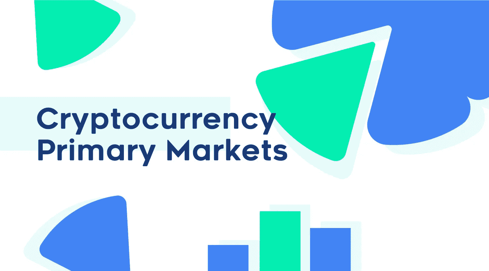
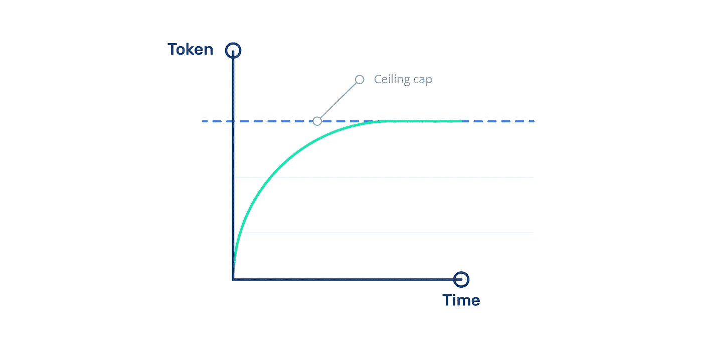
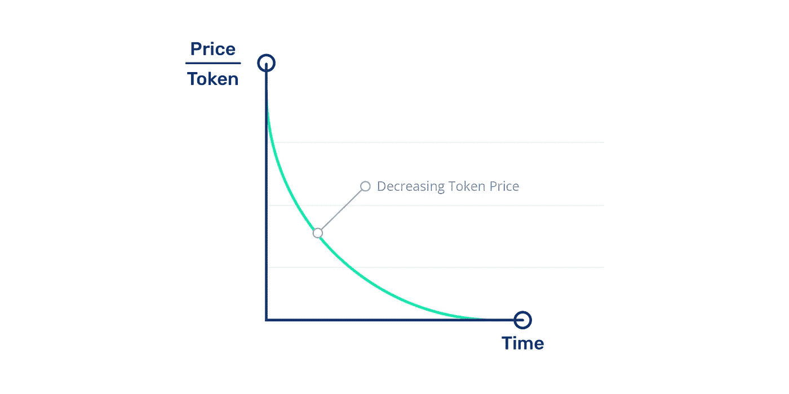
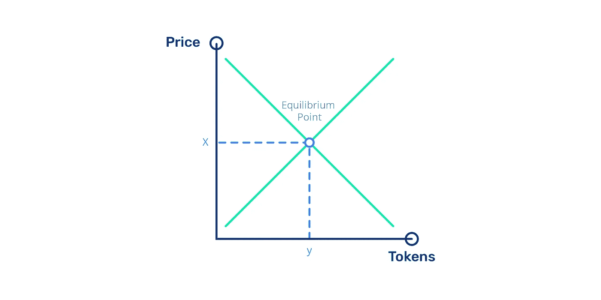
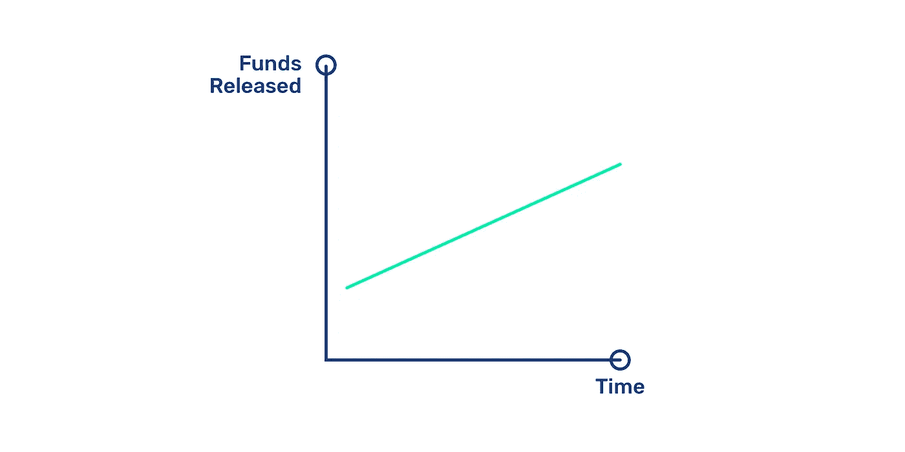
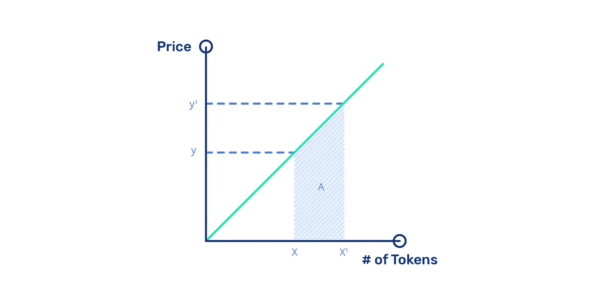
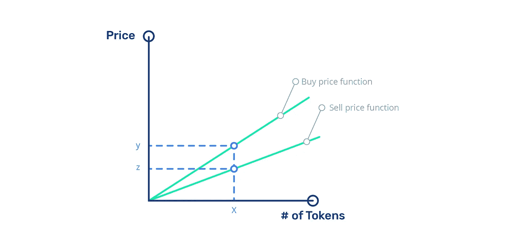

# 加密货币初级市场和代币发行机制简介

> 原文：<https://medium.com/hackernoon/introduction-to-cryptocurrency-primary-markets-and-token-issuance-mechanisms-50d1fd26ed83>

加密货币扰乱一级市场已经将近十年了。

但是它们首先是什么呢？

一级加密市场首次向投资者发行新的数字代币**，投资者直接从代币产生的地方购买代币。**

**每种加密货币都必须在某个时间点启动，其首批代币的发行方式决定了其基本面。**

**过去十年，代币发行机制发生了巨大变化，因为它们在投资者和发行者之间引入了更公平的互动。让我们回顾一下在一级市场出售代币的不同方式**

****

# **1.工作证明挖掘**

**当 Satoshi 在工作证明(PoW)中计算出 genesis 块时，最初的加密货币比特币启动了它的网络。**矿工在网络上投入时间、设备和精力。他们解决计算问题，并通过获得硬币获得奖励。****

**矿商将真正的资源分配到网络中:通常是产生高额安装成本和能源费用的数据中心。通过这样做，他们在初级市场上购买硬币。**

**此外，开发人员可以在数字资产进入流通领域之前对其进行“预挖掘”。在这种情况下，加密货币是在引入一级市场之前闭门产生的:这通常被认为是一种不公平的资产分配方式。**

****

# **2.分叉资产**

**加密货币运行在开源代码上，矿工必须执行这些代码，才能通过 power 赢得采矿奖励。**

**当一种加密货币开始运行时，任何人都可以派生出该软件，对代码库进行修改，并开始挖掘新的区块。**

**在这种情况下，通过分叉原始加密货币来发行新的加密货币。如果矿商开始在分叉的加密货币上投资资源，他们会通过分配计算能力在一级市场上购买。**

****

# **3.许可分类帐**

**在引入智能合同开发平台后，一些企业寻求为其业务实施区块链数据架构。**

**例如，银行集团为资金汇款实施了分布式分类账技术(DLT)。蓝筹机构还探索了区块链在主流行业的应用，如供应链或医疗。**

**在这种情况下，由于 DLT 是在一个封闭的门和一个允许的封闭环境中建立的，DLT 代币不提供给公众投资者，而是保留在一个封闭的公司网络中。**

****在这里，投资者既是代币发行者又是持有者。**分配和资产发行是与财团其他成员或在一个组织内私下协商的结果。**

****

# **4.安全和稳定资产**

**安全令牌是受监管金融工具支持的资产。数字资产代表对证券的要求，一些证券可以在特定的司法管辖区发行。**

**令牌化证券可以代表公司的股权、债务、实物资产甚至另一种加密货币。**

**发行人必须与金融监管机构协调，在一个负责任的环境中发行股票。就像任何其他证券发行一样，令牌化证券一级市场要求投资者和发行者严格遵守。**

**因此，发行人必须遵循现有的证券法框架，持有人通常必须注册为合格投资者，以便在一级市场上购买。此外，发行人需要确保持有人能够对所述证券直接主张权利。**

**例如，发行一种“稳定的”黄金支持代币，应该包括一个将资产兑换为黄金的快速通道，并提供一个透明的机制来评估代币的储备。**

**也有以指数形式由其他加密货币支持的令牌化资产的情况。这些代币是否受证券法管辖仍有争议，因为保留的资产不属于现有的法律框架。**

****

# **5.单轮代币销售**

**在以太坊令人难以置信的扩张之后，许多代币发行者通过智能合同经历了代币化销售路线。理论上，这是一个公平的交易，相比之下，PoW 和 fork 发行机制往往以后期投资者为代价过度奖励开发者。**

**在这种情况下，发行者通过智能合约组织代币销售，并将它们提供给潜在投资者，投资者可以评估代币的经济性，并决定是否购买代币。**

**不幸的是，第一代代币销售，通常被称为 ICO(首次发行硬币)，为投资者提供了有限的讨价还价机会，容易受到高估项目的影响。**

**本质上，ico 是单轮代币销售，发行者向一级市场投资者出售数字资产，以换取主流加密货币，并且没有任何价格谈判。**

## **a.限量销售**

**有上限的代币销售涉及代币的发行，该代币已经或将要收敛到上限。换句话说，限量发售的代币数量有限。**

****

**它为销售参与者提供了清晰的网络估价，但软硬目标的引入增加了资产评估的复杂性。**

**软上限代表成功销售所需筹集的最低金额，硬上限代表最高金额。**

**一系列筹资目标给网络估值带来了不透明性。**

**例如，发行 20%的代币，软硬上限在 100 万美元到 500 万美元之间，网络价值在 500 万美元到 2500 万美元之间，这是一个很大的价差。**

**此外，如果销售提高了软上限和硬上限之间的金额，未售出的令牌有三种可能的结果，可以极大地改变网络的后货币估值:**

*   ***好处*:发行者烧掉未售出的代币和相同比例的总供应量，保持提议的代币分配比例不变。**
*   ***坏处*:发行者不按比例燃烧未售出的代币，这在没有通知的情况下有效地稀释了投资者。**
*   ***丑陋的*:发行者将它据为己有，这增加了他们在网络中的份额，并在这个过程中稀释了投资者。**

**在 2017 年和 2018 年盛行的是上限销售收益发行者，而不是一级市场投资者，他们经常忘记考虑关键的令牌基本面。**

## **b.无上限销售**

**代币发行者可以组织无上限销售，对代币数量没有上限，而不是对代币供应加以限制。**

****

**它没有明确资产的估值，但保证参与者参与出售。**

**在这种情况下，投资者只知道代币的价格，不知道网络的估值，也不知道发行者希望筹集的最大资金额。**

**无上限销售对投资者来说是危险的游戏，但对发行者来说却是赚钱机器。但愿无上限销售从未真正起飞，因为发行人和公众投资者放弃了这种发行方式。**

## **c.荷兰拍卖**

**也称为反向拍卖，这是一种出售代币(或任何商品/服务)的方法，其中单一资产的价格随着时间的推移而降低，直到买方同意购买所述代币。**

****

**它在代币购买者之间创造了一个竞争环境，这些购买者想要胜过其他出价来得到代币。**

**另一方面，发行者是定义拍卖定价曲线的人，没有市场反馈，这可能导致网络的高估，以防投资者中出现 FOMO。**

**未售出代币的情况构成了荷兰拍卖中另一个令人紧张的问题。发行者可以将其保留或烧掉，但销售参与者在历史上对如何管理未售出的资产没有影响力。**

**这三种类型的销售遵循“买者自慎”的交易规则:要么按照代币发行者的方式，要么走高速公路——投资者实际上没有讨价还价的能力。再加上对代币经济学的理解薄弱，公众投资者经常在这些销售中烧伤自己的手。**

****

# **6.单轮“公平”代币销售。**

**第二代令牌化销售已在 2017-18 年浮出水面，仅在上限、无上限和荷兰拍卖热潮几个月后。由于第一代销售没有为投资者提供足够的议价能力，因此见证销售机制的不断创新令人耳目一新，这有助于发行者和投资者之间建立更公平的关系。**

## **a.互动 ICO (IICO)**

**杰森·特什(Jason Teutsh)、维塔利克·布特林(Vitalik Buterin)和克里斯托弗·布朗合著的《互动销售》( interactive sale)解决了参与和评估令牌化销售的困境。在上限销售期间，投资者对提议的网络估值很清楚，但很难参与(因为令牌有限)，而无上限销售保证参与，但模糊了项目估值。**

****

**为了避免这种现象，投资者可以对 IICOs 的网络资本进行个人竞价。在互动销售的第一阶段，参与者以个人网络最高限额的形式提交投标，并可以撤回投标。然后，智能合约找到投资者之间的均衡，实际上限下的任何个人上限都将被退还。**

## **b.DAO + ICO = DAICO**

**Vitalik 将分散自治组织(DAO)和 ICO 模式结合成一个 [DAICO](https://ethresear.ch/t/explanation-of-daicos/465) ，以降低代币发行者带着筹集的资金逃跑的风险。**

****

**DAO 不是获得大量资金，而是在预先确定的时间内发行所筹集的资金，迫使发行者兑现承诺。**

**新一代的一次性代币销售刚刚开始了他们的初级市场之旅。尽管它在发行者和投资者之间引入了更公平的关系，但市场尚未从上限/上限/荷兰式销售转向更公平的销售。**

****

# **7.持续销售**

**连续销售不是进行一次性代币销售活动，而是通过做市智能合约促进代币随时间的交换。投资者可以购买代币，并通过直接与代币互动来平仓。**

## **a.债券曲线收缩**

**首先由西蒙·德·拉·鲁维耶(Simon de la Rouviere)作为“[债券曲线](/@simondlr/tokens-2-0-curved-token-bonding-in-curation-markets-1764a2e0bee5)”和班科尔(Bancor)作为“[智能代币](https://blog.bancor.network/smart-tokens-101-63edc2cc5a89)”引入的债券曲线合约有助于根据预定的价格曲线购买和出售代币的自动化做市机制。**

****

**与依赖一次性代币发行事件的销售不同，债券曲线合约持续释放资产，有效地将代币价格与市场条件和预期相匹配。**

## **b.连续组织**

**Thibauld 引入了[持续组织模式](https://hackernoon.com/introducing-continuous-organizations-22ad9d1f63b7)，这是一个传统组织，它建立了一个分散的自治信托(DAT)作为财务经理，以持续筹集资金并向代币持有人分配股息。**

****

**DAT 是一种智能合约，具有债券曲线合约和赞助燃烧，可自动发行和转换令牌化证券。**

**在过去的几年中，令牌发行机制引入了重要的创新。但除了严格的技术要求之外，市场采用的主要障碍仍然是“买者自慎”的情况，即在投资者正式要求之前，代币发行者没有动力组织此类发行机制。**

## **我们如何才能迫使代币发行者组织更公平的代币发行？**

**加密货币一级市场的 [**令牌管理的注册中心**](https://tropyc.co/articles/token-curated-registry) ，使投资者能够从良好行为者的管理白名单中接受或拒绝令牌发行者。**

**黑客日:2020 年 3 月 13 日**