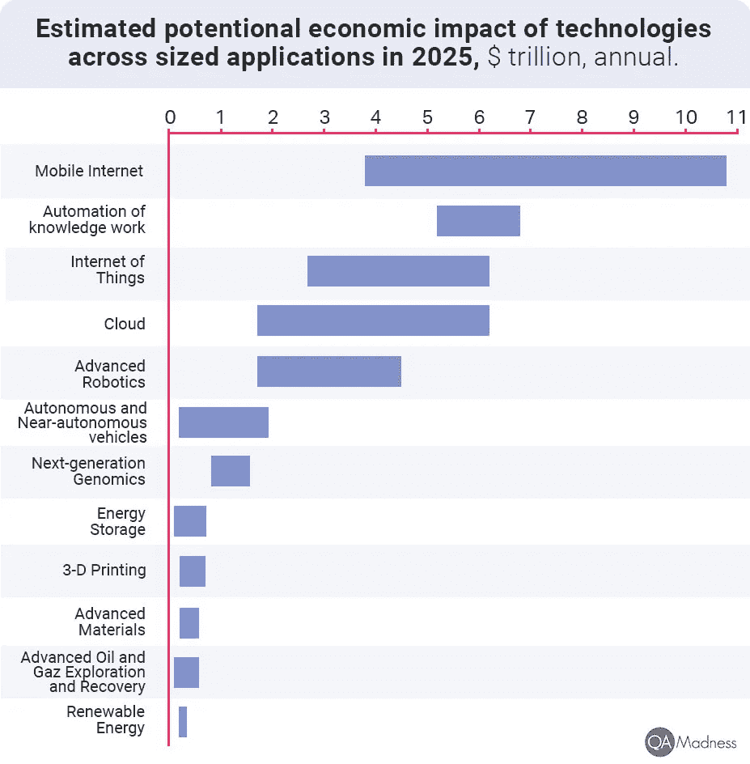

# 投资颠覆性技术:操作指南

> 原文：<https://medium.com/hackernoon/investing-in-disruptive-technology-a-how-to-guide-6847114de67f>

[Pixabay](http://thestocks.im/)

作为一个渴望发现新趋势和技术机会的人，我决定详细阐述“颠覆者”的概念，并解释为什么这些技术是我们生活不同领域的游戏规则改变者。

作为一名投资者，你可能太经常听到团队“颠覆性技术”了。一些企业家认为这是一张无风险的王牌，一定会带来高收入。相比之下，投资者经常避免“破坏性”业务，因为投资回报和盈利能力不确定，风险极大。

但让我们先澄清一下:被称为颠覆性的东西并不是改变世界的强大突破性技术。相反，颠覆性的想法是简单、负担得起的解决方案，可以取代现有的复杂系统或昂贵的产品。通过这样的业务，服务和产品拥有更广泛的受众。

# **如何检测干扰物？**

要确定业务“破坏性”的级别，请尝试回答这些问题。它们中的每一个都有助于揭示破坏的特征。

## **1。它是否为产品/服务的非消费者提供了解决方案？**

这是一个关于商业目标受众的问题。它提供的解决方案必须变得易于使用，从而在不同的社会阶层中扩展服务/产品的使用。

## **2。与市场上的产品相比，创新产品是否更易于使用？**

这个因素不言而喻。由于便利是 IT 市场的新亮点，颠覆者是取代现有复杂性或降低成本或两者兼而有之的催化剂。

## **3。业务可持续吗？**

颠覆性的想法是伟大的，但如果它与商业模式相结合，以支持其长期发展，那就更好了。

# **如何保持关注？**

对颠覆性技术的投资从来都不容易。如果是这样的话，每一个新想法在对竞争者构成威胁之前就已经退出了市场。在分析了投资者和企业家的建议后，我收集了一系列建议，以跟随不可阻挡的趋势，并准确预测未来改变游戏规则的巨头。

*寻找急需创新思维的市场利基。*

早在 2013 年，麦肯锡全球研究所就发布了关于新兴生活改变产业的有影响力的 [**研究**](https://www.mckinsey.com/~/media/McKinsey/Business%20Functions/McKinsey%20Digital/Our%20Insights/Disruptive%20technologies/MGI_Disruptive_technologies_Full_report_May2013.ashx) 。该报告定义并分析了最近十年的 12 大经济前沿技术。

这些技术的惊人之处在于，它们对传统技术领域没有任何限制。相反，这些创新进入了医疗保健，电信，能源部门，媒体，生物技术。由于颠覆者现在在行业方面多样化，投资组合包含更多具有充足流动性的公司，具有更有效的回报和风险管理。

2013 年，麦肯锡提供了关于潜在的改变游戏规则的技术的数据，这些数据将重申到 2025 年的经济影响:

相比之下，2018 年， [**全球 X 基金**](https://www.globalxfunds.com/content/files/Thematic_Tech_Survey-vFinal.pdf) 发表了同一主题的新报告。这些数据涵盖了被投资者视为机遇的七大科技趋势。

*搜索创新产业的例子。*

这个列表是我结合上面的图表中提供的一些。非常欢迎你来帮忙，用你自己的想法来填充它。

*   **人工智能&质量保证自动化**

难怪，我知道。大数据一直是热门话题。《世界质量报告》用数字证明了人工智能的新兴性质:64%的 IT 公司——受访者有人工智能计划改善客户流程。62%的公司渴望为内部目的实施智能技术，57%的公司需要 [**人工智能进行软件测试**](https://www.qamadness.com/ai-in-software-testing/) 。此外，55%的人认为人工智能是增强软件开发的潜在平台。

这意味着 IT 部门积极实施人工智能来数字化业务运营。“智能”技术可以高效快速地分析非结构化数据集。此外，人工智能系统保留收集的信息，以便为未来的分析建立联系。

全世界在认知系统(应用程序和平台)上的支出导致了支持其功能的解决方案的转变。有了这些系统，IT 部门可能会引入机器学习策略来自动化开发和测试任务。这种想法是将人力资源用于软件项目中更复杂、更有创造性和更具战略性的部分，将重复的任务留给机器学习系统来自动化。

*   **无线时代&自主运输**

贝恩咨询公司的最新研究预测，到 2021 年，物联网市场将达到 5200 亿美元。看来 [**物联网产品**](https://www.qamadness.com/wireless-era-what-to-expect-and-how-iot-software-testing-evolves/) 凭借其无线技术支持，完全有机会加速城市规划、医疗保健、交通运输、制造业和零售业的发展。

生产自动驾驶汽车的趋势可能会将当前的交通概念转变为无线生态系统。交通灯的引入、智能高速公路系统的发展、先进的车辆路边通信是值得投资的资源。这些解决方案将增加物流领域的价值，并加快长距离转运路线的发展。

[Pixabay](http://thestocks.im/)

*   **可再生能源**

世界能源理事会提供的数据显示，水电仍然是可再生电力的主要来源，占全球供应量的 71%。渐进式水力发电技术侧重于开发抽水蓄能电站、水库和径流式水力发电厂。

风能和太阳能是两个更有价值的投资来源，企业家们在这里找到了可持续能源增长的有效解决方案。可印刷太阳能电池板、光伏电池、太阳能水厂是证明可再生能源影响效率的例子。

*   **电子商务& O2O**

尽管用户是自信的网上购物者，实体店仍将是 [**到 2021 年**](https://www.shopify.com/enterprise/o2o-online-to-offline-commerce)82.5%零售额的来源。数字和线下体验的结合是零售市场爆发的方式。难怪:电子商店提供了便利，而实体商店增加了购买信心。这就是为什么 [**全渠道战略**](/@andyan_965/how-to-conquer-online-to-offline-retail-opportunity-95cc97a2c03c) 成为将鼠标点击购买和现代化店铺条件相结合的成功解决方案。

*区分干扰物类型。*

Macrovue 提供的这种分类定义了三种嵌入颠覆性技术现象的公司。

**经验丰富的颠覆者**是已经成长为创新“大使”的现代市场巨头。今天，它们广为人知，并将继续改变行业规则:谷歌、亚马逊、脸书、特斯拉、阿里巴巴、贝宝。

**早期颠覆者**带来的解决方案对银行业、大型制药公司和电视行业的服务产生了巨大影响。例子包括网飞，Dropbox，Twitter，3D 系统。

新的颠覆者并不总是公开的，然而他们最初都得到了风险投资的资助。这些公司是有前途的技术供应商，已经颠覆了这个行业。如今，许多公司都备受瞩目:Airbnb、SpaceX、优步、Palantir、小米。

[Pixabay](http://thestocks.im/)

做作业。

在投资领域，仔细的公司研究是必须的。Macrovue 的投资者建议对影响公司增长的关键因素进行基本面分析。该研究涉及商业模式概述、竞争优势、市盈率和资产负债率。

此外，Macrovue 的团队提供了一种多元化的投资组合方法，而不是完全投资于一家公司。就颠覆性技术投资而言，选择一批你认为有机会成功的公司是一个风险小得多的决定。

# 一锤定音

颠覆性技术热潮在 2019 年仍在继续。因为不可能总能发现潜在的尖端解决方案，所以在投资前最好仔细分析市场。但有一点是肯定的:只要颠覆性的想法逐渐进入我们的生活，我们就可以期待很多令人兴奋的变化。