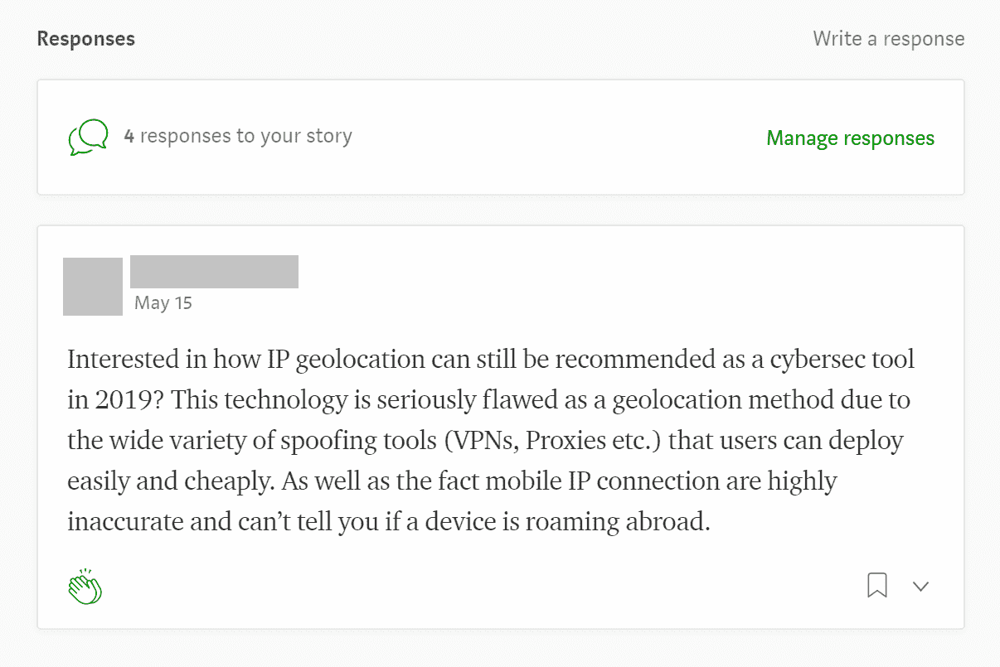

# 网络安全调查中的 IP 地理定位

> 原文：<https://medium.com/hackernoon/ip-geolocation-can-it-still-support-cybersecurity-investigations-34d7eee7b064>

## 到目前为止，位置一直是追踪和逮捕罪犯的一个明确的资产。

在一个非法活动越来越多地通过数字手段发生的世界里，网络犯罪者往往比那些追逐他们的人在技术上领先一步。

因此，人们很自然地会期望心怀不轨的网民会聪明到隐藏自己的行踪，以避免被抓。

尽管如此，我们还是不断听说 [IP 地理定位 API](https://main.whoisxmlapi.com/the-ip-geolocation-api-guide-why-tracking-web-users-whereabouts-matters)对网络安全的好处，特别是防止欺诈和身份盗窃以及反击其他已知威胁。那么，IP 地理定位在这场斗智斗勇中处于什么位置呢？

在批评者看来，IP 地理定位因其缺乏准确性以及攻击者可以规避该技术的不同方式而受到批评。以下是[在我最近发表的帖子](https://hackernoon.com/what-is-the-best-ip-geolocation-api-for-cybersecurity-professionals-87653b625376)上留下的评论:

另一方面，在一系列现实事件中，IP 地理定位的使用已被证明对网络安全专业人员和执法机构锁定已知的不良行为者及其网络非常有用。让我们看看下面的案例来说明这一点。

## **汉萨:瓦解欧洲最大的暗网毒品市场**

Hansa 在黑暗网络上称王称霸，成为欧洲最大的毒品市场，拥有 3600 名经销商和 24000 种产品，包括可卡因、海洛因和摇头丸。为了摧毁这一交易，荷兰调查人员启动了“刺刀行动”( Operation Bayonet )(简称“T7 ”),从而确认了 Hansa 的两名管理员及其账户——有效地控制了该网站。

当 Hansa 的买家和卖家被置于监控之下时，道德黑客巧妙地重写了网站的代码，以获取每个用户的密码，并保存每张照片的地理位置数据。这是最精彩的一幕——警方诱骗匿名用户在他们的电脑上打开一个信标文件，从而泄露了他们的位置。该行动导致当局记录了 10，000 个恶意 IP 地址和 420，000 个用户的数据。

## **丝绸之路:它是如何走进死胡同的**

臭名昭著的网上毒品黑市运作了两年，并被证明难以捉摸。在[通过 Tor 追踪其服务器的物理位置](https://www.theguardian.com/technology/2013/oct/08/silk-road-hack-suspicion-fbi-server)后，FBI 最终关闭了它。关于当局如何能够找到像丝绸之路这样匿名托管的网站存在争议，但据信该机构入侵了该网站并发现了相关的 IP 地址。

做了这些之后，在地图上放一个大头针就不难了。事实上，联邦调查局与托管公司取得了联系，并设法制作了服务器和工厂跟踪系统的图像，这反过来又允许跟踪所有在网站上登录和交易的人。

## **LulzSec 拆除:隔离失败**

策划高调攻击美国中央情报局和索尼电影公司的臭名昭著的黑客组织，由于其领导人的一次错误行动而被迫屈服。更准确地说，当赫克托·泽维尔·蒙塞古尔[用他的化名“萨布”登录一个互联网中继聊天室时，他没能掩盖他的 IP 地址](https://www.bankinfosecurity.com/one-simple-error-led-to-alphabay-admins-downfall-a-10131)

这个错误帮助当局追踪了 ISP 和分配给该地址的相应记录——在这个过程中，还将他们重定向到一个连接的子域页面，萨布在那里发布了他的汽车的照片。

# 那么，IP 地理定位是网络安全贸易的有效工具吗？

正如前面的案例所表明的，跟踪 IP 可能会导致用户、他们可疑的操作以及背后的犯罪网络。然而，IP 地理定位不太可能是灵丹妙药，或者不应该盲目信任。

网络罪犯确实避免留下可能会重定向到其非法事务的痕迹，大多数情况下涉及到代理和 VPN 的使用。这是事实。但这并不意味着犯罪者和他们的系统是完美无缺的。

像任何人一样，他们可能会放松警惕，做出错误的判断，从而泄露他们行踪的细节。只有在道德黑客等其他技术被用来削弱或推翻禁止位置检测的保护措施之后，IP 地理定位才可能证明自己有用。

此外，由于不同的原因，IP 数据可能是错误的。例如，无效的注册表数据会导致不一致，或者 IP 地理定位服务提供商可能不会以足够的频率刷新他们的数据库。更重要的是，一旦我们将地理搜索从一个国家缩小到州、城市或社区级别，准确性就会下降。

也就是说，在当今日益复杂的网络安全格局中，孤立使用的任何系统或数据源都不可能提供一个通用的画面来对抗威胁和攻击者——这实际上是威胁情报平台和其他复合安全产品出现的驱动因素之一，这些产品结合了多种功能，以进行更有意义的分析。

因此，决定是否将 IP 地理定位纳入一个人的网络安全计划，在很大程度上取决于该技术填补其他应用程序和替代方案留下的空白的能力。

一句话:IP 地理定位不是一个完美的数据来源。但它仍然可以大大有助于识别可疑字符，通常与其他技术和网络安全组件结合使用。