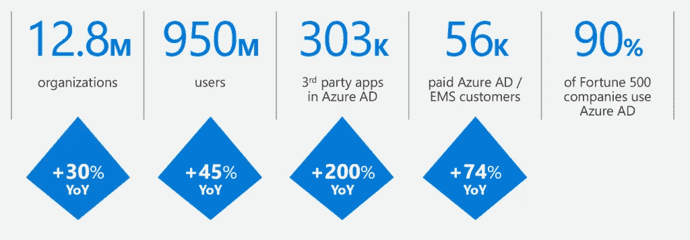

# Azure 盈利吗？

> 原文：<https://medium.com/hackernoon/is-azure-profitable-3531a14f6233>

没有人愿意购买今天在这里明天就消失的摇摇欲坠的产品，企业在 IT 基础架构方面也是如此。考虑到工作效率的依赖性、传统上较低的回报率以及 IT 基础设施沉重的财务负担，世界各地的首席技术官等通常会像潜在股东一样关注关键绩效指标(KPI ),包括收入、盈利能力、客户数量等，以便在对 AWS 和 Azure 等基础设施即服务(IaaS)平台进行长期投资之前预测其可行性。

例如，如果服务提供商在 8 年后接近收支平衡或亏损运营，这可能表明运营效率低下、体系结构疏忽以及即将发生的变化，这些都会增加代价高昂的停机的可能性。所有这些都可能突显出未来加息的可能性，或者说，这个平台可能经受不住时间的考验。但如果收入和利润都在点上，这表明长期稳定和风险小得多。相比之下，这就像是在一个平静的夏日早晨或在一场冬季暴风雪中被给予选择桨板。

不用说，你可以通过衡量一个解决方案的盈利能力来了解它。这就是为什么亚马逊、苹果和谷歌等常见的领先者不羞于披露其产品的个人收入、利润和用户数量。但这也是为什么他们背后的竞争往往更具创造性，而不是简单地报告相同的指标。当考虑到微软为了压制 Azure 的个人优点所做的努力时，我不得不质疑 Azure 到底有多赚钱。

不过，在此之前，值得强调的是，任何专注于用统计数据撒谎的复习课程都会提醒你，省略是迄今为止用统计数据撒谎的最简单方式。除了回避有用的指标，转而使用误导性和价值较低的指标，本质上像章鱼喷墨一样利用数据，它们的统一应用是统计数据的强大和成熟的方法，行业领先者背后的公司喜欢诉诸于此。简而言之，一些企业选择以不知情为借口，采取转移注意力的策略，而不是把事情摆到桌面上，用真相来照亮自己的负面形象；微软对此也不例外。最近，苹果公司也在这件事上有罪。

如前所述，作为排名第一的云基础设施提供商，亚马逊很乐意通过公布收入、利润和用户数来报告 AWS 的各个优点。为什么要隐藏自己是最好的？作为排名第二的云基础设施提供商，微软选择将 Azure 的收益捆绑到一个名为[智能云](https://www.microsoft.com/en-us/Investor/earnings/FY-2018-Q4/productivity-and-business-processes-performance)的容器中，该容器平均 Azure 与 Windows 和 SQL Server、Active Directory、Hyper-V 等传统服务器软件的收入、利润和损失，因此不可能在平等的基础上比较这两个平台。

Azure 报告用户总数，但不报告智能云之外的收入或利润(crutch？).与此同时，LinkedIn 报告了收入、利润和总用户数，而忽略了每月用户统计数据，如[月活跃用户](https://www.investopedia.com/terms/m/monthly-active-user-mau.asp) (MAU)。虽然微软的政策是不报告 MAU 等有用的指标，因此 LinkedIn 不再报告它，但他们似乎对报告 [Azure AD](https://www.microsoft.com/en-us/microsoft-365/blog/2017/11/13/how-organizations-are-connecting-their-on-premises-identities-to-azure-ad/) 、 [Office 365](https://www.petri.com/office-365-soars-155-million-active-users) 、 [Windows](https://www.onmsft.com/news/microsoft-claims-over-700-million-windows-10-active-devices-150-million-cortana-users/amp) 、 [Edge](https://m.windowscentral.com/microsoft-edge-now-being-used-more-330-million-monthly-active-devices) 、 [Cortana](https://mspoweruser.com/half-a-year-later-and-cortana-shows-no-user-growth/) 、 [Bing](https://www.statista.com/statistics/752270/range-of-bingcom-based-on-unique-visitors/) 、 [Skype](https://mspoweruser.com/skype-300-million-monthly-active-users/) ( [ooops 现在他们不报告](https://techcrunch.com/2017/10/30/skypes-big-redesign-publicly-launches-to-all-desktop-users/))、[考虑到上述情况，您可以看到微软似乎在战术上挫败了他们的政策，但您也可以看到一个明显的趋势，即遗漏也是一样的，同时似乎试图用武断的政策掩盖它们。](https://m.windowscentral.com/xbox-live-hits-57-million-monthly-active-users-fy18-q4)

有时不说话就是用统计数据说话，省略数据以及微软目前正在利用的创造性捆绑策略并不例外，而是十亿美元的标准。虽然他们声称现在已经改变了，但他们仍然有相同的总委员会，布拉德·史密斯，他们自可笑的反垄断时代以来就一直有，我们也可以看到微软投入额外的努力来搅浑水，可以说是运行率，模糊的指标，大量的营销超支，而不是简单地提供他们的数据；就像历史上一样。

然而，我们仍然可以通过假定 Azure 无罪来进行推测，并简单地假设它独自负责智能云在[2018 财年第四季度](https://www.microsoft.com/en-us/Investor/earnings/FY-2018-Q4/intelligent-cloud-performance)的所有收入，即 96.06 亿美元，这样我们就可以看看 Azure 在其最佳假设日的平均每账户收入(ARPA)，并将其与 AWS 进行比较。当我们这样做时，让我们假设 Azure 有 1300 万个帐户，而不是他们的 1280 万个帐户，这只是为了说明增长，因为这些数据已经超过一年了。因此，让我们以 9，606，000，000 美元/1，300 万个帐户=每个帐户最近一个季度的平均收入为 738.92 美元为例。还不错。干得好假想的蔚蓝。

另一方面，AWS 报告称，目前只有微不足道的 100 万个账户订阅它，而在 2018 财年第三季度仅产生 66.8 亿美元的收入，[其中 21 亿美元是利润](https://www.cnbc.com/2018/10/25/aws-q3-results.html)。因此，我们可以得出 66.8 亿美元/100 万个客户=每个客户最近一个季度的平均收入为 6680 美元。为了便于比较，我们可以用 AWS 的 ARPA 除以 Azure 的 ARPA(6680 美元/738.92 美元)，这表明 AWS 的账户货币化效率是 Azure 的 9.04 倍。此外，如果 AWS 能够维持 Azure 账户基数(6680 * 1300 万)的 ARPA，那么它每个季度将产生 868.4 亿美元的收入。😳

AWS 的效率为 31.4%(利润/收入)，而根据其 ARPA 衡量，效率比 Azure 高 9.04 倍，这也表明 Azure 的效率在第 4 季度可能低至 3.5%或 359，320，000 美元，这本身就很容易将其捆绑到一个容器中，如由更高效的产品组成的智能云。这也意味着 Azure 可能会产生每账户 27.64 美元的平均利润，相比之下，AWS 目前看到的每账户 2100 美元的平均利润仍然是 Azure 的 76 倍；当它被赋予一个重大的疑点利益时。

然而，如果 Azure 占智能云收入的一半(48 亿美元)，这些差异只会变得更大。如果是这样的话，那么他们每个账户的平均收入将为 369.23 美元，如果他们像亚马逊一样高效，本季度的净利润将在 1.63 亿美元至 15 亿美元之间。如果准确的话，从 ARPA 的角度来看，这也表明 AWS 的效率比 Azure 高 18 倍。但是我跑题了。

总之，当像微软这样装备精良的数据驱动型技术公司在报告没有人要求的指标时，不公布明细利润或 MAU 等基本 KPI，而是报告一项已经生产了 8 年的服务，这通常是这些 KPI 与他们销售的叙述相矛盾的结果，而不是因为它们不容易获得。代替这些指标，甚至当假定 Azure 是无辜的，并与 AWS 进行比较时，AWS 和 Azure 之间的差距似乎比微软在生产 8 年后希望我们相信的更大。Azure 可能确实是盈利的，但当考虑到 AWS 和 Azure 之间的运营效率差异以及微软为抑制其个别性能指标所做的一切努力时，我别无选择，只能问 Azure 的盈利能力如何，或者它到底有没有盈利。