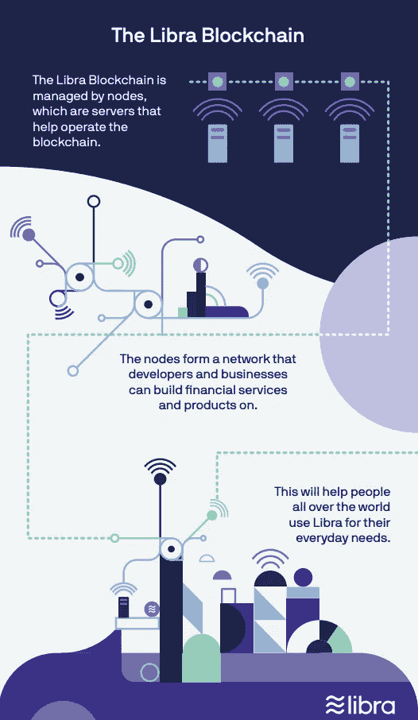

# 脸书准备好迎接数字货币了吗？

> 原文：<https://medium.com/hackernoon/is-facebook-ready-for-digital-currency-235a85f67785>

## Greenspoon Marder LLP 公司的合伙人 Katya Fisher 和合规律师 Adam Kemper 对脸书渗透到数字货币进行了评论。

(L): Katya Fisher, Esq. and (R) Adam Kemper, Esq. | Greenspoon Marder LLP

在世界上第一种数字货币出现 12 年后，比特币，世界社交媒体巨头*脸书*，宣布将推出“天秤计划”，由自己的数字货币组成，将于 2020 年正式亮相。

数字货币 *Libra* 将建立在 Libra 区块链上，存放在 Calibra 中，这是一个数字保管钱包，可以存储和使用 Libra 数字货币。脸书公司的子公司 Calibra，Inc .作为受监管实体提供金融服务，同时反映了将 Calibra 的财务数据与脸书的社会数据分开的重要性。

> " *Libra 有潜力为全球数十亿人提供一个更加包容、更加开放的金融生态系统。我们期待作为创始成员加入 Libra 网络，并通过 Calibra 为我们的社区提供访问 Libra 的途径。我们知道旅程仅仅是开始，但是我们可以一起完成 Libra 的使命，创建一个简单的全球货币和金融基础设施，这将使数十亿人获得权力*。— **大卫·马库斯，脸书卡利布拉的负责人**

Source: Facebook | Libra

鉴于 6 月份的声明，脸书并没有说服所有人，尤其是监管者和律师。

那么，为什么脸书的天秤座货币开局不利呢？鉴于这家社交媒体巨头在隐私方面的可疑记录，美国立法者并不太兴奋。

**最近要求停止天秤座**

最近，美国众议院金融服务委员会(CFS)正式要求脸书停止进一步继续该项目的计划。在众议员 Maxine Waters 的领导下，委员会致函脸书首席执行官 Mark Zuckerberg 和 David Marcus 以及雪莉·桑德伯格首席运营官，要求立即暂停实施该项目的计划，原因有很多:

**(1)实施全新的全球金融体系，旨在抗衡美国货币政策和美元；**

**(2)严重的隐私、交易、国家安全和货币政策问题**

**(3)明显的风险和缺乏监管保护使其在脆弱性方面与市场上的任何其他加密货币、交易所和/或数字钱包没有区别；和**

**(4)缺乏存款保险**

然而，关于监督，脸书表示，它计划将 Libra 移交给一个名为 Libra Association 的独立财团，这将有助于促进 Libra 网络及其加密货币的运营、开发、推广和扩展。虽然 CFC 委员会在信中承认天秤座协会的存在，但从表面上看，这仍不足以给世界注入信心。

在结论中，委员会认为“由于脸书已经掌握在世界四分之一以上人口的手中，脸书及其合作伙伴必须立即停止实施计划，直到监管机构和国会有机会审查这些问题并采取行动

[…]

“*在暂停期间，我们打算就基于加密货币的活动的风险和收益举行公开听证会，并探索立法解决方案。未能在我们能够停止实施之前停止实施，可能会导致一个新的瑞士金融体系“大到不能倒”*

脸书的意图是什么？合规性和透明度。

“*随着这一进程的推进，我们期待与立法者合作，包括在即将举行的众议院金融服务和参议院银行委员会听证会上回答他们的问题，”脸书的一位发言人告诉我。*

截至今天，包括*万事达、Visa、*和 *PayPal* 等金融机构在内的 27 家公司已经签约充当“节点”，这需要 1000 万美元的买入费。

**有什么法律？**

脸书最近因隐私问题而臭名昭著。关于加密货币钱包的安全性和安全性的问题比比皆是，并且该行业在违规或丢失的情况下缺乏明确和既定的法律补救措施。

我与格林斯庞·马德·LLP 律师事务所的合伙人[卡佳·费舍尔](https://www.gmlaw.com/attorneys/katya-fisher/)和该公司区块链部门的加密货币合规律师[亚当·肯珀](https://www.gmlaw.com/attorneys/adam-kemper/)就脸书的 Libra 给消费者市场带来的监管影响进行了交谈。

“目前还不清楚脸书将在多大程度上获得消费者金融信息或信誉，以及它可能如何使用和保护这些数据，”Kemper 说。"*虽然[脸书]已经声明其打算遵守金融法规，但细节仍有待观察，并且在洗钱、欺诈以及遵守各种监管机构(如美国的金融犯罪执法网络(FinCEN)和商品期货交易委员会(CFTC)以及其打算进行交易的每个国家)方面存在责任问题*"

Andrew Rossow: Katya，鉴于监管机构的强烈反对，你认为 Libra 实施中的主要问题是什么？

**Katya Fisher:** 我认为金融服务委员会的代表在总结监管问题上做得很好。从消费者的角度来看，最大的担忧之一是隐私和数据收集。脸书目前因侵犯隐私和分享用户数据面临高达 50 亿美元的罚款。这一点不容小觑:举个例子，剑桥分析公司获得了 5000 万脸书用户，作为在选举期间影响美国选民的一种方式。现在，脸书将与天秤座协会的其他成员一起访问财务数据。

许多其他问题仍然存在。这种货币可以被视为证券发行吗？在如此多的监管者失败的情况下，脸书将如何在监管者身上取得成功？脸书将如何应对潜在黑客攻击和/或违规的风险缓解和保险方面的消费者风险？目前仍有许多猜测。

我们也不要忘记，脸书十年前试图推出一种数字货币，但失败了。现在技术和概念不同了，时代也变了，但是谁也说不准天秤座会成功到什么程度。

…

在我与 Calibra 的交谈中，它告诉我，未经客户同意，它不会与脸书公司或任何第三方共享帐户信息或财务数据。换句话说，Calibra 客户的账户信息和财务数据不会被用于改进脸书公司产品系列的广告投放。

**阿瑟:主要的福利怎么样？**

KF: 脸书和它在天秤座协会的伙伴们拥有巨大的影响力和权力。如果他们能做到这一点(他们很有可能做到)，这种货币可以帮助世界各国的无银行账户者开户，并帮助开创一个国际金融和支付的新时代。像脸书这样帮助整个生态系统的公司正在使加密货币和去中心化的治理结构合法化。

你认为在这个项目被立法者和监管者认真对待之前，脸书能够逃脱一大堆隐私问题吗？如果是的话，你认为下一步该如何补救已经造成的损害？

KF:脸书的高管并不傻。他们明白隐私是一个问题，不仅仅是因为监管原因，也是因为用户的信心。采纳加密货币的一些原则——去中心化和无信任系统的概念——对脸书来说是一个重塑形象和保持现状的机会。我不认为脸书可以完全逃避这些问题，但它肯定有机会挽回一些损失。

Adam Kemper: 消费者不是问题。尽管有报道称存在隐私问题，但脸书仍拥有约 20 亿用户，仍是世界各地人们日常使用的头号社交媒体平台。因此，如果人们使用脸书与世界各地的人交流，为什么不使用同一个“简单易用”的平台进行交易或兑换货币呢？

有趣的是，世界人口中没有传统银行的人数大致相同(即 20 亿)。根据 Libra 白皮书，Libra 致力于让数十亿可能使用互联网和智能手机的人(包括没有银行账户或银行服务不足的人)更容易进行交易。

对脸书来说幸运的是，它有机会观察和研究其他人十多年来的许多失败尝试，以创造一种易于交易和使用的加密货币形式，效仿比特币的成功。

事实上，脸书与 PayPal、Visa、优步、比特币基地、Lyft、万事达卡、Ebay、Spotfiy 等金融服务和消费者使用空间领域的大公司建立了结构化关系，这给了脸书和天秤座最大的成功机会。理论上，Libra 似乎是解决无银行账户人群问题的答案。

然而，我们在数字货币领域仍存在监管不确定性。Libra 是在法律还没有跟上数字货币交易形式的现有技术和方法的时代出现的。监管正在演变，但关于加密货币的使用仍然模糊不清。

因此，监管者和立法者已经对脸书表现出怀疑和抵制，为什么他们不会呢？脸书通过天秤座可以很好地扰乱整个银行系统，改变个人日常交易的方式。我们正处于一场金融革命之中。

可以理解的是，监管机构希望解决有关隐私、消费者保护法以及 Libra 的使用是否会为个人洗钱或逃税提供机制的问题。讨论仍在进行中。

因此，我的感觉是，监管者和立法者已经要求延缓 Libra 的实施过程，以便他们能够理解它，并试图在它被大规模采用和使用之前对其进行监管。敬请关注。

…

最后，Calibra 表示将使用脸书公司的数据来遵守法律，保护客户的账户，降低风险，并防止犯罪活动。除了这些情况之外，如果 Calibra 产品的功能可以通过脸书的数据进行个性化或改进，“我们将首先获得客户的同意，与 Calibra 共享相关数据。"