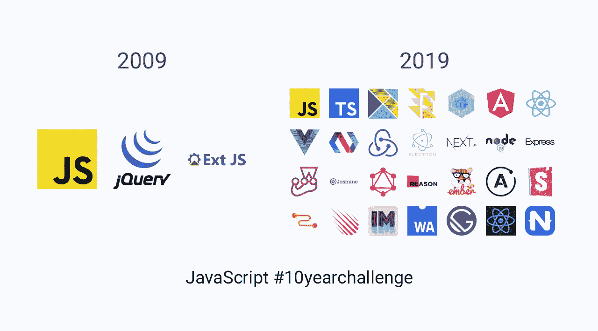
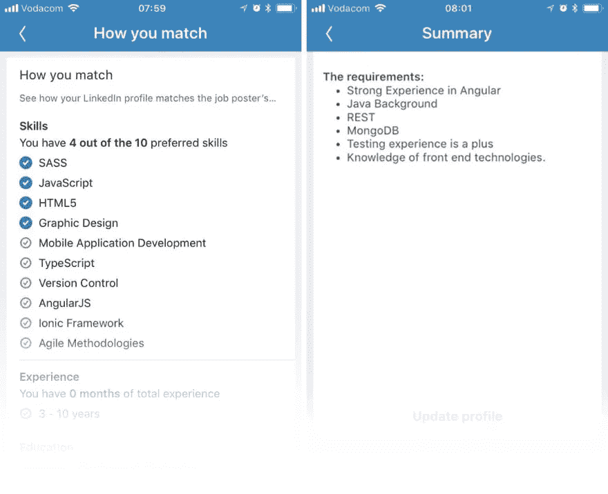
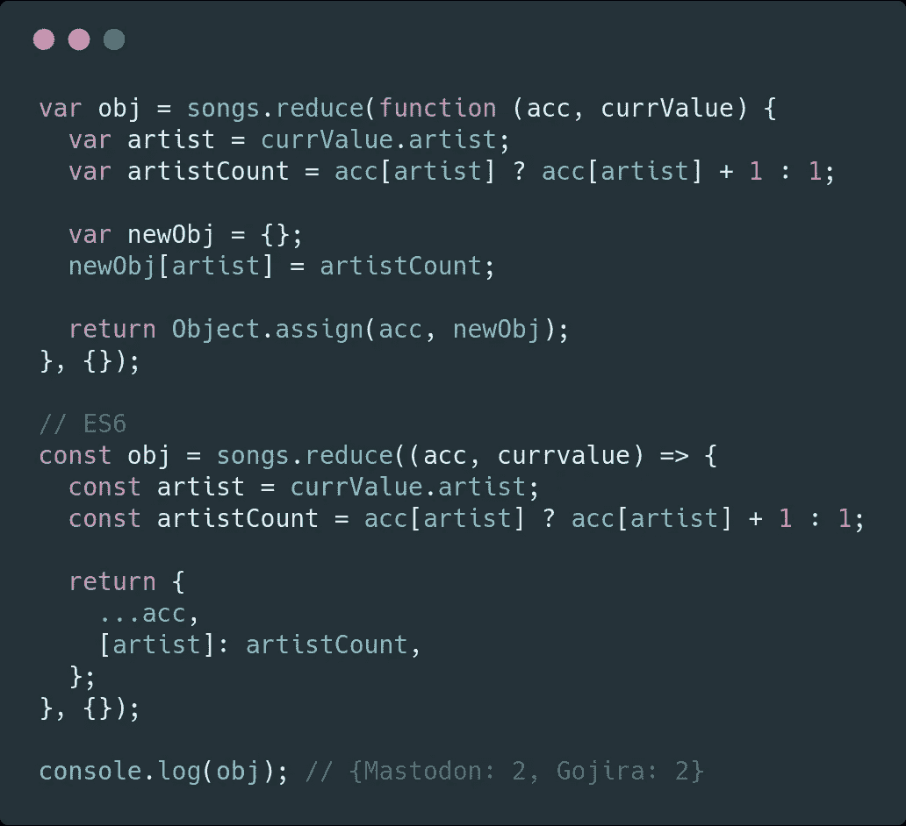

# 前端开发是否有身份危机？第二部分

> 原文：<https://medium.com/hackernoon/is-front-end-development-having-a-identity-crisis-part-ii-ad8179590aaf>

2018 年末我写了 [*是前端开发有身份危机*](https://hackernoon.com/is-front-end-development-having-an-identity-crisis-2dfcc5951192) 作为这个系列的第一部分。我对它的受欢迎程度感到惊讶，不是因为它明显的点击诱饵标题(有罪)；而是它与社区的共鸣程度。当我在 2019 年初做第二部分的演讲时，人群中的点头几乎是一致的——这显然是我们需要谈论的事情。最终许多开发人员都有同样的感觉:前端开发作为一个角色已经变得模糊不清。

# 第一部分的简短摘要

作为自然选择的结果，物种进化成许多变种或亚种。这些亚物种都有不同的属性和品质，最终使他们每个人都是独一无二的。

技术也不例外。在某种程度上，技术已经产生了数百种编程语言、范例、框架和库，每一种都有自己独特的属性和挑战。

**以 JavaScript 为例。**

Credit to reddit user u/TheDoctorWumbology

JavaScript 已经发展成为后端和前端的多种大型技术。这样做的问题是，前端和后端，应用程序和网站，设计师和开发者之间的界限变得模糊了。“前端开发”这个概念几乎已经失去了意义。

**那么什么是前端开发人员呢？**我们需要问自己三个问题:

**1。我们在为什么平台开发？** —作为开发人员，我们可以选择构建多种平台:移动、桌面、web 或服务器。传统上，前端处理应用程序的用户界面，但 JavaScript 的快速发展已经将这一角色转移到几乎所有这些平台。

**2。我们在用什么语言开发？** —平台的这种转变促进了 React 和 Angular 等技术的兴起，它们都有自己的一套规则和范式。像 PHP、Python 和 C#这样的语言也已经成为许多组织的前端堆栈的一部分，因为它们使我们能够构建服务和 API。

**3。我的技能水平和职称是什么？**——平台和语言的不清晰导致工作规范的混杂，影响了我们对标题的理解。有些前端角色需要后端技能，有些工程角色需要 UI 设计技能。这些角色都没有标准化。

# 那么，这一切有什么关系呢？

## 模糊的工作规范

在下面的例子中，在左边，开发者被要求知道角度和离子。诚然，这两种技术之间有一些重叠，但它们都是大型框架，各有各的细微差别。再加上平面设计要求(与前端无关)，你就得到了一个要求很高的角色。

Example of front-end job posts on LinkedIn. You can read more about my findings in Part I.

右边的帖子要求有 Angular，Java，REST 和 MongoDB 的经验。这个角色基本上是一个全栈，但提供的薪水少得可怜，这个角色的头衔是*前端开发人员。*

## 进入壁垒

这些工作岗位看似无害，但它们实际上制造了一个进入的**壁垒。最近，一个朋友想改变他的职业道路，去做一些他觉得更能适应未来的事情——所以他问我他如何进入 web 开发。**

**老实说我不知道该跟他说什么**——掌握前端的道路漫长而充满恐惧**。考虑到入门级前端角色的要求有多高，当你刚刚起步时，学习 HTML 和 CSS 有什么好处吗？**

我看着这个 ES6 片段，真诚地质疑一个低年级学生应该如何记忆和理解这个级别的代码。事实是，这种理解水平已经成为前端开发人员的期望，我认为这导致开发人员**筋疲力尽**。

## 烧坏

2016 年，我得出结论，除非我跟上 React 或 Angular 的潮流，否则我将成为一名过时的前端开发人员。我花了一些时间学习 React，并意识到我还必须在我的堆栈中包含 Node。在一个时间点上，我同时学习 ES6、Node 和 React。

这太难了。

我每天工作 15 个小时，同时还要应付培训和工作中的大型项目。我起床越来越早，睡眠越来越少，压力也越来越大。是的，一年后我知道了 React 和 Node，但我付出了代价。这种倦怠对我的个人生活和工作产生了巨大的影响，在某种程度上，我仍在恢复中。

## 技术面试

尽管我精疲力尽，但我对我所学的技能充满信心，所以我开始寻找新的机会。当时反应在南非是一种罕见的技能，所以我很快就被邀请去做采访。第一次面试总是很容易，但我没有准备好接下来的技术讯问。

我为这些技术面试做了准备，但还是失败了。

技术面试可能会很难，尤其是如果你刚开始做一名开发人员，或者你是一项技术的新手。招聘开发人员时，技术面试很重要，但它过于依赖我们记住技术术语的能力。

## 职位名称

假设你通过了技术面试并被录用，现在你的头衔是*前端开发人员。*你走进与利益相关者的第一次会议，项目经理请与会者介绍他们自己。Sally 先说:“我是数字部门的主管，负责 x 业务部门的销售渠道。”Joe 接着说，介绍自己是“产品负责人和项目负责人”。轮到你了，你小声嘀咕着“我是前端开发人员”。

**在那个房间里，你立刻失去了权威。**

现实是头衔确实很重要。他们拥有权威，随之而来的是薪酬和职业发展。通常情况下，环境迫使我们接受不一定符合我们经验或产出的头衔，这可能会很快将我们束缚在一个角色中。

# 我们如何解决这个问题？

现在我们更详细地了解了这个问题，我们实际上能做些什么呢？

首先，我们需要**教育招聘人员和组织**。组织往往不理解他们招聘的角色，我们对此负有部分责任。

> 公司领导人只是在 YouTube 或 BuzzFeed 上听到一些东西，然后随意地把它们放进他们的工作描述中，并没有意识到他们在寻找一个出色的、虚构的独角兽员工。
> ***Ruth Reyer 对本系列第一部分 dev.to 的评论***

作为团队领导，我们有责任教育我们的组织，并确保他们的工作规范与需要填补的角色相符。作为开发人员，我们也有责任质疑我们的角色和职责，并让我们的领导意识到这些差异。

最后，我们对招聘人员的挑战不够。他们在 LinkedIn 这样的平台上撒了一张大网，然后很快就根据他们甚至不理解的标准解雇了你。我个人发现招聘人员非常乐于听取对他们工作规范的反馈；这种反馈也将你定位为专家。

我们需要**按照角色的本来面目来称呼它们**。标题模糊不清，缺乏层次，这可能会削弱开发人员的权力。这对我们的薪酬和职业发展有直接影响。

> 作为一名开发人员，我真的很纠结于自己目前的定位。我主要做定制的 WordPress 网站，最擅长 HTML、CSS 和 JavaScript。
> ***Jenna Schultz 对 dev.to 的评论，本系列第一部分***

组织和领导者需要明确区分前端、后端、全栈和软件工程。这将帮助我们标准化角色和职责；并确保与角色相关的报酬是公平的。

我们需要**重新考虑我们雇佣**的方式。技术面试是不可避免的，但也许我们应该测试候选人解决问题的能力，而不是他们的记忆力。

> 科技深海潜水者对我来说是不可能的。我只做对话式的采访。我试着尽可能地去感觉他们，但是如果我得到了一个面试机会，它陷入了深度潜水，我就对一切说“我不知道”，并尽快结束它
> ***Sean Anderson 对 dev.to 的评论，本系列的第一部分***

在与候选人将要工作的环境相似的环境中测试他们。大多数开发人员工作在一个可以使用 StackOverflow 这样的资源来解决问题的环境中，那么我们为什么要期望他们在巨大的压力和审查下盲目地解决问题呢？

不要在电话中测试候选人，而是给他们一个问题，他们可以在家里用工作中可以使用的所有工具来解决这个问题。问题不一定要简单，但这会让你对他们编写的代码质量和他们解决问题的能力有一个很好的认识。如果你仍然需要进行电话技术面试，问他们一些测试他们解决问题能力的问题，而不是他们是否能背诵 for 循环。

允许候选人在工作中学习，引导他们走向成功，而不是期望他们从第一天起就成为摇滚明星。

最后，记得**放松自己**。我们都是永远的学生，经常面临同样的挑战——这需要练习和耐心。有时候我们只需要后退一步，提醒自己享受旅程。

# 跟我来

*   [中等](/@vernonjoyce)
*   [开发到](https://dev.to/assaultoustudios)
*   [领英](https://www.linkedin.com/in/vernon-joyce-45b7624b/)
*   [推特](https://twitter.com/vj_hiriji)