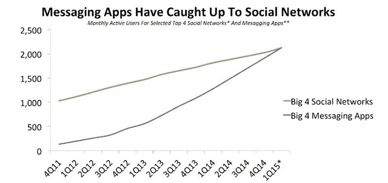
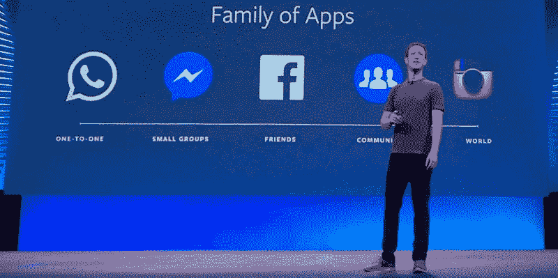

# 点对点信息在保护你的隐私方面变得越来越差了吗？

> 原文：<https://medium.com/hackernoon/is-peer-to-peer-messaging-getting-worse-at-protecting-your-privacy-8771e80f9331>

点对点消息传递已经成为沟通的生命力，不仅对个人，而且对在线业务也是如此。随着今天的社交媒体成为主要的分发平台，这种环境下的消息传递是用户参与的理想媒介。尽管它在我们的生活中扮演着如此重要的角色，但人们也开始担忧:

1.  他们在保护我们的在线隐私和言论自由方面做得如何？
2.  这些平台对你的参与是否有你应得的回报？

大多数情况下，答案是令人失望的。这可能会让你认为点对点消息传递变得越来越糟糕，尤其是从隐私的角度来看。然而，在这篇文章中，我们将证明你是错的。区块链技术通过使用默认加密和直接加密货币奖励，一次性回答了这两个问题。《幽灵对话》是一个利用当今最新区块链技术的当前项目。但是在理解为什么他们的解决方案可以提供真正的私人通信之前，让我们来看看你目前使用的消息应用程序的利与弊。

# 消息应用程序是如何在我们的生活中变得如此重要的？

如果你想了解书面文字交流有多年轻，让我告诉你，[第一条短信](https://www.businessinsider.com/the-first-text-message-ever-2013-12)是在 1992 年发出的。它是由沃达丰的一名工程师发送到 Orbitel 901 电话上的，上面简单地写着:圣诞快乐。

几年后，第一个可用的聊天应用程序诞生于 1999 年，AOL Instant Messenger (AIM)。你认为人们是如何接受的？同年达到[1800 万同时用户](https://mashable.com/2014/04/15/aim-history/)。他们喜欢它！

[https://www.cjr.org/tow_center_reports/guide_to_chat_apps.php](https://www.cjr.org/tow_center_reports/guide_to_chat_apps.php)

这也是我们私人谈话的安全问题受到质疑的时候。微软 MSN Messenger competition 背后的团队[连续几周每天都在入侵 AIM](https://www.itprotoday.com/windows-78/duel-instant-messengers-aol-vs-msn)，直到 AOL 修复了自己的安全漏洞，并永久屏蔽了微软。

Google Talk(现在被称为 Hangouts)于 2005 年推出，WhatsApp 于 2013 年成为免费的移动消息应用，超过了每天发送的短信数量，但消息时代是在 iOS 和 Android 设备进入市场时开始的。到 2017 年，苹果每天计算出 6.3 万亿条信息！

相信今天构建的消息应用程序可以超越任何当前的领导者似乎是不可能的，但这是可以做到的，特别是如果它直接解决用户的缺陷和问题。像 [Ghost Talk](https://www.ghost-talk.io/) 这样的项目之所以存在，是因为保密性对我们的交流至关重要，这只是技术发展的自然步骤。

消息应用甚至还没有发挥出全部潜力。在中国，微信已经普及了对话式商务。您可以直接在 messenger 中预订电影票或叫出租车。它甚至[取代了一些餐馆的服务员](https://www.news.com.au/technology/gadgets/mobile-phones/smartphone-app-replaces-waiters-in-chinese-restaurant/news-story/7b750c3c52ff279013b7d33b6083cba7)，但这有点不合常规。

尽管听起来很超前，但微信引发了[巨大的隐私担忧](https://www.scmp.com/news/china/society/article/2156297/how-growing-privacy-fears-china-are-driving-wechat-users-away)。当大多数流行的即时通讯应用背后的公司表示，他们不会建立一个让政府能够访问用户加密信息的“后门”时，拥有微信的腾讯公司是唯一一个没有公开声明支持这一立场的公司。关于，对吗？

西方的情况也是如此。当 Amber Rudd 担任英国内政大臣时，她呼吁技术公司在他们的加密内容中建立这样的后门，以便安全服务在反恐斗争中需要访问时使用。我们当前的消息应用程序是否顶住了政府的压力？让我们来看看那些标榜自己为安全消息应用程序并在保护用户隐私和言论自由方面采取强硬立场的应用程序，包括前面提到的 Ghost Talk。

# 在隐私方面我们(不)信任！

**Signal Private Messenger** 被认为是整个安全消息应用领域的先驱。它是一个开源平台，任何人都可以自由地检查应用程序的代码，看是否有任何安全缺陷。然而，这对他们来说是一把双刃剑，因为其他公司只是采用他们的底层协议并在他们的解决方案中实现它；WhatsApp 就是其中之一。当然，脸书的实现带有一些漏洞，但是我们接下来会谈到这些。Signal 的主要缺点是其他应用程序能够解决的相当简单和基本的外观。

这还不是全部。当一个 bug [阻止删除用户指定要消失的一组消息](https://motherboard.vice.com/en_us/article/bj3pxd/signal-disappearing-messages-not-disappearing)时，Signal 引起了一些关注。团队解决了这个问题，但它还会再次发生吗？

[https://adespresso.com/blog/best-messaging-app-for-business/](https://adespresso.com/blog/best-messaging-app-for-business/)

**电报**消息应用以拥有最好的安全性而闻名。“秘密聊天”功能保证消息会在所有相关设备上自动自毁。 [1 亿用户](http://fortune.com/2016/02/24/telegram-100-million/)在他们的私人对话中信任它。但是有多少在使用秘密模式呢？鉴于这一功能在默认情况下是不可用的，我们可以认为 Telegram 的做法也不诚实。实际上，该团队从未允许独立审计员评估他们的加密技术，这意味着很难知道他们有多值得信任。当他们声称实际上没有保留任何敏感的用户数据时，我们应该相信他们的话吗？

WhatsApp 是最受欢迎和最安全的消息应用之一，受到超过 15 亿用户的信任。集成了 Signal 的加密聊天协议，一个很棒的用户界面，以及像群聊这样的功能使它获得了很大的成功。然而，隐私问题在 2014 年被脸书以 190 亿美元收购时提出。脸书因其数据收集和用广告瞄准用户的意图而臭名昭著。他们没有隐瞒他们计划与脸书分享 WhatsApp 用户数据的事实。作为用户，你可以选择退出，但这真的能阻止他们监视你吗？

这还不是全部。似乎应用程序本身就有漏洞。安全研究人员 Tobias Boelter 声称，WhatsApp 能够为离线用户创建新的加密密钥，发送者或接收者都不知道，这意味着该公司可以生成新的密钥，用来读取通过他们的服务发送的加密信息。听起来像是政府要求的“后门”功能。认为这个漏洞是故意留在那里的是不是很疯狂？

脸书正在变得越来越大，今年，2019 年 1 月，其首席执行官马克·扎克伯格透露，它[计划将](https://www.nytimes.com/2019/01/25/technology/facebook-instagram-whatsapp-messenger.html) Whatsapp、Facebook Messenger 和 Instagram 消息服务整合到一个统一的技术基础设施上。这可能会在很多方面出错。

[https://techcrunch.com/2016/04/27/facediction/](https://techcrunch.com/2016/04/27/facediction/)

约翰·霍普金斯大学的密码学家马修·格林[解释道](https://www.wired.com/story/encrypted-messaging-isnt-magic/)“加密不是魔法。你很容易弄错。尤其是，如果你不信任你的谈话对象，你就完了。”

端到端加密的目标是在发送的同时将消息内容转换成难以理解的数据块。在这个过程中，消息是不可读的，但另一端的人可以向其他人显示聊天内容，截图，或无限期地将对话保留在他们的设备上。特朗普的前竞选主席保罗·马纳福特(Paul Manafort)甚至发现自己被起诉，因为[联邦调查局(FBI)获得了特朗普在 WhatsApp](https://www.washingtonpost.com/news/powerpost/paloma/the-cybersecurity-202/2018/06/06/the-cybersecurity-202-paul-manafort-s-case-may-undermine-the-fbi-s-encryption-argument/5b16ae5e1b326b08e8839150/) 上发送的信息，而这些信息来自接收这些信息的人。从技术上来说，你的信息是安全的，但大多数信息应用程序会记录你的聊天对象。

这如何符合欧洲通用数据保护法规(GDPR ),该法规对于任何企业在欧洲合法运营都至关重要？WhatsApp 不符合 GDPR 标准。当它上传用户通讯录中的所有联系人时，它违反了数据保护法，根据该法，企业失去了对个人数据的控制，在这种情况下，是对自己员工数据的控制。

# 新的隐私问题

话虽如此，问题从“我的数据是否被任何第三方服务拦截？”变成“我如何才能在不将我的数据所有权交给对方的情况下与对方交流？”

以保护用户数据为目标的颠覆性社交媒体应用 Ghost Talk 即将推出新的安全功能，如自动删除消息，允许用户确保所有消息在接收方阅读后立即消失。

[https://www.ghost-talk.io/](https://www.ghost-talk.io/)

其他几个加密消息应用程序也提供了相同的消失消息功能，以帮助确保您和您的聊天对象都不会将数据保留超过必要的时间。然而，鬼说话提供的不仅仅是私人交流。它改变了用户与企业、小企业、艺术家和推广者互动的方式:每个用户都因他们的参与而获得回报。

Ghost Talk 使用一个分散的支付平台，通过不可变的智能合约和加密货币奖励来奖励其社交媒体消息应用程序的用户。消息应用程序中的任何活动都会产生 XSCC(智能硬币令牌)奖励。此外，如果用户使用 Ghost Talk 消息生态系统，我们在微信应用中看到的交互水平将为他们带来相当有趣的利润。

那有什么条件呢？没有了。Ghost Talk 以一种全新的模式重塑了平台参与者的奖励方式。这种模式可以解决当前的消息应用程序问题，如 GDPR 合规性。Ghost Talk 仅根据数据保护法和预定义的目的处理数据，并采取综合措施保护个人数据。

Ghost Talk 以最直截了当的方式解决了隐私问题，它的承诺超越了内容创作和品牌推广的未来，这是任何成功的社交媒体平台最重要的部分，被放在用户手中。

# 结论

诚然，我们的通信不断受到来自公司、黑客或当局的不正当间谍活动的威胁。但是，加密的级别不一定是问题。我们需要一种全新的模式来保护我们个人生活中最隐私的细节，我们许多人都通过这些消息应用程序分享这些细节。

受欢迎的科技公司未能采取必要的基本措施来保护我们的权利，现在他们无法保持值得信赖。当最后一点信任最终耗尽时，我们将有两个选择:完全停止使用短信(很难相信这是可能的)或者支持诚实的公司建立有利于用户隐私的新模式。鬼话提出了这样一个独特的模式。这可能是未来吗？只有时间能证明一切。但无论如何，它听起来比所有其他流行的消息应用程序都要好，这些应用程序重复相同的特性和功能，年复一年地失败！