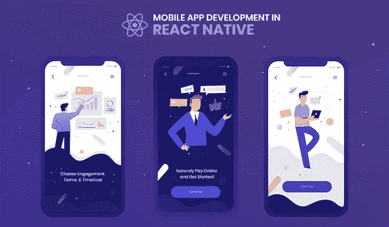

# React Native 是移动应用开发的健康投资吗？

> 原文：<https://medium.com/hackernoon/is-react-native-a-healthy-investment-for-mobile-app-development-203e29347b97>

2019 年已经在路上了。所以，现在是洞察移动应用开发最新趋势的大好时机。正如你可能知道的，移动应用程序开发市场已经重塑了从你的日常日程到你的交流方式的一切。从预订出租车到点餐，手机已经成为人们屡试不爽的福利。根据 Statista 的报告，智能手机用户的数量到 2020 年将达到 400 万，这是从桌面到移动的重大转变。

今天，在移动应用程序开发时代，混合应用程序是开发人员和客户正在开发的解决方案。值得注意的是，那些同时寻求高性能和更快部署，并在新技术中取得成功的人，反应很自然。React Native 是脸书在 2013 年推出的一个混合应用程序框架，允许开发人员在 JavaScript 的帮助下以更快的速度开发应用程序。这项技术允许您在不同的移动平台上重用代码，以最少的资金和时间交付更快更好的应用程序。

正如技术创造者所描述的，用户界面的 JavaScript 已经改写了界面开发的整个概念。那么，"**为什么要使用 React 原生技术进行移动应用开发呢？**”。什么使它成为正确的选择，为什么 react 本地开发者如此受追捧？最重要的是，开发移动应用值得吗？

# 让我们来看看 react native 的几个特性，它们将帮助您跨不同的平台进行发布，并且不会影响用户体验:

## 开发周期短

React 原生移动应用程序开发技术加快了开发可靠但更好的应用程序的过程。作为一个开源项目，它包含了许多容易获得的组件，并且有一个专家团队来克服任何问题并支持 React。统计数据已经证明，使用这种技术，开发时间逐渐减少了 30%。此外，通过使用 Redux，一种先进的管理工具，可以大大减少应用程序的时间。

## 生机勃勃的生态系统

大多数情况下，React Native for[**mobile application development**](https://www.xicom.biz/offerings/mobile-app-development/?utm_source=SM01)代码是简单的 JavaScript，在语言及其各自的生态系统中获得了大部分改进。由于它的分析性质，只有某些库非常适合使用。不管怎样，React 原生开发者在 React 原生平台上开发应用程序时过得很轻松舒适。

## 跨平台灵活性

为了更好地了解，大多数 React API 都是面向跨平台的，这可能意味着至少它们的一个组件支持 IOS 或 Android。在极少数情况下，开发者在选择平台时需要注意考虑设计，尤其是 Android 或 IOS。在这些场景中，React Native 技术提供了支持文件扩展名的模块和平台。这些平台可以很容易地检测应用程序运行的操作系统，为进一步的面向平台的实现保存知识。作为平台特定的文件扩展名，它允许开发者为特定的功能定义特定的文件。因此，React 可以根据应用程序成功运行的操作系统选择正确的文件。

## 更好的本地应用程序开发

原生应用程序开发通常与较慢和较低生产力的部署时间相关联，并伴随着效率的缺乏。然而，React 原生移动应用程序开发的重点是速度和效率，以及混合空间和原生结果。

另外，脸书的 React JS web 应用 UI 库也在 React Native 的保护下。这项技术使得 React JS 的应用程序性能和抽象比以前更好。易于理解的编程语言为混合移动应用程序开发的发展奠定了基础。

## 开发者的更好选择

获得 React 原生技术的全面知识就像任何了解 JavaScript 的人一样容易。React Native 最初允许任何前端开发者交一个熟练的移动— [**应用开发者**](https://www.xicom.biz/offerings/hire-mobile-developers/?utm_source=SM01) 。尽管如此，开发者并不需要任何特定的培训，比如 IOS 的 Swift 或 Android 的 Java 他们需要对 JavaScript 有一个粗略的了解，对原生 UI 元素有一点了解，需要一些 API 相关的平台，最后是设计模式。

**尽管 React Native 是一个新词，但它正在迅速发展，脸书已经开始投资于它的扩张。**

## 第三方兼容性

> 听到“第三方兼容性”你是怎么理解的？

第三方兼容性意味着开发者不必依赖 web view 来实现特定功能。让我们考虑一下，如果你试图在你的应用程序中灌输谷歌地图的功能，React Native 技术会让你将插件与指定的模块链接起来。因此，有必要将地图与一些设备的功能连接起来，如缩放、旋转和维护外围设备，以使用更少的内存和更快有效地加载。

## React Native 是用户界面的最佳解决方案

React 原生移动应用程序开发的主要重点是构建一个完美的移动用户界面。这种特殊的技术更倾向于 JavaScript 库，而不是框架。由于与自然环境的异步 JavaScript 交互，结果用户界面具有高度的响应时间和灵活性，这使得该应用程序与典型的混合应用程序相比具有更短的加载时间。

## 即时实时更新

苹果商店是否花了很长时间才批准你的应用程序？

当你等待批准后，每次你在应用程序中做一些更新时，都变得非常复杂。因此，React Native 就是答案。使用 React Native 技术开发移动应用程序允许您发布更新，甚至不需要经常去商店。有了 JavaScript 的授权，更新应用程序的整个过程变得简单而流畅。

## 零重写

React 本机特定库提供 React 本机移动应用程序开发公司在当前移动应用程序代码中包含基本组件。这是一种更宽松的方法，让本地开发人员不要从头开始编写特定的代码。这种方法使得现有的移动应用程序可以轻松地切换到 react 本地库。

**但是，在您开始享受 React Native 的好处之前，了解一下技术需求是很重要的:**

*   React Native 使用一套完整的组件，例如、<view>、<scrollview>、<textinput>、<flatlist>组件，将它们绘制成本地 iOS 和 Android 版本。甚至，一些第三方组件可以从 NPM 下载。</flatlist></textinput></scrollview></view>
*   没有 DOM(文档对象模型)。每一个文本都需要放在<text>标签中，而如果某些内容是可点击的，那么它必须放在<touchable opacity="">标签中。</touchable></text>
*   从任何东西到某些东西，如果你想在你的页面上滚动，把它放在标签<scrollview>里面是必要的。此外围之外的任何内容都将被视为固定在视口中。</scrollview>
*   类似地，对于样式，组件 React Native 使用样式表。它与 web 中使用的 CSS 样式表相同，除了。
*   甚至，它有一个用于两个平台的代码库，即 iOS 和 Android。它的行为可以根据组件的要求进行定制。特别是，它可以通过使用 platform.os 来检测平台。
*   请记住，对于每次点击事件，使用 onPress 而不是 onClick。
*   要添加自定义字体，您需要创建一个资产文件夹，并指向 NPM 提到的根文件夹中的资产/字体。此外，资产地址披露给 NPM。
*   开箱即用，但依偎滚动不能在 Android 平台上工作。“scrollview”子级依赖于“scrollview”父级将触摸事件传递给子级。然而，父节点配置了特定的“mTouchSlop ”,这是吸收超出该 Slop 的阻力的原因。虽然 slop 似乎设置得很低，但它通常优先在外部滚动视图中滚动，同时很难在内部滚动。

# 最后..

从萌芽品牌到数百万美元的公司，每个行业都在部署 React Native [**移动应用开发技术**](https://www.xicom.biz/offerings/mobile-app-development/?utm_source=SM01) 来简化他们的开发流程，并成为他们进步的原因。

因此，当您使用 React Native 技术并将其与其他 JavaScript 框架进行比较时，您会理解 React Native 带来了令人难忘的 UI 体验。本地环境与混合空间的融合使得移动应用程序开发过程成为一种迷人的存在。