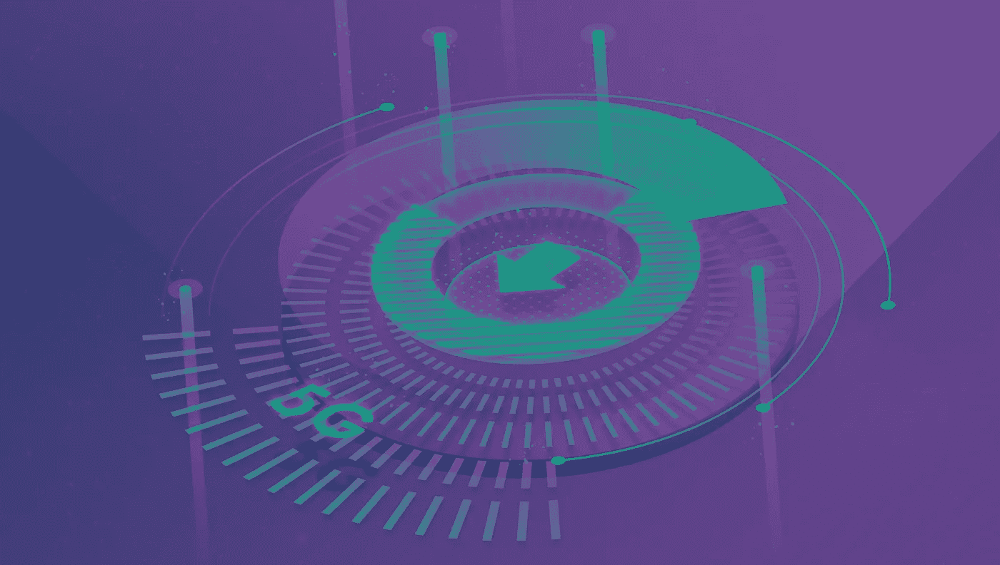

# 音乐行业为 5G 做好准备了吗？拥抱流媒体之外的音乐未来

> 原文：<https://medium.com/hackernoon/is-the-music-industry-ready-for-5g-embracing-the-future-of-music-beyond-streaming-18867590a2e5>

你最后一次购买音乐是什么时候？我指的不仅仅是物理媒介。随着流媒体的惊人增长，你最近没有购买下载的可能性也越来越大，因为越来越多的音乐粉丝选择访问歌曲，而不是想要拥有它们。

在最近的一次采访中，凯文·特威切尔 DataArt 的媒体&娱乐实践顾问——讨论了音乐行业在过去几年中发生的巨大变化，同时开启了一场关于行业下一波转型的对话。随着物理媒体转向下载，以及流媒体的爆炸性增长，我们见证了从所有权模式到访问模式的巨大转变。这一发展主要是移动消费增长加上 3G 和 4G 网络速度的结果，它产生了许多回报，包括收入大幅增加，艺术家在全球范围内发布大量内容的能力不断增强。

但是接下来呢？嗯，这些 3G 和 4G 网络预计最早将于明年被 5G 的商业实施大大超越。5G 有望比 4G 快大约 64 倍，将成为游戏规则的改变者，为音乐行业带来大量创新和机遇。

5G 网速的可用性会再次改变音乐行业吗？随着技术处于快速发展的音乐世界的前沿，这个行业准备好迎接另一个颠覆者了吗？当前的音乐基础设施能跟上这场革命吗？

**音乐市场生机勃勃**

随着实体媒体的销售迅速下滑，音乐行业的恐惧显而易见。收入下降给艺术家带来了更大的压力，他们为了生存而不断巡回演出，而唱片公司和其他相关企业面临着可能永远无法回到高销量高利润率的辉煌时代。

然而，流媒体的兴起给整个行业带来了急需的提振，在相对较短的时间内以大规模增长的潜力取代了恐惧。[来自 *IFPI*](https://www.ifpi.org/downloads/GMR2019.pdf) *(国际唱片业联合会)*的最新报告显示，音乐业务的收入持续增长，2018 年全球唱片收入增长 9.7%。这标志着收入连续第四年增长，更不用说是自 1997 年该组织开始跟踪市场以来的最高增长率之一。

毫无疑问，流媒体是这些令人难以置信的收益的原因，2018 年流媒体总收入增长了 34%，整体数字世界占全球市场的 58.9%。与此同时，虽然流媒体越来越多地主导着录制音乐的收入，但巡回演出仍然是大多数艺术家的主要收入来源。在最近的 [*全球娱乐和媒体展望 2018–2022*](https://www.pwc.com/outlook)报告中，*普华永道*预测，从 2018–2022 年，现场音乐收入将以 3.3%的复合年增长率(CAGR)增长，到这四年结束时将达到令人难以置信的 305.5 亿美元，从而确保大多数全球艺术家的巡回演出收入。

下载量又回来了吗？

正如我在本文开头提到的，音乐迷下载一首歌曲的可能性正在迅速下降。流媒体速度更快，价格更低，因此在过去几年里迅速占据了消费者的偏好。

但是等等！随着 5G 进入市场，速度的大幅提升会导致下载音乐的回归，从而远离流媒体吗？通过使用 5G 而不是 4G，预测显示普通消费者[在下载 10，000 首歌曲时将节省 3 个多小时，同时在整个在线娱乐活动(如音乐、电视、电影和游戏)中每月节省大约 23 个小时](https://www.techrepublic.com/article/faster-downloads-and-low-latency-from-5g-will-save-hours-of-download-time-compared-to-4g/)。我们已经见证了大多数电信公司投资于内容合作伙伴关系，例如威瑞森无线宣布，它将向一些付费用户免费提供 Apple Music，从而为这些消费者每人每年节省 120 美元的独立订阅费用。

那么，我们朝哪个方向走？音乐粉丝会使用 5G 的功能下载歌曲还是流媒体仍然是首选[？我去我的 Twitter 粉丝](https://twitter.com/sbludov/status/1105130054223364096)那里看看音乐社区是怎么想的，尽管 64%的人说一旦他们获得更高的 5G 速度，他们就会播放更多的音乐，但 36%的人说他们打算因为更快的连接而下载更多的音乐，这表明下载量在几年内首次增长的巨大潜力。

**超越下载，超越流媒体**

一旦 5G 在商业上变得可行，速度和质量的巨大改善将为创新和数据密集型产品的扩展带来绝佳的机会，而在连接速度较慢的情况下，这是不可能的。

由于 5G 速度的出现，虚拟音乐会拥有重大增长的潜力。与此同时，这一概念已经达到了惊人的高度。今年早些时候， [Epic Games 在堡垒之夜举办了一场由世界知名的 EDM DJ Marshmello](https://www.roadtovr.com/fornite-virtual-concert-potent-glimpse-of-virtual-reality-future/) 在游戏中表演的活动，约有 1000 万并发用户观看了该活动。虽然这场音乐会只有 10 分钟长，但其令人难以置信的影响力显示了虚拟现场表演广阔的未来潜力。

对于音乐人来说， [5G 将把远程协作的可能性提升到一个全新的水平](https://www.ericsson.com/en/blog/2019/3/real-time-music-collaboration-with-5G)。尽管已经存在一系列用于远程记录的工具，但是当前网络连接中的高延迟和缺乏可靠性带来了许多挑战，并且极大地降低了成功的可能性。凭借超低的延迟和速度的大幅提升，5G 为音乐家和制作人开辟了许多新的世界，他们可以在不在同一物理空间的情况下一起工作。从排练和写歌到录音、表演和教学，我们正处于远程合作爆炸的风口浪尖，5G 将以前不可想象的联系变成了现实的机会。

当我们想到增强现实(AR)时，商品可能不会是第一个想到的东西。然而，使用 AR 来销售商品就在这里，潜力是不可思议的。比如美国运通音乐 app 在发布了[一款名为 Outside 的移动 AR 体验。粉丝们一边听着贾斯汀·汀布莱克新专辑中歌曲背后的故事，一边体验他自己的导航。用户可以一边听着“微风拂过池塘”这首歌，一边探索郁郁葱葱的蒙大拿风光，同时与各种图标进行互动。在整个 AR 体验中，粉丝们获得了能够购买独家 Timberlake 商品的特权，例如 t 恤和法兰绒。混合现实体验让艺术家有机会一窥他们的创意世界，同时让粉丝有机会更多地了解他们最喜爱的艺术家，并通过购买独家商品收集一些未来的收藏家物品。](https://vrscout.com/news/justin-timberlake-music-ar/)

虽然 5G 有可能从根本上改善和扩展音乐和娱乐世界，但仍存在许多挑战。跟上新格式的发展并为不断发展的音乐产业制定版权法规需要勤奋和卓越的技术。音乐人将需要越来越精细的合同和交易来有效地控制和影响他们音乐的使用和发行方式。此外，当前的音乐基础设施将需要调整和扩展，以跟上明显更快的网络速度的商业可用性所带来的快速发展。虽然 5G 还没有到来，但它很快就会到来，整个音乐行业必须抓住时机，为它的到来做好全面准备。

你对 5G 和流媒体之外的音乐未来有什么想法？请在下面的评论中分享你的观点。

由**谢尔盖·布多夫**T4【SVP】媒体&娱乐[数据艺术](https://www.dataart.com/industry/media-and-entertainment?utm_source=medium.com&utm_medium=referral&utm_campaign=m-regular&utm_content=sbludov-hn-5gmusic)