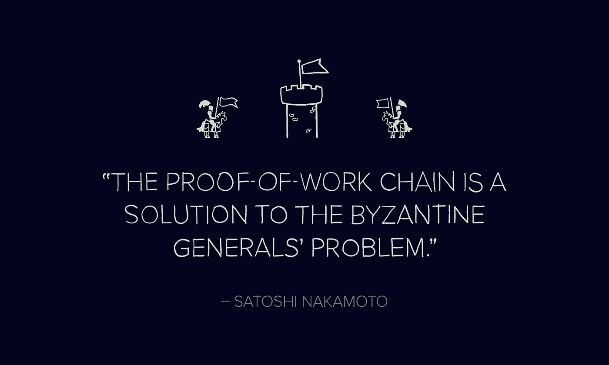
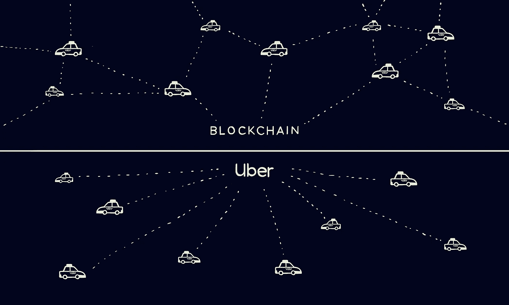

# 下一代区块链技术已经到来了吗？

> 原文：<https://medium.com/hackernoon/is-the-next-generation-of-blockchain-technologies-already-upon-us-e129bd0e4383>

自从中本聪首次提出比特币白皮书以来，比特币和区块链已经不是以前的创新了。

区块链已经超越了数字货币的范畴，进入了新的不可想象的用途。区块链技术公司的核心仍然是分布式、不可变和拜占庭式容错数字会计的基本原则。

然而，区块链的数字版本一直是手头的限制稳步发展。按照设计，第一个区块链(比特币)被设计成交易速度低、功能单一并维持公共治理。

比特币的这些局限性可以说是其区块链的优势。然而，它们也限制了比特币在更大规模经济活动中作为结算层以外的用途。

自比特币以来，区块链就有了后续版本，每一个版本都建立在前一个版本的基础之上。

简而言之，每个版本之间的界限并不严格，但他们所走的道路跨越了比特币、智能合约、去中心化应用程序，并进入了新的整体区块链环境。

特别是[insole ar](https://insolar.io)，正在将边界推向区块链的下一代。

# 第一代区块链:不可变的、分布式的、点对点的数字现金

最开始，有比特币。建立在先驱工程师和科学家的肩膀上，如大卫·乔姆、亚当·贝克、尼克·萨博、戴伟和哈尔·芬尼。

这个新颖的网络是拜占庭人的普遍问题第一次真正受到数字化的挑战。简而言之，问题围绕着如何验证和信任独立的代理(节点)为了共同的目标而协同工作。

“The proof-of-work chain is a solution to the Byzantine Generals’ Problem.”
*– Satoshi Nakamoto* [[Source](https://www.mail-archive.com/cryptography@metzdowd.com/msg09997.html)]

这个众所周知的问题是网络中特别难以克服的[向量](/loom-network/understanding-blockchain-fundamentals-part-1-byzantine-fault-tolerance-245f46fe8419)。它对使用大型数据集影响人类生活的网络构成了指数级威胁。例如，空气控制、医疗供应链、铁路管理和核电项目。

虽然是开创性的，但比特币和其他第一代区块链是具有单一目的的单链。比特币本应是一种“点对点电子现金系统”，但自那以来，它基本上限于这一功能，尽管后来的发展扩大了侧链(side-chains)等生态系统。

## 区块链 1.0 版的优势

除了解决拜占庭将军的问题，中本聪还克服了数字货币面临的最大问题之一:重复支出。

顾名思义，重复消费是指一个用户花费相同的价值两次或更多次。在非数字世界，这就好像你向两个供应商承诺各支付 10 美元。在你用你的 10 美元和每个卖主交换他们的货物后，后来发现其中一个卖主得到了一张假的 10 美元。

在现实世界中，由于难以复制有形的法币和纸币，双重支出受到控制。在数字世界中，这几乎是不可能克服的。计算机文件和数据很容易被复制和扩散，使得验证数字真实性变得非常复杂。

> “在 Satoshi 的创新之前，**重复消费是数字货币交易**的致命弱点——如果不使用中介，数字系统根本不可能证明两个或更多不同的人没有花费相同的数字货币。"
> –[*比尔·巴尔海德*](https://twitter.com/billbarhydt) *|凯西创始人兼首席执行官* [ [Coindesk](https://www.coindesk.com/the-double-spend-what-bitcoins-white-paper-solved-forever) ]

中本聪遏制类似拜占庭将军问题的重复支出；通过一个加密的哈希链进行保护，并通过工作证明共识进行验证。

## 区块链 1.0 版的局限性

取决于你对比特币的看法，例如，它是储值工具、结算网络还是支付处理器；比特币区块链存在一些限制，可能会阻碍它实现这些不同的用例。

像块时间和大小这样的项目会限制事务速度。此外，比特币是一种独特的可编程货币，虽然具有开创性，但它的功能相对有限。

除了较低的交易速度和相对有限的功能，比特币几乎没有能力与其他区块链进行本地交互。互操作性的缺乏是可以理解的，但是孤立的区块链交互的需求已经增长。

此外，尽管克服了拜占庭将军的问题，早期一代区块链人在共识选项和灵活性方面受到限制。

最初，工作验证(PoW)提供了一种达成共识的解决方案。然而，从那时起，出现了一系列新的共识机制实验，例如利害关系证明(PoS)、委托利害关系证明(dPoS)和身份证明(PoI)等等。

到目前为止，区块链在改变他们的共识算法的能力上保持僵化。这限制了寻求利用新方法保护区块链的项目。

例如，智能合同区块链，以太坊目前正在进行一场有争议的辩论，以在即将到来的名为 Casper 的更新中从 PoW 更改为 PoS。围绕如何最好地实施这一变化存在许多不确定性，这使得以太坊的未来对所有相关利益方来说都不明朗。

在这方面，Insolar 是区块链共识在互操作性和可塑性方面的重大改进。可部署的[域](/insolar/insolar-domains-simply-explained-7183dc56d8ca)可以根据区块链项目的需求进行定制，无论是私有的还是公共的。

> “…在实时企业环境中使用区块链不仅仅是对整个网络应用单一的共识算法，而是允许用户和企业决定将哪些规则应用于自己的业务流程。”
> –*英豪团队* [ [来源](/insolar/insolar-consensus-algorithms-achieving-10k-tx-s-61a333f8c38a)

## 第一代发展

其他第一代区块链试图根据他们如何定义比特币的目的来解决这些限制。推动这些解决方案的最有力工具是从比特币中硬派生出一个新的区块链。

简而言之，这是对比特币的复制和粘贴，并根据你的需求进行了一些修改。例如，莱特币和比特币现金是对比特币有限交易速度的回应。替代硬币可以剥离并重新开发，以更好地适应用户对数字货币应该如何存在的不同思考方式。

普遍的共识是，比特币仍处于发展初期。然而，这些限制通常是在协议层面，在这一基础阶段进行修改会遭到强烈反对。

相反，对扩展性、功能性和互操作性的限制正在链外开发，通常称为第二层。不要误解区块链 2.0，第二层解决方案建立在现有区块链之上。

例如，像闪电网络这样的国家渠道正在增加对规模的限制，即交易速度。此外，Segwit 使得将更多的数据打包到每个块中成为可能，每个块可以确认更多的事务。最后，原子互换通过连接主权区块链提高了互操作性。

比特币是第一个利用工作证明(PoW)区块链来解决拜占庭将军问题和重复支出的货币。然而，现在秘方已经出来了，区块链有了新的用途和范例。

# 第二代区块链:可编程价值网络

在维塔利克·布特林将区块链从可编程的货币解锁为可编程的价值后，第二代区块链火了。

作为对区块链潜力的重新想象，Vitalik 构思并开发了以太坊区块链。这个独特的网络，通常被称为世界计算机，利用传统意义上的区块链和两种全网络加密货币，以太和气体。

然而，网络的核心是将这一代区块链人与上一代分开的软件。

以太坊虚拟机(EVM)是一套图灵完备的软件协议，只要有足够的内存和时间，任何人都可以在以太坊区块链上运行任何程序。

开发者可以编写可在以太坊的 EVM 上执行的软件，以换取天然气，这是 EVM 经济的加密货币。EVM 执行软件最重要的子集是智能合同的部署。

如果 EVM 将这一代区块链人与第一代分开，那么智能合同就定义了第二代。

## 区块链 v2.0 优势

对于第二代区块链来说，最重要的里程碑是智能合同的出现，这是一种由图灵完全虚拟机执行的自主软件。

简而言之，这些是两个代理之间的可编程协议，没有任何第三方来促进或调解合同协议。

为了说明智能合同，考虑像亚马逊这样的电子商务巨头。在线市场充当第三方代理，促进和调解两个陌生人之间的购买。一个买家，一个卖家。

在这种情况下，亚马逊的目的是弥合买方和卖方之间的信任差距。买家需要相信他们会得到他们买的东西。相反，卖家需要相信他们会为所卖的东西得到回报。亚马逊通过帮助将支付转移到卖家，将购买转移到买家，满足了这些对信任的需求。

理论上，亚马逊的第三方角色可以被一套智能合同所取代，自动地、有计划地消除陷入合同协议的双方之间的信任因素。

> “大多数技术都倾向于让在外围做琐碎工作的工人自动化，而区块链则让中心自动化。区块链没有让出租车司机失业，而是让优步失业，让出租车司机直接为顾客服务
> *–*[*维塔利克·布特林*](https://twitter.com/VitalikButerin) *|联合创始人以太坊和比特币杂志*

“… blockchain puts Uber out of a job and lets the taxi drivers work with the customer directly.” *—* [*Vitalik Buterin*](https://twitter.com/VitalikButerin)

EVM 和智能合同是第二代区块链的关键组件。结合区块链生态系统，这些部分实现了更高的交易速度、改进的可扩展性和功能的爆炸式增长。

此外，智能合同的使用开辟了一条通向利益证明(PoS)的道路，这是一种新的共识选择。这种验证和安全的方法将网络加密货币与节点挂钩，作为合作的激励。被标记的节点因参与保护和验证区块链而按比例获得奖励。

PoS 通常被认为是 PoW 的竞争对手，因为前者需要的维护能源少得多，对环境的影响也小得多。

## 区块链 v2.0 的局限性

尽管在功能性和提高交易速度方面取得了巨大的进步，区块链的智能合约一代仍然在桌面上留下了价值。

第二代可编程价值网络在网络本地互操作性和未来扩展方面仍然受到限制。其中一些限制，像上一代一样，正在被第二层和外链解决方案所解决。然而，相对于区块链的后续几代，智能合约网络，如以太坊、EOS、Dvinity 和 Hyperledger，如果要成为世界计算机，将需要解决方案来扩展。

Insolar 凭借默认的网络互操作性和[前所未有的交易速度](https://cointelegraph.com/news/enterprise-blockchain-platform-records-10k-transactions-per-second-in-testnet-launch)摆脱了这些限制。企业级应用程序可以很容易地被纳入一个生态系统，这个生态系统已经号称每秒近两万次交易(T3)。

## 第二代开发

随着越来越多的智能合约被尝试使用，扩大规模的需求变得无处不在。新的方案，如侧链和驱动链正在测试，随着新的方法，以 PoS 和一个类似的排列命名的指定股权证明(DPoS)。

这些离线和在线解决方案是对不断增长的网络资源需求的直接响应。这种增长的需求在很大程度上可以归因于向第三代区块链的转变，即分散应用(Dapp)时代。

# 第三代区块链:去中心化应用

尽管去中心化应用(Dapp)自第一代区块链以来就已经存在，但从技术上讲，比特币是一种 Dapp，直到智能合约之后，Dapp 的概念才真正起飞。

区块链的第三个版本不一定代表区块链的世代转换，而是一个新的功能前沿。分散式应用程序开始将区块链工业与现实世界的目的联系起来。从微支付和资产令牌化到数字收藏品和分散贷款，Dapps 是区块链潜力的下一次迭代。

> “Dapps 现在正在获得媒体的报道，但我相信，有一天它会比世界上最受欢迎的网络应用程序应用得更广泛……”
> *–*[*Siraj Raval*](https://twitter.com/sirajraval)*|“分散式应用程序”*

## 区块链 3.0 版的优势

如果智能合同给区块链带来了十倍多的功能，那么 Dapps 及其所需的基础设施就是又一次十倍的飞跃。

Dapp 与你在谷歌 Play 商店或 App Store 中找到的应用程序没有什么不同。传统应用程序将运行在由应用程序开发者共同拥有或租赁的集中式硬件上。例如，Google Docs 由 Google 拥有和运营。该软件仅对开发团队关闭，运行在谷歌拥有和保护的硬件上。

或者，Dapp 通常是一个开源项目(尽管不是必须的),它的软件运行在一个分散的网络上。企业、消费者、游戏玩家、收藏家、基础设施管理、社交网络、在线隐私、稳定硬币和分散交易所(dex)等领域已经有了 Dapps。

Dapps 的大部分运行在智能合同区块链上。以太坊网络上的 Radar、Augur、MakerDAO、Decentraland 等去中心化应用；EOS 网络上的 Bancor、brunh 和 Newdex 以及 Steem 网络上的基础、Steemit 和尊重。

尽管 Dapps 开始让区块链更接近用户，但运营它们的网络存在明显的局限性。最明显的莫过于收藏品 Dapp，CryptoKitties，在 2017/2018 年牛市的高潮附近几乎使以太坊网络陷入瘫痪。

大批量 Dapps 开始测试其区块链的上限，这需要创新的爆发，并标志着第三代区块链。

更高效的区块链和外围技术被理论化、测试并推向市场。随着想象力超过了大多数区块链的技术能力，像 Metamask 这样的软件变成了真空

## 区块链 3.0 版的限制

Dapp 最显著的局限性直接受到其基础区块链的影响。伸缩性、交易速度和有限共识方法的问题通常是从它们运行的智能合约网络继承而来的。Dapp 只能在区块链允许的范围内生长。

随着第二代技术的发展，许多限制都得到了改善，如前面提到的侧链或协议层分片。

对于 Insolar 来说，切分是降低智能合约权重和保持交易费用最小化的主要策略。通过使用分片和独特的节点管理，Insolar 能够同时运行智能合同。智能合同的这种并行处理防止了软件被阻塞队列所阻塞。

## 第三代发展

在许多情况下，Dapps 的开发超越了他们正在使用的区块链的限制。就像年轻的网飞的点播视频流媒体服务超出了互联网基础设施的容量。像网飞这样的应用将网络推向了新一代。戴普斯将区块链工业带入了第三代。

正如所强调的，智能合同区块链直接或间接地对其生态系统中的 Dapps 施加限制。因此，Dapp 开发的快速繁荣催生了更多的项目来扩展区块链的局限性。无论是改善用户体验还是实施全新的网络，项目都在尝试寻找最有效的智能合同环境来满足他们的需求。

EOS、Steem、Ethereum、Stellar 和 Cardano 等主要参与者通过提供各种折衷方案在这一领域脱颖而出。每个区块链优先考虑他们认为智能合同网络应该如何运行；平衡因素，如安全性、交易率、终结性、治理、共识类型和 ASIC 容忍度等等。

然而，通常优先考虑一个因素会损害另一个因素。

# 第四代区块链:分布式企业级价值网络

迄今为止，区块链的代际演变遵循着一个熟悉的模式。在每个版本之间，我们对基于区块链的网络的局限性的看法都有一个范式的转变。

第四代是承认区块链以前的局限性。在企业对企业和消费者对企业的市场中，限制支撑全行业网络潜力的局限性。

这一代人超越了目前区分各种区块链项目的平衡行为。

## Insolar 正在推动第四代区块链

第一，交易速度。区块链处理事务的速度对于企业级集成至关重要。物联网(IoT)正在呈指数级增长，制造、航运、农业和电信等行业正在产生超出管理能力的数据。

交易速度不仅需要高，还需要随着网络容量动态扩展。在企业就绪型区块链中，开发人员不能追赶批量需求，只有在需求达到极限后才扩展网络。

Insolar 中的软件优化和节点管理支持一个生态系统，该生态系统可在满足限制之前根据网络需求进行扩展。

其次，Insolar 在堆栈的每一层都是高度可定制的。硬件云可以根据个人区块链需求进行配置，域逻辑可以配置为完全根据需要运行智能合同

> “Insolar 不是应用单一逻辑的单一区块链，而是创建分布式业务网络，根据所有可能的场景和标准支持多种应用”
> –in solar 团队[ [来源](/insolar/insolar-domains-simply-explained-7183dc56d8ca)

第三，通过独特的网络架构，私有和公共区块链，成员和 Dapps 本身是可互操作的。每个云、域和智能合同可以有根本的不同，但仍然不会限制它们与网络其余部分的协作能力。Insolar 是一个可互操作的网络生态系统。

最后，Insolar 将大规模扩展、高度定制和互操作性整合到一个完整的企业级网络中。从区块链到 Dapp，业务逻辑兼容性和可访问性都被嵌入到了 Insolar 中

最终，Insolar 是区块链的一种新的思维方式。将企业生态系统的动态需求置于分布式开源架构的最前沿。

披露:区块链技术正在快速发展，为了突出这一代人的进步，本文受 [Insolar.io](https://insolar.io/) 委托撰写