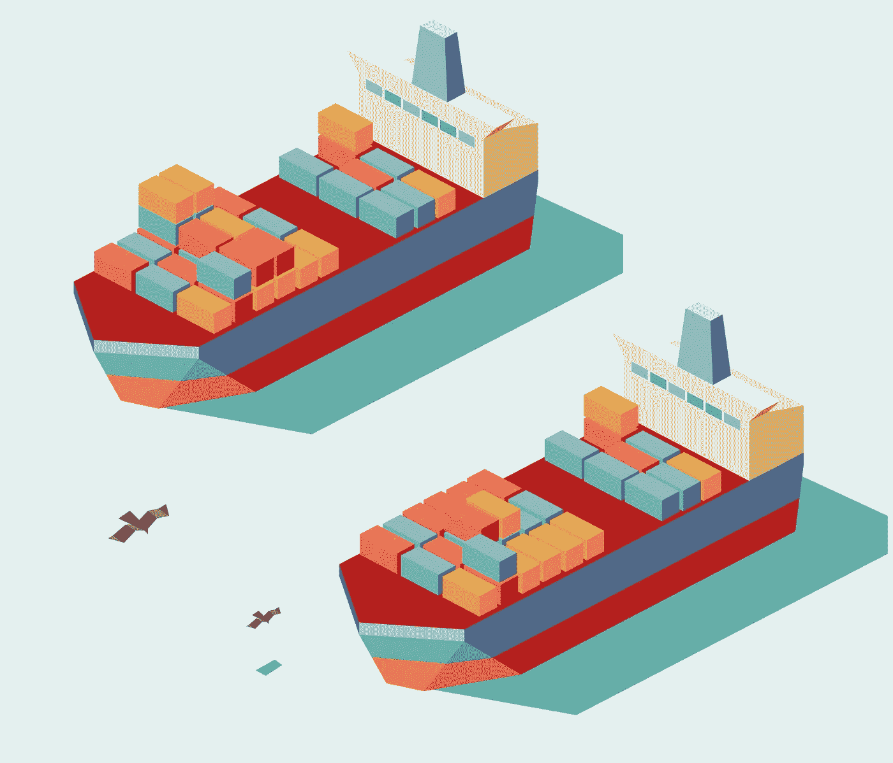

# 炒作之外还有生命吗？—企业区块链现状

> 原文：<https://medium.com/hackernoon/is-there-life-beyond-the-hype-the-status-quo-of-enterprise-blockchain-1eebeac22f15>

说 2018 年是区块链年并不为过。在你的职位或服务范围中使用“区块链”这个词就足以让你迅速成为“It”人士或公司。

虽然 2018 年令人失望的结局可能会鼓励一些人跳出区块链的热潮，但这个领域正在稳步前进。

根据 PRWeb 在 11 月下旬发布的[报告](https://www.prweb.com/releases/blockchain_in_retail_projected_to_surpass_2_3b_by_2023/prweb15954706.htm),区块链在全球零售业中的市值预计将在未来五年内从现在的 8000 万美元增加到 23 亿美元。这意味着整体增长 29 倍，年增长率为 96.4%。

> 有趣的是，行业仍在等待企业区块链大规模应用的突破性成功故事。

通过最新的讨论、会议、行业媒体和我自己网络内的(通常是激烈的)对话，我想分享我对 2019 年年中区块链企业现状的一些思考，以及阻碍加速采用的因素。

# **区块链在这里停留**

尽管去年的加密冷水淋浴，今天很难不感兴趣的公司在区块链技术。或许，令人失望的大量未兑现承诺的公司以及 ICO 泡沫的破裂是塞翁失马焉知非福……如今，这种情绪可能不那么热情了，但投资者和其他利益相关者已经开始对代币经济采取更加理性的态度。

> 作为对监管不足的 ICO 模式的回答，替代形式的硬币产品正在浮出水面，包括 STO 的(安全令牌产品)。

与其他发行的硬币类似，STO 的投资者会得到一个加密令牌，代表他们在一个项目中的份额。但与 ICO 不同，证券代币代表实际价值，即股票、债券、房地产或其他资产，因此是一种风险较低的投资形式。

虽然加密初创公司可能会经历一段艰难时期，但这项技术本身正在企业中获得动力。在过去的几个月里，Coindesk 或 Cointelegraph 等区块链媒体渠道一直在定期报道区块链试验的新案例、概念验证和各行各业一些最大的市场参与者的采用计划。

> 其中包括 IOTA 与捷豹和路虎的合作，耐克(Nike)开发了一种名为“Cryptokicks”的实用令牌原型，路易威登(Louis Vuitton)测试了区块链支持的原产地跟踪解决方案，百事可乐(PepsiCo)加入了广告供应链领域，或者宜家(IKEA)在物联网领域开发了原型。

金融科技领域已经宣布了更多颠覆性的举措，包括法国兴业银行推出智能合约债券，摩根大通推出 JPM 硬币震惊市场，以及启动 Quorum——一个专注于企业的以太坊版本，随后三星为 Galaxy S10 手机配备了内置加密钱包。

# **协作是走向成熟的动力**

由于该技术仍在努力推进到下一个成熟度级别，联盟已被证明是推出可伸缩的企业级区块链解决方案的最可行的方法。

到 2018 年底，宣布两个最大的专注于技术的区块链财团 Hyperledger 和 EEA(企业以太坊联盟)将合并，提供了一个如何建立桥梁的展示案例，以便为该领域配备通用操作标准，同时加强开源社区。

以商业为重点的财团也做得很好，其中 IBM Food Trust 可以说处于领先地位。该联盟整合了包括沃尔玛、雀巢、都乐食品、联合利华在内的一些食品行业巨头的供应链努力，并通过合并家乐福，最近还将其触角延伸到了欧洲。**如今，超过 80 个品牌在该联盟旗下运营。**

由于现有现成的区块链软件，企业区块链试用和概念验证的数量增加已成为可能。虽然无需许可、公开、快速、安全和可扩展的企业区块链仍然是圣杯，但其他模式为去中心化提供了同样肥沃的土壤。

当然，这种替代方案对区块链福音传道者来说可能看起来违反了 Satoshi 的愿景，但在更务实的层面上，许可、私有或混合区块链是一种风险更低、更灵活的采纳模式，仍然借鉴了区块链的核心价值主张——数据分发、透明度和安全性。

更重要的是，区块链基础设施的进步和复杂程度是由开源努力积极推动的，而 Hyperledger 处于最前沿。Hyperledger 继续部署新的框架和工具，这些框架和工具已经成为加密之外的技术的许多领先用例的支柱。

基于 Hyperledger 的框架，IBM、Azure、Oracle 或 AWS 等公司提供基于云的区块链即服务(BaaS)解决方案。他们还为技术基础设施的到位提供全面支持，包括网络共识、交易分配和验证、智能合同模板或资产令牌化。

BaaS 解决方案不仅由大型行业参与者提供，也由 Dragonchain、Factom 或 Blockstream 等小型公司提供。通过利用 BaaS 解决方案，企业可以构建定制产品，而无需设置、管理或执行基于区块链的基础设施，从而将采用的便利性提升到一个新的水平。

虽然建立技术基础设施相对容易，但最近的实施工作表明，业务目标和协作工作将决定技术是否可扩展。

# *范式的转变*

就采用的共同途径达成一致并不容易。最后，虽然看起来这个行业正在把它的焦点从技术转移到用例上，它应该一直在那里。这项技术的价值主张仍然令人着迷，但公司和投资者最终意识到，这项技术的好坏取决于它周围的用例。

d'apps(去中心化的应用程序)的例子可能是技术的前景完全盖过可用性因素的最强有力的证据。达普斯的数据是无情的。

根据 [dappradar](https://dappradar.com/rankings) 的说法，现在所有平台上有 2197 个实时应用，其中 75%没有用户……似乎在区块链的狂热中，许多项目“忘记”遵循技术行业中长期存在的产品开发生命周期的良好实践。

许多项目相信技术本身就能推动销售，他们的产品仅仅建立在假设的基础上，UX 很差，没有用户反馈。结果，市场上充斥着没人想要的低质量产品——功能不全，难以使用，没有真正需要解决的问题。今天，潮流正在转变，更多的初创公司终于从良好的敏捷和精益项目开发实践中汲取经验——早期和小型测试，为用户构建，并根据他们的反馈进行迭代。

# *扩展正在成为一项业务，而不是一个技术问题*

我们仍在等待突破性的大规模企业区块链实施成功案例，但越来越明显的是，扩展的障碍不在于技术，而在于业务基础设施。矛盾的是，信任问题是挑战的核心。

许多犹豫不决的公司未能加入合作竞争，共同目标和个体目标之间的平衡仍然是一个巨大的问题。有些人可能会说，保留意见并非没有根据。联手努力创新一个行业并使其更加透明需要广泛的高完整性数据共享，尽管数据加密，但许多公司对此感到不安。

信任和所有权的问题给航运业前景看好的 IBM-Maersk 溯源供应链联盟蒙上了一层阴影。除了 IBM Food Trust 之外，IBM-Maersk 用例已经成为协作和可伸缩性的领先和开创性的例子，可以向其他人展示“它是如何做到的”。

自然，马士基拥有的区块链平台需要节点作为网络上的信任锚——这是产品可用的先决条件。马士基已经邀请竞争对手及其子公司加入该平台，但竞争对手犹豫不决。到目前为止，两家竞争对手的首席执行官已经公开表示马士基-IBM 区块链解决方案不可行，从而大大减缓了扩张的步伐。

# *关注互操作性*

个人目标和共享目标之间的矛盾也带来了互操作性的问题，这个问题仍然是区块链采用和扩展的主要障碍。互操作性差意味着区块链和智能合约之间的资产转移模糊不清，无法进行交互。在商业层面上，更好的系统互操作性意味着增加组织内部和组织之间以及跨部门的合作机会。

虽然一些备受瞩目的互操作性解决方案，如 Wanchain 和 Polkadot，已经在生态系统中运行，但我们应该期待为实现更好的跨系统连接而付出更多努力。在[达沃斯世界经济论坛上，一个以区块链为重点的小组](https://www.youtube.com/watch?v=QzgTTsOOk04&t=2937s)中，区块链公司的核心领导人承诺在 2019 年加强互操作性努力。

Ripple 的首席执行官 Brad Garlinghouse 承诺给 Ripple 的互操作性解决方案 Interledger 带来动力。然而自那以后，该领域几乎没有突破。

# *成熟是一场马拉松，而不是短跑*

在 2017-2018 年的宣传之后，区块链行业确实变得稍微年长和明智了一些，尽管实施和知识水平在各个行业和人口统计中仍然存在很大的差异。在我的祖国波兰，过去的一年里，我们付出了巨大的努力来教育公众了解区块链技术的价值、它所提供的商业机会以及相关的风险。

令人难以置信的是，教育活动既有自上而下的渠道，通过高端企业活动，也有自下而上的低调社区活动。还有“传播信息”的附加值。随着越来越多的成功项目在全球涌现，并且随时可以使用区块链软件，提供有竞争力的集中式解决方案的公司也面临着越来越大的创新压力。

在区块链的采用和扩展过程中，该行业需要跨越的最后一个障碍似乎是心态障碍，遗憾的是，这可能是最难跨越的障碍...要实现这一目标，企业必须走出舒适区——远离孤岛，加强协作和竞争，获取和共享知识。似乎正是同样的信任问题阻止了企业实施一项原则上应该完全消除信任的技术。