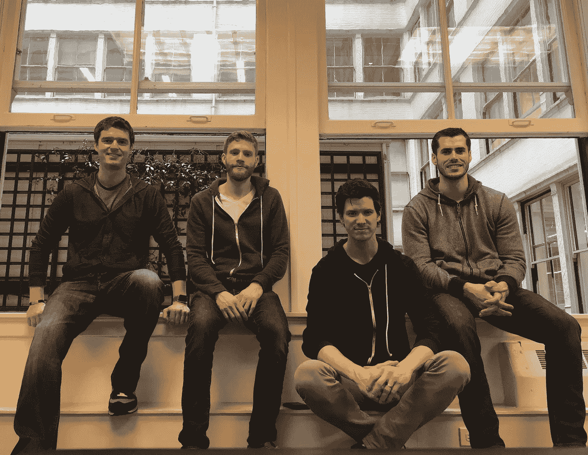

# 杰森·卡拉卡尼斯公开否决了安德鲁·法拉的提案——这帮助他筹集了 1600 万美元

> 原文：<https://medium.com/hackernoon/jason-calacanis-publicly-shot-down-andrew-farahs-pitch-and-it-helped-get-his-startup-16-million-de709ab0b323>

安德鲁·法拉创业的前提非常简单。

他和他的团队设计了一个匿名人员计数器，帮助公司监控有多少人使用他们建筑的不同部分。这种事情让你想知道为什么像它这样的东西还不存在。

安德鲁的公司 [Density](https://www.density.io/) 使用红外激光和实时深度处理来保护数据。该产品收集大型设施的使用统计数据，以帮助公司更好地利用他们的空间，无论他们是希望扩大规模，缩小规模还是只是让员工知道自助餐厅的排队长度。

Density 以 1600 万美元的总额结束了第三轮融资。它的投资者名单中包括许多知名人士，如[创始人基金](https://foundersfund.com/)合伙人[塞恩·巴尼斯特](http://www.cyanbanister.com/)、[前期投资公司的马克·苏斯特](https://upfront.com/)和[杰森·卡拉卡尼斯](https://calacanis.com/)。

杰森从一开始就接受了致密。安德鲁飞到旧金山与他会面——甚至在他开始一个过程之前。在第一次会面中，杰森推动安德鲁搬到西海岸。

“他问，‘告诉我，你为什么不在 NBA？’安德鲁说。我说，‘因为我跳投很烂。’"

“他说，‘不，你为什么不在旧金山？你应该来大联盟打球。"

安德鲁犹豫了，部分原因是将公司总部从纽约州的锡拉丘兹搬到西海岸需要大量资金。所以杰森提议给安德鲁开一张 50 万美元的支票来实现这个愿望。他没花太多时间就接受了杰森的提议。

这里有一个教训:在建立联系时，安德鲁强调质量胜于数量。

“每一段有意义的关系——所有导致融资的关系——实际上都来自一个人，”安德鲁说。

“通常在筹资过程中，你会发现一两个或三个超级有关系的人，他们是你能够筹集资金或获得会议的原因，”他说。

**“你应该热爱你卡片中的每一句话”**

但事实是:联系只能让你走这么远。一旦你有了会议，你必须精心策划完美的推销。安德鲁对如何建造坚固的甲板有一些具体的建议。

他承认，他的第一次投球有点……*密集*。他和他的团队与一屋子的创始人和投资者分享了他们的想法，他们似乎对此印象深刻。杰森·卡拉卡尼斯也在那里。

安德鲁说，最终，贾森劫持了球场，向 Density 展示了他们所缺乏的东西。

Jason 显然要求其他投资者举起一只手，如果他们明白 Density 在做什么以及他们是如何做的。

没有一个人举手。

Jason 提出了一个后续问题，即是否有人认为密度在它所提供的方面是显著的。

这一次，每个人都举起了手。

杰森·卡拉卡尼斯看了看安德鲁，给了他一些宝贵的建议:“直接接触产品，”安德鲁回忆道。“尽可能快地展示它的能力，因为您可以围绕它进行真正的对话。”

“甲板是你最好的朋友，”安德鲁说。“你应该热爱你甲板上的每一句话。如果你不这样做，下一张幻灯片出现时你就不会兴奋。但如果你感到兴奋，这就传达了大量信息，并极大地提高了你的推销质量。”

另一个关键是保持简短。安德鲁的《甲板》与其说是一篇论文，不如说是一个提示。

此外，投资者不应该把注意力放在幻灯片上。他们应该把注意力集中在你身上，以及你带来了什么，而不是阅读你所说的话。

他说，从一些关于你的可信度的信息开始。然后尽快钻研产品。只有在你做到这一点后，你才能证明市场的有效性，并提供令人信服的指标。

**如何进行三阶段筹款流程**

安德鲁对“良好的筹资过程”的定义相当刻板。

对于 Density 来说，第一阶段是花一个月的时间非正式地会见安德鲁已经认识的人。表面上，他的目的是获得关于讲故事的反馈，但他发现这些对话导致了伟大的，有机的介绍。

“通常情况下，其他创始人和投资者不会问你就这么做，”安德鲁说。"你不一定需要请求介绍才能得到一个."

在第二阶段，他小心翼翼地将最初的会议安排在一个相当紧凑的时间范围内。

安德鲁说:“大多数初创公司会尽快召开会议。相反，他建议等到你聚集了足够多的潜在投资者后再行动。然后，把那些会议堆起来。

“你希望所有的投资者都在同一时间开始投资。如果一个投资者听到了你故事的开头，而另一个投资者正处于尽职调查阶段，他们就处于完全不同的位置和领域。他们实际上并不是在竞争同一笔交易。”

安德鲁建议，当你安排时间时，从你最不关心的会议开始。

“前几个应该是，如果那些投资者通过了，你完全没问题，”他说。“重要的是，你已经改进了你的故事，并获得了关于什么引起了共鸣、你需要处理什么样的异议的反馈。”

“你的最后一投总是你最好的，”安德鲁说。

然后是第三阶段。安德鲁说，再安排四到六周的时间做最后的调查和完成交易。

“这绝对是筹款过程中最快的速度，”安德鲁说。“假设你不是一只鸟，至少需要三个月的时间来筹集超过 100 万美元的资金。更有可能的是，你需要六到九个月的时间。”

安德鲁指出，在整个过程中，跟踪潜在投资者与你相处的时间是一个好主意。

“投资者想和你在一起的时间越多，尤其是普通合伙人或公司里有能力开支票的人，他们就越有可能想开支票，”他说。这是一个可靠的指标。

"他们有很多其他的事情可以花时间去做。"

安德鲁建议尽可能多地与某家公司的不同人会面，如果他们中的一些人真的讨厌你的推销，也不要被吓倒。争论是有吸引力的。一些公司想收购那些能引发轰动的公司。

“作为一名投资者，你永远不想感受到的是‘哼’，”安德鲁说。

*内森·贝克德是 Foundersuite.com***的首席执行官，这是一个软件平台，自 2016 年以来，已经帮助企业家筹集了超过 10 亿美元的种子和风险投资。本文基于 Foundersuite 的《我是如何融资的》播客* *的一集* [*改编，深入了解创业公司创始人如何融资的幕后故事。*](https://soundcloud.com/user-2586856/how-i-raised-it-with-andrew-farah-of-density-on-7182018)*