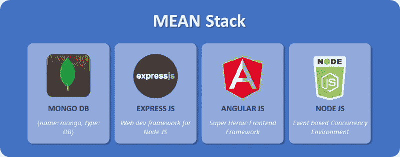
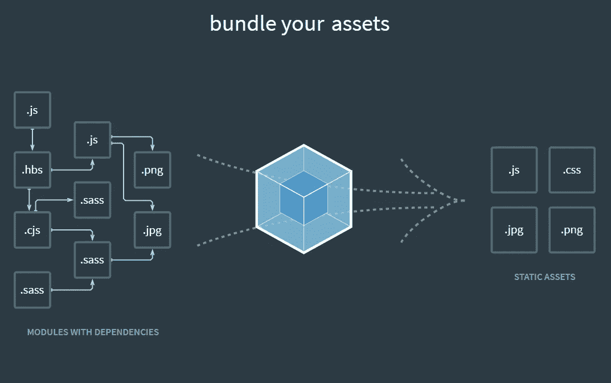
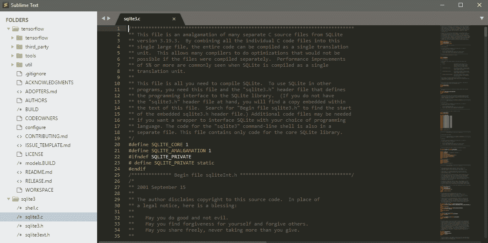

# JavaScript 生态系统的 38 个最重要的工具

> 原文：<https://medium.com/hackernoon/javascript-ecosystem-38-tools-for-front-and-back-end-development-c22f0a95693c>

六年来，JavaScript 一直是最受欢迎的前端编程语言。看看最近的 StackOverflow 调查结果就知道了——71.5%的专业开发人员选择它作为最常用的编程语言。难怪它会发生。这种编程语言的结构使它成为构建动态网站、应用程序和游戏的完美选择。

此外，JavaScript 相当容易使用和学习，部分是因为它的语法，部分是因为它的生态系统。JavaScript 有大量的工具、框架和库，使得这种编程语言如此受欢迎和受欢迎。在本文中，我们将走过 JavaScript 生态系统，看看它最受欢迎的组成部分。

# 什么是 JavaScript 生态系统？

**JavaScript 生态系统**是一个软件包、库和其他资源的集合，当它们相互集成时，有助于开发。这些工具是由不同的开发者和提供商创建的——例如，React 库由脸书提供支持，而 Angular 框架由谷歌创建，而 Vue.js 由独立开发者设计。

*A scheme of JavaScript ecosystem*

JavaScript 生态系统工具方便了开发人员在应用构建的每个阶段的工作，从第一行代码开始，到部署结束。所以，让我们从头开始，先看看开发的工具。

# 开发工具

JavaScript 生态系统的这一部分涉及与 JavaScript 软件开发过程相关的一切。首先，我们将解决[的全栈开发](https://www.altexsoft.com/blog/engineering/the-good-and-the-bad-of-javascript-full-stack-development/?utm_source=MediumCom&utm_medium=referral)。技术堆栈是一个概念，类似于框架:它是不同工具(包括框架)的组合，允许开发人员创建一个完整的产品，包括后端和前端开发以及 UI。书库是生态系统的一部分。其中最普遍的是平均堆栈。

*MEAN stack
Source:* [*Thinkwink*](/@thinkwik/your-a-z-guide-to-mean-stack-development-f52fa987708)

是一个免费、开源的以 JavaScript 为中心的工具集，用于构建动态网站和网络应用。它由以下组件组成:MongoDB(一个 NoSQL 数据库)，Express.js(一个 web 应用框架)，Angular 或 Angular.js(一个前端框架)，以及 [Node.js](https://www.altexsoft.com/blog/engineering/the-good-and-the-bad-of-node-js-web-app-development/?utm_source=MediumCom&utm_medium=referral) (一个服务器平台)。MEAN stack 的主要优点是 JavaScript 运行在应用程序的所有级别上，并允许开发人员用一种编程语言从头开始构建整个应用程序。

没有这些工具，开发人员的生活注定要在一个应用程序上花费数不清的时间。库和框架简化了这个例程。它们由帮助执行特定功能的现成代码组成。框架和库也有它们的生态系统，允许在其中构建整个产品。但是库和框架的区别是什么呢？基本上，它们的功能原理是相同的，但是框架是一个更广泛的概念。

一个**库**允许开发者完成某些任务，而一个**框架**允许一次构建一个完整的应用。一个库需要多个集成，而一个框架已经有了自己的工具和集成生态系统。用于 web 和移动开发的 JavaScript 库和框架即使没有几千个，也有几百个，但是这里我们将看看最流行的例子。

## 图书馆

[React](https://reactjs.org/) 是一个用于构建动态用户界面的开源库。它是由脸书在 2011 年创建的。该框架用于创建具有多个动态元素的 web 应用程序。React 基于 JavaScript 和 JSX，后者是来自脸书的 PHP 扩展，允许为前端开发创建可重用的 HTML 元素。React 有 React Native，这是一个独立的用于移动开发的跨平台框架，我们将在稍后讨论。但是如果你想了解更多关于 React 和 React Native 的优缺点，可以看看我们的文章，里面有很多关于这个主题的信息。

jQuery 是一个专注于处理 HTML 文档的库，它有一个简单的 API，允许用户在浏览器中处理事件和创建动画。此外，jQuery 用于操作文档对象模型(DOM ),并具有插件开发功能。它是一个轻量级的跨浏览器库，具有用于图形界面构建的 jQuery UI 和用于移动框架的 jQuery Mobile。

[D3.js](https://d3js.org/) 是一个数据驱动库，面向数据可视化。它允许通过将任意数据绑定到 DOM 并将数据驱动的转换应用到文档来操作基于数据的文档。该库支持大型数据集和用于交互和动画的动态行为。D3 的函数式风格允许代码重用，并支持 CSV 和 HTML。

## 前端框架

[Angular](https://angular.io/) 是一个由 Google 提供支持的前端框架，兼容大多数常见的代码编辑器。Angular 框架用于构建动态的单页面 web 应用(spa)和[渐进式 web 应用](https://www.altexsoft.com/blog/engineering/progressive-web-apps/)。当 Angular 首次发布时，它的主要优点是能够将基于 HTML 的文档转换成动态内容。Angular 是最流行的前端框架之一，您可以在我们关于 Angular 开发的[利与弊](https://www.altexsoft.com/blog/engineering/the-good-and-the-bad-of-angular-development/?utm_source=MediumCom&utm_medium=referral)的文章中了解更多。

[Vue.js](https://vuejs.org/) 是另一个针对单页面应用的开源 JavaScript 框架。它使用基于组件的开发模型，并允许向项目添加组件。Vue.js 是一个更像框架的库的例子。用户必须理解 HTML 和 CSS 才能使用它。它提供了许多在开发中使用的模板和模式。Vue 的主要优势是文档的小尺寸和基于 HTML 的语法。

*How Vue.js works
Source:* [*Vue.js*](https://vuejs.org/)

Ember.js 是一个面向单页网络、移动和桌面应用的框架——Apple Music 就是建立在它之上的。Ember.js 使用了[模型-视图-视图-模型](https://en.wikipedia.org/wiki/Model%E2%80%93view%E2%80%93viewmodel) (MVVM)模式。Ember 工具允许开发人员创建开发环境，其命令行界面提供了脚本自动化工具。js 工具包括强制构建过程的模块(Ember 数据和 Ember 检查器)。

## 移动开发框架

[React Native](http://www.reactnative.com/) 是 JavaScript 上最好的移动开发框架之一。该框架允许工程师在 Windows、macOS 或 Linux 上开发本地应用。React 原生支持 Android 4.1+和 iOS 9.0+。它使用本地 API 在移动设备上呈现组件。它不使用 HTML 和 CSS，但是为基于 CSS 的元素提供了特殊的 API。

Ionic 是一个前端框架，允许在 HTML5 中构建本地和渐进式 web 应用程序，以及混合移动应用程序。它与角框架兼容。

[Meteor](https://www.meteor.com/) 是另一个用于 web、桌面、iOS 或 Android 开发的 JavaScript 框架。它具有紧凑的代码，并与 MEAN stack 和其他 JavaScript 工具集成。Meteor 通过网络将数据发送到客户机服务器，而不是 HTML。还有，Meteor 允许构建 UI。

## 后端框架

[Node.js](https://nodejs.org/en/) 是最流行的后端 JavaScript 框架。这是一个可以与其他前端框架一起使用的运行时环境。Node.js 对事件做出反应，并允许开发人员创建后端应用程序，如社交网络或博客。

[Meteor.js](https://www.meteor.com/) 是另一个后端框架，集成 Angular 和 React 前端框架，连接 Node.js，这个框架最好的品质就是集成和构建自动化。Meteor 与 MEAN stack 的所有部分兼容，并允许使用移动开发框架 Cordova 构建混合应用程序。这个框架是快速原型化和构建 MVP(最小可行产品)的好选择。

## 包管理器

除了框架和库，JavaScript 生态系统的这一部分可能是最重要的，如果我们谈论开发的话。包管理器取代了数小时令人疲惫的工作:你可以在命令行中键入几个词，而不是搜索正确的插件和库。包管理器立即找到必要的依赖项。

依赖项是具有可重用代码的插件或库，允许开发人员在构建过程中优化他们的代码，以创建优秀的应用程序。包管理人员在存储库中找到它们，并安装它们以创建更大的应用程序栈。他们还更新这些库并安装新的库。

[npm](https://www.npmjs.com/) 是一个开源的 Node.js 包管理器。它在命令行界面中用于管理大多数 JavaScript 工具的大量插件和包。它处理来自 jQuery、Bootstrap、React、Angular 和 Ember 的组件。npm 可以为移动、前端和后端开发安装各种各样的库。

[Bower](https://bower.io/) 的工作原理与 npm 相同，但处理更多包含 HTML 和 CSS 代码的组件，包括字体甚至图像文件。Bower 与其他工具一起用于集成各种设置和工作流程。它可以与 Grunt、Gulp 和 Webstorm 等构建自动化工具一起使用。但是 Bower 的缺点是只更新包和安装依赖。它不能缩小代码，所以它不能清除源代码中不必要的元素。

[约曼](http://yeoman.io/)集架子工、构建工具和软件包管理员于一身。它帮助开发人员建立环境，并简化单元测试、缩小和构建工具执行的其他过程。我们将在下一节详细讨论构建工具。

## 构建自动化工具

构建工具，或者也称为任务管理器/任务运行器，允许开发人员自动化缩小、编译、打包、单元测试和错误修复。

Webpack 是一个开源的模块捆绑器。它捆绑了 web 包、依赖项、CSS 文件和资产，允许开发人员创建依赖图、打包资产并将其发送到浏览器。这个工具的另一个功能是分析模块和资产之间的依赖关系。Webpack 需要 Node.js 框架才能使用。

*How Webpack works
Source:* [*Webpack*](https://webpack.js.org/)

Grunt 拥有一个由 6453 个插件组成的庞大生态系统，可以帮助实现大量任务的自动化。这些插件通过 npm 软件包管理器进行管理和安装。它创建和配置任务。Grunt 被 Adobe、jQuery、Twitter、Mozilla、Firefox 账户、Opera、WordPress 和微软使用。

[Gulp](https://gulpjs.com/) 由几个小模块组成，它们执行特定的任务并简化构建过程。其方法在于将任务定义为单独的文件。这个原理允许测试独立的单元。Gulp 提供了 300 多个代码清理和格式化插件。

## 代码编辑器

开发人员还需要拼写检查器来发现可能的拼写错误。代码编辑器就是处理这些的工具。所有的代码编辑器必须至少有三个关键功能:语法高亮、自动完成和折叠。在这一节中，我们还将讨论集成开发环境(IDE)。由于特性的数量，它们不同于常规的代码编辑器。

**IDEs。**IDE 允许开发人员设置环境、编辑代码、测试、调试和执行[代码重构](https://www.altexsoft.com/blog/engineering/code-refactoring-best-practices-when-and-when-not-to-do-it/?utm_source=MediumCom&utm_medium=referral)。一些 ide 具有版本控制、代码搜索、语言支持和可视化编程模块，以及用于全栈开发和 GUI 构建的选项。JavaScript 生态系统中最受欢迎的 IDE 有 WebStorm、Aptana、Zend Studio、Komodo IDE、Netbeans 和 JavaScript 开发工具(JSDT)。

[WebStorm](https://www.jetbrains.com/webstorm/) 符合 web 开发的主要 JavaScript 框架(Angular，React，Vue.js)，移动框架(React Native，Ionic，Cordova)，后端框架(Node.js，Meteor)。它自动化了单元测试、调试，并集成了几个版本的控制系统(Git、GitHub 和 Mercurial)。

Aptana 是一个多语言 IDE，支持 HTML、CSS、JavaScript、PHP 和 Ruby。这个 IDE 可以使用脚本进行定制，它还具有调试特性、Git 集成和内置的 CLI 终端。Aptana 的优势在于可以用于部署，这是这个 IDE 的核心特性之一。

[JavaScript 开发工具(JSDT)](https://www.eclipse.org/webtools/jsdt/) 是一个 [Eclipse](https://www.eclipse.org/) 产品，一个全球性的软件开发基础，由 IBM 创建。这是一个由三个组件组成的平台，包括 JSDT 核心(解析器、编译器、DOM)、JSDT UI(用于图形界面构建)、JSDT 调试(调试支持)、JSDT Web(支持与基于 HTML 或 JSP 的 Web 应用程序集成)。它集成了 JSON 编辑器、Bower 和 npm 包管理器等工具。

**代码编辑。**你可能认为 ide 可以完全取代所有的代码编辑器。也许吧。但是，它们仍然是一个很好的选择，因为它们更轻便，工作速度更快。

[Sublime Text](https://www.sublimetext.com/) 是代码编辑器领域的佼佼者。Sublime Text 是一个跨平台的编辑器，具有方便的可视化界面、包控制功能、拆分编辑功能和许多简化编辑的键盘快捷键。用户必须购买许可证才能连续使用，但编辑器提供免费使用期。

*Sublime Text interface
Source:* [*Sublime Text*](https://www.sublimetext.com/)

[Atom](https://atom.io/) 也是一个跨平台的代码编辑器，可以与 JavaScript、HTML、CSS 和 Node.js 协同工作，而且 Atom 兼容 PHP 框架。Atom 是一个可定制的工具，预装了八种语法和四种 UI 主题。由于有多个窗格，Atom 接口允许开发人员跨不同文件比较和编辑代码。Atom 有一个适用于所有平台的可移植版本，因此用户可以针对不同的编程任务使用不同的版本。与 Sublime Text 不同，Atom 是一个开源代码编辑器。

[Visual Studio Code](https://code.visualstudio.com/) 是一个可以和十四种编程语言一起使用的代码编辑器。它有一个预建的智能感知自动完成模块，也允许开发人员编辑类型脚本代码。这个编辑器的类型获取附带了 npm 包管理器和类型声明文件。

# 测试和调试工具

在部署之前，代码片段必须经过测试，以消除可能出现在生产中的现有错误。自动化测试和调试工具有助于加速质量保证过程。这些工具通常使用特定的 JavaScript 框架。这里我们将描述 JavaScript 生态系统中的一些测试工具。

Jest 是一个脸书驱动的测试工具，它与 React 库一起工作，这使得它成为 React 生态系统的一部分。然而，它允许测试不是用 React 构建的应用程序。

[Jasmine](https://jasmine.github.io/) 是一个用于 JavaScript 测试的行为驱动开发框架。它允许开发人员执行前端和后端测试。Jasmine 是一个开箱即用的测试工具，具有简单的语法和预构建的工具。

[量角器](http://www.protractortest.org/#/)是角度生态系统的一部分。这是一个端到端的测试框架，建立在本地事件和特定于浏览器的驱动程序之上，允许测试人员像用户一样查看应用程序。量角器支持 Jasmine 和另一个 JavaScript 测试框架 [Mocha](https://mochajs.org/) 。

*Protractor testing guide
Source:* [*Protractor*](http://www.protractortest.org/#/)

一些用于网络开发的测试工具允许在浏览器中测试代码，比如 [Chrome 开发工具](https://developers.google.com/web/tools/chrome-devtools/?utm_source=dcc&utm_medium=redirect&utm_campaign=2018Q2)和 [Redux 开发工具](https://chrome.google.com/webstore/detail/redux-devtools/lmhkpmbekcpmknklioeibfkpmmfibljd?hl=ru)。两者都是浏览器扩展。Chrome Dev Tools 与另一个应用程序 Angular [Augury](https://augury.rangle.io/) 一起运行，它用于调试和分析 Angular 中创建的应用程序。

[Phantom.js](http://phantomjs.org/) 使用标准的 DOM API 或者像 jQuery 这样的库来执行测试。它允许创建截图，并与其他测试框架一起工作，如 Jasmine 和 Mocha。

[Selenium](https://www.seleniumhq.org/) 是一款用于浏览器和移动测试的开源测试工具。这是一个集成了任何类型的工作流的工具，比如敏捷、 [DevOps](https://www.altexsoft.com/blog/engineering/devops-principles-practices-and-devops-engineer-role/?utm_source=MediumCom&utm_medium=referral) 和[连续交付](https://www.altexsoft.com/blog/business/continuous-delivery-and-integration-rapid-updates-by-automating-quality-assurance/?utm_source=MediumCom&utm_medium=referral)。Selenium 是一个跨平台工具，支持十种编程语言和七种浏览器。你可以在我们的文章中了解更多关于硒的利与弊。

# 部署工具

如今，大多数应用程序要么存在于公共云服务器上，要么使用[无服务器架构](https://www.altexsoft.com/blog/cloud/pros-and-cons-of-serverless-architecture/?utm_source=MediumCom&utm_medium=referral)。让我们看看开发人员用于不同部署方式的工具。

## 云部署工具

[Docker](https://www.docker.com/) 是一个跨平台的工具，将代码打包成微服务，并帮助部署和集成。

[Jenkins](https://jenkins.io/) 是一个工具，既可以用作持续集成的服务器，也可以用作持续交付中心，它带有许多附加插件来调整持续交付工作流。

[Chef](https://www.chef.io/chef/) 是一个基础设施代码管理工具，既可以运行在云服务器上，也可以运行在硬件服务器上。

[Ansible](https://www.ansible.com/) 是一款用于云供应和应用部署的配置管理自动化工具。

## 无服务器部署工具

Amazon Web Services Lambda(AWS)是一个用于任何类型的应用程序和服务的无服务器部署的工具。除了 JavaScript，AWS 还支持 C#和 Python。一旦开发人员将它上传到工具，它就会不断地缩放代码。这个工具的优点是用户只为运行代码付费。

[微软 Azure Functions](https://azure.microsoft.com/en-us/services/functions/) 是一款多语言工具，提供事件驱动的体验。该工具管理庞大的工作流，并提供高级别的安全性。Microsoft Azure Functions 具有内置的持续部署，并使用集成的监控工具。该工具还提供了移动后端支持，并扩展了 SaaS 应用程序。

[谷歌云功能](https://cloud.google.com/functions/)是一个支持 JavaScript 和 Python 的事件响应 FaaS。它很容易连接到第三方云服务，只对运行代码向用户收费。Google Cloud Functions 还具有构建和测试功能，使用 Node.js 或 Python 运行时。

# 一锤定音

如果我们要涵盖 JavaScript 生态系统中的所有工具，这个列表将会是无穷无尽的。这里我们只提到了最常用和最优秀的元素。这些工具、框架和库的数量使得 JS 成为几乎所有前端开发项目的好选择。作为一种流行的编程语言，JavaScript 拥有一个庞大的追随者和贡献者社区，他们扩展了生态系统，创造了新的工具来促进开发人员的工作。因此，可能现在有人正在开发一个新的框架，它将成为 Node.js 或 Angular 的竞争对手。

*照片由弗朗西斯科·赫苏斯·纳瓦罗·埃尔南德斯在* [*Unsplash*](https://unsplash.com/) 上拍摄

*原载于 AltexSoft Tech 博客**[***JavaScript 生态系统:38 个前端和后端开发工具***](https://www.altexsoft.com/blog/engineering/javascript-ecosystem-38-tools-for-front-and-back-end-development/?utm_source=MediumCom&utm_medium=referral)*