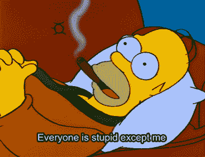
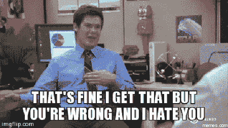

# 让你的自我远离编码

> 原文：<https://medium.com/hackernoon/keep-your-ego-away-from-coding-749b41cfc57d>

你曾经参加过两个或者更多的开发人员在争论不相关的技术问题的会议吗？

在代码设计会议上，当同事拒绝了你的拉取请求或批评了你的解决方案后，你有没有感到沮丧？

你在博客帖子或 StackOverflow 中读到过多少关于这种或那种更好方法的无休止的激烈讨论？

如果你做了足够长时间的开发者，你肯定会经历以上所有的事情。

为什么？作为开发人员，我们为什么如此执着于我们的代码？为什么我们总是需要证明自己是对的？

*   艾娃还是摩卡？
*   React 还是 Vue？
*   网络包或包裹
*   特快还是哈比神？
*   Visual Studio 还是 Intellij IDEA(或者 VIM)？
*   AWS SAM 还是无服务器框架？

> *我并不是说没有差异。我的意思是，大多数时候，这些差异并不会造成***多大的差异。**

*在开始一个新项目之前，一定要对一些解决方案进行评估，但是这种评估必须基于数据，基于客户的需求，基于工具可能的限制，而不是基于个人的偏好或品味。
当然，以前的经验在选择中可能是决定性的，因为成本是(使用 IntelliJ 需要许可证，而 Visual studio 不需要；让一个团队学习新的堆栈需要时间和金钱)*

*仅仅因为你更了解一个工具，并不意味着这个工具比市场上的其他工具更好。*

*最终，客户或用户并不关心 Web 应用程序是用最新最酷的 js 技术栈还是。net，只要它工作，速度快，它看起来很好。*

# *你解决的问题比你写的代码更重要*

*这些年来，我越来越脱离一些技术决策。尤其是关于哪个棉绒、测试框架或捆扎机的次要问题。
战斗多以意见为主。*

*总是**保守派 vs 炒作**——*只要有效，我擅长，就坚持*vs*更新总是更好*。*

*我喜欢尝试新事物，我喜欢学习一些东西，但我们也必须交付，我们不能总是在每个项目中转换框架和语言——浪费时间、精力和金钱。*

*这并不是说我不讨论技术话题。我知道。它们中的一些也会变得相当热。但这从来不是谁对谁错的问题。*

*事实上，我非常喜欢被证明是错误的，因为这意味着我犯了一个错误，或者我可以做得更好，学到一些东西。
最终谁对谁错并不重要，重要的是这个解决方案是对的，无论它属于谁。它甚至不一定是最好的。*

*重点是:*

*   **除非有事实和数据支持，否则观点并不重要**
*   **最好是好的敌人*通常你(以及最终——客户)需要的不是最优的解决方案，而是适合需求和时间/资金限制的解决方案。*

*当进行技术讨论时，无论是为下一个项目选择技术堆栈，还是为下一个功能进行代码设计会议，或者是代码审查，**把你的自我放在一边**。*

> **讨论的是代码——技术和解决方案，* ***不是关于你。这与你有多酷、有多专业无关。****

*把你的自我放在一边，从情感上脱离你的创造物，拥抱变化，接受批评，从每一次经历中学习。*

# *从情感上脱离你的代码。*

*从情感上脱离代码并不意味着对你所做的事情变得草率或不感兴趣。不要在感情上脱离你的工作。
关注结果。*

*如果你对自己的代码诗过于自豪，**如果你认为你的实现是唯一可能的解决方案，并且是完美的，因此你是一个优秀的开发人员和聪明人，当然你会受到攻击——如果有人批评它，或者提出不同的建议，你会受到人身攻击。更不用说如果你被证明是错的，你会有什么感觉。***

**

*如果你保持谦逊，将自我排除在代码之外，你可能只会招致一些挫折:
*该死，为什么* ***我*** *没有意识到这个问题？为什么那个方案没有出现在我的脑海里？我为浪费了数小时或数周的工作而感到惭愧，我不得不重做同样的东西，这有点令人恼火..**

*我们都经历过这个。没关系。*

# *对话不是竞赛。*

*别人是对的，不代表你是错的。与你不同的观点不是对你的正确性的攻击。*

**

*有时，提出的解决方案实际上是正确的，也是最好的，但是如果它考虑到了必要条件并且不那么费力，那么选择一个不太理想的方案可能是明智的。*

*在这个问题上，这些年来我改变了很多想法。
在**之前，我是那些总是为最佳设计而奋斗的开发人员之一**，它必须有所有正确的设计模式、依赖注入、接口，它必须经得起未来的考验，并且对未来的实现和需求的变化具有灵活性。然后我看到那些进一步的实现从未出现，或者尽管有所有的复杂性和灵活性，新的需求总是设法破坏设计。*

*所以我慢慢地放弃了这种立场，转而采用一种更简单——而不是更容易——的方法。灵活，但更注重现在必须做的事，而不是可能做的事。*

*作为一名优秀的软件工程师，我当然会尝试预测问题，但我不会再执迷于写超级抽象的东西来为未来的变化做准备。*

# *专注于传递价值，而不是证明你是最好的*

*原教旨主义从来都不是好事，它不属于宗教，也不属于科技。灵活性更重要。你要知道规则，你要知道什么时候打破规则。*

*永远记住，代码可以修改，代码可以改进，代码可以删除。*

*你不可能知道所有的事情，总有一些事情你可以或者必须去学习，你并不完美，总会有人比你更好。(如果没有。也许你站错了队，也许你应该继续前进，**你永远不会成为房间里最聪明的人***

*这一切都没问题。所有这些都不会降低你的地位。相反，它必须被视为积极和具有挑战性的东西。*

> **自豪而谦逊地写代码。将你所有的激情投入到工作中，但不要顾及自我。
> 要伟大，但要感恩。**

**

*你如何应对批评？你是如何在关心和困扰之间保持平衡的？*

**原发布于 2019 年 6 月 4 日*[*https://dev . to*](https://dev.to/dvddpl/keep-ego-away-from-coding-4gi5)*。**