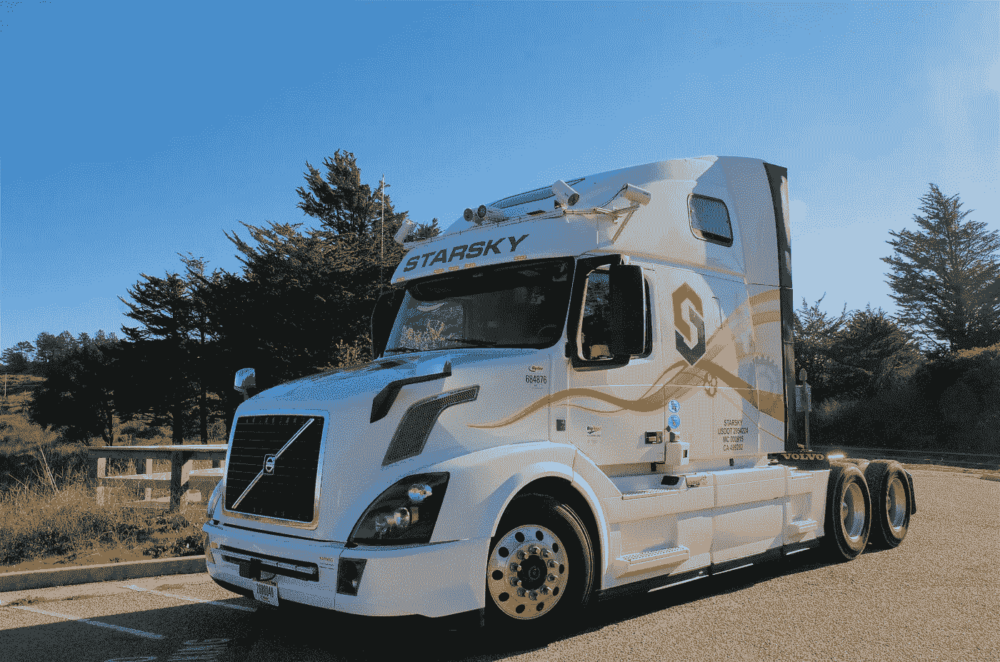
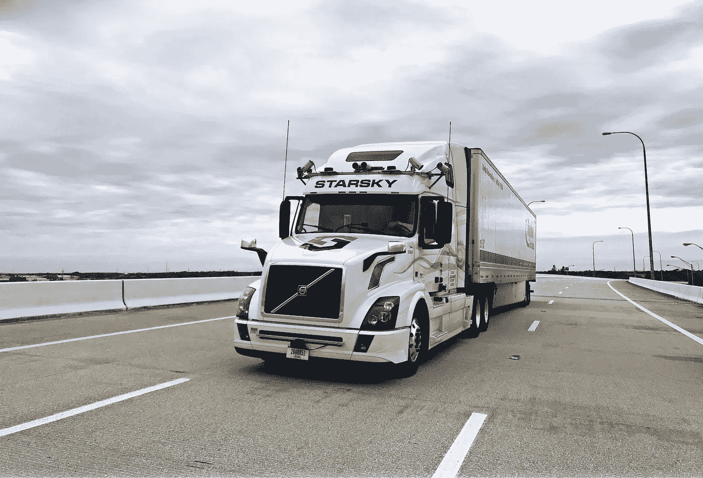

# 保持自动驾驶决策简单:Starsky Robotics 的行为规划

> 原文：<https://medium.com/hackernoon/keeping-self-driving-decisions-simple-starsky-robotics-behavior-planning-a7d8ed7ba6f1>

当人们问我以什么为生时，我给出的最简短的回答是:*我帮助制造安全的自动驾驶卡车*。过去两年，我一直在 Starsky Robotics 自动驾驶堆栈的行为规划层工作。简而言之，我开发软件，让我们的卡车做出正确的决定，我与团队的其他成员一起工作，以证明系统正在做正确的事情。

Starsky Robotics’ Autonomous Truck

“行为规划”是一个有点不寻常的术语，即使在行业内也是如此，所以让我首先解释一下我们 Starsky 对它的定义。行为规划层负责卡车的高级决策，我们认为这些决策需要几秒钟或更长的准备时间，如变道、驶出匝道或在紧急情况下靠边停车。

> 在 Starsky，我们能够让这个决策出奇地简单，因为我们的卡车只需要在高速公路上自动驾驶。这种简单性是好的；正是这一点让我们能够部署一个真正的、经过验证的、自主的货运解决方案。

Starsky 的行为规划通过从我们的感知堆栈中获取关于卡车周围环境的信息，从路线计划中获取关于我们想要去哪里的信息，以及从卡车和我们系统的内部监控中获取关于当前卡车状态的信息来做出决策。然后，它对照预设规则检查哪些行为是可能的，并进行预测，以确定哪种行为最适合执行。

例如，为了查看右侧车道是否可能改变，我们将首先检查卡车右侧的车道是否存在。然后，我们将预测我们周围的场景将如何演变为两种情况:一种是我们改变车道，另一种是我们停留在当前车道上。最后，我们将评估这两个预测，并选择一个给出最好的结果。

好的，但是在任何时候你都可以选择做很多行为，对吗？可能会有慢速变道、快速变道、减速、停车，以及你能想到的任何其他情况，这还是在考虑可能的机动顺序之前。而预测这一步很难——它取决于你周围所有汽车、卡车、自行车和行人的意图和动作。另外，这些特工的行动取决于其他特工和我们卡车的行动。你可以看到这有爆炸成许多许多可能性的趋势，这些都需要计算和评估。**这种复杂性是有代价的**，既体现在所需的计算上，也体现在我们人类理解和验证系统的能力上。这并不简单。

# 我们为什么喜欢卡车

那么我们能做什么呢？在 Starsky，我们通过减少下面等式中的每个数字来简化行为规划的工作。首先，让我们看看可能的行为。

> BP 难度=(可能行为的数量)*(预测复杂度)

半挂卡车又大又重。它们需要很长时间来加速和减速。它们不太容易操作。他们不是很快。他们没有迫不及待要到达目的地的乘客。更保守的行动通常是最好的卡车。卡车大部分时间都在高速公路上行驶，只需要少量的机动动作。

**高速公路环境是高度受限的** - 人类需要被允许在高速公路上开这么快——所以我们可以定义一些简单的规则，关于什么时候哪些行为是可能的(回到基本的例子，如果没有右车道，就不能进行右车道变换)。所有这些加起来，在给定的时间点上，只有极少数的行为是可能的。

高速公路环境也大大降低了预测的复杂性。我们不必考虑像十字路口和人行横道那样复杂的行人交通(我忠实于我的爱尔兰词汇，称之为斑马线)。没有自行车道。没有交叉交通。由于可能的机动次数有限，其他车辆的意图更容易识别。汽车通常在自己的车道上行驶，有变道和并线。这大大简化了预测步骤。我们仍然需要考虑我们周围车辆之间的相互依赖性，但是它们的数量和类型都减少了。这仍然很难(而且非常非常有趣)，但这是一个更容易解决的问题。

# 斯塔奇的方法

在 Starsky，我们希望保持我们的系统简单。无论如何，制造一辆自动驾驶卡车都是一项复杂、不确定的工程任务，因此我们的目标是尽可能降低复杂性，同时仍然达到我们的目标[用无人驾驶卡车](https://wired.com/story/starsky-robotics-truck-self-driving-florida-test/)运输货物。

Starsky’s Truck on a Florida Highway

我们的卡车在高速公路上是自动驾驶的，在高速公路上决策更简单，在高速公路上是遥控操作的，在高速公路上人类占优势。我们在一个严格的运营设计领域内运营:我们在运营之前预先批准路线，并有一套明确的天气和其他环境条件。如果在旅行过程中出现我们的自主系统无法处理的异常情况，teleop 驾驶员将会收到警报，并可以接管卡车的控制权。

> 所有这些都让我们的决策变得简单。

这在行为规划的日常开发和调试中有优势，但主要的好处是它允许我们**完全验证我们的系统**。我们可以确定可能的故障模式的完整列表，并在我们的设计和实施中主动解决这些问题。这种故障模式分析允许我们定义检测和响应系统故障的安全要求。然后，我们可以开发卡车上和卡车下的测试，充分验证我们是否满足正常的决策要求和安全要求。这是 [Starsky 在整个系统中实现安全](/starsky-robotics-blog/understanding-starsky-robotics-voluntary-safety-self-assessment-1d70318a1459)的方法，也是我们的解决方案得以实现的原因。简单是好的——它让我们安全，让我们知道我们是安全的，让我们展示我们是安全的。

***

*丽贝卡·菲尼·巴里是斯塔奇机器人公司的行为规划主管。Starsky 现招聘* [*多个角色*](https://jobs.lever.co/starskyrobotics/) *，包括在* [*行为策划团队*](https://jobs.lever.co/starskyrobotics/b19941a4-0221-46f7-a239-d93017d07395) *。*