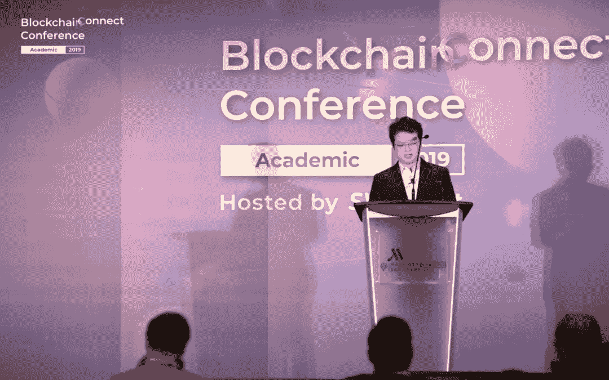
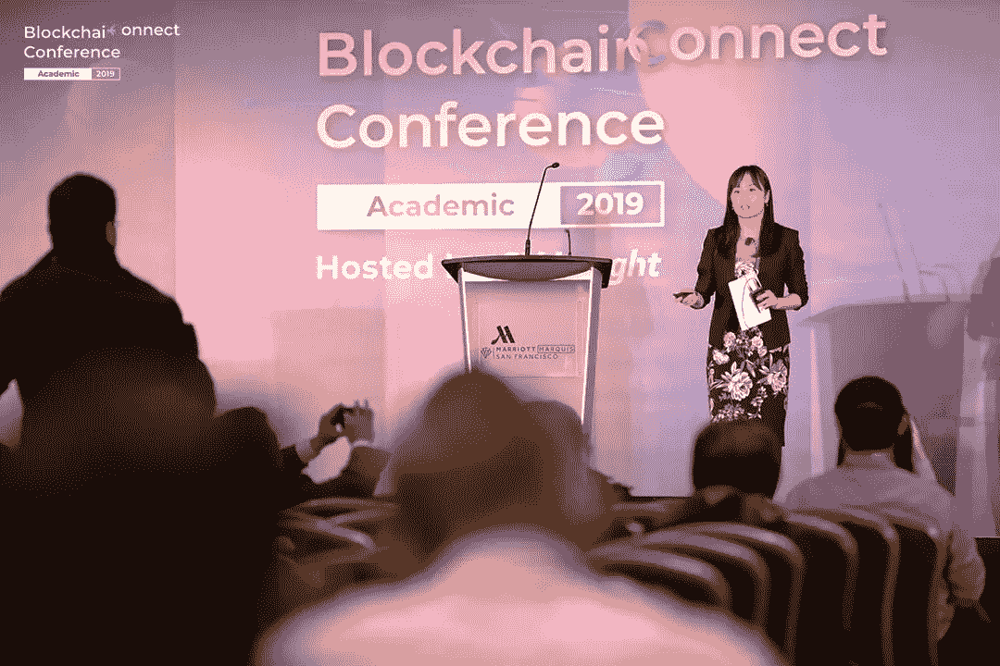
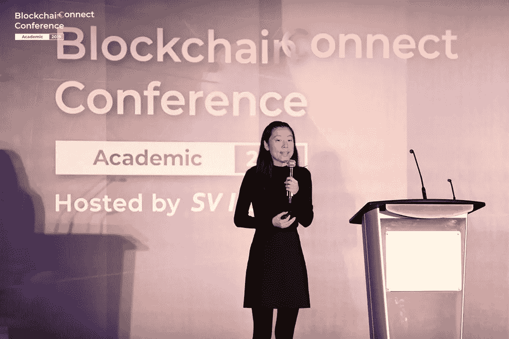
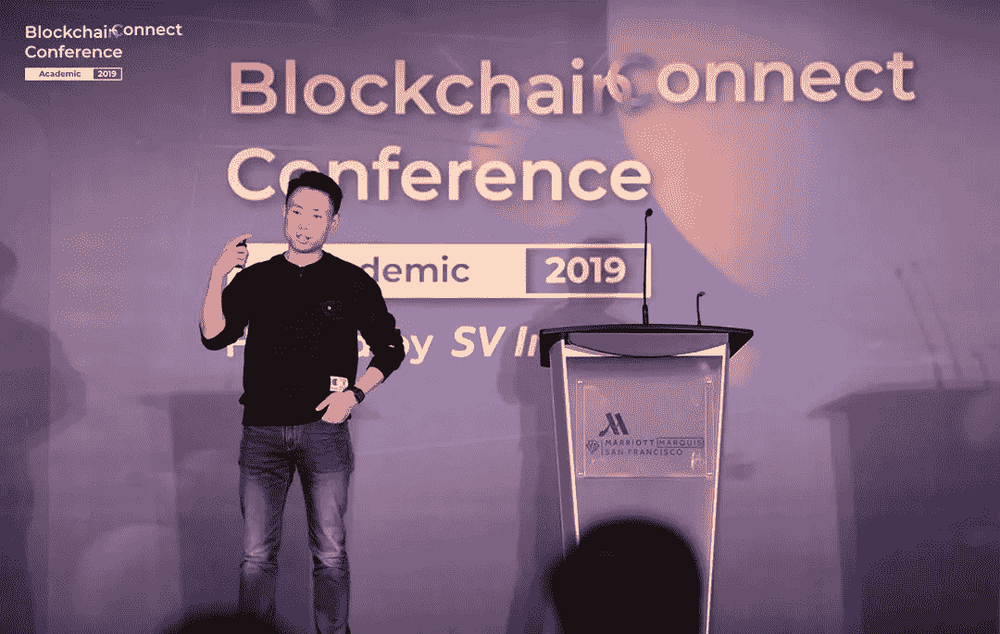
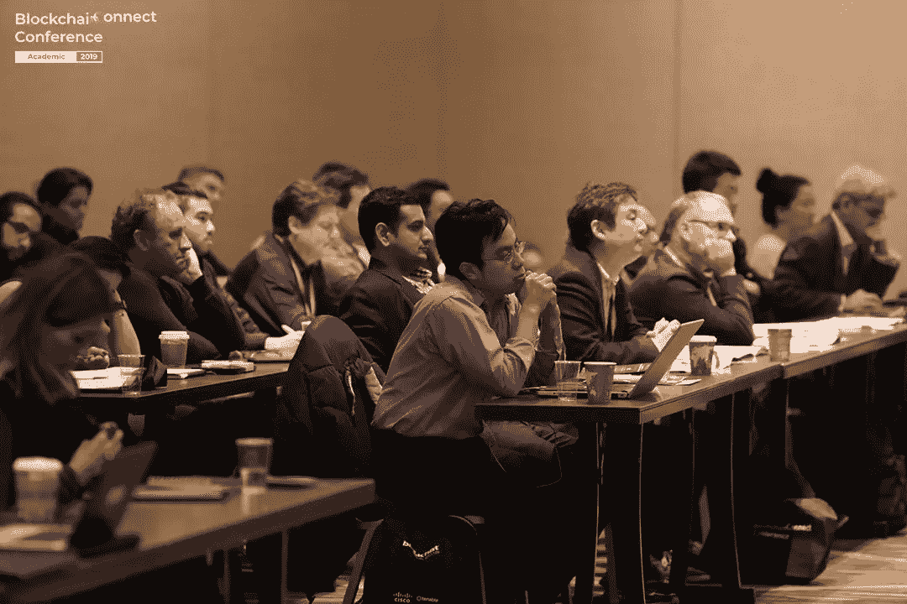
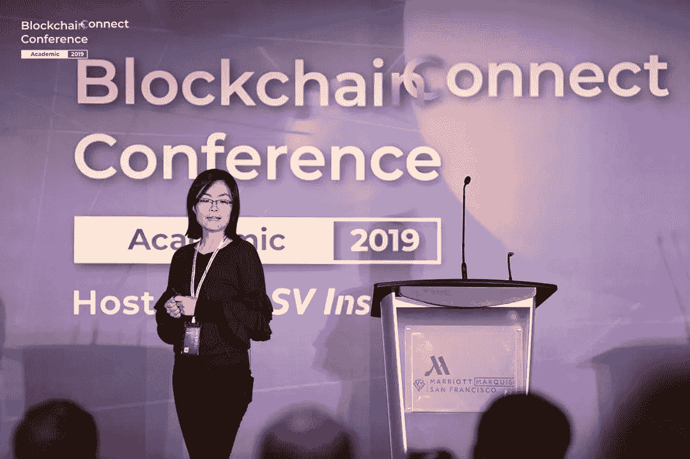
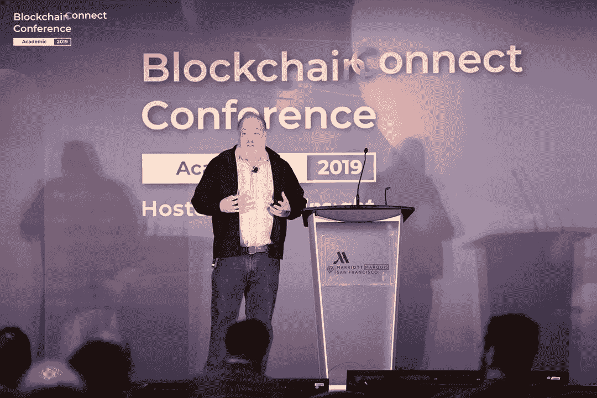
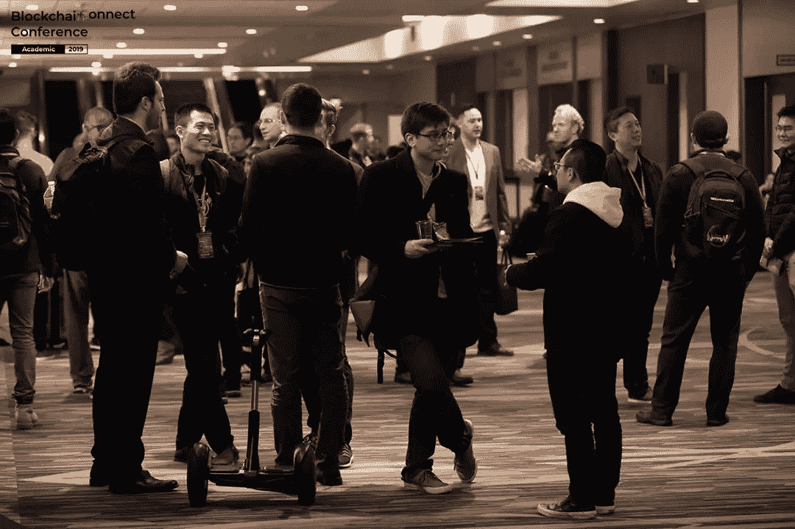
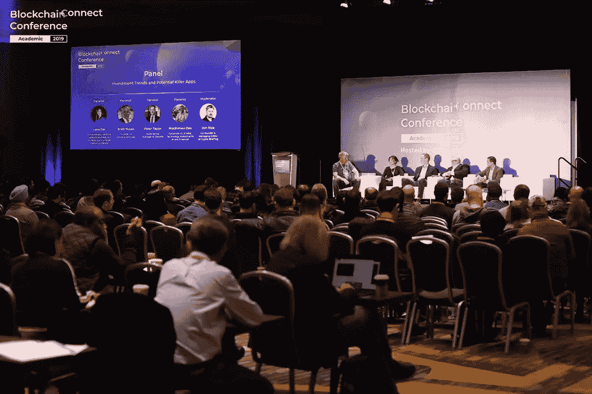
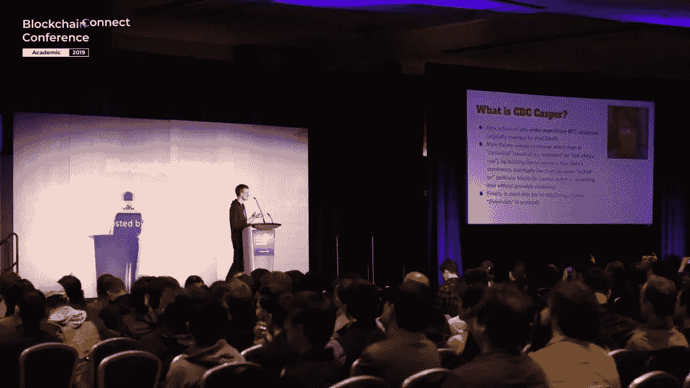

# 区块链连接大会的主要收获:2019 年学术会议

> 原文：<https://medium.com/hackernoon/key-takeaways-from-blockchain-connect-conference-academic-2019-fe8988c50549>

维塔利克·布特林和大卫·乔姆等区块链专家在会上说了些什么？

第三届区块链连接大会于 1 月 11 日在旧金山举行。

以太坊创始人 Vitalik Buterin、“在线匿名之父”David Chaum、“互联网安全教母”Dawn Song 等众多顶尖学者，以及来自英特尔、甲骨文、VMware、腾讯、德勤、蚂蚁金服的高管，以及金融行业高管、投资人、千余名与会者，共同见证了这场学术盛宴。

Ethereum founder Vitalik Buterin

[SV Insight](http://www.svinsight.com) 联合创始人 Peter Qin 在开场白中讲述了 SV Insight 的发展历程。他分享了公司的 3 大业务模块:SV Insight Media、SV Insight Research 和 Blockchain Connect Conference。

(SV Insight COO Peter Qin)

[SV Insight Research](http://www.us.svinsight.com) 总监 Nicole Ni 发布了 SV Insight Research 最新成果《2018 全球区块链学术研究与趋势报告》(以下简称《报告》)。该报告由 SV Insight Research、Ontology、U Network、崇东社区联合发布。它涵盖了区块链底层技术的分析和学术与工业的结合。**2018 年，区块链底层技术的三个关键词是可扩展性、存储、隐私&安全。**这三个话题在嘉宾的发言中都备受关注。

(SV Insight Research director Nicole Ni)

2019 年，学术界的工作将如何改善整个区块链技术的发展？该行业将如何拥抱区块链？我们将在这里揭示细节。

**区块链将保护你的隐私和信任**

加州大学伯克利分校计算机科学教授 Dawn Song 表示，“2019 年将是关于隐私的一年”。隐私不仅是普通大众的热门话题，也是区块链空间的热门话题。另一个热门话题是可伸缩性，然而，**可伸缩性不仅意味着支持交易流程的更高 TPS，还意味着支持更复杂的智能合约操作。**

作为绿洲实验室的创始人，Dawn Song 教授提到，绿洲实验室希望在区块链建立一个基于隐私的云计算平台。该平台现在允许一些智能合同在名为“安全飞地”的隔离硬件上运行，保护隐私和大规模计算。智能合约还会用收集到的数据训练机器学习模型。

(Professor Dawn Song)

“人生没有统一的信任。一万个小信托连接起来，建立社会的信任，区块链就是最好的连接器。”本体创始人兼 CEO 李峻介绍了**本体的最新成果:分片。**据他介绍，本体分片设计已经发布，支持网络、事务和状态分片，这将有效解决区块链开发中最大的挑战之一——可扩展性。

未来，本体希望构建一个分布式的信任协作平台，该平台提供完整的开发工具，构建 DApp 主动生态系统，将信任元素源源不断地注入到人、财、物、事的应用场景中，实现高效稳定的信任合作。

(Ontology founder & CEO Jun Li)

CertiK 的联合创始人 Daryl Hok 从我们生活中的信任开始，并谈到了区块链智能合同的信任。如何才能完全信任智能合约？— — **通过数学。数学是一种可读、透明、可持续并得到全世界认可的验证形式。**

如今，Certik 使用形式验证(一种数学方法)来验证是否存在漏洞或错误。除了区块链领域之外，形式验证长期以来一直用于其他场景，如 NASA 和国防部。

**安全加密，学术界和业界是怎么做的？**

传统的互联网加密是通过传输层安全(TLS)协议完成的。在去中心化的环境下有效吗？

Nucypher 联合创始人兼 CTO Micheal Egorov 在“去中心化的互联网和超越公钥加密的需要”的演讲中透露，NuCypher 使用代理再加密(PRE)技术来确保开发者可以在公共区块链上存储、共享和管理私人数据，以此来创建一个分布式加密系统平台。

伍斯特理工学院的 Berk Sunar 教授讨论了同态加密和区块链的结合。在他看来，使用同态加密技术，智能合约可以在不知道真实数据的情况下处理密文，大大提高了隐私安全。**目前，IBM、微软、Intel 等大公司都在全同态加密(FHE)上下了很大功夫。**当然，Sunar 教授也指出了使用 FHE 时在性能、引导和其他方面仍然存在的挑战。

根据 SV Insight Research 的报告，可信执行环境(TEE)是隐私和安全方面最重要的技术之一，它严重依赖硬件供应商。英特尔实验室总工程师 Mic Bowman 的演讲进一步证明了这一点。在他看来，TEE 与硬件紧密集成，区块链技术可以在一定程度上受益，在保密性、效率、性能和可伸缩性方面有实质性的改进。

**打破“不可能的三角关系”**

在区块链世界中有一个流行的说法是存在一个“不可能的三角”，即一个人不可能同时实现可伸缩性、分散性和安全性。然而，根据与会学者提出的建议，以及业内现有的区块链技术解决方案，“不可能三角”已经变得越来越“可能”而非“不可能”。

在石溪大学副教授、阿尔格兰德首席科学家陈静的介绍中，阿尔格兰德使用了超快的拜占庭协议。**这样的共识协议每隔几个步骤就要验证一次，导致延迟非常低。**同时，通过加密抽奖机制、轮换委员会、纯 ProSec(纯 PoS)协议等设计，实现了去中心化、可扩展性、安全性等多重考虑。

陈静教授表示，对于目前很多公链项目来说，“不可能三角”的每一个方面都需要考虑，但是对于一些具体的应用场景，会选择一个角度进行优化。Algorand 还在大会期间在旧金山举行了首次线下 meetup，许多开发者讨论了 public chain 和其他相关话题。

(Algorand Chief Scientist Jing Chen)

另一位知名学者，迅雷 Token 联合创始人、康奈尔大学教授 Elaine Shi 在演讲中谈到了共识机制的数学基础，探讨了大规模共识机制的理想协议。

(Cornell University Professor Elaine Shi)

**另一种可伸缩性技术是基于第 2 层的链外可伸缩性。** Texa Network 联合创始人 TF Guo 解释了 Texa Network 如何将智能合同的执行从链上转变为链下，并通过第 2 层的链下解决方案引入可信计算技术，以实现高性能和更好的隐私性的智能合同。

**技术实现:区块链“微信支付”、发票、社交网络……**

正如 SV Insight 研究报告所分析的那样，区块链技术与医疗保健、能源、安全、物联网和金融这五个行业结合得最多。那么，科技巨头在区块链领域有什么创新呢？

“在中国，像微信这样的社交应用程序有内置的支付功能，符合用户的期望。“网络匿名之父”大卫·乔姆提到了微信的支付+社交功能。然而，我们需要在去中心化的世界上建立一个社交+交易服务平台吗？当然可以，这也是 Elixxir 想要打造的。

继 Digicash 之后，David Chaum 推出了另一家初创公司 Elixxir。他承认，为了实现速度、隐私、可扩展性和安全性，Elixxir 有 2 大创新:首先，为了保护隐私，每个块中的节点必须团队工作；第二，所有交易的公钥都是预先计算好的，每个实时交易中只使用“哈希函数”。今天，Elixxir 可以在 3 秒内传输信息，在 10 秒内完成交易。单个链上每秒可以处理超过 100，000 个事务。“当技术成熟后，最高交易可以达到每秒百万笔。”

(Elixxir founder David Chaum)

腾讯区块链负责人 Aaron Cai 介绍了腾讯在发票中应用区块链的尝试。2018 年 8 月，腾讯推出了其**首个“区块链发票”，消费者可以实时跟踪发票的报销情况。**区块链还有助于提升传统发票的流程和效率，以最终实现无纸化管理。去年 12 月，基于区块链技术的电子发票与微信支付相结合，使操作更加便捷。

"下一个主要的应用领域将是金融基础设施、身份认证和供应链."埃森哲全球区块链研究总监贾斯汀·赫齐格(Justin Herzig)在商业会议上介绍了埃森哲在分布式总账方面的研究进展。在他看来，现有的分布式账本技术已经为下一阶段的产品做好了准备。

除了游戏和金融，区块链还可以应用于哪些领域？世界经济论坛(WEF)区块链项目负责人 Ashley Lannquist、甲骨文区块链项目管理高级总监 Mark Rakhmilevich 和 SCRY.info 联合创始人 Rya Chang 进行了一次有趣的对话。例如，SCRY.info 正在创建一个基于区块链的社交应用程序。

如何实现代币经济的价值最大化？内容预测与发布平台 U 网 CEO、SV Insight 联合创始人、联合创始人张一伦、CanonChain 联合创始人杨思超进行了讨论。他们认为**社区应该在共同的目标**下提高合作的效率和共同价值的收益。每个主题或目标都有一个代表其价值的相应标记，用于最大化其包含的信息的价值。

**投资趋势:2019 年，熊市将持续**

**“2018 年之后，区块链熊市将持续到 2019 年。”**

在下午的“2019 投资趋势”小组讨论中，LDV Partners 合伙人、卡耐基梅隆大学客座教授 Lake Dai、Unbank Venture 创始人 Brett Noyes、来自德勤、蚂蚁金服科技投资等机构的代表在讨论中发表了各自不同的观点。

Lake Dai 表示，当经济低迷处于最低点时，将是投资者投资的最佳时机。从历史上看，互联网泡沫破裂的第二年(2001 年)，很多互联网公司要么经历了大浪淘沙，要么吸取了前人的教训，未来会做得很好。当时，及时投资这些互联网公司的投资者后来获得了高额回报。

德勤审计高级经理皮特·泰勒透露，在 **2019 年，美国 SEC(证券交易委员会)将严格控制 ICO 和其他区块链相关活动，以努力保护投资者的利益。**

那么，2019 年投资者是否应该继续投资加密货币呢？嘉宾表示，投资要看投资人自身的能力。如果能力允许，投资人还是会投资优秀的加密货币项目。

(VC Panel: 2019 blockchain investment trends)

下午，大会举行了优秀论文颁奖仪式。这些论文是 SV Insight Research 从世界顶级期刊和会议(如 IEEE、ACM、Springer 等)中挑选出来的。)作为数据来源，还有学术界提交的论文，然后根据期刊的影响因子排名、论文引用数等指标进行评选。

来自加州理工学院、华盛顿大学圣路易斯分校、北卡罗来纳大学等知名高校的教授和研究人员对其获奖论文进行了颁奖。这些论文涵盖了社交网络、与食品安全行业等行业的结合以及私人安全和智能合同应用等技术方面的主题。

除了颁奖之外，区块链媒体 Dbit、区块链全媒体平台推广解决方案提供商 NOC Venture 等区块链项目在大会上进行了路演和演示。

**以太坊 2.0: Casper 将于今年推出其测试网**

**大会最令人期待的部分肯定是以太坊创始人 Vitalik Buterin 的闭幕词。**以太坊将如何继续发展？Vitalik 在大会上重点介绍了 CBC Casper 和以太坊 2.0。

(Ethereum founder Vitalik Buterin)

Vitalik 解释了 CBC Casper 的基础知识:CBC Casper(correct-by-construction Casper)是一种新的安全异步拜占庭容错共识，主要由以太坊团队研究员 Vlad Zamfir 提出。Casper 是一个验证系统。为了加入系统，认证者需要拿出他们所拥有的以太坊的一定比例作为安全边际。如果验证者恶意倒挡，那么**可以提交证据没收验证者的保证金，使得犯罪成本非常昂贵。**

(Vitalik Buterin)

卡斯帕强调终结。这意味着不再使用最长链规则来选择规范链(即用户应该注意的链)，而是基于 GHOST 一致性算法修改的 LMD GHOST(最新消息驱动的 GHOST)。

相比于现有的 FFG 版本(维塔利克的卡斯珀版本)，维塔利克承认 CBC 的卡斯珀会更优雅。它可以用于任何 POS，同时它将有效地提高可扩展性，并在以太坊中更快地部署。

在问答环节，当被问及 Casper 的具体实施计划时，Vitalik 官方透露，如果开发团队工作顺利，testnet 将于今年推出。

围绕以太坊 2.0 的开发，Vitalik 分享了他的愿景。Vitalik 认为，得益于信标链，以太坊 2.0 将能够管理 PoS 协议(Casper)并实现分片功能。