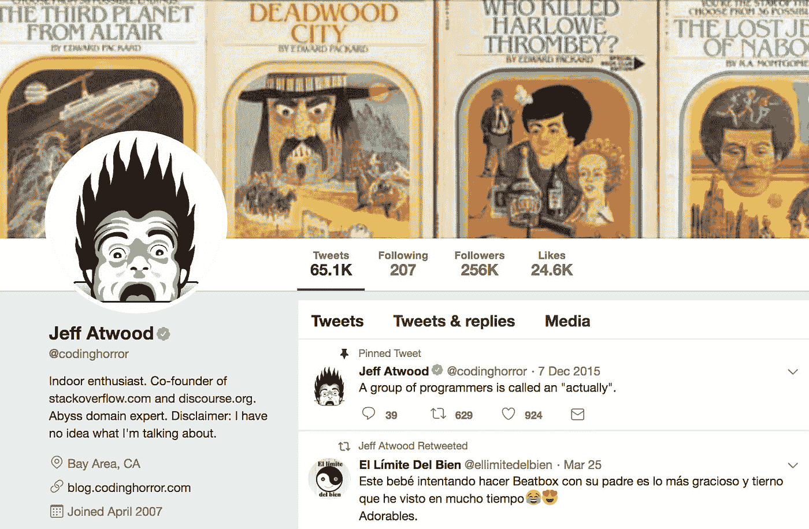

# 杰夫·阿特伍德的《黑客正午》中的 AMA

> 原文：<https://medium.com/hackernoon/key-takeaways-from-jeff-atwoods-ama-on-hackernoon-78abc7501530>

Hacker Noon 的技术讨论旗舰版块——[community.hackernoon.com](https://community.hackernoon.com/)为杰夫·阿特伍德主持了一场 [AMA(随便问我)的会议。](https://community.hackernoon.com/t/i-am-jeff-atwood-codinghorror-co-founder-of-stack-overflow-and-discourse-ask-me-anything-4-8-noon-pst/1800) Jeff 是 Stack Overflow(后来的 Stack Exchange)的联合创始人，Stack Overflow 是全球开发人员和编码人员的救命稻草。随后，他在 2012 年创办了开源讨论软件 Discourse。充分披露我们是粉丝，因为话语为[黑客正午的社区论坛](https://community.hackernoon.com/)提供动力，也将为[黑客正午的评论系统](https://hackernoon.com/where-hackers-hang-out-c43eb09e175a)提供动力。好软件。

> 下一个[黑客中午 AMA](https://community.hackernoon.com/c/ama) 是与[独立黑客的考特兰艾伦在太平洋时间 4/18](https://community.hackernoon.com/t/im-courtland-allen-creator-of-indie-hackers-ask-me-anything-thu-apr-18-noon-pst/1945) 周四中午

# 我从杰夫·阿特伍德的《AMA》中学到的

社区的问题从业务发展和技术创新到社区建设和品牌发展实践。下面提供了他的 AMA 的关键要点。然而，要查看他的回应，以他特有的风格，以及调用克苏鲁的细节，[请访问 AMA 线程](https://community.hackernoon.com/t/i-am-jeff-atwood-codinghorror-co-founder-of-stack-overflow-and-discourse-ask-me-anything-4-8-noon-pst/1800/10)。

 [## 我是杰夫·阿特伍德(@codinghorror)，堆栈溢出和话语的联合创始人。问我什么都行！4/8…

### 嘿黑客正午社区，👋我是杰夫·阿特伍德。我在 2008 年共同创立了 Stack Overflow，最终成为了 Stack…

community.hackernoon.com](https://community.hackernoon.com/t/i-am-jeff-atwood-codinghorror-co-founder-of-stack-overflow-and-discourse-ask-me-anything-4-8-noon-pst/1800) 

# 编程、技术和管理

对于一个关于构建软件平台的建议的请求，Jeff 坚持认为即使他有多年的经验，再多的计划和测试也不能帮助软件经受住用户的实际使用。如果您必须优化，请关注交付结果的速度:

[*“因此，目标应该是让用户*](https://community.hackernoon.com/t/i-am-jeff-atwood-codinghorror-co-founder-of-stack-overflow-and-discourse-ask-me-anything-4-8-noon-pst/1800/35) *手中的软件有一个早期的工作版本，并有一个紧密而快速的反馈循环来迭代:*

1.  *部署软件*
2.  *收集反馈*
3.  *根据反馈改进软件*
4.  *重复*

*不要为了一切顺利而优化，那是不可能的，要为了提高速度而优化。”*

Jeff 认为对开源运动做出贡献的最好方式就是参与。找到一个你喜欢或受益的开源项目，看看有什么方法可以贡献，从小事做起。

[*“既然我们在 Discourse*](https://community.hackernoon.com/t/i-am-jeff-atwood-codinghorror-co-founder-of-stack-overflow-and-discourse-ask-me-anything-4-8-noon-pst/1800/40) *上盈利了，每年我们都会努力回馈开源生态系统，Discourse 是其中的一部分，并从中受益。”*

Jeff 相信，如果你带领许多其他的编码人员朝着一个共同的目标前进，你最终可以在不编码的情况下完成更多。关键是良好的沟通技巧，这是优秀开发人员和优秀开发人员的区别。

> [*“不要开始一个真正大的项目。*](https://community.hackernoon.com/t/i-am-jeff-atwood-codinghorror-co-founder-of-stack-overflow-and-discourse-ask-me-anything-4-8-noon-pst/1800/51) *开始一个小项目，和你的用户一起迭代，把它做大。”*

# 写作、博客和内容的未来

杰夫说，像脸书和 Instagram 这样的社交媒体平台，很有可能已经超越了博客当年的权威。这导致写博客的人越来越少，并涌向其他更直观的博客，这些博客不需要博客所需的技能和专业知识水平:

> [*“定期写博客的人越来越少了*](https://community.hackernoon.com/t/i-am-jeff-atwood-codinghorror-co-founder-of-stack-overflow-and-discourse-ask-me-anything-4-8-noon-pst/1800/45) *，除了写博客，还有数不清的替代方式，包括无处不在的社交媒体。”*

他主张社区版主必须有能力关闭有问题成员的“社区之门”。如果在现实生活中这样做是可以接受的，为什么我们不能在网上这样做呢？这里最好的事情是让人们写下这些问题并广泛宣传。它工作了。吱吱作响的轮子得到了润滑，特别是如果他们有更高的道德基础来保护代表不足的群体。

> [*“言论自由≠触及自由”*](https://community.hackernoon.com/t/i-am-jeff-atwood-codinghorror-co-founder-of-stack-overflow-and-discourse-ask-me-anything-4-8-noon-pst/1800/54)

在 Discourse 上，Jeff **实现了一个信任系统**,在这个系统中，那些多次做出负责任和有益贡献的人被授予更高的特权，以帮助阻止垃圾进入，并创建一个维护平台质量的冠军名册。

# 目标、优先级和偏好

我们一直在“我如何成名”上给话语社区提供建议——这是无法回避的核心要求，即定期**创造人们喜欢的伟大、有趣的内容**。

*[*作为一个行业*](https://community.hackernoon.com/t/i-am-jeff-atwood-codinghorror-co-founder-of-stack-overflow-and-discourse-ask-me-anything-4-8-noon-pst/1800/37) *，我们对用户安全和* [*设计为恶*](https://blog.codinghorror.com/designing-for-evil/) *考虑不够。部分原因是我们中的许多人都是男性，人们不会像女性和代表性不足的群体那样在网上打扰我们——所以我们没有考虑我们的软件可能被滥用来使其他人的生活痛苦的许多方式。但好消息是，我相信软件可以被设计成鼓励人们在网上做更好的自己**

*杰夫信奉“三件事”哲学。它说我们必须删除那些花哨的待办事项，只关注今天需要完成的三件事。这就是我们需要做的。*

**[*说到软件*](https://community.hackernoon.com/t/i-am-jeff-atwood-codinghorror-co-founder-of-stack-overflow-and-discourse-ask-me-anything-4-8-noon-pst/1800/50) *，我一般会实践* [*投诉驱动开发*](https://blog.codinghorror.com/complaint-driven-development/) *，对于话语我们总是倾向于* [*聚合活跃社区的反馈*](https://meta.discourse.org/t/how-do-we-decide-what-goes-into-each-release-of-discourse/20870) *而不是随机意见。”***

**杰夫承认，话语和松弛可以共存，因为它们迎合了不同的组织。对于作为紧密团队协作的较小团队来说，Slack 更好，而 Discourse 则更适合较大的公司，在这些公司中，多线程需要共存并且易于搜索。**

# **在会议结束时**

**杰夫有一点很突出，那就是他能够找到一种幽默的方式来表达自己的观点。在整个 AMA 期间，他都坚持尽可能多地推荐好书。从 50 年前的经典著作《无我编程的 10 条戒律》到更现代的《智人》。**

**我想感谢杰夫分享他的宝贵时间。**

## **下一个[黑客中午 AMA](https://community.hackernoon.com/c/ama) 将在太平洋时间 4/18 周四中午与[独立黑客的考特兰·艾伦在一起](https://community.hackernoon.com/t/im-courtland-allen-creator-of-indie-hackers-ask-me-anything-thu-apr-18-noon-pst/1945)**