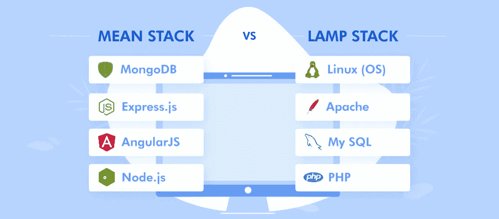

# LAMP 堆栈还是 MEAN 堆栈——为您的下一个 Web 应用选择哪一个？

> 原文：<https://medium.com/hackernoon/lamp-stack-or-mean-stack-which-one-to-choose-for-your-next-web-application-75dcbb2b69f1>

MEAN Stack OR LAMP Stack

几年前，LAMP stack 曾主导构建 web 驱动应用程序的市场。当时 MongoDB、Express.js、Angular.js、Node.js 是独立的身份。

但是这些年来，这些独立的身份出现了，并聚集在一起做一些严肃的工作，通过形成一个新的堆栈，称为 MEAN (MongoDB，Express.js，Angular.js 和 Node.js)堆栈。

现在，灯堆的情况已经完全改变了。MEAN stack 给了它一个艰难的竞争，显然赢得了比赛。

**什么是灯栈？**

LAMP stack 是一个用于 web 开发的开源免费堆栈，包含 Linux OS、Apache web server、MySQL 数据库和 PHP。由于它的开源特性以及易于部署和定制，它仍然是一些开发人员的热门选择。

它有一个庞大的支持社区，是昂贵软件包的替代产品。个人和企业开发人员都可以使用它来开发 web 应用程序和服务器。

**栈是什么意思？**

另一方面，MEAN stack 包含 MongoDB、Express.js、Angular.js 和 Node.js，这种组合使 MEAN 成为一个简单易用的 web 开发堆栈。

MEAN 与 LAMP 的不同和独特之处在于它完全基于 JavaScript。像谷歌、优步和网飞这样的大公司正在使用 MEAN 来驱动他们的网络应用。

**平均堆栈 vs 灯堆栈**

开发人员从 LAMP stack 转移的一个主要原因是因为它没有 MEAN 灵活。说到简单性和灵活性，MEAN 远胜于 LAMP。

让我们深入了解与 MEAN 和 LAMP 相关的东西，并了解哪一个更适合您的下一个应用。

**使用 MEAN Stack 的现代 Web 应用程序开发**

对于期望 web 应用程序项目有高流量和高参与度的开发人员来说，MEAN 是一个理想的选择。当参与度很高时，管理一个应用程序并不是一件容易的事情。开发人员需要在这方面努力工作，因此他们需要一种灵活、可伸缩和可扩展的技术。

这就是平均筹码发挥作用的地方。它是一个用于现代 web 应用程序开发的开源 web 堆栈，尤其是针对云托管的应用程序。该堆栈自带网络服务器，因此如果使用量激增，应用程序可以有效地处理流量。

**均值的分量:**

**MongoDB** : MongoDB 是一个非关系型的 NoSQL 数据库，用于以 JSON 文档的形式存储 app 的后端数据。

MEAN stack 和数据库都使用 JavaScript，因此当应用程序获取数据库和其他元素时，开发人员不需要翻译任何东西。

**Express.js** : Express.js 是 Node.js 的一个 [web app 框架，形成了 MEAN stack 的后端，负责前端和数据库之间的通信。这使得向用户传输数据更加顺畅，即使应用程序中有很多功能。](https://www.techuz.com/blog/best-node-js-frameworks-for-web-application/)

**Angular.js** : Angular 是 Google 打造的前端 web app 框架。是开发者做前端开发的首选。大多数使用 JavaScript 构建的 web 应用程序都使用 Angular。在 MEAN stack 中，Angular 帮助开发者使用 JS 构建应用的前端。

**Node.js** :是一个 js 框架，通过按需伸缩请求，帮助 app 同时处理多个连接。基于 Google V8，Node.js 被用作大多数知名应用的运行时环境，包括 Google Chrome。

Node.js 作为 MEAN 堆栈的主干，其中 Express.js 工作在 Node.js 之上，Angular.js 与 Node.js 交互以更快地提供数据。

**为什么要使用平均堆栈而不是灯堆栈？**

如果上面提到的理由还不足以说服你转向中庸，那么下面还有一些理由可以说明为什么中庸比灯好。

**应用程序开发的每个部分都使用相同的语言**

JavaScript 是一种易于使用、动态且灵活的语言。MEAN stack 在应用开发的每个环节都只使用这种语言，无论是前端(Angular)，后端(Express)，还是数据库。这使得应用程序的所有部分之间的交互更加流畅。

它还允许公司精简他们的开发团队。一个懂 JS 的开发团队可以随时随地开发一个应用。此外，在几个地方，开发人员可以在应用程序的多个部分重用相同的代码。

另一方面，如果您使用 LAMP stack，您将需要在 PHP 或 Python 之间切换，然后转移到 JavaScript 或 HTML。这使得事情变得富有挑战性和复杂。

**性价比高**

使用 MEAN stack，一群开发者可以同时在应用的服务器端和客户端工作。这将消除为双方雇佣独立开发团队的需要。最终，它可以帮助企业节省成本。

**不仅限于 Linux】**

LAMP 堆栈只能用于 Linux 操作系统。这意味着如果开发者想用 LAMP 开发一个应用程序，他们必须在 Linux 上工作。

然而，中庸却不是这样。它支持跨平台操作系统。这并没有将开发者局限于单一的操作系统。

**来自广大开发者社区的支持**

MEAN stack 中的所有技术都得到了广泛的个人和企业开发者社区的支持。如果您在代码行中遇到问题或者无法调试代码，这个社区会随时为您提供帮助和支持。

**结束**

自 2014 年推出以来，MEAN stack 一直主导着 [web 应用开发](https://www.techuz.com/web-development)的市场。如果您想要开发需要处理大量数据的应用程序，或者如果它基于云，那么 MEAN stack 将是正确的选择。

LAMP stack 适用于简单的小型项目，这些项目不需要时不时地面对峰值。

如果您有任何疑问，请通过下面的评论部分告诉我们。