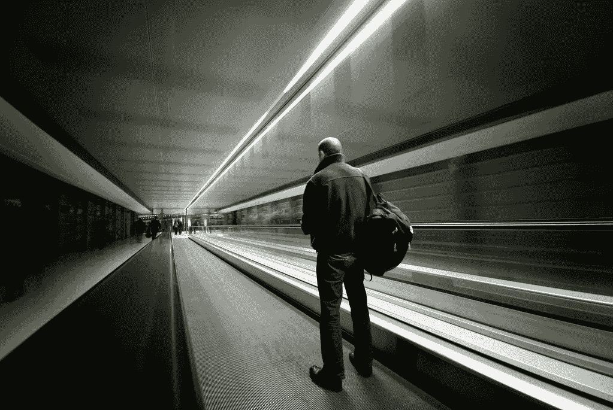
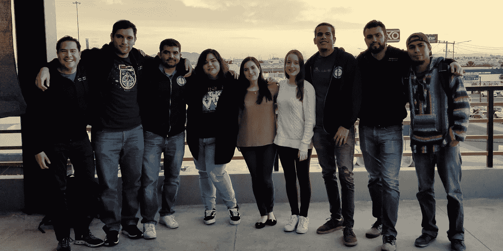

# 领导一个偏远的团队，成为一个数字流浪者——警示故事。

> 原文：<https://medium.com/hackernoon/leading-a-remote-team-and-being-a-digital-nomad-cautionary-tale-5088195d7cf0>

Image by Victor Bayon via Flickr

几天前，来自 [Remoters](http://remoters.net) 的团队发表了一篇我写的关于远程工作以及它如何成为建立团队的一种可行方式的文章——[聚光灯下的远程工作，如何让它工作而不死于尝试](https://remoters.net/remote-work-in-the-spotlight-how-to-make-it-work-and-not-die-trying/)——我是远程工作的坚定信徒。这是一种给组织和团队自由的方式，他们需要有更好的工作/生活平衡。

这篇文章给了我一些很好的反馈，我想继续写另一篇文章，这次是关于个人的。每个故事都有另一面，我想与 HackerNoon 社区分享我在领导一个远程团队和成为数字流浪者的过程中所学到的一些经验(不是出于选择，而是出于家庭原因)。

自 2015 年以来，在[software dev tools](https://softwaredevtools.com/)([near soft](https://nearsoft.com/)是我们的母公司)领导一个远程分布式团队非常棒。那年早些时候，我不得不从墨西哥城搬到 Nearsoft 在索诺拉(墨西哥北部)的总部。

我加入该组织的原因之一是为了他们的自由文化，你知道我有家人在巴塞罗那，这要求我每年去西班牙旅行 2-3 次。对于 Nearsoft 来说，我在 9 个时差的时区工作并不是一件坏事。我很高兴成为这样一个令人惊叹的组织和文化的一部分，适应一个扁平化的组织需要一些时间，但一旦近水楼台先得月，自我管理工作方式的好处就非常显著。

自 2012 年以来，我一直往返于美国/墨西哥和欧洲，因为当时我的基地是巴塞罗那，这并不时尚，也没有这样做的术语…直到数字游牧一词引起了媒体的关注。对我来说，我一直是个“出差族”，只是因为商业原因经常出差，而不是生活方式的选择。但在过去的 4 年里，我一年中有 3-6 个月在欧洲度过，其余的时间则在北美和南美旅行。

去年发生了一些重大的变化，我结婚了(第二次是幸运的),也有了第二个孩子。所以我努力多呆在家里，尽管今年我在这方面做得不太好。到目前为止，我已经去过一次亚洲和两次欧洲(65，000 多英里),这对我的身心都是一种伤害。

此外，我们的团队还在不断壮大，最初只有 100 多人的公司里的两个人，现在我们有 14 个人，300 多名员工。我们设法推出了产品品牌 SoftwareDevTools，在 Atlassian 和 Freshworks 等市场上销售应用程序，为[敏捷回顾](https://marketplace.atlassian.com/apps/1216054/agile-retrospectives-for-confluence?hosting=cloud&tab=overview)提供解决方案，为每日站立提供 Slack [聊天机器人，将](https://softwaredevtools.com/stand-bot/) [Trello 与 fresh desk](https://www.freshworks.com/apps/freshdesk/trello/)/[fresh service](https://softwaredevtools.com/freshservice/trello-app/)和 [Scrum Poker 应用程序](https://marketplace.atlassian.com/apps/1218960/scrum-poker-estimates-for-jira?hosting=cloud&tab=overview)集成，用于评估。现在，我们在全球拥有 400 家客户，几乎全天候工作，为我们的客户和合作伙伴提供服务。

有了这样的背景，我想和你们分享我今年到目前为止学到的经验，以及之前 7 年在创业、指导创始人和打造数字产品的道路上不断前进的经验。

**作为团队的一部分，经常往家走。**

我喜欢创造产品，但这不是你一个人能完成的，你必须和其他人一起工作，建立一种相互激励的关系，以取得出色的成果。这一点在过去几年的构建软件开发工具和与 Nearsoft 同事的合作中得到了体现。然而，拥有远程工作的好处并不都是美好的。

SoftwareDevTools team in Hermosillo — Nearsoft HQ.

直到几周前，我开始注意到一些行为变化，老实说，是我的配偶和同事指出我变得更具攻击性和脾气暴躁。这让我思考，我必须感谢他们花时间关心我，让我知道我不是最好的自己；许多经常移动的数字游民总是紧跟最新潮流，寻找机会。这是必要的，因为你要么是自由职业者，要么有幸成为一家远程工作的公司的一员，但这种时刻保持警惕的感觉很刺激。

与在路上的数字游牧民有一个共同点，那就是我们感觉像是在“旅行”。对你们中的一些人来说，这将类似于“摇滚明星”的心态，对那些戴上现实扭曲视野眼镜的人来说，这将持续几年，直到你感受到士兵在“执行任务”时所经历的痛苦，并不得不处理被遗弃、后悔、孤独、悔恨等情绪。如果你找不到处理它们的方法，它们会随着时间积累，你会开始改变，微妙的变化会发生，你会开始失去你的基础。你的团队需要一个领导者来留意和意识到他/她的反应，避免不必要的摩擦。

为什么？为了继续成为一名数字流浪者，过上你想要的生活方式(你想在无限泳池里拍那张照片，对吗？)，你必须做好自己的工作，并不断取得成果。如果远程人员在工作中表现不佳，没有人会和他们一起工作，所以队友或雇主会很乐意和你“打交道”；因为他/她可以交付。为了增长和收入，他们会处理你的行为。你将开始走上一条与现实脱节的道路。

此外，在遥远的未来回家的感觉开始成为你的负担。你可以尽可能忽视它，但每个人都需要一个家庭，宿舍/Airbnb/co-work 上的那些同龄人/流浪者永远不会是你的亲人，不要把同理心误认为是真正的欣赏和关怀；那些是为少数人保留的。对于那些在陌生人身上发现它们的人，我向你们致敬，但希望现实不会回来告诉你们它是怎样的。没有人会比你的家人更关心你。

所以，找到你的家人，回家去建造一些能创造根的东西。你不会后悔的，如果你足够幸运，可以和你爱的人从一个地方旅行到另一个地方，那么你就做了我的导师[来自](https://www.linkedin.com/in/nisselson) [LDV Capital](https://www.ldv.co/) 的 Evan Nisselson 曾经说过的话:“家是我放下帽子的地方”。但是对于我们这些渴望呆在一个地方或承诺成为扎根的一部分的人来说，找到你的家。

你的团队需要你保持正确的心态，你需要照顾好自己。我们知道锻炼和冥想将是你自我保健的重要组成部分。找时间尽你所能成为最好的队友。

以下是来自社区的优秀文章和文章列表:

*   [想开始冥想吗？](https://hackernoon.com/want-to-start-meditating-dont-use-an-app-df6df2eae940) - >剧透不需要 apps)
*   对变革和组织健康的思考。
*   [禁食的好处。](https://hackernoon.com/im-fasting-to-prevent-cancer-and-be-healthier-a376d691a34d)

**反喧嚣，永续经营。**

我开始探索“突然”产生这些情绪变化的原因。我只是意识到我不可能一直“巡回演出”,我做得太过了。“交付成果”的代价让我筋疲力尽，现在我有了一个需要我回家的家庭，悔恨和内疚开始袭来。我不得不面对自己，并开始理解我不能让他们每个人都有价值，你必须放弃机会和不断的忙碌才能富有成效。关注重要的事情是实现可持续发展的途径。

如果一切都很重要，那么什么都不重要。”―帕特里克·兰西奥尼

我喜欢这个来自 [Basecamp](https://basecamp.com/) founders 最新著作的作品— [工作中不一定要疯狂](https://basecamp.com/books/calm):

与其要求付出一切，我们不如问，要付出什么？一次谈话的邀请。

但是这个对话不仅仅是和你的团队，而是和你自己。给自己一些时间来留意自己的决定和行为，愿意做出取舍，缩短时间，最重要的是找到一种更简单的方法来完成手头的任务，抓住机会，给自己留有喘息的空间。

*问题带来选择，法令烧掉它们——杰森·弗里德&大卫·海涅迈尔·汉森——base camp 创始人。*

所以，不要觉得有义务抓住每一个出现在你面前的机会，坐下来好好想想；这会让我更接近我们团队的目标吗？这在个人或职业层面上是可持续的吗？我这样做是为了我自己的利益还是为了让我的队友受益。当你开始倾向于“我”而不是“我们”时，你会知道你已经开始改变；因为领导的角色就是当管家。

我真的建议你看一看斯科特·贝尔斯基的书——《混乱的中间地带》——书中有一个很好的观点:

*战略与完成团队的目标关系不大，而与更好地满足网络参与者的需求关系更大。*

领导者的角色是服务于你的团队和你客户的需求，你需要意识到你正在产生的摩擦和你正在引起的不适。当你引导你需要尊重和照顾他人的需求时。当你开始做出不可持续的决策时，你没有照顾好你的团队；你是在为自己的短期收益服务，这是一个向下的滑坡。

找到正确的平衡很重要，但是当你不停地移动，而不是长时间呆在一个地方，这会对你和你的团队造成伤害。注意你在旅途中所做的决定，考虑你的健康，最重要的是对你带领团队的方向感到满意。

只有当你为他人服务并避免短期目标时，可持续发展才能实现。长期的结果要求你建立一个健康的团队，包括你自己。变得脆弱，每当你感到不知所措的时候就寻求帮助，不要害怕对每一个出现在你面前的“好”机会说“不”,或者与你的团队进行更多的讨论。

我将引用斯科特·贝尔斯基的一句名言来结束这篇文章:

当我们不能集中注意力时，成功就无法扩展。

专注于生活中重要的事情，你所爱的人和你所服务的人。

标题图片由[维克多巴永](https://www.flickr.com/photos/formalfallacy/)拍摄。