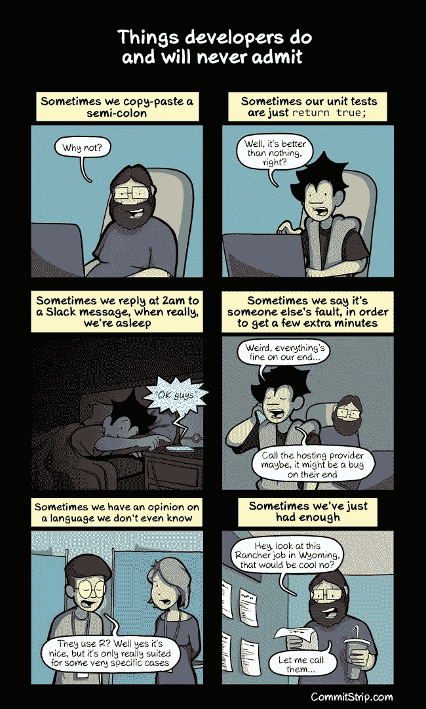
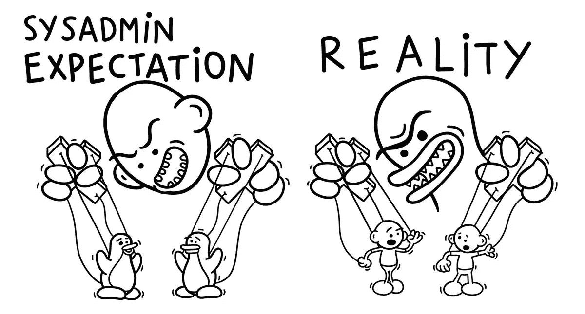

# 学习数据工程:我最喜欢的数据工程师免费资源

> 原文：<https://medium.com/hackernoon/learn-data-engineering-my-favorite-free-resources-52a29ab999b>

由[本杰明·罗戈扬](https://www.linkedin.com/in/benjaminrogojan/)原创[贴在这里](https://www.coriers.com/what-skills-do-i-need-to-become-a-data-engineer/)

数据科学和机器学习的资源有很多[列表。我们想为那些可能对数据科学不感兴趣，但想从事数据工程的人创建一个资源列表。](/@SeattleDataGuy/learning-data-science-our-favorite-resources-to-learn-data-science-from-free-to-not-47beb6424de1)

让我们首先列出成为一名优秀的数据工程师所需的基本技能。

数据工程师专门研究几个特定的技术方面。数据工程师拥有扎实的自动化/编程技能、ETL 设计、理解系统、数据建模、SQL，通常还有一些其他更适合的技能。例如，一些数据工程师开始涉足 R 和数据分析。这也是由他们的特定角色决定的。作为一名数据工程师，我被要求建立基本的网站，开发 API 并创建模型和算法。

由于各种技能和工具，我们的团队开发了一套资源，可以帮助那些希望进入数据工程领域的人。下面我们将讨论 ETL 工具、SQL、系统设计等。

**ETL 工具**

先说第一个技能。设计 ETL。有很多 ETL 工具。SSIS(或 Azure 数据工厂)、Airflow、Informatica 等等。他们都吹捧他们会解决你所有的问题。但是像任何工具一样，它们也有利弊。

**SSIS**

例如，SSIS 实际上是为 SQL server 开发的。尽管它允许您将数据加载到许多其他数据库中。它显然是针对微软环境的。此外，SSIS 对于那些不是很强的程序员来说是很棒的。该工具基于 GUI，允许您拖放只需要您更改参数的任务。这些任务可以让你自动发送电子邮件，管理依赖关系，并允许许多其他有用的功能。

尽管如此，还需要了解所有这些任务。这使得喜欢编程而不是使用 GUI 工作的数据工程师更加困难。GUI 需要知道属性隐藏在哪里，并且仅限于所提供的框架。如果你更喜欢编辑代码，这可能会非常令人沮丧，因为在 SSIS，花 1 分钟编写代码可能需要 30 分钟到 1 小时的修改。此外，对于任何曾经开发过 SSIS 管道的人来说，您都非常清楚这样一个事实，即一个很小的元数据更改就可以关闭整个数据库(当然，这不是 SSIS 独有的问题)。

为了更好地介绍 SSIS，我们喜欢聪明的猫头鹰。这是一个很好的地方来学习所有的技巧，以获得您可能想要使用的属性和可能的功能。这是一个关于执行基本任务的视频。

Informatica 提供了许多类似于 SSIS 的特性，但通常在处理大数据和不同类型的数据库系统方面要好得多。这是对该工具的一个很好的介绍。

**气流**

现在终于有气流了。airflow 是一个很好的工具，因为它不仅仅是将数据从 a 点移动到 b 点。它还进行了大量的依赖关系管理跟踪，并且有一个很好的 UI，可以轻松管理作业。

气流是用 python 写的，这意味着你的团队需要精通编码，并且理解如何管理气流。如果您的团队有许多复杂的管道，那么您的一名员工可能会陷入确保所有 ETL 任务都在运行，以及排除气流中断的任何故障的困境。

这不是气流独有的现象。SSIS 还需要了解 SQL Server 自动化代理，但由于它更基于 GUI，因此更易于管理。一旦有数百条管道进入气流，就很难跟踪数据的来源和去向。

*有时，你甚至会得到我们称之为意大利面的桌子。这就像意大利面条代码，但是有数据。

非 Linux/程序员类型的人可能不太容易接触到气流。所以这实际上取决于你团队的规模以及你团队管道的复杂程度。

没有很多关于气流的视频，因为它太新了。下面有几个。但这也指出了另一个弱点。不像 SSIS 和 Informatica 有强大的社区支持，气流仍然是新的，因此没有相同类型的教程/如何支持。这是你气流之旅的良好开端。这个系列涵盖了什么是气流和开发你的第一个管道

这些是 ETL 工具的几个例子。还有很多，通常分为 GUI 和代码库。但这是一个很好的开始。

**数据建模和数据仓库**

接下来让我们讨论下一个我们认为被忽视的关键部分。这就是数据建模/数据仓库。一些公司将数据建模和 ETL 工程的工作分开。这在一些公司可能是有意义的。我们只是认为，数据工程师不仅要开发填充表的 ETL，还要了解如何开发数据仓库，这一点同样重要。

数据仓库和数据建模通常涉及使用 API 从操作系统中提取数据，或者以另一种方式提取数据，以便允许分析师分析历史数据。然后，为了提高效率，更好地表示业务流程中发生的实际事务和变化，对这些数据进行了整形。

现在有几个警告。过去，设计数据仓库只有几种范式。由于像 Hadoop 这样的新数据系统，数据仓库不能总是以传统方式设计。

* *对于没有使用过 Hadoop 的人来说，无法运行某些语句(如“更新”)会极大地限制您的能力。

如果您正在使用传统的关系数据库，那么您将需要了解几个关键概念。这包括星型模式、反规范化、分析表和渐变维度(从开始)。这些是一些通常发挥作用的关键数据建模概念。理解这些概念是什么，以及它们如何应用于数据工程师是必要的。

这里有一些很好的资源供你了解更多。

**星形模式**

星型模式是数据工程师可以创建的最简单的数据模型之一。中间是我们所说的事实表。此表显示了实际发生的交易。这可能是购买产品或去医院。每个事务都有一组映射到维度表的 id 列。维度表包含有助于描述事务中涉及哪些实体的信息。这个事件在哪里发生，这个人买了什么，等等。为了更深入的了解，请查看下面的视频！

**缓慢变化的维度**

交易是不断发生的。维度在很大程度上保持不变。但是，在有些情况下，商店经理可能会改变，或者一个人可能会改变工作角色。这些可以被认为是缓慢变化的维度。我们通过下面视频中描述的几种方法来实现这一点。

**数据反规格化**

数据反规范化在某种程度上与数据建模有关。我们希望有一个单独的视频来谈论它，只是为了确保这个概念是清楚的。事实上，如果你要去面试，那么你可能会问这样一个问题:我们为什么要规格化还是反规格化？

**系统设计**

接下来，我们来谈谈自动化和系统设计。数据工程师不完全是软件工程师。我们不开发服务和应用。然而，我们确实需要自动化我们的大部分工作，并且通常所有这些都适合一个更大的系统。

该系统通常有大量的限制、依赖性和特性需求。这意味着数据工程师不能只设计 ETL 和自动化脚本，而不考虑事情如何适应更大的图景。

不仅如此，我们如何设计我们的表和 ETL 定义了系统在未来如何使用。这意味着我们不仅需要确保我们的整个系统符合当前的要求。这也意味着我们需要考虑经理们将来可能会问什么问题，以及我们需要考虑哪些特性。

这就是为什么我们认为看一些软件工程师的系统设计面试问题是有帮助的。在一天结束时，技能转移得很好。这些视频通常会向您展示如何解决问题，了解功能和局限性，并实施高级解决方案

例如，这个 Youtuber 做得很好，列出了任务的需求和功能，然后深入研究他将如何解决每个问题。

我们的另一个个人爱好是几乎任何与优步工程有关的东西。他们总是有很棒的高低层次的解释。无论是通过博客还是视频。

[优步工程博客](https://eng.uber.com/author/renesuber-com/)

**SQL**

SQL 是大多数数据工程师的饭碗。即使像 Hadoop 这样的现代数据系统也有 Presto 和 Hive 分层，这允许您使用 SQL 而不是 Java 或 Scala 与 Hadoop 进行交互。

SQL 是数据的语言，它允许数据工程师轻松地在系统之间操作、转换和传输数据。与编程不同，它在所有数据库之间几乎是相同的。有几个已经决定做出非常剧烈的改变。总的来说，SQL 是值得学习的，即使是在今天的环境下。

与 SSIS 相似，WiseOwl 制作了我们认为对你有益的视频。他们有一些播放列表，所以请全部查看！

**SQL 查询**

**SQL 程序和编程**

我们也有一些视频为一些更小众的情况。

**使用 Python 和 SQL 自动将文件加载到 SQL Server**

**使用 SQL 动态批量插入**

**Tableau 或其他数据 Viz 工具**

数据可视化并不是每个数据工程师日常工作的一部分。数据工程师不得不开发报告和仪表板的情况并不少见。有很多现成的工具非常容易使用。Tableau、SSRS、D3.js 等。除了 D3.js，这些大多都是拖拽工具。

**Tableau 拥有丰富的资源**

**为了好玩**

任何工程师一天的大部分时间都在开会和盯着电脑。除了这些学习的好资源。作为工程师，我们想为笑声提供一些我们最喜欢的资源。所有这些漫画、视频和网站都涉及技术，非常适合用来调侃我们的职业。

**技术主管**

技术负责人 Patrick Shyu 是一名 YouTube/开发者/喜剧演员(各种类型)，他制作的视频介于实用建议和纯粹的喜剧之间。老实说，很难分辨他什么时候是在讽刺，什么时候可能是在说一个工程师的真心话。这就是他的视频如此有趣的原因。作为一名工程师，当他开玩笑时(大多数时候)，当他不开玩笑时，你会明白。但是他一直板着脸，音调没有变化，这很滑稽。

他涵盖了很多主题，比如面试技巧、如何开发反模式(是的，你没看错)，以及大量其他热门话题。这是他的一个视频。

[如何成为 10X 工程师](https://youtu.be/Iydpa_gPdes)

另一个伟大的喜剧救济来源是承诺地带。现在有很多经典的工程漫画。看看呆伯特就知道了。然而，提交条有一些新鲜的东西。它真正关注的是发展的更多特质。呆伯特真的可以和办公室里的大多数人说话。而 Commitstrip 主要面向开发人员、系统管理员和 TPM。他们经常会取笑编程语言的细微差别、bug 周期或其他非常具体的话题。这只是增加了我们这些真正经历过漫画嘲笑的痛苦的人的幽默感。

[http://www . commitstrip . com/en/2017/10/30/things-developers-do-and-will-never-admit/](http://www.commitstrip.com/en/2017/10/30/things-developers-do-and-will-never-admit/)

最后，这是写给那些 Linux 粉丝的。Nixcraft 有一个博客，里面有很多关于 Linux 和其他系统的技巧和窍门。然而，他的 Twitter feed 通常会有更高比例的迷因、视频和各种有趣的媒体，而不是给任何开发者的建议。他通常关注 Linux，但也花了相当多的时间转发开发者漫画和迷因

【https://twitter.com/nixcraft?lang=en 

这些视频和资源涵盖了每个数据工程师都需要了解的一些基本概念。从这里开始，你可以学到很多其他有用的技能。例如，用于分析目的的 R 或 python 是

对于其他数据工程和数据科学主题，请随意阅读下面的博客帖子！

[4 数据科学家必备技能](http://www.coriers.com/4-must-have-skills-for-data-scientists/)

[10 篇伟大的编程和数据科学文章](http://www.coriers.com/10-great-programming-and-data-science/)

[如何开发成功的医疗保健分析产品](https://towardsdatascience.com/how-to-develop-a-successful-healthcare-analytics-product-e36e0d4cb141)

[如何使用 R 开发预测模型](https://www.youtube.com/watch?v=8cKeAH2aGVI&t=6s)

[用 Google Sheets 进行网页抓取](https://hackernoon.com/web-scraping-with-google-sheets-20d0dce323cc?source=activity---post_recommended_rollup)

[什么是决策树](http://www.acheronanalytics.com/acheron-blog/brilliant-explanation-of-a-decision-tree-algorithms)

[算法如何变得不道德和有偏见](http://www.acheronanalytics.com/acheron-blog/how-do-machines-learn-bias-data-science)

[如何开发鲁棒算法](/@SeattleDataGuy/how-to-develop-a-robust-algorithm-c38e08f32201)