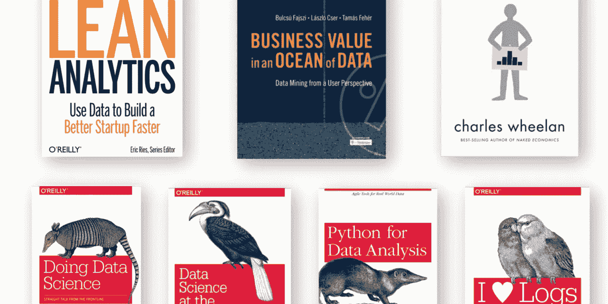
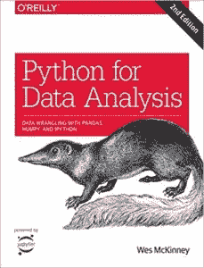
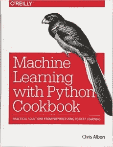
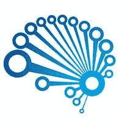

# 学习数据科学:从免费到免费学习数据科学我们最喜欢的资源

> 原文：<https://medium.com/hackernoon/learning-data-science-our-favorite-resources-to-learn-data-science-from-free-to-not-47beb6424de1>

[作者本·罗戈扬](https://www.linkedin.com/in/benjaminrogojan/)原帖[此处](https://www.coriers.com/learning-data-science-our-favorite-resources-from-free-to-not/)

今天，我们想介绍一些我们最喜欢的数据科学资源。顾名思义，这些资源将从免费到不免费。有些人喜欢买书，有些人喜欢在线课程。所以我们创建了这个数据资源列表，从书籍到课程，从免费到不免费。

数据科学有许多方面。统计、数据清理、编程、系统设计，实际上……几乎任何与数据相关的事情都取决于公司的规模。

这篇文章将讨论我们最喜欢的关于这些主题的资源。现在，这些课程和书籍中的大多数都是统计学、Python 和数据科学等主题的初级读物。他们真的只会提供基础知识。归根结底，真正的实践经验是真正训练您的数据科学知识的少数事情之一。你应该从这些资源中学到尽可能多的东西，然后申请尽可能多的实习和初级职位，并为面试而学习。

你会学到更多，收获的不仅仅是技术知识。你也会获得很多商业经验。

就这样，让我们开始吧！

# 免费统计课程

让我们从学习/复习基本的统计学概念开始。你们中的许多人可能在大学里上过一两门统计学课程。但是你可能记不清所有的事情，所以从头开始复习是个好主意。

尝试开始接受复杂的统计概念和模型是很诱人的。但是大多数算法和模型都需要某种准确性和假设检验。这意味着你实际上需要能够理解像 p-检验与 at-值、z-统计与 t-统计、ROC 与 AUC 这样的概念。、随机变量等。

这些似乎都是基本的概念，也许你还记得这些单词。然而，我们发现它们经常被遗忘，因为我们中的许多人更专注于学习如何用 python 和 R vs 基本统计学实现模型。虽然这两个概念不一定相互依赖。当您在任一种语言中运行模型时，如果没有完全理解 p 值的重要性，您可以开始假设您理解 p 值的含义。

# 统计课程

**1。可汗学院**

这就是为什么我们建议至少回去看看可汗学院的统计部分。它们涵盖了诸如[假设检验](https://www.khanacademy.org/math/statistics-probability/significance-tests-one-sample/more-significance-testing-videos/v/hypothesis-testing-and-p-values)、 [T 统计与 Z 统计](https://www.khanacademy.org/math/statistics-probability/significance-tests-one-sample/more-significance-testing-videos/v/z-statistics-vs-t-statistics)、[置信区间](https://www.khanacademy.org/math/statistics-probability/confidence-intervals-one-sample/estimating-population-proportion/v/confidence-interval-example?modal=1)等概念。

Khan 总是一个很好的起点，因为视频是视频和音频示例的完美结合。

个人觉得，说到纯统计学，我们喜欢的书并不多。在这个资源列表的 R 编程部分，我们会参考自己最喜欢的 R +统计书籍。

**2。杜克大学 Coursera**

对于免费的完整课程，你可以尝试杜克大学的统计学课程。这实际上是几门课程，涵盖了多种类型的统计学，如经典统计学与贝叶斯统计学。这是两种值得研究的不同方法。

*抬头！—此帖子包含亚马逊服务有限责任公司联营计划的推荐链接，这是一个附属广告计划，旨在为我们提供一种通过链接到 Amazon.com 和附属网站来赚取费用的方法。*

# Python 视频、书籍和课程

Python 是一个有趣的话题。关于 python 的事情是，编程语言有如此多看似合理的子部分。例如，当我们准备面试时，我们总是想弄清楚我们将处理哪种类型的 python 问题。我们会被问到一些问题吗？这些问题集中在操作性、分析性、基于优化的概念、算法和数据结构，或者可能是数据科学算法。所有这些都是不同的话题，有不同风格的面试问题。得到一个如何遍历二叉树的问题与实现一个决策树算法是非常不同的。

作为一名数据科学家，您通常会从 python 的分析和操作方面受益。操作部分会给你提供 [**自动化枯燥的东西**](https://www.amazon.com/gp/product/1593275994/ref=as_li_tl?ie=UTF8&tag=buy05cb-20&camp=1789&creative=9325&linkCode=as2&creativeASIN=1593275994&linkId=ea8088753583055a3f273a268a496f73) **( < -3)的能力。正如陈腔滥调的书名**。

这本书非常适合任何关注数据的人。数据科学家、业务分析师、商业智能工程师和数据库开发人员都可以从自动化中受益。现在，你不需要使用 python，如果你在一个 windows 环境中，有 PowerShell Linux 必须 bash。学习某种形式的脚本语言有助于改善你的工作流程和设计思维。

一旦你熟悉了 python，学习熊猫就变得容易多了。Pandas 是一种数据操作语言，允许您对数据集进行转换和基本分析。我们的一条建议是，作为一个用户，你需要考虑 Pandas 与 SQL 相比在哪里提供价值。在 SQL 上使用 Pandas 并不总是有益的。这可能有很多原因。如果你在电脑上运行的 Jupyter 笔记本上运行 Pandas，那么无论你在做什么数据处理，都是在你电脑有限的 ram 上进行的。

大多数大公司或者至少是科技公司会使用某种形式的云计算来运行你的 Jupyter 笔记本。尽管如此，python 并不总是快速数据转换的最佳选择。我们看到有人用 python 开发了一个 date_diff 函数，它花了 5 分钟来运行 100 万行，而如果他们用 SQL 运行它，可能只需要 1 秒钟。这是一个重要的注意事项，因为想象一下，如果不是一百万行，而是十亿行。这意味着运行时间增加了 1000 倍(好吧，说到计算就没那么简单了，但关键是……要长得多)。

熊猫仍然有它的位置，对于准备和分析你的数据非常有用。这里有一些熊猫的好资源:

# 免费熊猫 Python 视频

**4。熊猫的真实解释**

Sentdex 是一个很棒的 youtube，他让 python 变得非常简单。除了熊猫之外，他还为多个主题创建了 python 教程。但是我们真的很欣赏他脚踏实地的风格。他假设你从零开始，然后从那里开始。

在我们看来，这使得他的视频可能是 Youtube 上最有效的视频教程之一。另外，他的风格很容易模仿。

**5。专业人士—使用 Panda 进行 Python 数据分析**

我们想分享一个由弗兰克·凯恩创作的免费 Udemy 视频。你会看到我们多次提到这位讲师。他是最专业的课程创作者之一。这个视频是免费的。然而，弗兰克·凯恩确实制作了许多我们付费并喜欢的高质量课程。他有 python 和许多其他现代技术概念的从初学者到免费的课程。他还写了一本关于 Python 和机器学习的书

[**6。熊猫**1 小时简介](https://youtu.be/ikOEn8jY2Is)

最后，我们喜欢的长篇视频并不多。很多时候，你很难一次花一个小时看完这些视频。有一个是我们喜欢并想分享的。如果你刚刚开始学习，并且想要一个关于熊猫的速成班，看看下面的视频。我们对下面的视频的一个意见是，你一定要改变视频质量。对我们来说，一开始很糟糕，直到你把它调到 720 便士。

## Python 书籍

网上没有很多我们喜欢的关于熊猫的免费书籍。因此，在这种情况下，我们将推荐一些你可以在亚马逊或 [O'Reily 上挑选的 10 天免费试用的书籍。这实际上至少是找到你可能喜欢买的书的好方法！](https://learning.oreilly.com/register/)

在这里，经典是不会错的

**7。** [**Python 进行数据分析**](https://www.amazon.com/gp/product/1491957662/ref=as_li_tl?ie=UTF8&tag=buy05cb-20&camp=1789&creative=9325&linkCode=as2&creativeASIN=1491957662&linkId=42a9a64770e07dcad65b36017f058970) **。**

图片来自亚马逊

它将涵盖所有基础知识，如数据聚合和时间序列，同时通过基本的 python 练习，帮助您学习如何将 Pandas 应用于实际问题。这是我们在书本或课程中寻找的特质之一。我们倾向于需要实际的问题来应用我们的技能。这使得设计和解决问题变得更加容易。

正如书中所说，这本书将带你了解“在 Python 中操作、处理、清理和处理数据的具体细节”。作为一名数据科学家，这些技能至关重要，因为你的大部分时间将集中在清理和处理数据上。

这可能是我们推荐的少数几本关于熊猫的书之一。我们很快还会将许多其他数据科学和机器学习书籍添加到这个列表中。但是我们不会推荐太多纯粹关于熊猫的书。

# 机器学习和数据科学 Python

熊猫做很多基本的分析功能。它汇总并运行基本的描述性统计过程。以便更容易地应用更高级的模型。你需要学习 Scikit learn。现在，我们保守地说。仅仅学习库是如何工作的并不能让你成为一名机器学习工程师。它是需要了解的重要库之一，因为它包含了科学家将在 python 中使用的大部分模型数据。

再说一次，Sentdex 有一套很棒的教程，非常实用。

**8。Sentdex 的机器学习**

Sentdex 已经存在一段时间了，所以对于更新的内容，可以查看 Simplilearn。它有一些更新的视频，他们做得很好，更加深入。我们真的希望他们能得到更好的音频质量，但除此之外，这是一个学习 Scikit learn 的很好的视频集。

**9。Simplilearn —使用 Python 进行机器学习**

# Python 机器学习书籍推荐

对于书籍，我们推荐 **10。** [**用 Python 学习机器菜谱:从预处理到深度学习的实用解决方案**](https://www.amazon.com/gp/product/1491989386/ref=as_li_tl?ie=UTF8&tag=buy05cb-20&camp=1789&creative=9325&linkCode=as2&creativeASIN=1491989386&linkId=24f11e81078746254c7eae13bdbc405d) **。**

图片来自亚马逊

这本书将从线性回归和 KNN 这样的主题开始，然后深入到更深入的学习概念，如神经网络。此外，像许多其他 O'Reilly 的书，它有很多很好的解释很好的实际例子。

# Python 的机器学习课程

如果你正在寻找一门课程，有几个选择。

再次， **11。关于这个话题，弗兰克·凯恩还有另外一门很棒的课程** ，他将会比上面提到的书涉及更多。他还将讨论集成学习和偏见权衡。另外，如果你是一个视觉学习者，这可能会让你受益更多。还有一整节是关于 Apache Spark 的机器学习，它让您可以将这些技术扩展到在计算集群上分析的“大数据”。

另一门很棒的课程是 **12。** [**机器学习 A-Z:动手 Python & R 在数据科学**](https://click.linksynergy.com/deeplink?id=GjbDpcHcs4w&mid=39197&murl=https%3A%2F%2Fwww.udemy.com%2Fmachinelearning%2F) 。本课程内容全面，讨论了 Python 和 r。本课程不仅关注 Scikit learn，还关注一般的机器学习。此外，这门课程的创建者是 SuperDataScience.com 的所有者，这是一个很棒的网站，有播客、课程等等。所以如果你不想为课程付费，你可以随时免费收听播客！

当然，Python 不是数据科学的唯一语言。另一种流行的语言是 R(同样，这不是仅有的两种语言，还有其他人们喜欢使用的语言…除了 Matlab..我们不谈 Matlab)。

# R 视频和书籍中的编程

现在总在讨论学 R 还是 python 哪个语言。可能有数百篇博客文章支持这种或那种观点。这场争论可能会持续几年，直到下一个数据科学的热门语言出现。事实是，作为数据科学家，这将完全取决于你加入的公司/团队。有些人可能会使用 R，有些人会使用 Python，有些人可能会使用其他语言。这完全取决于应用程序、知识库和团队在更大组织中的功能。

数据科学家要么爱 r，要么恨 r。在生产中实现起来可能要困难得多，而且对于大多数数据科学家来说，它通常更多地扮演研究角色。这并不是说它更差或更不实用。Python 对大多数人来说更容易，因为他们可能已经在其他自动化过程中使用它了。因此，与学习新语法相比，工程师可能要做的就是学习更多的数据科学和一些库。

但是，那些在 R 开始的人喜欢它。r 实际上很容易上手，在 Jupyter 笔记本出现之前就已经感觉更像 Jupyter 笔记本了。

它可以逐行运行，并允许您立即看到您的输出。此外，很容易知道为每个函数设置什么参数，如果您足够聪明，并且已经使用 SQL 正确设置了数据，那么只需要几行代码就可以运行您的模型。

对于 R 书，你可以阅读经典的、老套的书籍。 [**统计学习入门:带应用 R**](https://www-bcf.usc.edu/~gareth/ISL/ISLR%20Seventh%20Printing.pdf) 免费在线！如果你问任何一个数据科学家他们最喜欢的书是什么，这几乎可以保证是其中之一(即使他们没有读过)。现在如果你真的想买这本书，那就去吧:)。

又一经典 **14。** [**R Cookbook:数据分析、统计、图形**](https://www.amazon.com/gp/product/0596809158/ref=as_li_tl?ie=UTF8&tag=buy05cb-20&camp=1789&creative=9325&linkCode=as2&creativeASIN=0596809158&linkId=663777a061aa4710abace24f6d0948cf) 的经验证食谱。这是一本很棒的入门书，因为它实际上只深入介绍了线性回归、图形和时间序列分析。还讨论了其他几个主题，但它们不像上面提到的主题那样侧重于统计或深入。这本书的价值仍然很大！事实上，我们建议你先复习你的统计学，然后读这本书，再读 R 中的统计学学习介绍(现在我们需要为我们的下一篇文章创建一个学习指南)。

# R 编程的免费视频

我们最喜欢的 R 初学者视频之一是由全球健康与格雷格·马丁制作的。格雷格制作的视频非常有信息性和娱乐性..令人失望的是，这真的是这个频道唯一一个关注 R 的节目…但对于任何想从 R 开始的人来说，这是一本很好的入门书。

**15。面向初学者的 r 编程**

现在，如果你正在寻找一个更完整的教程，那么你可以看看大卫兰格的数据分析教程。它没有娱乐性强，但同样能增长见识。总共有 7 个视频，所以你会对 R 有一个很好的理解，以及如何用它来分析数据。
R 和数据分析简介

16。数据科学导论第 1 部分

# r 编程课程

从 R 有组织的课程的角度来看，最棒的是有大量的课程。其实， **17。** [**约翰·霍普斯金在 Coursera 上免费提供数据专业化证书。如果你想学习 R 和良好的数据分析实践，我们会推荐你。这是学习 r 的另一个很好的入门书。**](https://www.coursera.org/specializations/jhu-data-science)

现在，如果你更喜欢付费课程，那么 SuperDataScience 提供了另一个很好的课程。您将涵盖所有重要的主题，如数据框架和 ggplot2(这可以说是 R 中最常用的库之一)。您总是需要一种显示数据的方式。

18。 [**R 由超级数据科学从 A 到 Z 编程**](https://click.linksynergy.com/deeplink?id=GjbDpcHcs4w&mid=39197&murl=https%3A%2F%2Fwww.udemy.com%2Fr-programming%2F)

除了 R 和 Python，还有一种你想学的“语言”。我们使用引号是因为 SQL 并不真正提供 Python 或 r 的相同功能。它实际上只是一个用于与数据库引擎接口的层。尽管如此，SQL 确实代表结构化查询语言。

# SQL 书籍、视频和课程

SQL 可能不会在一些训练营中被大量讨论，但它仍然是数据科学家必须掌握的技能。与 Pandas 相比，在 SQL 中准备大部分数据集通常要容易得多。这还可以帮助数据科学家与数据工程师沟通，帮助他们开发更有效地运行模型所需的分析表和数据管道。

即使在 HDFS 和其他分布式数据系统的世界中，SQL 仍然是一项非常有价值的技能。这些现代数据系统，如 Hadoop，在顶层有 Presto 和 Hive，允许你使用 SQL 与 Hadoop 交互，而不是 Java 或 Scala。SQL 是数据的语言，它允许数据科学家和数据工程师轻松地在系统之间操作、转换和传输数据。与编程不同，它在所有数据库之间几乎是相同的。有几个已经决定做出非常剧烈的改变。总的来说，SQL 是值得学习的，即使是在今天的环境下。

SQL 有大量的在线课程、书籍和秘籍可供你阅读。老实说，作为一名数据科学家，你不需要学习太多基础知识。

我们最喜欢的是智慧猫头鹰。我们在《成为数据工程师所需的技能》一文中提到了这一点。但是我们认为我们应该再推荐他们一次！

19。免费的 SQL 查询基础知识

如果您有兴趣学习一些基于传统关系数据库的更复杂的查询，这里是 wise owl 的另一个很棒的系列。

**20。SQL 程序和编程**

**SQL 非免费课程**

好了，现在对于那些对课程感兴趣的人。

这里的难点是描述不同的 SQL 层。还有 MySQL，Oracle，SQL Server Postgres，Redshift(算是)，Presto(又是…算是)。实际上，Presto 的酷之处在于它可以位于 MySQL 和其他数据库引擎之上。目前，我们喜欢的课程是。

[**21。用于数据分析和商业智能的 MySQL**](https://click.linksynergy.com/deeplink?id=GjbDpcHcs4w&mid=39197&murl=https%3A%2F%2Fwww.udemy.com%2Fsql-mysql-for-data-analytics-and-business-intelligence%2F)

是的，标题没有提到数据科学，但这是可以的。这里的目的是学习如何使用 SQL 来回答业务问题。老实说，SQL 通常不是数据科学的“数据科学”部分发生的层。

通常，SQL 更多地用于数据清理、连接表和基本聚合。所以这门课非常适合学习。这个课程比较适合初学者。前几节主要集中在配置上，不要过于关注复杂的 SQL。然而，随着学习的深入，您将会学到一些重要的主题，比如自连接和子查询。

奖励——它也有一些 Tableau 快速项目！

**SQL 书籍**

就 SQL 书籍而言。我们认为提供的实例越多越好。尤其是如果他们不仅仅试图计算顾客的平均购买量。因此，在这种情况下，我们建议

[**22。实用 SQL:用数据讲故事的初学者指南**](https://www.amazon.com/gp/product/1593278276/ref=as_li_tl?ie=UTF8&tag=buy05cb-20&camp=1789&creative=9325&linkCode=as2&creativeASIN=1593278276&linkId=3802bdaf99fcc1a779e77b908bab31da)

关于这本书的一点是，它是为 Postgresql 的。如果你喜欢更传统的数据库，你可以看看 **23。** [**学习 SQL:掌握 SQL 基础知识**](https://www.amazon.com/gp/product/0596520832/ref=as_li_tl?ie=UTF8&tag=buy05cb-20&camp=1789&creative=9325&linkCode=as2&creativeASIN=0596520832&linkId=9b8c14d046ba76d2e0011f9c83025c8f) 。我们喜欢《实用 SQL》这本书的原因是，它很好地完成了基础知识的讲解，然后帮助您将这些基础知识应用于一些更复杂的问题。此外，学习一些 Postgres 并观看一些 SQL Server 或 MySQL 上的视频确实会给你一个很好的基础。你将能够开始区分各种系统的利弊。作为一名数据科学家，这一点价值不大，但如果你成为一名工程经理，需要决定你的整个公司/团队将基于什么样的数据库系统，这一点将非常重要。

# 职业建议和案例研究

除了 Python、统计学和 r 等所有基础知识之外，观看高级项目和一般职业建议的例子也很棒。

例如，我们在 Youtube 上最喜欢的高水平商业案例视频之一是关于网飞预测内容需求的。他们在讨论问题、谈论他们需要解决的问题、他们如何处理数据等方面做得很好。这对年轻的数据科学家来说非常好，因为它可以帮助你看到整个过程。当年轻的工程师/数据科学家开始工作时，投入到一个项目中会很有诱惑力。然而，像这样的视频演示了数据科学家在解决问题之前是如何思考问题的。

**24。30 分钟内的数据科学:预测网飞的内容需求**

下一个视频非常适合设定期望值。它们涵盖了如何成为一名优秀的数据科学家，数据科学家面临的一些问题，工资等。现在，你会听到很多来自任何数据科学家的陈词滥调。垃圾进垃圾出，每个公司对数据科学家的看法都不一样，数据科学、机器学习和大数据有时可以融合在一起。如果你为一家初创公司工作，你会做所有这些事情。如果你是这个领域的新手，这些答案可能看起来不像陈词滥调，但如果你已经作为数据科学家工作了几年，你就会习惯这些答案。

[**25。数据科学家:现实 vs 期望 2**](https://youtu.be/0X2H-ZD_Chw)

你需要帮助来提升你的职业而不仅仅是技能吗？Kirell 有很多很棒的视频。特别是，下面的视频讨论了如何提高你作为数据科学家的职业生涯，这不仅仅是通过学习更多的算法。他经历并采访了许多不同的数据科学家，从他们那里获得了职业建议，并根据他们的最佳建议制作了这个视频

[**26。如何改善您的数据科学职业生涯— KIRILL EREMENKO**](https://youtu.be/s7Eo-QeZEqM)

正如我们开始时所说。使用这些免费和非免费的资源只是成为数据科学家的一小部分。最好的学习方法是找一份数据科学家的工作。如果你还有时间，那就去实习吧。这是下面视频的第一个提示，也是我们的提示。我们中的一些人很难找到第一份工作，因为我们没有实习机会，不得不忍气吞声，找到一份较低级别的工作，直到我们有足够的经验从事更侧重于技术的工作。所以我们可以肯定地认可第一条建议！

[**27。获得数据科学工作的 5 个技巧**](https://www.youtube.com/watch?v=MfP-P8EHGBo)

我们打算涵盖一些有趣的，技术性较低的书籍，但我们认为这个列表暂时足够长了！

对于那些希望专攻数据科学甚至另一个数据库主题的人来说，我们希望您喜欢这个免费到免费的资源列表。有很多内容要讲，我们希望你不要不知所措。一次选择一到两本课程或书籍。阅读它，学习它，理解它，然后再跳下一个。这将有助于您的数据科学之旅。买下每一本书，开始每一门课程可能很有诱惑力，但之后你很可能永远也读不完任何一本书(除非你有惊人的纪律性)。

所以慢慢来，享受这个过程。我们可能要再列一个清单，进一步列出其他有价值的话题。此外，如果您想在我们创建新内容时第一个知道它，请确保注册我们的电子邮件列表或通过我们的联系页面联系我们！

如果您想阅读更多关于数据科学的文章，请查看下面的链接！

[如何开发鲁棒算法](/@SeattleDataGuy/how-to-develop-a-robust-algorithm-c38e08f32201)

【2018 年 10 篇最佳数据科学文章

[将 CSV 数据动态批量插入 SQL 服务器](https://www.youtube.com/watch?v=2bBsYmQjzSE&t=4s)

[SQL 最佳实践—设计 ETL —第 1 部分](https://www.youtube.com/watch?v=sLhInuwdwcc&t=169s)

[算法如何变得不道德和有偏见](http://www.acheronanalytics.com/acheron-blog/how-do-machines-learn-bias-data-science)

[4 数据科学家必备技能](https://www.theseattledataguy.com/4-skills-data-scientist-must-have/)

[什么是决策树](http://www.acheronanalytics.com/acheron-blog/brilliant-explanation-of-a-decision-tree-algorithms)

此帖子包含来自亚马逊服务有限责任公司联营计划的推荐链接，这是一个附属广告计划，旨在为我们提供一种通过链接到 Amazon.com 和附属网站赚取费用的方式。