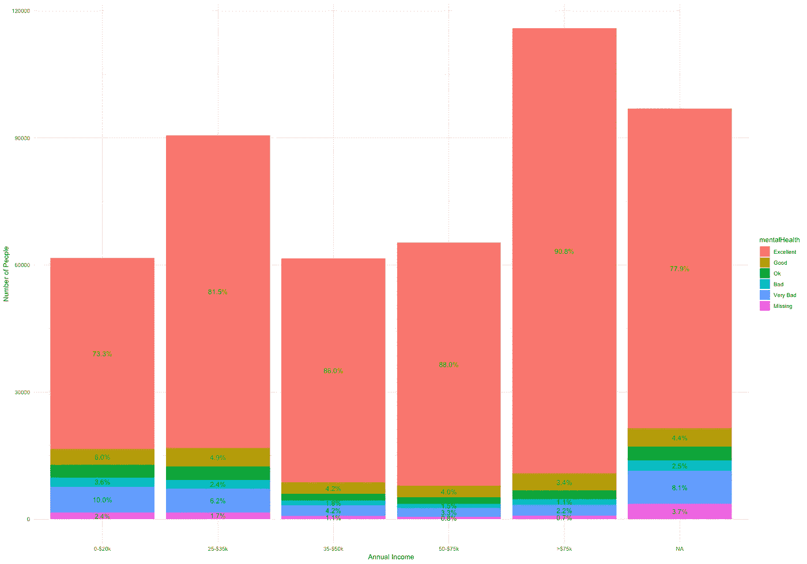
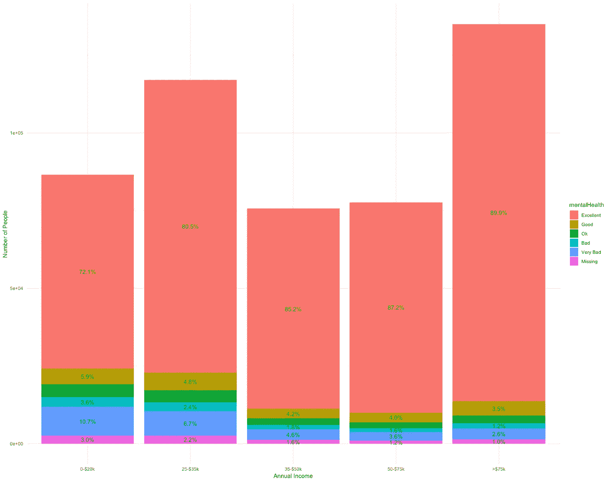
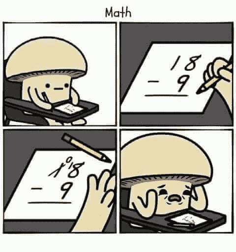
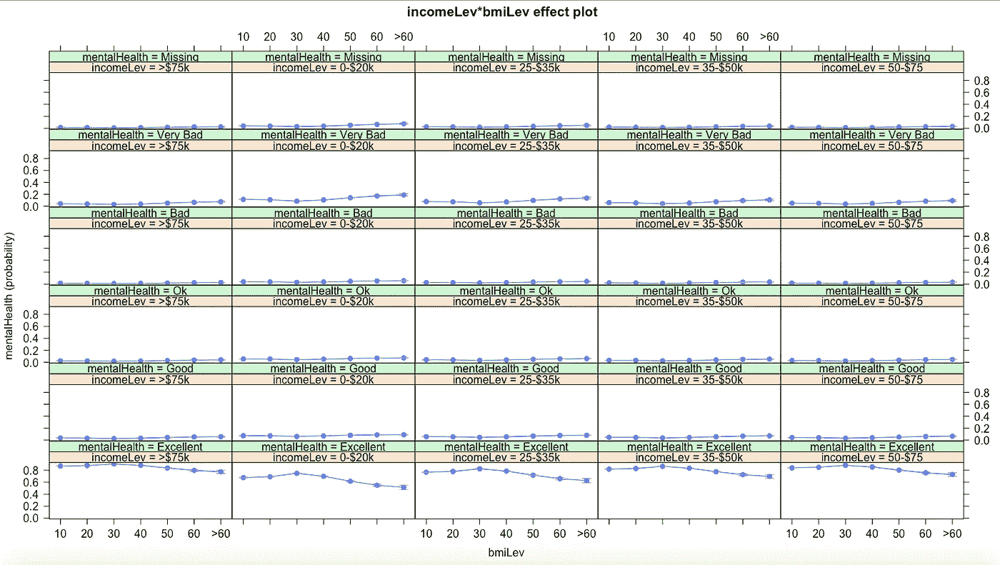

# 学习理解收入和体力活动等变量对心理健康的可能影响

> 原文：<https://medium.com/hackernoon/learning-to-understand-possible-effects-variables-such-as-income-and-physical-activity-have-on-a687cf3c23bc>


Mental Health, Source: Pixabay

心理健康正日益成为一个传统上被掩盖的热门话题。我们已经开始理解心理健康对生产力、总体健康、人际关系和身体健康的影响，并更加关注心理健康。甚至雇主也开始更加重视提供让员工尽可能快乐和健康的工作环境和条件，进步的公司提供额外津贴，如每月按摩、餐饮、免费和有补贴的健身房以及无限假期。有鉴于此，作为一个对发展我的编程和数据科学技能感兴趣的个人，我也受到了我正在学习的 Coursera 统计专业的数据可视化和分析项目的部分激励。我决定从疾病控制和预防中心( [CDC](https://www.cdc.gov/brfss/index.html) )提取 2013 年[行为风险因素监测系统数据](https://d3c33hcgiwev3.cloudfront.net/_384b2d9eda4b29131fb681b243a7767d_brfss2013.RData?Expires=1551052800&Signature=ArVJderWSw2ujJioELfZIhSuZ9SdRthuHY1--C8ZEL25OeXP-JfnJeuB4GtOg2j5S26zMHMKRJ~mezpXk7wFKUntHIW~FFUj9jnazM7L95M4xU7hmeB4CCyhSIV2BH6NM2RD4wnxRVBg1j~ban4O0gv~Znyx6s2oNUYcyZP4jn0_&Key-Pair-Id=APKAJLTNE6QMUY6HBC5A) (BRFSS)来摆弄数据。这些数据是通过每月电话采访收集的，是最大的数据集之一，专注于了解预防性健康实践和风险行为的趋势，这些行为与影响美国成年人的慢性病伤害和可预防的传染病有关。我分析的目标是了解收入水平和一个人报告的心理健康之间的关系，以及你每年挣多少钱、你的身体活动量以及你吃的水果和蔬菜量对你心理健康的影响。

**提取数据和理解结构**

```
install.packages("ggplot2")
install.packages("mice")
install.packages("effects")
library(ggplot2)
library(MASS)
library(mice)
library(data.table)
library(dplyr)
library(effects)
load("~/Documents/R Stats Assignments/brfss2013.RData")
```

在上传必需品库和加载我的数据之后，我想看看数据集的总体形状和结构，以了解维度的数量、每列中的数据类型以及我需要运行的清理，以便以一致的格式获得我的数据，从而促进我的分析。

```
> dim(brfss2013)
[1] 491775    330#check structure of columns
str(brfss2013$columname)
#check for NA values
sum(is.na(brfss2013$columname))
```

在查看了提供的[码本/索引](https://d3c33hcgiwev3.cloudfront.net/_e34476fda339107329fc316d1f98e042_brfss_codebook.html?Expires=1551052800&Signature=WcKqb7jEp1f~jJkvuSZCkwJOFqTXts6NqKr~6jAs7awDc8WPcP9azjsrnIMUrNelJgdxcK6wMyhgGA8BPuEm0gNMrUPw6nckR-uYnLtPPu6OH7YamsKyCHZpIlJ55vhSVXc479UPXP0D8v1pfCckO5dmgq5C~XZ-4iewAd2FdbU_&Key-Pair-Id=APKAJLTNE6QMUY6HBC5A)之后，我对我需要与之交互的列有了一个很好的想法，并决定专门关注这些列。这包括与每周体育活动分钟数、每周吃的水果、每周吃的蔬菜、身体质量指数、年收入范围，当然还有心理健康相关的数据，这些数据是通过一个人在特定时期内心理健康状况不佳的天数来衡量的。由于 NA 值会模糊分析的准确性，并可能引入无响应偏差，因此我在列中寻找 NA 值，这些值占数据的 4.8%至 34%。我假设这些是不可忽略的缺失值，不能简单地从我的分析中删除。对于 34%的数据缺失情况下的数值，我假设简单地用标准平均值或中位数填充会扭曲我的分析并降低其准确性。相反，我选择了一种易于实施且相对准确的估算方法来代替我的 NA 值。

**贝叶斯线性回归多重插补**

准确估算值的最快方法之一是通过线性回归算法，该算法尝试根据预定义的预测值列表来预测潜在值。使用 frequentist 方法(普通线性回归),我们假设独立变量之间存在线性关系，此外还假设有足够的值来进行准确预测。但是，对于这种插补，我选择了贝叶斯模型，通过这种方法，我们假设响应和预测值都是随机的(在我们的插补中考虑了不确定性)，尝试寻找特定事件的概率，根据先前的数据更新概率，并根据这些概率进行预测。整合先验信息以更新概率的能力使得贝叶斯模型在进行预测时更加灵活并且可能更加准确，尤其是对于较小的样本。

多重插补让我运行插补模型 n 次，根据使用的预测模型提供不同的可能插补。通常，这是一个三阶段的过程，包括实际估算、用可能的预测替代每个 NA，然后分析和汇集所有结果。

```
brfss2 <- brfss2013[,c('X_bmi5','X_drnkmo4','X_frutsum','X_vegesum','fc60_','pa1min_')]
imp_model <- mice(brfss2,method="norm",m=5)
#fill na function
fillna_fun <- function(data,columns){
  df <- setNames(data.frame(rowMeans(squeeze(imp_model$imp[[columns]], bounds = c(0,max(brfss2013[[columns]]))))),"col2")
  brf <- setNames(data.frame(data[[columns]]),"col2")
  brf$col1 <- rownames(brf)
  df$col1 <- rownames(df)
  setDT(brf)[df,col2 :=i.col2,on=.(col1)]
  brf$col2
}
brfss2013$pa1min_ <- fillna_fun(brfss2,"pa1min_")
brfss2013$X_bmi5 <- fillna_fun(brfss2,"X_bmi5")
brfss2013$X_drnkmo4 <- fillna_fun(brfss2,"X_drnkmo4")
brfss2013$X_frutsum <- fillna_fun(brfss2,"X_frutsum")
brfss2013$X_vegesum <- fillna_fun(brfss2,"X_vegesum")
```

链式方程(mice)多变量插补包允许使用贝叶斯线性回归进行简单插补。我选择缩小插补范围，使其适用于我的分析所需的带数值的列，并将插补运行默认次数-5 次。

我注意到贝叶斯线性回归对于一些插补返回了负数，这是不可能的，因为这些列是测量的数据。例如，一个人不可能每周花 300 分钟去健身。为了解决这个问题，我使用了[挤压函数](https://www.rdocumentation.org/packages/mice/versions/3.3.0/topics/squeeze)来添加一个约束，将预测限制在一个合理的自定义范围内。

与 [mice 文档](https://www.jstatsoft.org/article/view/v045i03)相反，我选择获得所有 5 次插补的平均值，并用它来填充我的 NA 值。我完全理解机器学习不应该这样使用，我错过了合并我的组合估算的重要步骤，一些人会认为我选择一个估算比平均要好。尽管如此，我还是采用了这个选项，以方便应用，并希望收到读者对这个选项的进一步反馈。

我使用 [setDT 函数](https://www.rdocumentation.org/packages/data.table/versions/1.12.0/topics/setDT)将函数中的向量强制转换到一个表格中，并通过索引连接向量，从而完成了函数，因为平均插补向量只有与原始数据帧中 NA 值相对应的索引值。

**映射**

我的分析中的一个重要步骤是将一些列的数值映射到组和范围中。例如，我不想看到身体质量指数的数字，而是想看到一个特定的身体质量指数属于哪个组/范围(例如 25 =正常)。

```
brfss2013$income2 <- as.character(brfss2013$income2)
brfss2013$X_bmi5 <- brfss2013$X_bmi5/100
brfss2013$healtheat <- (brfss2013$X_frutsum+brfss2013$X_vegesum)/100
labels <- c('Excellent','Good','Ok','Bad','Very Bad')
breaks <- c(0,5,10,15,25,10000)
bmiLabs <- c('10','20','30','40','50','60','>60')
bmiBreaks <-c(0,10,20,30,40,50,60,10000)
activLabs <-c('0-200','200-500','500-1000','1000-2000','2000-4000','4000-10000','>10000')
activBreaks <-c(0,200,500,1000,2000,4000,10000,100000)
brfss2013 <- brfss2013 %>%
  mutate(mentalHealth = cut(menthlth,breaks=breaks,labels=labels,include.lowest=TRUE)) %>%
  mutate(bmiLev = cut(X_bmi5, breaks=bmiBreaks,labels=bmiLabs,include.lowest = TRUE)) %>%
  mutate(physLev = cut(pa1min_, breaks=activBreaks,labels=activLabs,include.lowest = TRUE)) %>%
  mutate(incomeLev = case_when(grepl("15|20",income2)~"0-$20k",
                               grepl("25|35",income2)~"25-$35k",
                               grepl("50",income2)~"35-$50k",
                               income2 %in% "Less than $75,000" ~ "50-$75k",
                               grepl("more",income2)~">$75k"
  ))
```

由于 cut 被设计成获取一个数字向量，并根据一组自定义断点将其分割成多个区间，我决定使用 [cut 函数](https://www.rdocumentation.org/packages/base/versions/3.5.2/topics/cut)，根据我的标签定义定义断点和标签来映射数据。对于收入水平列，我将值转换为字符，以便能够使用 [grepl](https://campus.datacamp.com/courses/intermediate-r/chapter-5-utilities?ex=8) 。这是一个模式匹配函数，我用它来创建收入范围，方法是查找与我用来标识每行收入范围的自定义词相匹配的关键字。

值得注意的是，我做了一些关于精神健康的假设。我假设一个人在给定的时间内只报告有 0-5 次精神健康问题，他将被划分为精神健康状况良好、5-10 次健康状况良好、10-15 次正常、15-25 次不良以及任何超过这一水平的非常不良。这是基于观察数据和找到进行这种分类的理想断点。

**心理健康与年收入的关系**

我认为堆积条形图是可视化心理健康和年收入范围之间关系的最有效和最吸引人的方法。

```
#replace NA with missing
brfss2013$mentalHealth <- forcats::fct_explicit_na(brfss2013$mentalHealth, na_level = "Missing")
#convert income back to factor
brfss2013$incomeLev <- as.factor(brfss2013$incomeLev) 
brfss2013 <- subset(brfss2013, !is.na(incomeLev))
brfss2013 %>%
  add_count(incomeLev) %>%
  rename(count_inc = n) %>% 
  count(incomeLev, mentalHealth, count_inc) %>%
  rename(count_mentalHealth = n) %>% 
  mutate(percent= count_mentalHealth / count_inc) %>%
  mutate(incomeLev = factor(incomeLev,
                            levels=c('0-$20k','25-$35k','35-$50k','50-$75k','>$75k')))%>%
  ggplot(aes(x= incomeLev,
             y= count_mentalHealth,
             group= mentalHealth)) + 
  xlab('Annual Income')+ylab('Number of People')+
  geom_bar(aes(fill=mentalHealth), 
           stat="identity",na.rm=TRUE)+ 
  # Using the scales package does the percent formatting for me
  geom_text(aes(label = scales::percent(percent)),position = position_stack(vjust = 0.5))+
  theme_minimal()
```

使用 [dplyr 软件包](https://cran.r-project.org/web/packages/dplyr/dplyr.pdf)，我使用% > %运算符编写了多个运算，这些运算将按组记录收入水平和心理健康状况，找出按收入水平报告的心理健康数字的相对百分比，根据我的定制将条形图分组，并可视化堆积条形图，并在每个图上添加百分比标签。



Mental Health Distribution by Annual Income Range

使用我创建的关于什么构成良好心理健康的假设，数据似乎证实了人们的预期，你赚的钱越多，你就越有可能处于更好的心理状态。

**收入水平中的 NA 值有什么用？**

根据年收入范围可视化的心理健康分布，很明显，收入水平栏中有很多 NA 值。虽然我可以简单地放弃 NA 值，假设它们不会改变我分析的准确性，然后继续前进，但我相信很多人可能不愿意谈论他们的收入水平。这意味着很大一部分 NAs 来自那些不愿意通过电话分享年收入的人。可能的情况是，不愿意分享收入信息的人处于较低的收入范围(0-20k)或非常高的收入范围(超过 70k)，忽略这些占收入数据 15%以上的行，很容易引入无回答偏差。我想通过机器学习估算这些 NAs 的潜在价值。这一次，我选择通过[多元回归](https://rdrr.io/cran/mice/man/mice.impute.polr.html)模型来估算我的有序数据。该方法使用比例优势逻辑回归模型，其机制将在下一段中详细讨论。

```
#filling na values of income level column
brfss <- brfss2013[,c('incomeLev','healtheat','X_age_g','employ1','renthom1','sex','physLev')]
ordered_brfss <-mice(brfss, m=1, method='polr', maxit=1)
fillna_inc <- function(data,columns){
  df <- setNames(data.frame(ordered_brfss$imp[[columns]]),"col2")
  brf <- setNames(data.frame(data[[columns]]),"col2")
  brf$col1 <- rownames(brf)
  df$col1 <- rownames(df)
  setDT(brf)[df,col2 :=i.col2,on=.(col1)]
  brf$col2
}
brfss2013$incomeLev_ <- fillna_inc(brfss2013,"incomeLev")
```

出于估算的目的，我将重点放在我认为可以作为潜在收入最大预测指标的几列上。我特别关注了受访者报告的个人是否租房或拥有住房、她/他是否有工作、个人的性别、年龄、身体活动水平以及水果和蔬菜的数量。我选择运行一个单一的估算，纯粹是为了便于应用。

**根据收入水平可视化心理分布**


We all love data viz!

我想看看我的精神健康在收入水平上的分布在这个估算之后会是什么样子，然后建立另一个可视化。



Mental Health Distribution by Annual Income Range

**比例优势比**

将心理健康划分为好、好、优秀等组的行为将这一列转化为一个具有 5 个级别的因素。这些分解是根据级别排序的。鉴于本专栏的结构，我选择使用比例优势逻辑回归。出于我的分析目的，我需要选择一个模型，该模型将帮助我了解在给定我选择的独立变量的情况下，个人的心理健康属于某一类别的概率，并了解这些变量对概率有什么影响。虽然线性回归可能在一定程度上适用于二元分类问题(例如，如果响应变量是电子邮件是否是垃圾邮件)，但当您的响应变量有多个类别时，它就会崩溃。有序逻辑回归使用 logit 函数转换线性模型以满足有序响应类别，确保返回的概率在 0 到 1 的范围内。我本可以选择更灵活的[多项逻辑回归模型](https://en.wikipedia.org/wiki/Multinomial_logistic_regression)，但是这依赖于一个假设，即反应变量中的类别不能以任何有意义的方式排序——我认为这个假设不适用于我的精神健康反应变量。

我的模型依赖于计算比例优势比。简而言之，比例优势比是有序逻辑回归中使用的一种工具，通过预测响应变量属于特定类别的条件概率(给定被观察的独立变量的值),来帮助对独立变量和有序响应因子/类别之间的关系做出假设。


Probability Odds Ratio with multiple explanatory variables

在这种情况下，j 代表我们试图预测的类别/因素。上述公式包含 n 个因子，n 取决于因变量中因子的数量。这些数字指的是我用来建立模型的独立变量。



No Math

我用这个公式来理解与我们的结果(心理健康)关系最大的自变量——并试图理解自变量对心理健康的影响程度。

```
brfss2_model = polr(mentalHealth ~ incomeLev+bmiLev+X_drnkmo4+healtheat+physLev,data=brfss2013,Hess=TRUE) #Hessian used to get standard errors
```

我使用了 [polr()函数](https://www.rdocumentation.org/packages/MASS/versions/7.3-51.1/topics/polr)来拟合反应变量(精神健康)和预测变量的比例优势逻辑回归。在这种情况下，我决定包括身体质量指数，一个月消耗的水果和蔬菜总量，身体活动水平，年收入范围和一个月内饮用的酒精饮料。我在 Hessian 模型中加入了真实参数，从而包含了观察到的信息矩阵，以获得标准误差，并尝试评估该模型对数据的适用性。

```
(ctable<-coef(summary(brfss2_model)))
#calculating p_value by comparing the t-value against the stnd norm distr similar to a z-test
p<-pnorm(abs(ctable[, "t value"]),lower.tail = FALSE)*2
#combining p-value
(ctable<-cbind(ctable,"p value"=p))
```

我继续寻找回归系数并计算 p 值，以确定这些结果的显著性。回归系数的范围从每月酒精饮料的 0.001 到身体质量指数一组的 2.55 多一点，p 值具有统计学意义。从我的理解来看，回归系数越接近零，就越表明预测因子的分布对于我们反应变量的每一个水平都是完全相同的。对于接近零的系数，这大致意味着向自变量添加更多单位对响应变量的影响接近于零。

**显现独立变量的影响**

为了清楚地显示独立变量对心理健康的影响，我决定使用[效果包](https://cran.r-project.org/web/packages/effects/effects.pdf)。因为 polr 函数返回估计的回归系数，所以我使用了[这个包来帮助我解释我的 polr 结果](https://www.jstatsoft.org/article/view/v032i01)。

```
plot(Effect(focal.predictors = c("incomeLev","bmiLev"),brfss2_model))
```

在尝试了一些组合后，我选择展示年收入和身体质量指数效应图。我用这两个变量作为焦点预测因子，用典型值(固定值和平均值)作为其他预测因子。



Income Level * BMI effect on Mental Health

根据结果，我们看到，无论你的收入范围如何，精神健康状况良好的概率随着身体质量指数的增加而降低。有趣的是，当你接近年收入 75 000 美元时，这种下降趋势似乎逐渐减弱。我们可以在非常糟糕的心理健康状态下看到较小程度的类似影响，你越富有，身体质量指数的增加对你心理健康的影响就越小。如果你打算增加体重，如果你在增加收入的同时增加体重，你的精神状态可能会更好。

除了我所知甚少之外，我学到的最重要的一课是，数据分析和数据科学是一个迭代过程。你尝试不同的变量和模型，清理基于不断变化的假设的方法和可视化，并测试这对你的结果及其准确性有什么影响。

欢迎在 Twitter @Emmoemm 上联系或发送任何反馈