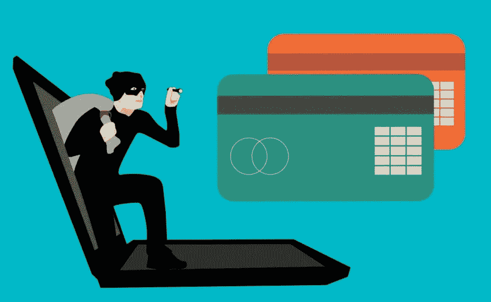

# 账本用户刚刚躲过一劫。或者他们有吗？

> 原文：<https://medium.com/hackernoon/ledger-users-just-dodged-a-bullet-or-did-they-e6b7f063e431>

4 月 25 日，Ledger 发布了一条推文，警告其用户一种危险的恶意软件，它通过“虚假更新”取代了 Ledger Live 应用程序，然后请求您的恢复短语。

这一事件凸显了 Trezor 和 KeepKey 等最受欢迎的硬件钱包面临的一个关键缺陷。这两种钱包都要求用户通过从可信来源(钱包发行者)下载软件来更新他们的钱包。这种机制为攻击者留下了空间，正如最近的实时恶意软件所强调的那样。虽然 Ledger 声称其团队能够足够迅速地检测到攻击，只有一台设备受到影响，但没有办法知道有多少人真正受到了影响。由于 Ledger(和大多数其他硬件钱包)的基础设施的工作方式，我们可以预计未来会发生许多类似的事件。

加密货币本质上是一种不信任的互动。比特币突然而有影响力的突出背后的燃料是，它的持有者和用户不需要依赖任何人来存储或控制他们的钱。硬件钱夹似乎通过允许钱夹的所有者是唯一能够控制保存在钱夹中的私钥的人来提供这一点。这不是特别安全，因为硬件钱包可以被破解，其中保存的私钥可以随后被没收，但它确实可以保护用户免受大多数在线攻击(但不是所有攻击都来自最近的恶意软件)。

这里有许多问题需要解决。然而，因为我知道现在大多数人缺乏阅读超过 100 个单词的注意力，我将在以后讨论这个问题，并讨论人们应该关注的替代方法。

首先也是最重要的，如果你想长期储存你的比特币，坚持使用纸质钱包，这样只有你才能掌控你的财富。纸质钱包不会因任何形式的网络攻击而受损，从而确保您的财富得到长期保护。尽管如此，从离线计算机接收你的纸钱包的密钥是至关重要的。纸质钱包是免费的，但当你花掉这些钱的时候，你应该遵循一个非常小心的程序，因为你的私人钥匙很可能暴露在网络环境或恶意软件中。

或者，如果你想经常使用比特币，并在一个地方保存多种货币(并不介意在免费的纸质钱包上花一点钱)，选择 Bitfi，因为它是唯一一个既不会存储你的私钥，也永远不会要求用户在任何电脑上下载或安装任何东西的硬件钱包。这使得我们刚刚看到的发生在莱杰和其他人身上的攻击实际上是不可能的。即使你的钱包被查封，Bitfi 也能保护你的资金安全，这也是因为它没有任何私钥。因此，它可以保护您免受在线攻击和物理攻击。基本上不可能偷或抢这个钱包，因为它不包含任何数据。Bitfi 的这一新创新是对冷藏方法的重大飞跃。

现在，让我们来解决 Ledger Live 的恶意软件事件所凸显的那些问题。

# **基于信任的更新**

硬件钱包需要更新，以便可以添加新功能，无论是否频繁，它们都迫使用户在他们的计算机和设备上下载和安装软件。让用户下载并安装更新的方面希望从正确的来源下载到没有恶意软件的计算机上，并且在很大程度上要求用户相信由制造商提供的软件(假设它是正确下载的或从正确的地方下载的)没有恶意软件和恶意代码。这消除了分散资金的不可信方面，并使用户面临许多风险。

需要用户手动下载安装软件的钱包给用户戴上了金手铐。软件被持续下载并安装到计算机和设备本身的架构注定会导致类似上述 Ledger 事件的发生，这只是再次发生的时间问题。

# **你财富的看门狗**

4 月 25 日的恶意软件攻击据说没有影响到很多人，因为莱杰的团队能够相当快地检测到它。虽然这对任何使用莱杰的人来说似乎是一个好消息，但重要的是要注意这一事件背后的寓意。

使用硬件钱包(如 Ledger 和 KeepKey)的人依赖于一个中央实体来确保他们的钱包和钱包内的财富的安全。虽然没有确定的方法来预测应用程序是否以及何时会受到危害，但我们所能做的就是遵循推荐的安全措施，并在发生这种情况时负责任地快速行动。

As great as watchdogs are, we don’t need them in our Bitcoin.

我们在 4 月 25 日看到的针对 Ledger 的恶意软件攻击并不是为了收集您的个人数据，而是设计来欺骗您输入由 24 个单词组成的恢复短语。由于该应用程序看起来完全真实，因此无法知道有多少人会成为受害者。尽管 Ledger 发布了一系列警告用户的推文，但并非所有用户都关注 Twitter，并可能在完全不知情的情况下使用该恶意软件。用户需要如此依赖他们钱包的制造商并不断监控更新也不是什么好事。

正如我们一次又一次看到的那样，大多数硬件钱包设计的架构容易出现许多问题，这些问题可能会导致彻底的损失。这些冷存储硬件钱包设备还没有发展到可以放心地存储大笔金额的地步。如果你正在使用这些设备，请非常小心。

总之，我们只看到两种可靠和安全的替代方案——纸质钱包(用于长期存储，但你需要小心创建和使用这些钱包)和 Bitfi(这使得使用你的货币变得容易，从不需要为任何计算机下载任何软件，并且没有私钥，使得在线和离线攻击几乎不可能)。像 Ledger、Trezor 和 KeepKey 这样的设备根本没有发展到足以保护用户，尤其是不了解技术的用户。