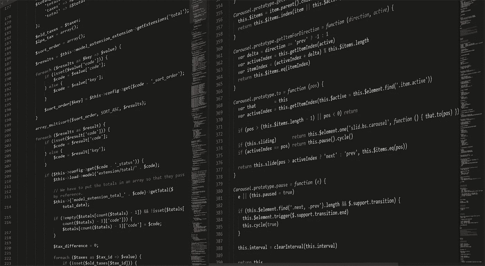

# 让他们吃 C# |为什么编码是蓝领工作的未来的 3 个理由

> 原文：<https://medium.com/hackernoon/let-them-eat-c-3-reasons-why-coding-is-the-future-of-blue-collar-work-4cd50b0b8762>

自从 Commodore 64 时代以来，计算机编程已经走过了漫长的道路。曾经专为穿着连帽衫的极客保留的东西已经成长为更成熟、对我们的社会更不可或缺的东西:稳定的就业。

例如，香农·兰斯(Shannon Lance)是四个孩子的单身母亲，离婚后，她不得不努力在经济上支持自己的孩子。她自己也承认，她没有电脑技能，甚至需要用手机来研究如何在 Mac 电脑上点击鼠标右键。但在学会编程后，她在当地一家软件公司拿到了六位数的薪水。

或者以[奥萨·麦格鲁德](https://technical.ly/dc/2017/11/06/ausar-mcruder-python/)为例，他放弃了演员/模特/特技演员的职业，去学习编码技能，成为了一名系统分析师和软件开发员。这些成功的故事不乏其人。

就像工厂工人推动了前三次工业革命一样，开发者将推动第四次工业革命。我们很快就会发现自己身处一个程序员比建筑工人更普遍的社会。这里有三个理由说明编码是蓝领工人的未来:

# **没有学位？没问题**

随着公众对高等教育的信心减弱，编码培训项目将填补这一真空。技术变革的快速步伐，加上四年制学位不断上涨的成本，使得传统教育变得不那么受欢迎，也不那么有效——尤其是对转行者而言。事实上，根据美国大学协会(Association of American Colleges&university)的 2018 [报告](https://www.aacu.org/sites/default/files/files/LEAP/2018EmployerResearchReport.pdf)，只有 33%的高管和 39%的招聘经理认为最近的毕业生已经做好了将知识和技能应用于现实世界的准备。

“你是不是被解雇的卡车司机？去花你生命中的四年和 50K+…然后你可以*也许*得到一份新工作！”这是一个艰难的决定。

工作的未来不会基于学位，而是基于技能。正如贸易项目填补了合格焊工、电工、木匠和技术人员的行列，开发人员不需要四年制学位就能产生影响。一些州已经建立了以开发者为中心的注册学徒项目来填补他们技术部门的空缺。

# **供给<需求**

根据 Code.org[的数据，2018 年有 63744 名计算机专业的学生毕业进入职场。但这些毕业生只能填补全美 505，000 多个开发人员空缺职位中的 12%左右。这一需求没有放缓的迹象，一些人预计到 2020 年开发人员空缺职位总数将超过 1，000，000 个。谈论工作选择。](https://code.org/promote)

所有这些机会都不是为硅谷独角兽准备的。这些都是稳定的工作，遍布全国，几乎在每一个行业:酒店，金融，零售，医疗保健，政府和国防…你得到了图片。

开放开发者职位的各种行业是关键，因为这将允许至少一些职业过渡者留在他们的行业内。这位被解雇的卡车司机可以在卡车运输行业找到一份开发工作，无论是车队算法的 QA，为自动驾驶卡车运输平台构建 UI，还是其他一系列技术应用程序。

# **与我们未来的机器人霸主并肩工作**

说到自动驾驶卡车运输平台，自动化正在到来，我们无法阻止它。公司要么接受自动化，要么被竞争对手远远甩在后面。虽然自动化将取代或完全取代大量工人，但它也将创造对高技能工作的更高需求，几乎所有这些工作都需要一定程度的编码知识。

许多工作已经实现了自动化，但机器永远无法取代某些工作。人类将继续成为技术背后的组织和驱动力。协调技术资源并引导这些资源解决业务问题需要人类的智慧。机器将只是执行指令，学习如何设计和传递这些指令将是非常有益的。

自动化取代工作的速度将快于创造新工作的速度，这种担忧是有道理的。但是，我认为我们不能开始想象自动化将创造的一些工作和行业。试图预测这一点类似于在 90 年代向某人解释 SEO、社交媒体管理或云计算。世界经济论坛[估计](http://reports.weforum.org/future-of-jobs-2016/chapter-1-the-future-of-jobs-and-skills/)2016 年进入小学的儿童中有 65%将最终从事尚不存在的工作。未来的工作机会深不可测，但同样，这些工作很可能需要编码技能。

—

虽然我们的社会和日常生活被技术彻底改变，但我们的劳动力需要适应，否则就会枯萎。如果我们不专注于提高低技能工人的技能并对他们进行再培训，让他们能够参与数字经济，社会成长的痛苦将变得难以承受。

为什么编码会是蓝领工作的未来？因为我们需要它。