# 让我们从 Webpack 4 开始吧

> 原文：<https://medium.com/hackernoon/lets-start-with-webpack-4-91a0f1dba02e>


Gif explaining use of Webpack

几天前，我想建立一个简单的 SCSS 和 ES6 的静态网站，我可以在某个地方主办。所以我决定设置一个简单的项目，可以将我的 SCSS 转换成 CSS，将 ES6+代码转换成 ES5。我决定用 Webpack 4。本文就是基于这样的学习。本文的代码库可以在我的 [Github](https://github.com/thejsdeveloper/webpack4-setup) 中找到。

**议程**

1.  Webpack 4 简介
2.  Webpack 的核心术语
3.  先决条件
4.  为 Webpack 做准备
5.  从头开始设置配置文件
6.  使用 HTML
7.  Webpack 开发服务器
8.  使用 ES6+和 Typescript
9.  使用 SCSS 和 CSS
10.  加载静态资源
11.  使用不同的环境

# **web pack 4 简介**

根据官方网站

> ****web pack****的核心是一个面向现代 JavaScript 应用的静态模块捆绑器。当 webpack 处理您的应用程序时，它会在内部构建一个依赖图，映射您的项目需要的每个模块，并生成一个或多个包。**

*我们现代的 JavaScript 应用程序可以有不同的模块，这些模块可以相互依赖。Webpack 利用依赖关系获取这些模块，并从中生成包。*

*默认情况下，Webpack 4 是零配置的(当我们开始使用 project 时，我们会看到这一点)。零配置并不意味着您不能在 Webpack 中配置任何东西。它是高度可配置的，以满足您的需要。*

# ***web pack 4 的核心术语***

*在开始实际安装之前，我们需要了解一些 Webpack 中涉及的基本术语。*

1.  ***条目***

*为了构建依赖图，Webpack 需要知道它应该从哪里开始。从那里开始，它开始寻找你的根模块所依赖的其他模块。默认条目为`./src/index.js` ，但您也可以将其设置为不同的模块:*

```
*module.exports = {
  entry: './path/to/my/entry/file.js'
};*
```

*多个入口点也是可能的:*

```
*module.exports = {
  entry: {
    main: './src/index.js',
    vendor: './src/vendor.js'
  }
};*
```

*2.**输出***

*输出配置告诉 webpack 在哪里写最终文件。通常这是`dist/`或`builds/`文件夹。你想怎么命名都行。*

```
*const path = require('path');

module.exports = {
  entry: './src/index.js',
  output: {
    path: path.resolve(__dirname, 'dist'),
    filename: 'main.bundle.js' 
  }
}*
```

*如果有多个入口点，我们需要稍微不同配置:*

```
*const path = require('path');module.exports = {
  entry: {
    main: './src/index.js',
    vendor: './src/vendor.js'
  },
  output: {
    filename: '[name].bundle.js',
    path: __dirname + '/dist'
  }
};*
```

*上述输出配置将在`dist`文件夹中产生两个文件，分别命名为`main.bundle.js`和`vendor.bundle.js`*

*3.**装载机***

*加载器允许我们转换文件，例如:将`.ts`文件转换成`.js`或者将`.scss`转换成`css`。Webpack 生态系统中有各种各样的装载机，如`file-loader, url-loader`等。*

***4。插件***

*插件在 Webpack 配置中起着非常重要的作用。加载器仅限于将模块从一种形式转换成另一种形式，而插件负责构建优化和资产管理。我们将在本文后面更详细地研究它。*

*在我们开始实际配置之前，这只是一些基本术语。如果你想了解更多核心概念，你可以参考**[**Webpack**](https://webpack.js.org/concepts)的官方页面。***

# *****3。先决条件*****

***在开始之前，我们需要在机器上安装节点。检查它是否安装在您的机器上。奔跑***

```
***node -v*** 
```

***如果它没有显示任何版本，这意味着节点没有安装。
要安装节点，请转到[节点 JS](https://nodejs.org/en/) 并下载安装。***

# *****4。为 Webpack 做好准备*****

***让我们创建一个名为`webpack-starter`的文件夹***

```
***mkdir webpack-starter
cd webpack-starter***
```

***现在初始化 npm***

```
***npm init***
```

***成功运行后，您可以在您的`webpack-starter`根文件夹中看到一个`package.json`文件。***

******

***现在我们将从 npm 资源库下载`webpack`和`webpack-cli`来运行它。对于这次运行***

```
***npm install webpack webpack-cli -D***
```

***它将在`package.json` 文件中添加这两个依赖项。***

***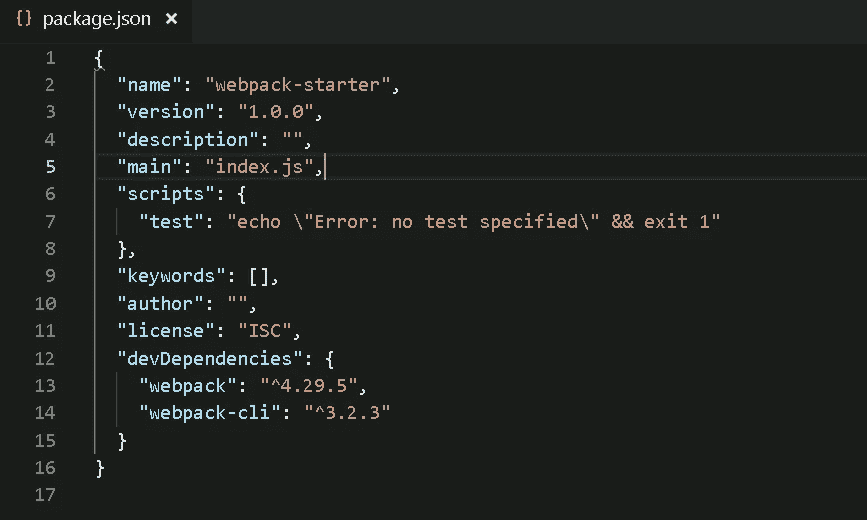***

***现在我们将在其中创建一个`src`目录和`index.js`文件。***

```
***mkdir src***
```

***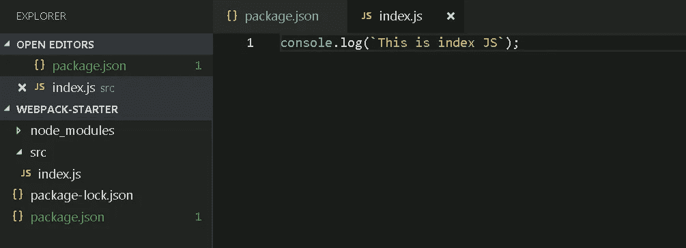***

***让我们修改`package.json`中的`npm`脚本***

```
***"scripts": {"dev": "webpack"}***
```

***现在从根文件夹中运行以下命令***

```
***npm run dev***
```

***您将看到一个在根文件夹中用`main.js` 文件创建的 dist 文件夹。***

***您将会看到一个在您的根文件夹中使用`main.js` 文件创建的 dist 文件夹。***

***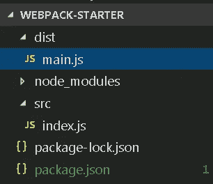***

***但是控制台中有一个警告。***

```
***WARNING in configuration
The 'mode' option has not been set, webpack will fallback to 'production' for this value. Set 'mode' option to 'development' or 'production' to enable defaults for each environment.
You can also set it to 'none' to disable any default behavior. Learn more: [https://webpack.js.org/concepts/mode/](https://webpack.js.org/concepts/mode/)***
```

***这个警告是因为我们需要设置一个模式。让我们这样做，并点击`npm run dev`***

```
***"scripts": {"dev": "webpack --mode development"}***
```

***现在您可以看到没有警告，并且生成了块。***

******

***但是等等！！！webpack 是如何做到的？我没有配置任何东西。还记得一开始我告诉你 Webpack 4 是零配置的吗？实际上，它带有默认配置，在`src`文件夹中搜索`index.js`文件，并假设它是构建依赖图的入口点。它还假设输出文件夹是`dist`，并在那里发出转换后的文件。***

# *****5。从 scratc 设置配置文件** h***

***我们现在将研究如何编写我们自己的配置，以便我们可以更好地控制 webpack 应该做什么。***

***让我们在根目录下创建`webpack.config.js`文件。我还创建了`src/app/`目录和`src/index.html`。***

***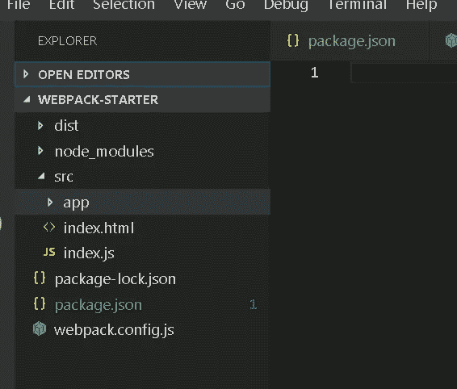***

***现在打开`webpack.config.js`，输入并输出以下代码。***

```
***const path = require('path');module.exports = {
  entry: './src/index.js',
  output: {
    filename: 'main.js',
    path: path.resolve(__dirname, 'dist')
  }
};***
```

***从根目录删除 dist 文件夹并点击`npm run dev`命令。你会发现同样的结果。***

# ***6。使用 HTML***

***你已经注意到一件事，当我们运行`npm run dev`时，它只是把`main.js`文件放到 dist 文件夹中。Wepack 没有复制我们的`index.html`文件。为此我们需要使用一个插件[**html-web pack-plugin**](https://www.npmjs.com/package/html-webpack-plugin)**。** 如此安装`html-webpack-plugin`***

```
***npm i html-webpack-plugin -D***
```

***现在 module.exports 中的`webpack.config.js`文件中的插件部分(不要删除条目和输出:P):***

```
***const path = require('path');
**const HtmlWebpackPlugin = require('html-webpack-plugin');**module.exports = {
   ....
plugins: [
        new HtmlWebpackPlugin({
            title: 'Webpack 4 Starter',
            template: './src/index.html',
            inject: true,
            minify: {
                removeComments: true,
                collapseWhitespace: false
            }
        })
    ]
}***
```

***改变`index.html`***

```
***<!DOCTYPE html>
<html>
<head>
    <meta charset="utf-8">
    <meta http-equiv="X-UA-Compatible" content="IE=edge">
    **<title> <%= htmlWebpackPlugin.options.title %> </title>**
    <meta name="viewport" content="width=device-width,initial- scale=1"> 
</head>
<body>
<h3>Welcome to Webpack 4 starter </h3>
</html>***
```

***我们使用`htmlWebpackPlugin.options.title`来添加标题，我们已经在配置文件中声明了。还要在您的`index.js`文件中放一个日志***

```
***console.log('This is index JS')***
```

***现在删除你的`dist` 文件夹，点击`npm run dev`命令。***

***你会在`dist`中看到`index.html`文件，标题被我们的配置文件标题所取代。您还会注意到 webpack 已经添加了一个包含生成脚本`main.js`的脚本标签。您不需要手动添加脚本文件。是不是很酷！！！***

******

***如果您在浏览器中打开`dist/index.html`文件并打开检查器，您将看到以下结果。***

***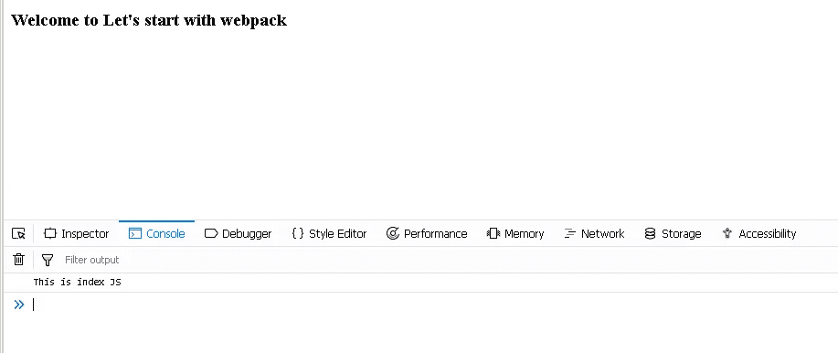***

# *****6。Webpack 开发服务器*****

***在开发过程中，您需要一种机制来从本地服务器提供您的文件，并自动重新加载更改，以避免在您做出任何更改后反复刷新浏览器。***

***为了解决这个问题，Webpack 有`[webpack-dev-server](https://www.npmjs.com/package/webpack-dev-server)`。因此，让我们设置我们的开发服务器。***

```
***npm i webpack-dev-server -D***
```

***转到您的`package.json`，将以下内容添加到您的脚本中:***

```
***"scripts": {"start": "webpack-dev-server --mode development","dev": "webpack --mode development"}***
```

***在这之后，进入终端的根目录并运行`npm start`。你可以在你的终端上看到这个***

***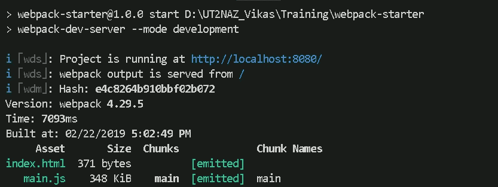***

***如果你去`http://localhost:8080/.` ，你可以看到你的欢迎页面。现在尝试在`/src/index.html`中改变一些东西，点击保存，你可以在浏览器中看到你的改变，而不用点击刷新。:)更多信息请参考[**web pack-dev-server**](https://github.com/webpack/webpack-dev-server#readme)**。*****

*****解析公共扩展*****

***有时我们不喜欢在导入模块时编写扩展。如果我们不写扩展，我们实际上可以告诉 webpack 解析它们。为此，在您的`webpack.config.js`中添加以下代码***

```
***module.exports {
.....
resolve: {extensions: ['.js', '.ts']},.....
}***
```

# *****7。使用 ES6+和类型脚本*****

***因此，随着我们的开发服务器的运行，我们将把我们的 ES6+代码和类型脚本转移到 ES5，因为大多数浏览器只能理解 ES5。***

*****a .将 ES6+转到 ES5*****

***为此，我们需要一台装载机。是啊！终于！！！一些装载机。所以我们需要
`babel-loader @babel/core @babel/preset-env`***

```
***npm i babel-loader @babel/core @babel/preset-env -D***
```

***因此，更新您的配置文件如下***

```
***...
module.exports = {
......module: {
        rules: [
            {
                test: [/.js$/],
                exclude: /(node_modules)/,
                use: {
                    loader: 'babel-loader',
                    options: {
                        presets: [
                            '[@babel/preset-env](http://twitter.com/babel/preset-env)'
                        ]
                    }
                }
            }
        ]
},
......}***
```

***那么这基本上意味着什么呢？我们可以编写不同的规则来加载`module`内部的模块。`test`基本上是正则表达式。`test: [/.js$/]`这里我们说的是匹配所有以`.js`结尾的文件，排除`node_modules`。`babel-loader`将使用`preset-env.`将这些模块/文件传输到 ES 5***

***所以是时候检验这个规则是否真的有所作为了。为此，我们将在`src/app`文件夹中添加`header.js`并添加一个`ES 6`代码。***

```
***export class Header { constructor() { console.log(`This is header constructor`); } getFirstHeading() {
    return `Webpack Starter page`;
  }}***
```

***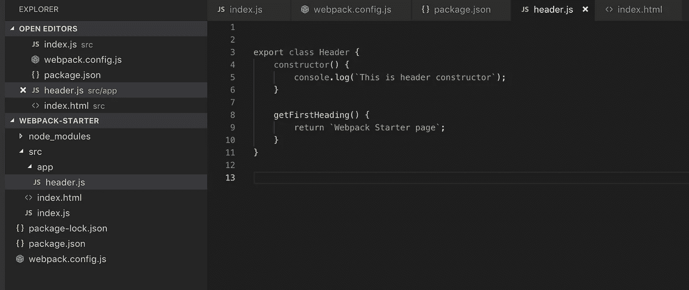***

***现在我们需要将它导入到我们的`index.js`文件中。***

```
***import { Header } from './app/header';let header = new Header();let firstHeading = header.getFirstHeading();console.log(firstHeading);***
```

***我们只是简单地导入`header`并生成一个对象，然后调用它的`getFistHeading`方法。***

***运行`npm start`，在浏览器中打开`[http://localhost:8080](http://localhost:8080)`。您可以看到以下结果:***

***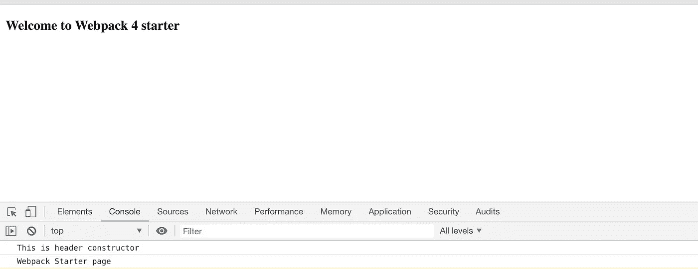***

*****b .将类型脚本编译成 ES 5*****

***所以一切都在按预期运行。让我们开始编译我们的`typescript`到`ES5`。为此，我们只需要安装依赖关系，并改变现有的规则。首先，安装依赖项***

```
***npm i @babel/preset-typescript typescript -D***
```

***我们更改了刚刚为 ES 6 转换编写的规则:***

```
***module: {rules: [ { test: [/.js$|.ts$/], exclude: /(node_modules)/, use: { loader: 'babel-loader', options: { presets: [ '@babel/preset-env', '@babel/typescript' ]
    }
   }
  }
 ]
}***
```

***我们还需要在`root`目录中添加一个`tsconfig.json`文件。点击了解更多关于`tsconfig.json`和[的信息。](https://www.typescriptlang.org/docs/handbook/tsconfig-json.html)***

```
***{"compilerOptions": { "target": "esnext", "moduleResolution": "node", "allowJs": true, "noEmit": true, "strict": true, "isolatedModules": true, "esModuleInterop": true, "baseUrl": ".", },"include": [ "src/**/*" ],"exclude": [ "node_modules", "**/*.spec.ts" ]}***
```

***仅此而已。它准备好测试了。我们将用测试标题的同样方法来测试它。***

***我们将在`src/app/`中创建一个文件`footer.ts`并添加以下内容。***

```
***export class Footer {
  footertext: string; constructor() {
   console.log(`This is Footer constructor`);
   this.footertext = `Demo for webpack 4 set up`;
  } getFooterText(): string {
   return this.footertext
  }
}***
```

***我们需要在`index.js`中导入它，就像我们在`header.js`模块中做的那样。***

```
***import { Footer } from './app/footer';......let footer = new Footer();let footerText = footer.getFooterText();console.log(footerText);.......***
```

***让我们运行它。`npm start`并导航至`http://localhost:8080.`***

***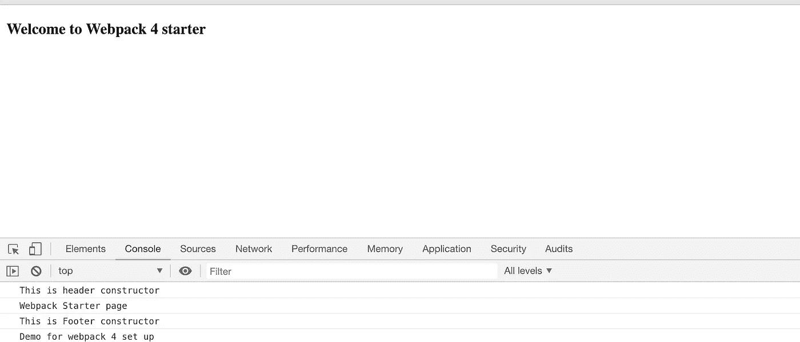***

# *****8。与 CSS 和 SCSS 合作*****

***为了加载 CSS 样式，我们需要两个加载器`css-loader`和`style-loader`。***

***`css-loader`获取我们的应用程序中引用的所有样式，并将其转换为字符串。`style-loader`将该字符串作为输入，放入`index.html`的`style`标签中。要安装依赖项:***

```
***npm i css-loader style-loader -D*** 
```

***我们需要编写一个匹配所有`.css`扩展的规则，并使用这些加载器将它们加载到`index.html`文件中。***

```
***module: {......rules: [.....
{                
  test: [/.css$/],                
  use:[                    
   'style-loader',                  
   'css-loader'
  ]            
}]......
}***
```

***让我们在`src`文件夹中创建一个`style.css`文件，并将一些样式放入其中。***

******

***现在我们需要将`style.css`导入到`index.js`中。将以下代码放入`index.js`***

```
***import '../src/style.css';***
```

***现在停止开发服务器并再次运行它`npm start`。导航至`http://localhost:8080`。你可以看到你的`h3`是红色的，如果你检查 DOM，你会发现添加了一个样式标签，里面有你的样式。:)***

***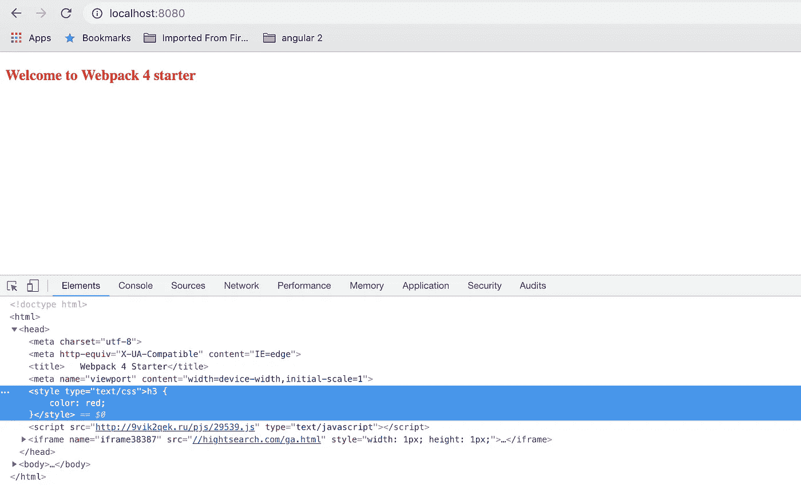***

*****将 SCSS 转换为 CSS*****

***为此，我们需要添加两个依赖项，即`node-sass`和`sass-loader`。`sass-loader`只需使用`node-sass`绑定将`.scss`文件转换为`.css`。如果你愿意，你可以在这里更深入地了解 node-sass。***

```
***npm i node-sass sass-loader -D***
```

***我们需要改变我们的规则来匹配一个`.scss`文件。***

```
***module: {......rules: [.....
{                
  test: [/.css$|.scss$/],                
  use:[                    
   'style-loader',                  
   'css-loader',
   'sass-loader'
  ]            
}]......
}***
```

***始终记住装载机的装载顺序很重要。所以不要改变顺序。让我们为 scss 文件创建文件夹结构。所以用截图中的代码创建`src/styles/scss`目录和`main.scss`文件。***

***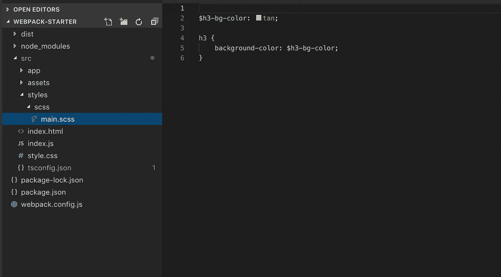***

***现在导入到`index.js`***

```
***import './styles/scss/main.scss';***
```

***现在是运行代码的时候了。`npm start`并转到`[http://localhost:8080](http://localhost:8080.)`和[。你可以看到结果。](http://localhost:8080.)***

***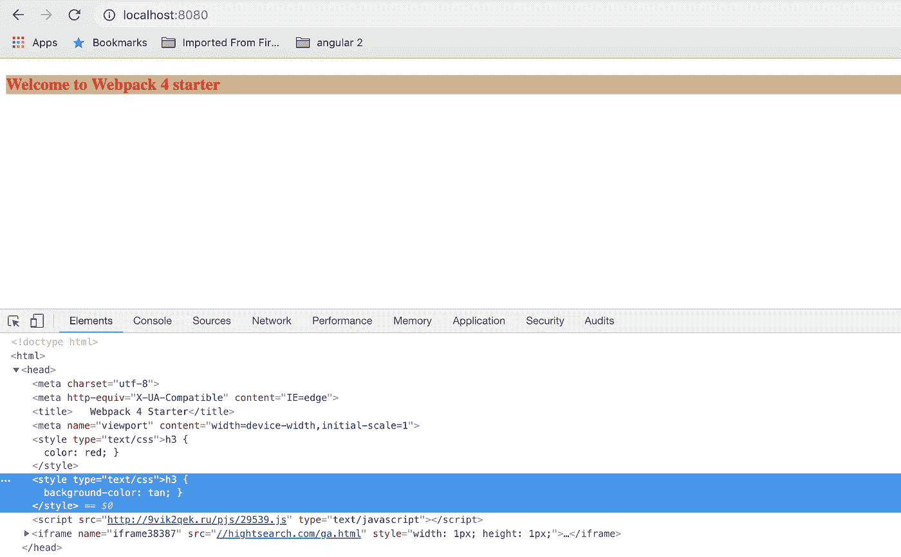***

*****将所有样式提取到一个文件中*****

***有时我们不想在内联样式标签中添加样式，而是想把它放在一个单独的样式文件中。为此我们有一个插件叫做 [**迷你 css-extract-plugin**](https://www.npmjs.com/package/mini-css-extract-plugin) 。***

```
***npm i mini-css-extract-plugin -D***
```

***我们需要像往常一样更新我们的`webpack.config.js`文件。***

```
***....
const MiniCssExtractPlugin = require('mini-css-extract-plugin');....module.exports = {.......module: {rules: [...... { test: [/.css$|.scss$/], use: [ MiniCssExtractPlugin.loader, 'css-loader', 'sass-loader' ] }]},plugins: [.........new MiniCssExtractPlugin({
 filename: 'style.css'
})]}***
```

***现在，如果您运行`npm start`并导航至`http://localhost:8080`。您可以看到以下结果:***

***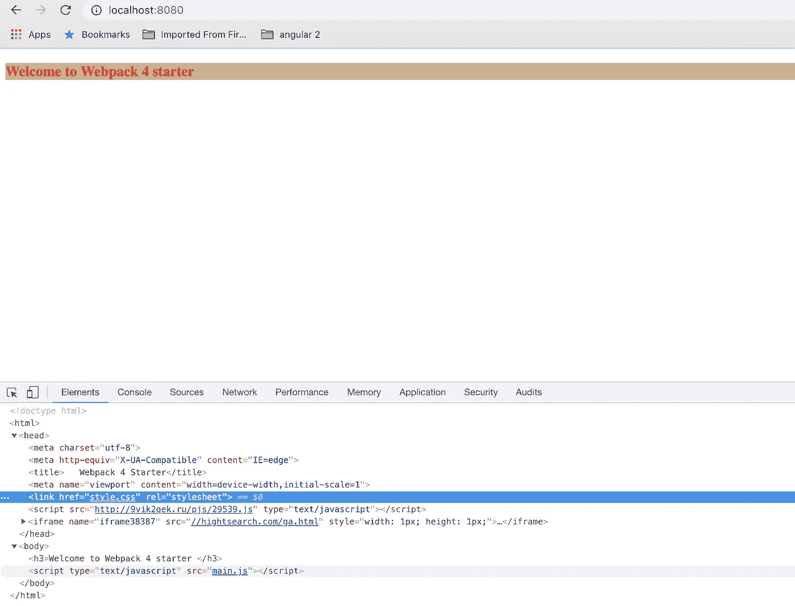***

***正如你在 inspector 窗口中看到的，添加了一个指向外部 css 文件的链接，而不是内联样式标签。***

*****添加后置 css*****

***[**Post css**](https://github.com/postcss/postcss)**是帮助我们用 js 插件转化 CSS。 [**自动前缀器**](https://github.com/postcss/autoprefixer) 是流行的 post css 插件，帮助我们添加浏览器前缀。要安装两者的依赖关系:*****

```
*****npm i postcss-loader autoprefixer -D*****
```

*****在根目录下创建一个`postcss.config.js`并跟随代码。*****

```
*****module.exports = {  
 plugins: [    
    require('autoprefixer')  
  ]
}*****
```

*****现在去`src/styles/scss/main.scss`更新`h3`风格。*****

```
*****h3 {background-color: $h3-bg-color;**user-select: none;**}*****
```

*****`user-select`阻止文本选择，此属性需要浏览器前缀。现在，如果你去终端运行`npm run dev`并去生成的`dist/main.css`，你会看到`user-select`是自动前缀。*****

**********

# *******10。加载静态资源*******

*****为了加载静态内容，我们需要一个名为`file-loader`的加载器。*****

```
*****npm i file-loader -D*****
```

*****现在我们需要修改配置文件中的规则。*****

```
*****rules: {
....
    {
        test: /\.(png|jpg|gif|svg)$/,
        use: [
          {
            loader: 'file-loader',
            options: {
              name: '[name].[ext]',
              outputPath: 'assets/images'
            }
          }
        ]
      }
.....
}*****
```

*****为了测试，创建一个目录`src/assets/images`并放一些图片。我正在放一个 webpack 的`.gif`。你可以从[这里](https://github.com/thejsdeveloper/webpack4-setup/blob/master/src/assets/images/webpack.gif)下载。*****

*****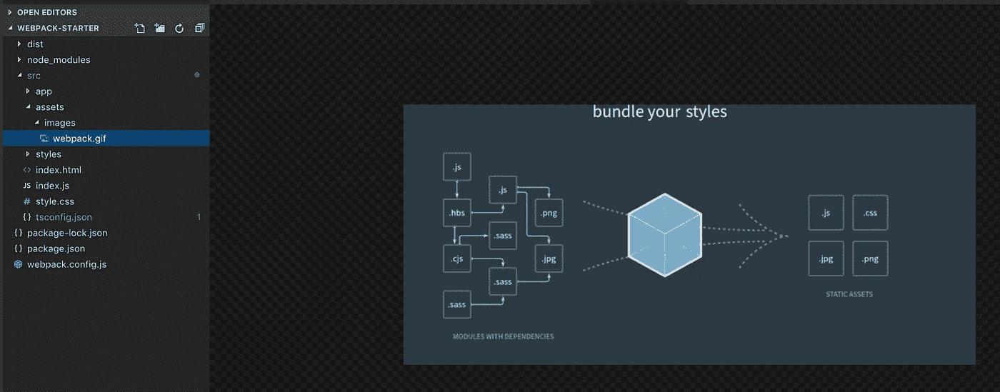*****

*****现在我们需要将它导入到我们的`index.js`中。*****

```
*****import webpackgif from './assets/images/webpack.gif';*****
```

*****让我们在`index.html`中创建一个`img`标签。我们将从`javascript`文件中设置`src`属性。将以下代码添加到`index.html` body 标签中。*****

```
**********
```

*****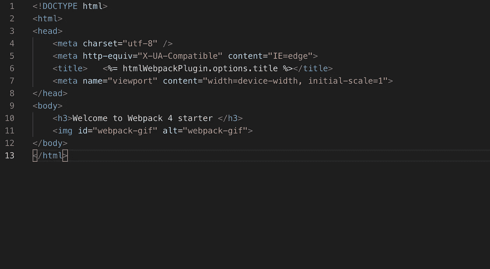*****

*****将以下代码添加到`index.js`。*****

```
*****.....
import webpackgif from './assets/images/webpack.gif';
.......// setting the source of imgdocument.getElementById('webpack-gif').setAttribute('src', webpackgif);*****
```

*****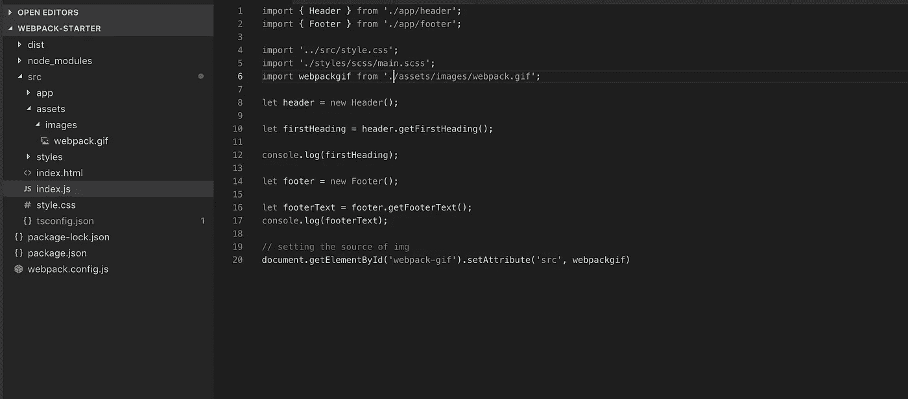*****

*****现在如果你运行`npm start`并导航到`[http://localhost:8080](http://localhost:8080.You)`T36。您可以看到以下结果:*****

*****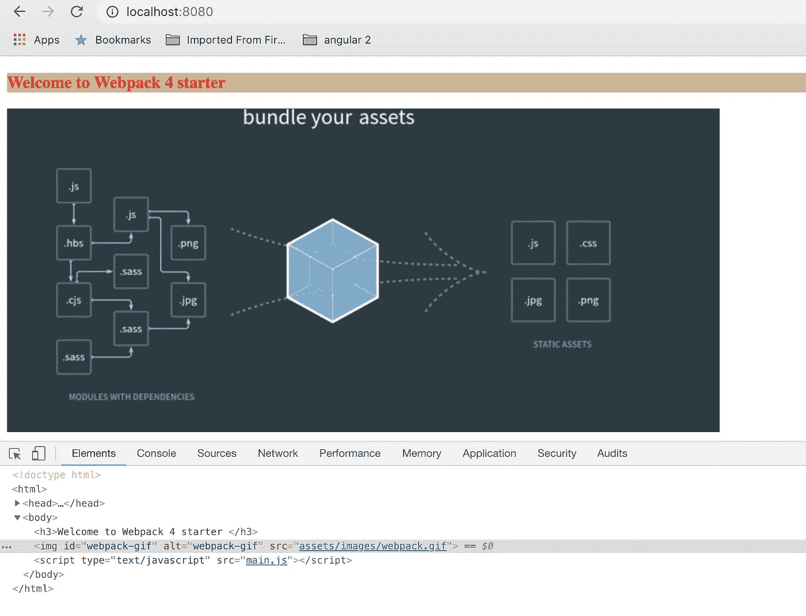*****

*****你可能想知道为什么我没有把`img`的`src`直接添加到 html 中？我为什么要通过 JavaSript 添加？实际上`file-loader`只加载那些被我们的模块引用的资产(在 JavaScript 或 Typescript 文件中)。*****

*****如果我直接添加到 html 中，删除图片导入。我们将得到以下结果:*****

**********

*****所以为了克服这个问题，我们需要一个插件叫做[**copy-web pack-plugin**](https://github.com/webpack-contrib/copy-webpack-plugin)**。**这会将我们的静态资产复制到我们指定的文件夹中。*****

```
*****npm i copy-webpack-plugin -D*****
```

*****更新配置文件:*****

```
*****....const CopyWebpackPlugin = require('copy-webpack-plugin');......module.exports = {
.....
plugins:[
{
  new CopyWebpackPlugin([{ from:'./src/assets/images', to:'assets/images' }])
}
.....}*****
```

*****现在，如果您运行`npm start`并导航到`http://localhost:8080`。您可以看到以下结果:*****

**********

# *****11。在不同的环境中工作*****

*****当我们为最终部署准备资产和文件时，我们需要尽可能地减少捆绑包的大小。出于这个原因，我们需要缩小我们的 css 和 Javascript 文件。我们可以用一个单一配置来实现，但是将配置文件分成不同的文件是一个很好的实践，这样就有了清晰的责任划分。由于这个原因，通常会有以下文件:*****

*****a.webpack.common.config.js*****

*****b.webpack.dev .配置. js*****

*****c.webpack.prod.config.js*****

*****顾名思义，公共文件将包含所有的公共配置。我们将使用[**web pack-merge**](https://github.com/survivejs/webpack-merge)**库将通用配置合并到开发和生产配置中。所以让我们安装 **webpack-merge*********

```
*****npm i webpack-merge -D*****
```

*****现在我们将在我们的根文件夹中创建一个`config`目录，并在其中创建上述文件。*****

*****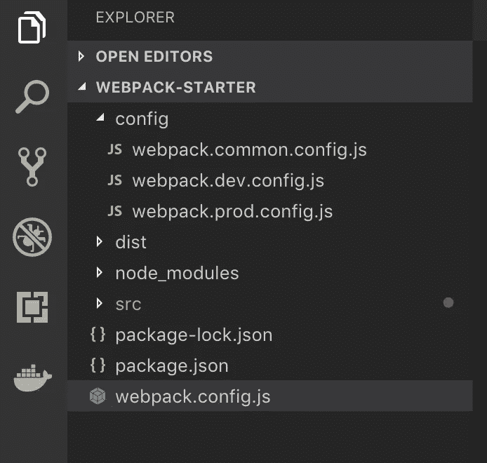*****

*****我们将把`webpack.config.js`文件的所有内容复制到`webpack.common.config.js`文件中。*****

*****更新`webpack.common.config.js`文件的输出如下:(dist 改为../距离)*****

```
*****output: {**path: path.resolve(__dirname, '../dist'),**filename: '[name].js'}*****
```

*****现在我们将把下面的代码放到`webpack.dev.config.js`*****

```
*****const merge = require('webpack-merge')const webpackBaseConfig = require('./webpack.common.config.js')module.exports = merge(webpackBaseConfig, {})*****
```

*****删除`webpack.config.js`的内容，放入以下代码*****

```
*****const environment = (process.env.NODE_ENV || 'development').trim();if (environment === 'development') {module.exports = require('./config/webpack.dev.config.js');} else {module.exports = require('./config/webpack.prod.config.js');}*****
```

*****这段代码基本上是说，如果 NODE_ENV 是 development，那么默认情况下使用`webpack.dev.config.js` else `webpack.prod.config.js`，它将使用`development`。*****

*******设置环境变量*******

*****为了设置`dev`和`prod`的环境变量，我们需要一个名为`cross-env`的 npm 包。这个 npm 包确保环境变量在每个平台上都设置正确。你可以在这里阅读更多关于这个[的内容。](https://www.npmjs.com/package/cross-env)*****

```
*****npm i cross-env -D*****
```

*****现在更改 npm 脚本:*****

```
*****"scripts": {"build:dev": "cross-env NODE_ENV=development webpack --mode development","build:prod": "cross-env NODE_ENV=production webpack --mode production","start": "webpack-dev-server --mode development"}*****
```

*******通过插件清除分发文件夹*******

*****您可能已经注意到，每当我运行构建命令时，我都会要求您手动删除`dist`文件夹。我们可以通过使用另一个名为[**clean-web pack-plugin**](https://www.npmjs.com/package/clean-webpack-plugin)**的插件来克服这个问题。*******

```
*****npm i clean-webpack-plugin -D*****
```

*****我们需要修改我们的公共配置:*****

```
*****const { CleanWebpackPlugin }   = require('clean-webpack-plugin');module.exports = {....
plugins: [
....
 new CleanWebpackPlugin().....
]}*****
```

*****我们稍后将继续生产配置。让我们先测试开发配置。*****

*****现在运行`npm run build:dev`。你可以看到`dist`文件夹生成了所有需要的资产。*****

*****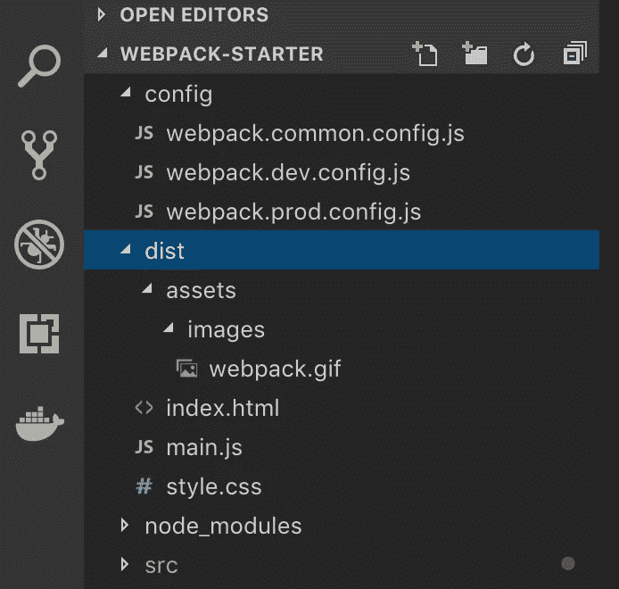*****

*******准备生产资源*******

*****为了简化 Javascript，我们需要一个名为 [**的插件**](https://github.com/webpack-contrib/uglifyjs-webpack-plugin)*****

```
*****npm i uglifyjs-webpack-plugin -D*****
```

*****对于 css 优化，我们需要另一个插件叫做 [**优化-CSS-资产-网络包-插件**](https://github.com/NMFR/optimize-css-assets-webpack-plugin)*****

```
*****npm i optimize-css-assets-webpack-plugin -D*****
```

*****安装此更新后`webpack.prod.config.js`:*****

```
*****const merge = require('webpack-merge');const UglifyJsPlugin = require('uglifyjs-webpack-plugin');const OptimizeCSSAssetsPlugin = require('optimize-css-assets-webpack-plugin');const webpackBaseConfig = require('./webpack.common.config.js');module.exports = merge(webpackBaseConfig, { optimization: { minimizer: [ new UglifyJsPlugin(), new OptimizeCSSAssetsPlugin() ] }});*****
```

*****现在一切都完成了，你可以通过`npm run build:prod`生成产品的构建*****

*****您可以看到生产和开发版本中生成的文件大小的差异*****

*****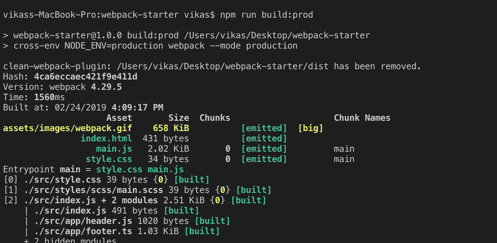**********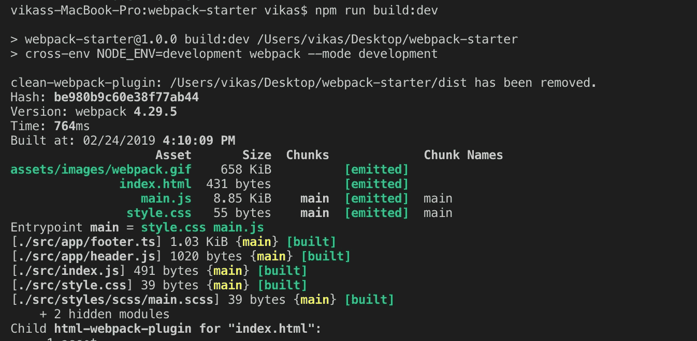*****

*****大小差异非常小，因为我们没有更大的代码库。*****

*****我们可以做最后一件事，我们可以在生成构建时实现散列。这非常简单，我们只需要在输出文件和迷你 css-extract 插件中添加[chunkhash]。*****

*****将通用配置更新为*****

```
*****....
module.exports = {
...
 output: { path: path.resolve(__dirname, '../dist'), ** filename: '[name].[chunkhash].js'** }.....plugins: [
....
 new MiniCssExtractPlugin({ **filename: 'style.[chunkhash].css'** }),...
]}*****
```

*****现在，如果您通过`npm run build:prod`生成构建，您将看到一个散列附加在文件的末尾。*****

*****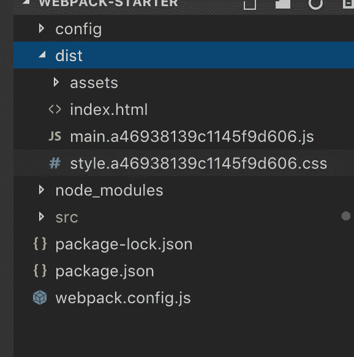*****

*****请提出任何改进建议，并分享、订阅和鼓掌。谢谢:)*****