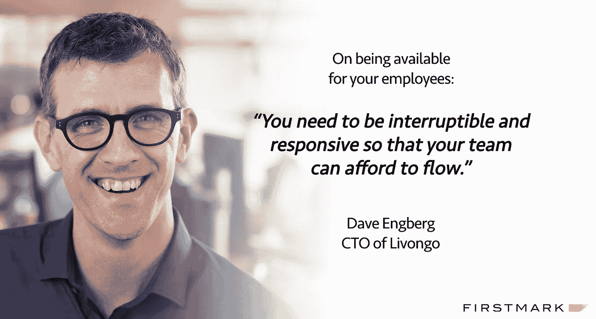

# Livongo 首席技术官 Dave Engberg 谈仆人领导力，与高管同行沟通+更多

> 原文：<https://medium.com/hackernoon/livongos-cto-dave-engberg-on-servant-leadership-communicating-with-executive-peers-more-620a2a92b203>

## 有效领导系列

Dave Engberg 是 Livongo Health 的首席技术官，负责监督工程、服务运营和 IT。在加入 Livongo 之前，Dave 在 Evernote 担任了九年的 CTO。在 Evernote 之前，Dave 是 CoreStreet 的联合创始人兼 CTO。当 Dave 在 2018 年纽约市 FirstMark 的 CTO 峰会上发言时，我们对他有了很好的了解。

# 你的第一个管理角色是什么？你从中学到了什么？

在上一次科技泡沫期间(1998 年至 2001 年)，我在一家名为“车道”的在线文件存储公司担任技术主管(首席架构师和首席技术官)，没有直接下属。后来，我搬到波士顿，成立了一家加密/安全公司，并最终管理了一个小团队。

我早期的职业生涯告诉我，技术“领导者”和“管理者”之间的区别非常重要。在过去糟糕的日子里，伟大的工程师会在晋升、薪酬和地位上遇到天花板，除非他们直接管理。领导力等同于组织结构图。

> 技术“领导者”和“管理者”之间的区别非常重要。

成功的公司现在有意为技术领导者构建平行的路径，让他们晋升为组织经理或技术领导者。这些非管理型领导应该通过设计、指导和跨职能协调来提供显著的影响。公司应该认可这些薪酬、头衔和非正式身份相当的领导者。我的员工会议包括管理董事和非管理主要领导。

# 在你职业生涯的早期，在你担任领导角色之前，你欣赏一个优秀经理的哪一个品质？

我总是被“仆人领导”的管理模式所吸引，其中很大一部分是证明你对于团队需要的任何事情都不会“太重要”。

我的一些早期经理每天都表现出这种态度。他们总是放下手头的工作去帮助别人，不管这个人有多低级。他们会承担相当一部分乏味的任务。我从未在迪士尼工作过，但我喜欢他们的政策，即“没有人会因为看到垃圾而不去捡。”

当我的经理在这方面做得很好时，我知道他们会愿意将我的需求置于他们自己的抱负之上，我会用长期的尊重和忠诚来回报他们。

> 我从未在迪士尼工作过，但我喜欢他们的政策，即“没有人会因为看到垃圾而不去捡。”

# 作为领导者，你养成的最重要的日常或每周习惯是什么？

当你选择从事技术管理时(而不是作为员工/主要贡献者的领导)，你需要放弃在工作时间专注于任何深层次的事情。你需要具有可中断性和响应性，这样你的团队才能负担得起流动。

我强迫自己在周末实现“零收件箱”的目标，并在本周的剩余时间里列表视图中不显示滚动条。如果我能在不到 5 分钟的时间内帮助别人完成一个请求，我会放下所有的事情，立即去做，以免排队的人越来越多。时间范围较长的请求会进入日历，而不是收件箱队列。

这往往会将大量工作挤出工作时间，但我每天会在火车上花 2 个小时使用不稳定的 LTE 来帮助解决这个问题。

# 你的一对一会议使用什么框架？

我的观点是，这些会议应该主要是员工表达他们的需求和促进他们发展的时间。作为经理，我的主要工作应该是让我的团队在当前任务和整体职业生涯中取得成功。因此，议程主要由他们掌控，有明确的指示，这不应该只是状态更新或工作总结。这些问题最好通过像站立会议这样的单独会议来解决。

偶尔，我会打破常规问自己的问题或提出一个重要的问题。但那要么是在他们无话可说的时候，要么是一个特殊的“非常特别”的会议。

> 作为经理，我的主要工作应该是让我的团队在当前任务和整体职业生涯中取得成功。

# 关于给予有效反馈，你会给第一次当经理的人什么建议？

我接受过一些不同框架的培训，比如 SMART(具体的、可衡量的、可实现的、相关的、基于时间的)。我认为值得花时间去学习其中的一个并做一些练习。

> 如果你一年只有一次在薪酬变动到期时给出反馈，那你就失败了。

在所有这些字母中，我认为“T”是第一次做经理的人可能会觉得最难的一个。如果你一年只有一次在薪酬变动到期时给出反馈，那你就失败了。你应该强迫自己安排频繁的增量反馈，你可以指出具体的最近的例子，而不是在几个月的时间里分批进行，像一堆砖头一样砸在某人身上。

# 你会和第一次当经理的人分享什么独特的招聘技巧？

我将跳过关于“不要和解，只雇佣 A 级球员”的老生常谈，集中讨论一个常见的战术失误。

我见过很多新的招聘经理安排一群人去面试一名候选人，然后把他们召集到一个房间里，让他们要么投票，要么围着桌子给出反馈。这污染了来自每个面试官的信号，并对面试的目的设定了错误的期望。

相反，你应该要求每个面试官收集不同技能或知识的实质性信息。他们应该首先写下对这些领域的评估。如果您希望他们帮助做出最终的是/否决定，这应该与领域评审分开。与直接参加面对面的圆桌会议相比，这会给你带来更微妙的信号。

# 你和教练一起工作过吗？如果是的话，你学到的最大的一课是什么？

我做了一些辅导，结果有好有坏。我在最后一次尝试中获得的最具可操作性的东西是与高管同行的沟通。对于技术领导者来说，陷入唱反调的角色是非常容易/常见的，因为他们通常是在实际交付他们同事的愿望。

> 总是以明确的热情开始回应，戏剧性的停顿，然后给出我的意见。

我的上一位教练给了我一些反馈，告诉我总是以明确的热情开始我的回答，戏剧性的停顿，然后给出我的意见。例如:“哇，这听起来是个好机会。我很乐意帮忙找出完成这件事的方法。[深呼吸…]我想先问两个问题…

有没有你真正钦佩的领导者(不是你现在的公司),你认为他会喜欢接受采访？

请将他们的姓名和简短描述发送到 jack@firstmarkcap.com，让我们知道。