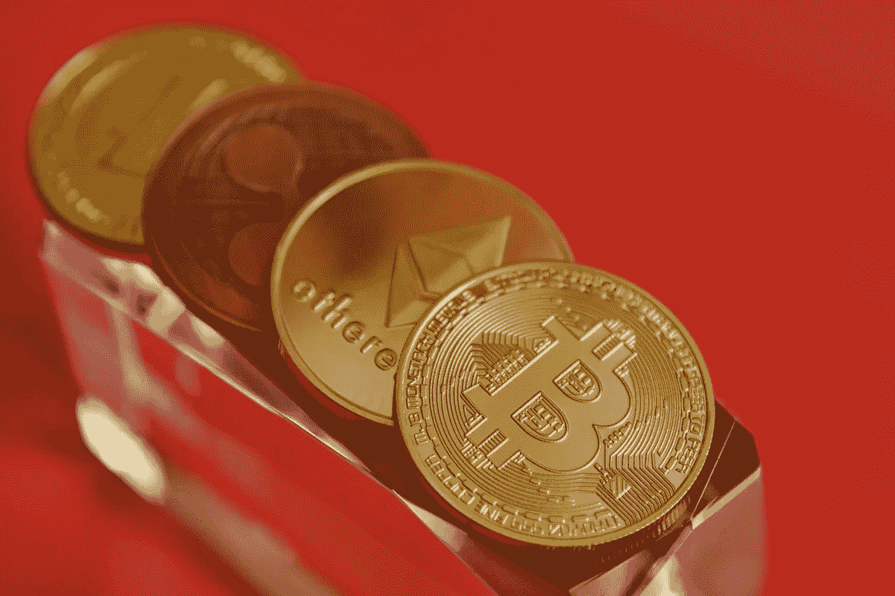

# 路易威登、贝宝和摩根大通:区块链在很大程度上颠覆了 2019 年

> 原文：<https://medium.com/hackernoon/louis-vuitton-paypal-jp-morgan-blockchain-disrupts-2019-in-big-ways-e4116813a6>

十多年前，某个“中本聪”发布了白皮书[比特币:点对点电子现金系统](https://bitcoin.org/bitcoin.pdf)。这篇论文只是简单地描述了数字货币在标题中的定义。至于比特币是如何颠覆金融行业的，这篇论文只有 10 页长，令人惊讶。

将近 11 年过去了，中本聪仍然默默无闻。一些人认为这个名字实际上是开发这项技术的一群人的假名。不管这个名字背后是什么人，他或他们都是 2017 年世界上最富有的 50 个人之一。据估计，中本聪的身价为 194 亿美元，根据《T4》的福布斯富豪榜，他或他们将会是世界上第 44 富有的人。

尽管这篇论文是这种极具争议的数字货币的主要发布点，但人们的兴趣一直都在运行比特币的区块链技术上。

# **什么是区块链？**

《区块链革命》(Blockchain Revolution)的作者 Don & Alex Tapscott 将这项技术描述为“一个不可腐蚀的经济交易数字账本，可以通过编程不仅记录金融交易，还可以记录几乎所有有价值的东西。”

所有数据都存储在“块”中，并使用[密码技术](https://blockgeeks.com/guides/what-is-blockchain-technology/)的“链”相互绑定。这些数据由许多计算机监管或由许多服务器运行，这使得任何知道如何访问云存储或档案应用程序的人都可以使用这些数据。

整个概念意味着区块链技术处理的数据是透明的，不属于任何人、任何组织，甚至不属于政府。本质上是民主的体现。也许这就是为什么最初，许多大型金融机构质疑区块链的安全性和合法性，许多人通常不愿意完全接受这项技术。

许多最先勇敢地利用区块链的公司都是小型创业公司。通常，他们向大公司提供能够接受数字货币的服务。

例如，总部位于佛罗里达州的 CLIC 科技公司为实体商家提供了一个平台，以安全地处理用加密货币支付的交易。虽然大多数大公司正在决定是否实施区块链技术，但像 CLIC 技术这样的公司为大型零售商提供了最大限度地发挥该技术优势的方法。It 新应用 CLICPay 和 CLIC 钱包预计将于 2019 年在美国推出，并于 2020 年在加拿大、日本、澳大利亚和英国推出。

随着越来越多的初创公司继续吞噬市场份额，最近几年，越来越多的主要金融公司认识到了以前被回避的技术的潜力。

# **区块链技术作为一种颠覆性力量**

在过去的几十年里，对比特币合法性的质疑挥之不去。事实证明，金融领域和科技领域的主要参与者一直在测试区块链的技术，这些领域曾经是加密货币的最强烈批评者。

首先，区块链是今年达沃斯的一个优先话题。世界经济论坛进行的一项调查发现，到 2027 年,[全球 GDP 的 10%将由区块链管理。这是因为在过去两年中，许多政府最近都在研究区块链的可能性。在此期间，谷歌关于区块链的搜索结果达到 370 万次。同期还有近 500，000 份新出版物。](https://www.weforum.org/agenda/2019/04/blockchain-distrubuted-ledger-technology-central-banks-10-ways-research/)

调查还发现，仅在 2017 年，区块链的风险投资资金就达到了 10 亿美元。对最初硬币发行的投资，加密货币的销售额达到了 50 亿美元的峰值。大型科技公司也加入进来，IBM 在区块链投资超过 2 亿美元，以增强其物联网能力。

# 巴克莱银行、苏格兰皇家银行集团和高伟绅律师事务所

4 月，这三家公司是测试 R3 为即时财产网络开发的区块链软件的 [40 家公司之一。该平台可以将客户买房的过程从几个月简化到几周，因为它消除了代理商和其他中间商等第三方。](https://www.bloomberg.com/news/articles/2019-04-04/barclays-rbs-join-blockchain-trial-to-speed-property-sales)

巴克莱银行(Barclays)驻纽约的集团创新办公室(group innovation office)负责人约翰·斯特彻(John Stecher)表示:“当一个人想买房时，这个过程包含了与不同企业和政府实体的一系列不同的互动，这些互动可能会令人不舒服，而且会很漫长。”。

# 央行开始实施区块链技术

同样在 4 月，世界经济论坛发布的一份新的白皮书发现，世界各地的央行实际上已经开始实施区块链和分布式账本技术或 DLT。这些发现也许可以被认为是区块链如何扰乱金融部门的最有意义的展示。首先，可以说，央行是国家货币政策、金融和经济稳定的守护者。已经实施区块链的央行包括南非、加拿大、日本、泰国、沙特阿拉伯、新加坡和柬埔寨。有趣的是，事实证明，令人惊讶的是，世界银行在 2018 年 8 月推出了首只区块链债券。

# PayPal 投资剑桥区块链

4 月份，Paypal [还投资了剑桥区块链](https://www.forbes.com/sites/michaeldelcastillo/2019/04/02/paypal-targets-identity-ownership-with-its-first-blockchain-investment/#d718a3a55611)，这是一家初创公司，承诺为人们提供一种拥有在线身份的方式，而不必在任何社交媒体平台上注册，如脸书。尽管据报道，这家在线汇款公司在 2018 年 3 月为一款可以加快加密货币交易速度的应用程序申请了专利，但 4 月份的投资是该公司第一次真正为区块链项目投资。

# 路易威登计划使用区块链

据报道，其母公司 LVMH 旗下的路易威登已经准备在其运营中使用区块链。一份未经证实的报告称，奢侈品牌[将使用区块链监控和追踪其正品的动向](https://www.coindesk.com/louis-vuitton-owner-lvmh-is-launching-a-blockchain-to-track-luxury-goods)。该项目据称代号为 AURA，预计将消除制造假冒商品的可能性。据报道，克里斯汀·迪奥香水也将使用该应用程序。报道称，在 5 月或 6 月首次推出后，该应用程序还将整合到 LVMH 旗下的 60 多个奢侈品牌。报道称，AURA 是由 studio ConsenSys 和微软 Azure 背后的同一批人开发的。有关各方都拒绝发表评论。

# 摩根大通和它的 JPM 硬币

二月份，美国最大的银行摩根大通宣布将推出自己的加密货币，JPM 硬币。这种货币被设计成有一个固定的价值，可以兑换 1 美元。与比特币和其他先锋数字加密货币不同，JPM 币不会免费交易。该行认为，有了自己的货币，机构客户的风险和交易成本将会降低。

通过此举，摩根大通声称自己是第一家成功涉足数字加密货币的美国银行。此举也是摩根大通首席执行官杰米·戴蒙(Jamie Dimon)的彻底转变，几年前他曾表示比特币是一种欺诈，交易比特币的人是“愚蠢的”。