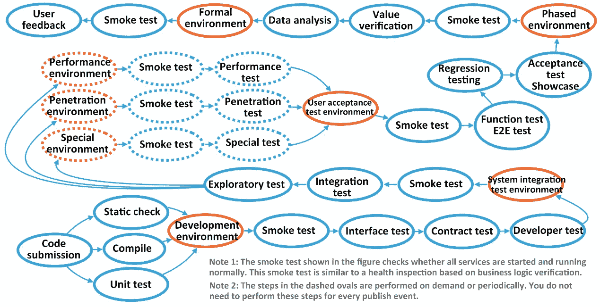
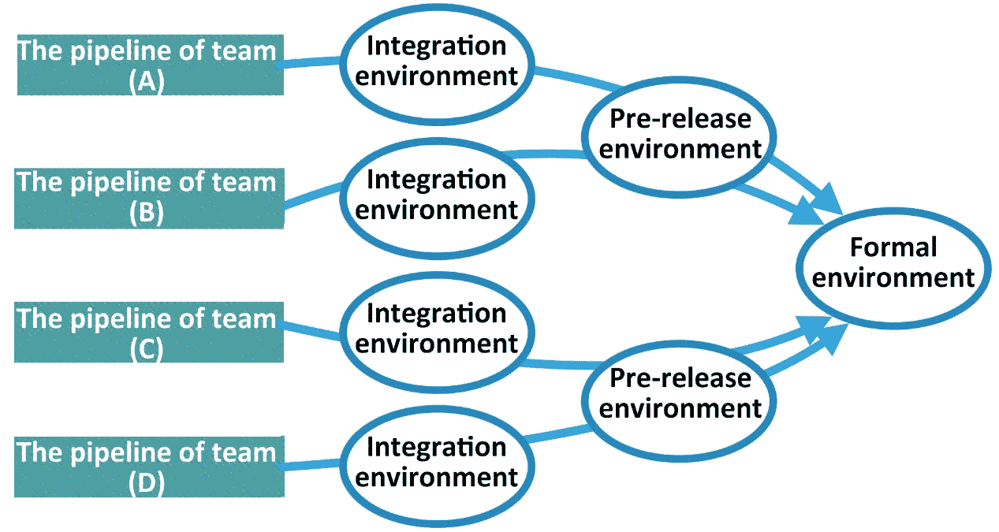
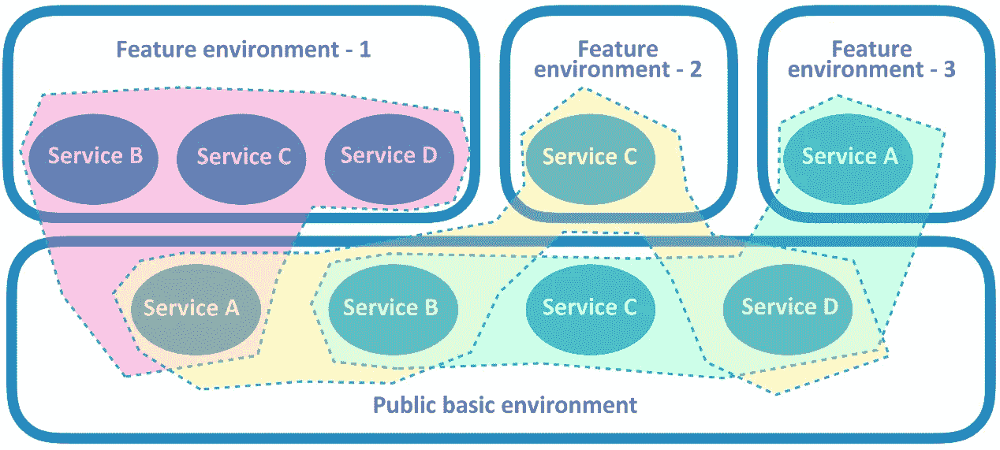
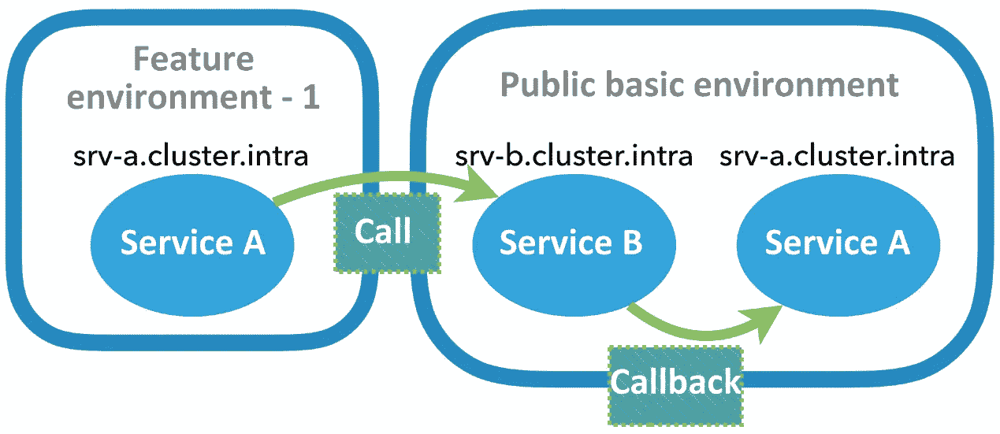

# 低成本高稳定性:我们如何管理阿里巴巴的测试环境？

> 原文：<https://medium.com/hackernoon/lower-cost-with-higher-stability-how-do-we-manage-test-environments-at-alibaba-f7bd444ff6d2>

## 一种服务级可重用虚拟化技术:特征环境


来自阿里巴巴研发效率团队的高级工程师林凡。

良好的代码提交实践和适当的变更前检查有助于减少失败，但不能完全消除风险。尽管添加多个测试环境副本可以有效控制故障的影响范围，但大多数企业资源有限，导致降低测试环境成本和提高测试环境稳定性之间存在冲突。

为了解决这个问题，创新的阿里巴巴 R&D 效率团队设计了一种令人惊叹的服务级可重用虚拟化技术，称为功能环境。在本文中，我们将关注测试环境管理，并介绍阿里巴巴使用的这种独特的方法。

# 前言

阿里巴巴的许多实践看似简单，但实际上依赖于许多深思熟虑的概念，如测试环境的管理。

互联网产品服务通常由 web apps、中间件、数据库和许多后台业务程序组成。运行时环境是一个小型的自包含生态系统。最基本的运行时环境是在线环境，部署正式发布的产品版本，为用户提供持续可靠的服务。

此外，还提供许多不对外部用户开放的运行时环境，用于产品团队的日常开发和验证。这些环境统称为测试环境。正规环境的稳定性，除了软件本身的质量外，主要与运行的基础设施有关，比如主机、网络等，而测试环境的稳定性更多的是受到人为因素的影响。由于频繁的版本变更和未验证代码的部署，测试环境失败是很常见的。

良好的代码提交习惯和适当的变更前检查有助于减少错误的发生，但不能完全消除错误。增加多个测试环境副本可以有效控制故障的影响范围。然而，企业的资源是有限的，所以降低成本和提高测试环境的稳定性成为两个需要平衡的目标。

在这一领域，别出心裁的阿里巴巴 R&D 效率团队设计了一种服务级的可重用虚拟化技术，名为“功能环境”(Feature Environments)，其构思巧妙，令人印象深刻。本文围绕测试环境管理这一话题，讨论这种具有阿里巴巴特色的工作方式。

# 测试环境管理中的困难

测试环境被广泛使用。常见的测试环境，如系统集成测试环境、用户验收测试环境、预发布测试环境和分阶段测试环境，反映了产品的交付生命周期，并间接反映了整个团队的组织结构。

小型车间式产品团队的测试环境非常容易管理。每个工程师都可以在本地启动全套软件组件进行调试。如果你还觉得这样不安全，加个公共集成测试环境应该就够了。


随着产品规模的扩大，在本地启动所有服务组件变得既耗时又麻烦。工程师只能在本地运行一些要调试的组件，然后在公共测试环境中使用其余的组件，形成一个完整的系统。

而且随着团队规模的扩大，每个团队成员的职责进一步细分，形成新的子团队，这意味着项目的沟通成本增加，公共测试环境的稳定性变得难以控制。在这个过程中，测试环境管理的复杂性带来的影响不仅体现在繁琐的服务联调上，还直接体现在交付流程和资源成本的变化上。

交付过程中的一个显著变化是测试环境种类的增加。工程师们为不同的目的设计了各种专用的测试环境。这些测试环境的组合为每个企业形成了一个独特的交付过程。下图显示了大型项目的复杂交付过程。



从单个服务的角度来看，环境由管道连接，再加上自动化测试或人工批准操作的级别，以实现环境之间的转移。通常，环境级别越高，部署频率越低，因此相对稳定性越高。相反，在低级别环境中，新的部署可能会随时发生，从而中断正在使用该环境的其他人。有时，为了重现一些特殊的问题场景，一些开发人员不得不直接登录服务器执行操作，进一步影响了环境的稳定性和可用性。

面对一个随时可能崩溃的测试环境，小企业尝试采用“阻塞”的方法，即限制服务变更时间，设置严格的变更规范，而大企业则擅长“不阻塞”，即增加测试环境的副本来隔离故障的影响范围。显然，如果采用“堵”的方法，不堪重负的考试环境的情况肯定会越来越糟，这是一千年前禹治水的传说中早已揭示的道理。所以，刻意的控制无法拯救脆弱的测试环境。

近几年 DevOps 文化的兴起，解放了开发者端到端的双手，但对于测试环境的管理却是一把双刃剑。一方面，DevOps 鼓励开发人员参与 O&M，以了解完整的产品生命周期，这有助于减少不必要的 O&M 事件。另一方面，DevOps 允许更多的人访问测试环境，因此出现了更多的更改和更多的补丁。从全局的角度来看，这些实践利大于弊，但是它们不能提高测试环境的稳定性。简单的流程“解锁”也无法拯救脆弱的测试环境。

那么，该投资的就得投资。不同团队使用的底层测试环境是独立的，这样每个团队看到的都是一条线性管道，整体看就出现了河流汇聚的形状。



因此，理想情况下，每个开发人员都应该获得一个独占的、稳定的测试环境，不受干扰地完成自己的工作。但是由于成本的原因，现实中只能在团队内部共享有限的测试资源，测试环境中不同成员之间的干扰成为影响软件开发质量的隐患。增加测试环境的副本数量本质上是一种以增加成本换取效率的方式。然而，许多试图在成本和效率之间找到最优平衡的探索者似乎在同一条不归路上越走越远。

由于客观的规模和体量，阿里巴巴产品团队也容易受到上述管理测试环境的困扰。

# 第一个挑战:测试环境类型的管理

在阿里巴巴，也有很多类型的测试环境。各种测试环境的命名与其功能密切相关。虽然业内普遍使用一些名称，但并没有形成权威的命名标准。其实环境的名字只是一种形式。关键在于各种测试环境要分别适应具体的应用场景，场景之间或多或少要存在一些差异。

一些差异存在于运行的服务类型中。例如，性能测试环境可能只需要运行与压力测试相关的访问量最大的关键服务，而如果运行其他服务，只会浪费资源。一些差异在于访问数据的来源。比如开发者测试环境的数据来源肯定和正规环境不一样，所以测试用的假数据不会污染在线用户的请求。预发布环境(或用户验收测试环境)使用与正式环境一致的数据源(或正式数据源的副本)，以反映新功能对真实数据的操作。自动化测试相关环境有一套独立的测试数据库，以避免测试过程中其他手动操作的干扰。

其他一些差异存在于用户中。比如分阶段环境和预发布环境都使用正式的数据源，但是分阶段环境中的用户是一小部分真实的外部用户，而预发布环境中的用户都是内部人员。简而言之，没有必要为没有业务特异性的测试场景创建测试环境。

在集团层面，阿里巴巴对管道的形式限制相对宽松。客观地说，只有一线开发团队知道团队的最佳交付过程应该是什么。阿里巴巴开发平台只是标准化了一些推荐的管道模板，开发者可以在上面搭建。下面列出了几个典型的模板示例:


这里出现了几个外界不太常见的环境类型名称，稍后将详细描述。

# 第二个挑战:测试环境成本的管理

成本管理问题很棘手，值得探讨。与测试环境相关的成本主要包括管理环境所需的“人力成本”和购买基础设施所需的“资产成本”。借助自动化和自助服务工具，可以有效降低人工相关成本。自动化也是一个大话题。宜另文讨论，此处暂不深究。

资产购买成本的降低取决于技术的改进和进步(排除大规模采购导致价格变化的因素)，而基础设施技术的发展历史包括硬件和软件两大领域。硬件开发带来的显著成本降低通常得益于新材料、新生产工艺和新的硬件设计思路。但目前来看，软件开发带来的基础设施成本的大幅下降，大多是因为虚拟化(即资源隔离和复用)技术的突破。

最早的虚拟化技术是虚拟机。早在 20 世纪 50 年代，IBM 就开始使用这种硬件级的虚拟化方法来成倍提高资源利用率。虚拟机上不同的隔离环境分别运行完整的操作系统，隔离性高，通用性强。但是，对于运行业务服务的场景来说，这有点麻烦。2000 年后，开源项目，如 KVM 和 XEN，普及了硬件级虚拟化。

与此同时，另一种轻量级虚拟化技术出现了。以 OpenVZ 和 LXC 为代表的早期容器技术，实现了构建在操作系统内核上的运行时环境的虚拟化，降低了独立操作系统的资源消耗，以一定的隔离性为代价获得了更高的资源利用率。

后来，Docker 凭借其映像封装和单进程容器的概念，将这种内核级虚拟化技术提升到了百万人追捧的高度。跟随技术进步的步伐，阿里巴巴很早就开始使用虚拟机和容器。2017 年“光棍节”购物狂欢节期间，线上商业服务被容器化的比例达到 100%。然而，下一个挑战是能否更有效地利用基础设施资源。

通过为虚拟机去掉硬件命令转换和操作系统的开销，程序和运行在容器中的普通程序之间只存在一层薄薄的内核命名空间隔离，完全没有运行时性能损失。因此，虚拟化在这个方向上似乎已经达到了极限。唯一的可能就是抛开通用场景，专注于测试环境管理的具体场景，继续寻求突破。最后，阿里巴巴在这一领域找到了新的宝藏:服务级虚拟化。

所谓服务级虚拟化，本质上是基于对消息路由的控制来实现集群中部分服务的重用。在服务级虚拟化的情况下，许多看似大型的独立测试环境实际上消耗了最少的额外基础设施资源。因此，为每个开发人员提供一个专用的测试环境集群不再是一个显著的优势。

具体来说，阿里巴巴交付流程包括“共享基础环境”和“功能环境”两种特殊类型的测试环境，形成了具有阿里巴巴特色的测试环境使用方法。共享基础环境是一个完整的服务运行时环境，通常运行相对稳定的服务版本。一些团队使用低级环境(称为“日常环境”)，该环境总是部署每个服务的最新版本作为共享的基本环境。

特征环境是这种方法最有趣的部分。这是一个虚拟的环境。从表面上看，每个特性环境都是一个独立完整的测试环境，由一组服务组成。事实上，除了一些当前用户想要测试的服务，其他服务都是通过路由系统和面向消息的中间件虚拟化的，指向共享基础环境中的相应服务。在阿里巴巴的一般开发流程中，开发任务需要经过功能分支、发布分支和许多相关环节，最终才能发布和上线。大多数环境是从发布分支部署的，但是这种供开发人员自用的虚拟环境是从代码特性分支的版本部署的。所以可以称为“特性环境”(在阿里巴巴称为“项目环境”)。

例如，一个交易系统的完整部署由十几个小系统组成，包括认证服务、交易服务、订单服务和结算服务，以及相应的数据库、缓存池和面向消息的中间件。然后，它的共享基础环境本质上是一个包含所有服务和外围组件的完整环境。假设此时正在运行两个特性环境。一个只启动交易服务，另一个启动交易服务、订单服务和结算服务。对于第一个特性环境中的用户来说，虽然除了事务服务之外的所有服务实际上都是由共享的基础环境代理的，但是在使用过程中似乎事务服务拥有一套完整的环境:你可以在环境中自由部署和更新事务服务版本并进行调试，而不用担心影响其他用户。对于第二个特性环境中的用户，部署在该环境中的三个服务可以联合调试和验证。如果在场景中使用了身份验证服务，则共享基础环境中的身份验证服务会做出响应。



这不好像是动态修改域名对应的路由地址，或者是消息主题对应的投递地址吗？其实没那么简单，因为共享基础环境的路线是无法针对某个特性环境进行修改的。所以正统的路由机制只能实现单向的目标控制，即特征环境中的服务可以主动发起调用，保证路由正确。如果请求的发起者在共享的基础环境中，就不可能知道将请求发送到哪个特征环境。对于 HTTP 请求，甚至很难处理回调。当共享基础环境中的服务被回调时，域名解析将共享基础环境中具有相同名称的服务作为目标。



如何双向正确地路由和传送数据？让我们回到问题的本质:请求应该进入哪个特性环境与请求的发起者有关。因此，实现双向绑定的关键在于识别请求发起方所处的特征环境，并进行端到端的路由控制。这个过程有点类似于“分阶段发布”,可以使用类似的方法解决。

得益于阿里巴巴在中间件领域的技术积累，以及追踪工具的广泛使用，比如 EagleEye，可以很容易的识别请求发起者，追踪回调链接。这样，路由控制就简单了。使用特征环境时，用户需要“加入”环境。该操作将用户标识(例如，IP 地址或用户 ID)与指定的特征环境相关联。每个用户一次只能属于一个特征环境。当数据请求通过路由中间件(比如消息队列、消息网关和 HTTP 网关)时，一旦确定请求的发起者当前在功能环境中，请求就被路由到环境中的服务。如果环境没有与目标相同的服务，那么请求被路由或传递到共享的基本环境。

特征环境不是独立存在的。它可以构建在容器技术之上，以获得更大的灵活性。就像在虚拟机上构建容器可以获得基础设施获取的便利一样，在特性环境中，通过容器快速动态部署服务，意味着用户可以随时向特性环境添加一个需要修改或调试的服务，或者随时销毁环境中的一个服务，让共享的基础环境自动替换它。

另一个问题是服务集群调试。

结合 AoneFlow 的功能分支的工作方式，如果将几个服务的不同服务分支部署到同一个功能环境中，可以进行多个功能的实时联合调试，使用该功能环境进行集成测试。然而，即使特性环境的创建成本很低，服务还是部署在测试集群上。这意味着每次修改代码时，都需要等待管道的构建和部署，节省了空间开销，但没有缩短时间开销。

为了进一步降低成本和提高效率，阿里巴巴团队成员提出了另一个想法:在功能环境中添加本地开发机器。在组内，开发机器和测试环境都使用 intranet IP 地址，因此通过一些修改，将来自特定测试环境的请求直接路由到开发机器并不困难。这意味着，即使特征环境中的用户访问实际上来自共享基础环境的服务，后续处理链路上的一些服务也可以来自特征环境或者甚至来自本地环境。通过这种方式，在集群中调试服务变得很简单，不需要等待很长时间来构建管道，就像整个测试环境在本地运行一样。

# 自己搭建特色环境

是否认为服务级虚拟化对于普通开发者来说过于小众和遥不可及？事实并非如此。可以马上自己搭建一个特性环境来试试。

阿里巴巴功能环境实现了双向路由服务级虚拟化，包括各种常见的服务通信方法，如 HTTP 调用、RPC 调用、消息队列和消息通知。完成这样一个全功能的测试环境可能是一个挑战。从通用的角度来看，可以从最流行的 HTTP 协议开始，构建一个支持单向路由的简单特性环境。

为了便于环境管理，最好有一个可以运行容器的集群。在开源社区中，全功能的 Kubernetes 是一个不错的选择。Kubernetes 中与路由控制相关的一些概念作为资源对象显示给用户。

简而言之，名称空间对象可以隔离服务的路由域，这与用于容器隔离的内核名称空间不同。不要混淆这两个。服务对象用于指定服务的路由目标和名称。部署对象对应于实际部署的服务。ClusterIP 类型的服务对象(NodePort 和 LoadBalancer 类型，暂时忽略)可以在同一个名称空间中路由一个真实的服务，而 ExternalName 类型的服务对象可以用作当前名称空间中外部服务的路由代理。这些资源对象的管理可以通过使用 YAML 格式的文件来描述。了解了这些之后，就可以开始构建特性环境了。

跳过基础设施和 Kubernetes 集群的构建过程。让我们开门见山吧。首先，为路由备份准备一个公共基础设施环境，这是一个全面的测试环境，包括测试系统中的所有服务和其他基础设施。暂时不考虑外部访问。共享基础环境中所有服务对应的服务对象可以使用 ClusterIP 类型，并假设这些对象对应的命名空间为 pub-base-env。这样，Kubernetes 自动将名称空间中可用的域名“service name.svc.cluster”和集群全局域名“service name . pub-base-env . SVC . cluster”分配给这个环境中的每个服务。有了备份的保证，就可以开始搭建功能环境了。最简单的功能环境只能包含一个真正的服务(如贸易服务)，所有其他服务都通过使用 ExternalName 类型服务对象代理到公共基础设施环境。假设环境使用名为 feature-env-1 的名称空间，其 YAML 描述如下(省略非关键字段信息):

```
kind: Namespace
metadata:
name: feature-env-1
________________________________________ 
kind: Service
metadata:
name: trade-service
namespace: feature-env-1
spec:
type: ClusterIP
...
________________________________________
kind: Deployment
metadata:
name: trade-service
namespace: feature-env-1
spec:
...
________________________________________
kind: Service
metadata:
name: order-service
namespace: feature-env-1
spec:
type: ExternalName
externalName: order-service.pub-base-env.svc.cluster
...
________________________________________
kind: Service
...
```

注意，服务 order-service 可以使用当前特征环境命名空间中的本地域名 order-service.svc.cluster 访问，请求将被路由到服务配置的全局域名 order-Service . pub-base-env . SVC . cluster，即被路由到公共基础设施环境中同名的服务进行处理。名称空间中的其他服务没有察觉到这种差异。相反，他们可能假设所有相关的服务都部署在这个名称空间中。

如果开发者在特征环境的开发过程中修改了订单服务，则修改后的版本应该被添加到环境中。您所需要做的就是使用 Kubernetes 的 patch 操作修改 order-service 的服务对象属性，将其更改为 ClusterIP 类型，并在当前名称空间中创建一个部署对象来与之相关联。

修改后的服务对象只对相应名称空间(即相应的功能环境)内的服务有效，不能影响从公共基础设施环境召回的请求，所以路由是单向的。在这种情况下，功能环境必须包含要测试的调用链接的门户服务，以及包含回调操作的服务。比如要测试的特性是由界面操作发起的，提供用户界面的服务是门户服务。即使服务没有被修改，它的主线版本也应该被部署在特性环境中。

通过这种机制，不难实现用本地服务部分替代集群服务进行调试和开发的功能。如果集群和本地主机都在 Intranet 中，只需将 ExternalName 类型服务对象指向本地 IP 地址和服务端口。否则，您需要为本地服务添加一个公网路由，并通过动态域名解析实现该功能。

与此同时，小芸正在逐步完善基于 Kubernetes 的功能环境解决方案，这将提供更全面的路由隔离支持。值得一提的是，由于公有云的特殊性，在联调时将本地主机加入到云上的集群是必须克服的挑战。因此，小芸通过隧道网络+ kube-proxy 的路由能力，实现了将本地局域网主机(没有公共 IP 地址)加入到不同内网的 Kubernetes 集群进行联合调试的方法。技术细节也将于近期在小芸官方微信上公布，敬请期待。

# 摘要

当很多人还在等待虚拟机和容器之后的下一波虚拟化技术的到来时，阿里巴巴已经提供了答案。创业者的心态让阿里巴巴的人明白，他们需要节约每一分钱。其实限制创新的不是技术，而是想象力。服务级虚拟化的概念突破了环境副本的传统认知，从独特的角度解决了测试环境的成本和稳定性之间的平衡问题。

作为一种特殊的技术载体，特性环境的价值不仅仅在于轻量级的测试环境管理体验，更在于为每一个开发者带来一种流畅的工作方式，这其实是“极简而不简单”的。

经验是最好的老师。阿里巴巴小芸在处理大型产品合作的方法上提供了巨大的帮助。行业任务和技术挑战，如敏捷和快速的产品迭代、海量的托管数据、高效的测试工具、分布式二级结构和大范围集群部署发布，都是阿里巴巴集团内部团队、生态系统合作伙伴和云开发者提供的贡献。我们真诚欢迎业界同仁与我们探讨和交流。

**(Original article by Lin Fan 林帆)**

# 阿里巴巴科技

关于阿里巴巴最新技术的第一手深度资料→脸书: [**“阿里巴巴科技”**](http://www.facebook.com/AlibabaTechnology) 。推特: [**【阿里巴巴技术】**](https://twitter.com/AliTech2017) 。