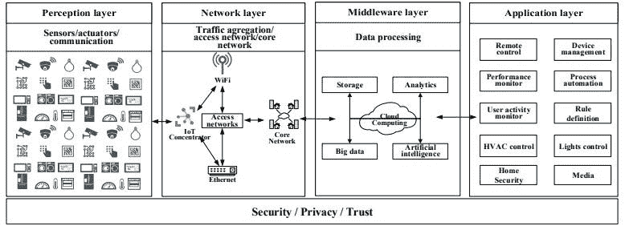

# 物联网通信的机器身份

> 原文：<https://medium.com/hackernoon/machine-identity-for-iot-communications-b2e92cac0dc7>

*机器对机器通信概述:流量、身份、挑战、解决方案*。

机器对机器(M2M)通信是指设备间的直接通信，通过这种通信，机器人/机器可以控制其他机器。M2M 通信可用于更有效地监控水处理设施或桥梁等关键公共基础设施的状况，减少人工干预。

该技术本身包括有线和无线连接，但我尤其对后者感兴趣，因为它具有更大的可扩展性。无线 M2M 通信也被称为物联网(IoT)。

**机器/事物**是物理实体，它们的身份和状态被传递到与互联网相连的 IT 基础设施。我们在集装箱、汽车或动物身上安装一个传感器，它就成为收集和分析数据的网络的一部分。这些设备包含许多或所有与计算机相同的元素:处理器、内存、存储、输入和输出、操作系统、软件。关键是，它们越来越便宜，越来越丰富，并且可以直接与互联网或与互联网连接的设备进行通信。

# M2M 通信:架构与类型

与需要人工批准、验证和授权的人类型通信(HTC)不同，机器对机器(м2M)通信指的是设备和底层数据传输基础设施之间的自动化数据通信。在下图中，我们看到了智能家居使用案例中物联网网络的一般通信方案。

The architecture [of a smart home environment](http://eudl.eu/pdf/10.4108/eai.6-11-2018.2279336)

随着物联网网络扩展到越来越多的行业，这些系统快速工作、以安全保密的方式交换数据并保持可靠变得至关重要。为此应该遵循的安全通信的基本原则是:身份验证(我总是需要知道我在和谁说话)、可用性(我必须能够在需要时进行通信)、保密性(其他任何人都不能获得消息)、完整性(消息不能被操纵)。

以下是目前最常用的 M2M 通信类型:

*   **后端对后端。**这是关于通过互联网向云提供商发送设备日志。它也适用于调度程序、守护程序和连续进程。
*   **物联网设备。**这是关于在服务器上统一来自小型、自治、专用设备的数据。
*   CLI 客户端。这涉及创建 CLI 应用程序，这些应用程序具有执行操作的必要权限，但仅在特定计算机上可用，如他们自己的计算机或大型机。

# 物联网设备的网络安全措施

在设备被闯入的情况下，流量分析对于检测利用 M2M 漏洞的 DDoS 攻击非常重要。M2M 和 HTC 流量之间存在明显的差异，这有助于找到攻击的来源并解决问题。正如[研究人员](http://eudl.eu/pdf/10.4108/eai.6-11-2018.2279336)所发现的，机器生成的流量和人类生成的流量之间存在重要差异:

*   正在传输的数据包数量少于 HTC 流量；
*   数据传输之间的时间间隔延长(长工作周期流量模式)；
*   具有相似统计特征的设备的流量模式；
*   输出流量的控制；
*   周期性流量和依赖于事件的流量；
*   聚合流量(来自特定于网络节点(如网关)的多个来源的组合流量)。

当前的通信网络不是为 M2M 应用设计的，尤其是因为 M2M 设备的行为可能与人类用户不同。将 M2M 应用程序引入现有系统将导致严重的过载，以及与其他用户和其他用户之间对网络资源的竞争。为了克服这一挑战，M2M 的交通应该优化，这将基本上发生在标准化。

但 M2M 通信公司的主要威胁不是其产生大量自动流量的能力，而是关键数据丢失的高概率。首先，在设备上设置正确的安全设置非常重要。出于安全原因，设备的操作系统空间应该划分为内核和应用程序，并在内核、用户模式和虚拟机中拥有独立的权限，以保护不同应用程序的权利。

# 物联网通信中的身份

为了确保安全通信，一方面，传感器必须能够容易地被网络网关识别，另一方面，必须检查网关本身的真实性。您可以使用 X.509 数字证书设置网关设备的身份。连接到网关的任何外部实体将能够验证现在启用 HTTPs 或 NTLS 协议的网关的身份。重要的是，有了证书，向现场设备或传感器发出的命令现在就来自可信设备。

设备身份也可以用设备 X.509 数字证书来保护。他们可以参考物联网制造商发布的初始设备标识符(IDevID ),或者参考网络管理员发布的本地重要设备标识符(lde vid)。每个 IDevID 都以这样的方式绑定到设备，使得在不知道用于影响加密绑定的私钥的情况下，伪造或传送到具有不同 id evid 的设备是不可行的。

或者，可以使用提供 TLS/SSL 安全服务的分布式 PKI 技术。代替 CA，它提供了一个[区块链网络](https://github.com/Remmeauth/remme-core/)(或者作为信任链替代的信任网络)。使用这种方法，网络管理员有可能控制所有被管理机器的身份，而不是通过过时的分级和复杂的公钥基础设施来确认它们。依赖于存储机器身份的中央服务器不足以响应现代通信速度的要求。

机器身份安全领域真正被业界接受的创新仍在路上，开源技术社区需要围绕现有的分布式技术团结起来。如何开始有许多可能性，例如，查看我们的 bounty challenge，集成分布式 PKI 协议以确保智能家居系统中的[安全物联网通信](https://gitcoin.co/issue/Remmeauth/gitcoin-remme-contest/1/2489)。

# 需要解决的机器身份挑战

物联网保护仍然不够安全，不足以防止像 [Mirai 未来组合僵尸网络](https://www.csoonline.com/article/3258748/security/the-mirai-botnet-explained-how-teen-scammers-and-cctv-cameras-almost-brought-down-the-internet.html)这样的攻击。尽管共享相似的体系结构，但各公司都在孤立地自行解决其 M2M 需求。此外，每天都有未知的设备、应用和用例加入，物联网领域也在不断变化和发展。互连以前从未连接过的异构 M2M 设备和应用程序并将其扩展到互联网的需求带来了新的复杂性。

然而，实现最佳安全实践的主要限制是物联网设备体积小、价格低，并且使用标准操作系统和协议，这引入了集中式网络解决方案类似的众所周知的弱点。