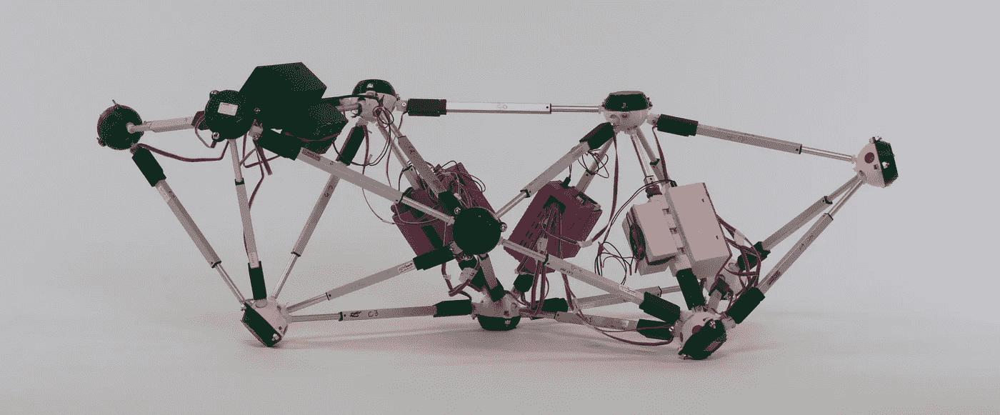

# 如何从创客毕业成为大众发明家

> 原文：<https://medium.com/hackernoon/maker-into-public-inventor-d337e155cb92>

The 7-Tet Tetrobot, a Public Invention

我们很多人都听过造物主之歌。正如多萝西·塞耶斯在“[创造者的头脑](https://en.wikipedia.org/wiki/The_Mind_of_the_Maker)”中所指出的那样，创造是对神的参与，或者至少是对神的模拟。

一直如此，但从未如此简单。今天，我们有创客空间、创客杂志和创客文化。我们有 3D 打印机、激光切割机和数控铣床；电脑驱动刺绣；整个开源软件的世界。甚至《我的世界》也是一种创造的媒介。埃默森式的自力更生根源于乡下人和先驱，他们制造几乎所有看得见的东西，在 20 世纪 60 年代发展成为业余爱好电子设备(那是当时获得立体声音响的一种方式)，并最终发展成为个人桌面激光切割机。

现代创客运动仍不成熟。孩子般的对简单事物的好奇，比如你的第一副激光切割的[松木 Tardis 耳环](https://www.etsy.com/listing/276257746/tardis-earrings-doctor-who-earrings?gpla=1&gao=1&&utm_source=google&utm_medium=cpc&utm_campaign=shopping_us_structuretest2019_d-jewelry-earrings-stud_earrings&utm_custom1=e512558d-87b0-449f-9c77-dfbadf2d721a&utm_content=go_1730355545_66715034334_337603379896_pla-354749637791_c__276257746&gclid=Cj0KCQjwoInnBRDDARIsANBVyAQPHb6Sk2Z8kmYZS1TAgxNfr0smR1gO8WRTuxAvvosW4dUDhGZLeTQaAkzzEALw_wcB)或者你的第一个 3D 打印的[克苏鲁](https://www.thingiverse.com/thing:2086578)雕像，应该被珍惜。我仍然喜欢它。但是没有父母希望他们的孩子永远是个孩子。

作为一个制造商，成长是多方面的。正如弗里曼·戴森指出的，宇宙在所有维度上都是无限的。人们可以使项目在难度维度上更先进；一个人可以做出更漂亮的物件；人们可以制造更多有用的物品。对大多数制造者来说，一个主要的动机是有一个朋友欣赏他们的作品所带来的满足感。欣赏我的作品，比如这篇文章，对我来说更意味着你喜欢我的头发或我的声音；那些东西是上天赐予我的。也许一切都是如此，但从某种意义上说，我创造的东西甚至比我的身体更真实地属于我。如果你喜欢我做的东西，它会让我觉得自己很重要，并在某种程度上受到赞赏。

但是我最感兴趣的方面是帮助他人。这个维度存在于创客运动中，但我想给它命名并强化它，让它更真实。我称之为[公共发明](http://pubinv.org)——在公众中，为公众的发明。

所有的制作过程从涂鸦到临摹到作曲到创新到发明。这些术语有些武断，但我使用术语“发明”或多或少像美国专利局那样，即使公共发明明确避开专利提供的垄断。也就是说，发明是真正新的有用的东西。这是一个高标准。你可能认为你不能成为一个发明家。你可以，我是来帮忙的。

任何能够设计和制作一套耳环的人都可以开始问自己:我如何利用这些技能来制作对他人有用的东西？可能性的海洋范围并没有使它看起来更容易。你可以设计一个园艺工具。太阳能收集器。堆肥工。一架望远镜。你的水棚模型。一个假肢。仅仅使用你的思维和激光切割机，你就可以通过对科学、医学、美食学、农业、教育做出贡献来影响全世界的人类。令人难以置信。但是，可爱的克苏鲁更容易；我们必须承认这一点。它更容易制作，也更容易欣赏。做耳环的话不太可能失败。要制造一种新的显微镜，你可能要学很多东西，而你的朋友可能不会欣赏。这个项目可能会彻底失败，这是发明的本性。如果成功是有保证的，它将很难保证“发明”的标题。

就我个人而言，我拥抱失败。在没有设定方法的情况下，我相信人们试图制造的劣质显微镜越多，就越有可能有人，甚至是其他人，制造出好的显微镜。如果你把自己的失败公之于众，那就更是如此，这是公共发明的原则之一。努力发明一些公益的东西，可以帮助全世界的人，这是一件大事。引用平克·弗洛伊德的话，我请你们扪心自问:你愿意“在战争中做跑龙套的，还是在笼子里做主角”？

让自己成为公共发明家的行为并不容易。《公共发明:101》还没有写出来——也许你可以帮我们写出来。从根本上说，你只需要开始思考如何用你的创造力去帮助别人。但是你也要冒更多的风险。你必须有更大的梦想。你必须尝试那些可能不会成功的事情。你必须了解人们需要什么。你可能不得不学一些让你害怕的东西，比如数学。但是想象一下回报:参与可能帮助地球上每一个人的项目的个人满足感。

你并不孤单。创客运动在创建社区方面做得很好。自由开源软件运动在如何组织不同的人进行创造性的、有时是人道主义的努力方面开辟了一条道路。公共发明很小，也很新，但它有两位高级发明教练随时准备提供帮助。

我们已经定义了大约 [45 个项目](https://docs.google.com/spreadsheets/d/1c_qcNfTRaGTTsexRF7Lp0HDJyPFmueahzMh6_wR3N1Y/edit?usp=sharing)，其中一些只是想法的草图，还有一些正在进行中，涉及农业、艺术、计算、能源、健康、机器、其他和科学等类别。我们已经描述了这些项目所需的技能和难度。

但是，从根本上说，公共发明不是关于组织，而是运动。如果创客运动产生的 1%的创造力作为一项运动应用于公共发明，人类生存的机会将会大得多。你可以成为公众发明家，只要你称自己为公众发明家；您不必联系我们，但我们可以提供帮助。

出于同样的原因，公共发明不是关于我的发明，也不是关于你的发明，而是关于*我们的*发明。大多数制造者有一打发明的想法，这些想法只是他们头脑深处的小火花。扇这些火花，喂它们；其中一些会变成火焰。你可以将这些想法“给予”公共发明——我们希望有一千个，这样潜在的志愿者可以更容易地找到与他们有共鸣的东西——只要你同意将它们免费提供给其他人。或者，没有我们，自己创造自己。

至少自从本杰明·富兰克林选择不为富兰克林的炉子申请专利以来，公共发明就成了一件事。但是五十年后，会有人在聚会上介绍自己是公共发明家。将会有数百万人直接为了人类财富和科学的自由和不受阻碍的进步而发明。你可以成为第一批。<read.robert></read.robert>