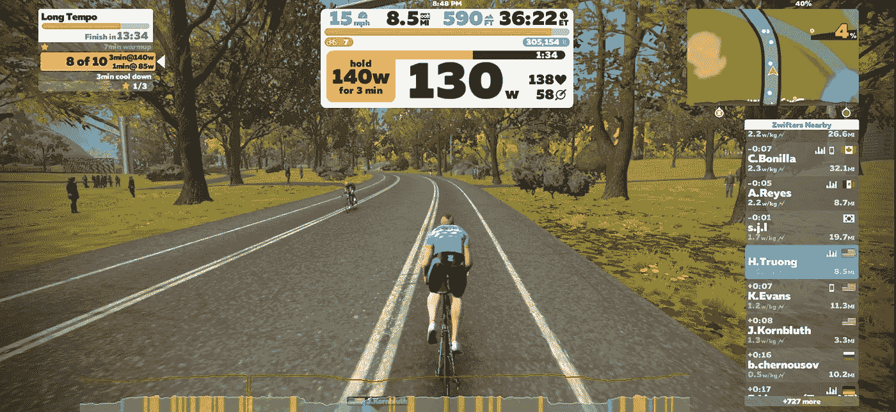
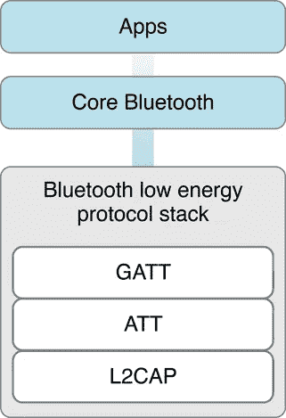
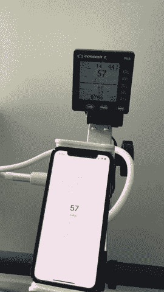

# 制作 iOS Zwift 克隆版，每月节省 15 美元！第 1 部分:核心蓝牙

> 原文：<https://medium.com/hackernoon/making-an-ios-zwift-clone-to-save-15-a-month-part-1-core-bluetooth-9925bba79f7a>

The BikeErg comes with the PM5: the most advanced PM thing ever.

我已经有一段时间没有做个人项目了，但我一直渴望开发一些新的 iOS 应用程序，昨天早上我决定继续下去，一起开发一些东西。

我最近购买了一辆名为[bike Berg](https://shop.concept2.com/bikeerg/601-bikeerg.html)的健身自行车(我认为这个名字与制造商也生产的划船机有关)。这辆自行车有一个内置的计算机，可以跟踪瓦特数(显然骑自行车是一项非常好的分析运动，因为它很容易跟踪原始功率)、燃烧的卡路里、节奏和其他东西。你可以在显示器上查看数据，或者使用像 [Zwift](https://zwift.com/) 这样的应用程序进行锻炼。

我现在一直在使用 BikeErg 进行定期锻炼，我尝试了许多可以连接到它的不同应用程序。Zwift 几乎是黄金标准，因为它有许多功能，如 3D 化身和环境，丰富的社区，以及许多不同的锻炼计划供您尝试。Zwift 还与 MyFitnessPal 和 Strava 等应用程序集成在一起，所以我可以欺骗人们，让他们认为我前一天在中央公园骑过车，第二天在伦敦骑过车。

Studies have shown that riding a bike in a completely white room really builds your FTP

虽然我认为 Zwift 的功能集真的很吸引人，但我更像是一个老学校应用程序用户。我不太关心网络社区。我真的不需要看着我的虚拟形象骑着他的自行车在一个未来的城市或一座爆发的火山周围转悠。我只是想做一些有针对性的锻炼，也许跟踪我的心率和燃烧的卡路里。每月 15 美元的价格对于那些使用所有这些功能并从中获得价值的人来说可能是不错的，但我觉得我没有。

It’s my virtual dude riding through a virtual New York with all his virtual pals

在这里要明确的是，我确实认为应用程序开发人员应该为他们的工作获得报酬，考虑到他们需要为所有用户的不同设置提供大量支持，Zwift 收取这笔费用绝对是合理的。在实现了一个小的概念验证之后，我对他们的开发团队产生了极大的敬意。

然而，我很便宜，我是一个 iOS 开发者，所以我想，“也许我可以推出我自己的假 Zwift！”

# 输入核心蓝牙

The more I stare at this image the less sense it makes

自从 iOS 5.0 SDK 中加入了 CoreBluetooth(我想第一个支持的设备是 iPhone 4s)，我就对蓝牙开发产生了兴趣。但是每次我试图坐下来阅读文档时，我都会因其复杂性而气馁，并最终被其他一些新的闪亮的 API 分散了注意力。因为我在这里有一个期望的用例:为自己做一个 Zwift 替代方案，所以我能够集中更多的精力，让一些东西工作起来。

虽然蓝牙协议非常灵活，但是这种灵活性也使得获得一个简单的概念证明变得非常复杂。如果你不知道特殊的蓝牙术语是什么意思，它看起来真的很令人困惑。我仍然没有真正理解它的全部，但我已经设法将一些东西拼凑在一起，作为我的假 Zwift 应用程序的基础。

我不想用技术术语和制作这个应用程序所需的步骤来烦你，我宁愿只是通过我的过程来弄明白它，这可能会稍微有趣一些。

# 当然叫“经理”

所以我做的第一件事就是去查看这个文档(我想它现在已经被废弃了，但是我在阅读它的时候没有注意到这个信息)，它覆盖了核心蓝牙框架。

我发现我需要创建一个 CBCentralManager，所以我创建了它，然后我尝试扫描一些蓝牙设备:

> let central manager = cbcentral manager()
> self . central manager . scanforperipherals(with services:nil，options: nil)

我立即得到一个错误，说我不能这样做，因为 centralManager 还没有启动。哎呀！然后，我设置了 centralManager 的委托，并等待方法“centralManagerDidUpdateState”在扫描之前检查它是否已通电。

我很快开始在我的下一个委托方法“central manager(_:did discover:advertisement data:RSSI:)”中获得一堆外围设备

我找到的东西包括我的笔记本电脑(一遍又一遍，尽管扫描设置为不允许重复…)，某人的蓝牙耳机和其他各种我无法识别的东西。成功！

一旦我过滤掉不断重复的外围设备，我就能够打开自行车(通过骑一会儿自行车)，并且我在我的日志中得到这样的消息:

我成功找到了我的 PM5。现在连接到它并获取数据。我最终根据名字连接到了 PM5。(在做了一些阅读后，看起来我可以根据“ce 060000-43e 5-11e 4-916 c-0800200 c9a 66”的最后一个服务 UUID 进行连接)。

我调用了 centralManager 的“connect”函数，后来得到了一个错误，因为外围设备没有保留(我猜中央没有保留一个强引用，这是有道理的)。我又试了一次，这次在一个数组中保存对外设的引用。

# 外围设备、服务和特性

一旦我连接，我必须发现外围设备的服务。一旦成功了，我必须发现每个服务的特点。一旦发现这些特征，您可以设置外围设备的服务特征，以便在特征发生变化时“通知”您。更深入地说:

*   使用中心的“连接(_:选项:)”方法连接到外围设备并保留它
*   处理"*central manager(_:did connect:)*" delegate 方法，其中设置外围设备的委托并调用其" discoverServices(_:)"方法
*   处理“peripheral(_:didDiscoverServices:)”委托方法，并为您想要发现其特征的每个服务调用外围设备的“discovercharacters(_:for:)”(此时为什么不为所有服务调用呢？)
*   通过对每个需要通知的服务特征调用外围设备的“setNotifyValue(_:for:)”方法，为每个需要发现的服务特征处理“peripheral(_:didDiscoverCharacteristicsFor:error:)”委托方法。
*   可以选择处理“peripheral(_:diddupdatenotificationstatefor:error:)”方法，查看是否能够成功更新每个外围设备的服务特征的通知状态。在某些情况下，我无法要求更新，也许这些特征只是静态数据？
*   处理“peripheral(_:diddupdatevaluefor:error:)”方法以获取您想要通知的每个特性的更新值。

这一切对我来说似乎真的很费解，这可能是我过去一直放弃实现蓝牙的部分原因，但我认为这更像是蓝牙协议的复杂性而不是 CoreBluetooth API 的症状。

现在我需要做的就是通过骑自行车几秒钟来生成一些数据。不过，我还没有完全完成。当特性被更新并且您开始得到通知时，您可以检查新的值，但是那些值只是[数据对象](https://developer.apple.com/documentation/corebluetooth/cbcharacteristic/1518878-value)。根据数据的结构，每个特征可以包含许多值，这取决于实现蓝牙协议的人。

我做了一些研究，发现[这份文档](https://www.concept2.com/files/pdf/us/monitors/PM5_BluetoothSmartInterfaceDefinition.pdf)描述了 PM5 设备的蓝牙规范。

Just some really interesting light reading

该文档中有一些表格，包括上面描述 UUID 特性的表格，其中包括经过的时间、卡路里以及最重要的瓦特数。我发现数据被编码成字节，所以我将原始数据对象分割成一个 8 位整数数组。当我开始打印这些数组时，我看到了这样的东西:

I originally printed out the Base 64 string representation of the Data before reading the doc, which was a lot less useful

因为 PM5 最初是为划船机设置的，所以文档有点混乱。它指的是可能与自行车上的每分钟转数一致的“笔画”？我对 watts 感兴趣主要是为了证明我的概念，所以我在提到 watts 的文档中找到了一些值。规格中的表格提到了“冲程功率 Lo(瓦特)”并有一个“冲程功率 Hi”(有什么区别？).我拼凑了一个界面来测试我对第一个值的猜测，下面是视频结果:

I took this video with an iPad and for once I’m not ashamed of that. Also it’s shaky cause I was cycling.

成功！我现在可以用我的应用程序将我的手机连接到我的自行车上。到目前为止，我只获得了自行车的瓦数数据，但通过阅读规范，似乎有更多的我可以通过蓝牙拉。例如，通过使用 Zwift，我已经知道我可以从自行车上获得节奏，我还看到了一些其他有趣的东西，如卡路里、速度和行驶距离。

# 每个旅程都从单核蓝牙实施开始

我将这篇博文命名为“第一部分”，但我不知道下一步会是什么时候。我的愿望是:

*   我希望最终能以类似 Zwift 的方式建立定向锻炼
*   我还希望能够跟踪我的心率，这可以通过为我现有的应用程序编写一个 Apple Watch 应用程序来实现
*   我希望能够存储我的锻炼数据，并与 Apple Health 集成
*   我想导入锻炼，或者至少在应用程序中创建锻炼
*   我想绘制自行车的实际瓦特数与指导瓦特数的图表，并显示心率和直方图
*   我想避免功能蠕变

我还没想好以什么顺序做这些事情，但是现在我将继续使用 Zwift，因为我已经支付了会员费。我的下一步可能是将连接到 PM5 的代码分解到它自己的项目中，并以一种易于使用的形式提供其中的所有数据。我有点在这两者之间左右为难，只是为了锻炼而获得 MVP。

如果要我估计的话，到目前为止我大概花了 3 个多小时在这个项目上，花在写这篇博文上的时间更多。如果我根据我的签约率来衡量我的时间价值，我大概可以用它支付一年多的 Zwift！因此，这个项目实际上更多的是学习不同的 iOS 技术，而不是省钱。

如果你觉得这篇博文有趣，请告诉我！我想写下我的过程，以便我能记住它，但希望它对任何试图实现 CoreBluetooth 的人都有用。我找到了一些连接到心率监测器的示例代码，但我没有找到任何将代码写入规范文档的示例代码。如果你想尝试自己运行这个应用程序(而你恰好有一辆和我一模一样的自行车)，请点击这里查看源代码。

2019 年 3 月 23 日更新:我将自行车上的一些值添加到我的蓝牙服务中，并意识到规范中的“lo”和“high”值是指这些值中的一些值不适合 8 位整数。所以我修改了 watt 实现，将这两个值一起使用，并添加了其他值，没有问题。我可能应该更注意规范中的“lsb”注释。