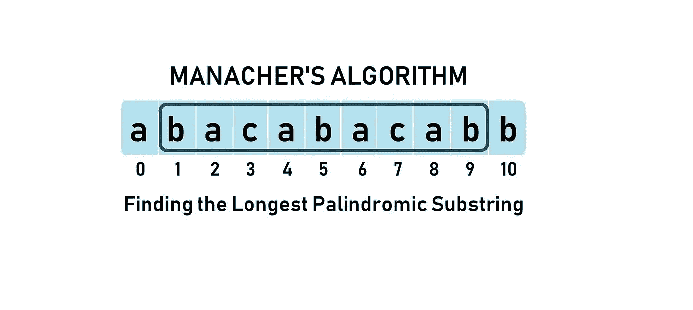
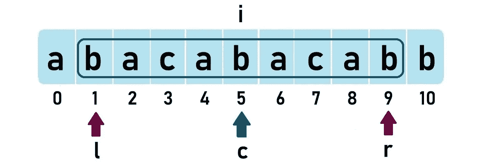
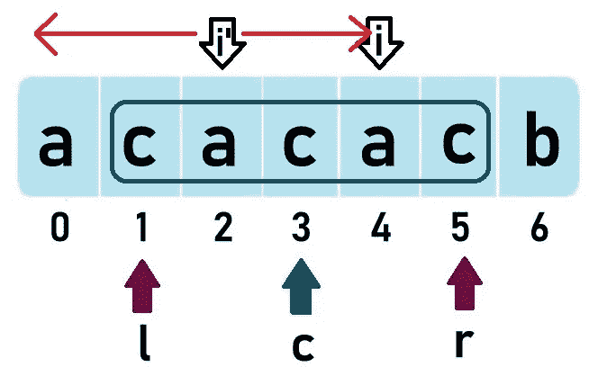

# Manacher 算法解释—最长回文子串

> 原文：<https://medium.com/hackernoon/manachers-algorithm-explained-longest-palindromic-substring-22cb27a5e96f>

Manacher 的算法帮助我们找到给定字符串中最长的回文子串。它通过使用对回文如何工作的一些见解，优化了暴力解决方案。怎么会？让我们看看！

为了简单起见，让我们关注奇数长度的回文。我们从左到右绕着绳子走。

***符号:***

设 c 是我们到目前为止遇到的最长的回文的中心。并且设 l 和 r 分别是这个回文的左右边界，即最左边的字符索引和最右边的字符索引。现在，我们举个例子来理解 c，l，r。

例如:“阿巴卡巴卡布”

从左到右，当 I 在索引 1 时，最长的回文子串是“aba”(长度= 3)。

c, l, and r for palindromic string “aba”

当回文以索引 5 为中心时，给定字符串的答案是 9；c、l 和 r 如下所示:

Final c, l, and r positions for the whole string

现在我们知道了 c、l 和 r 分别代表什么，让我们暂时离开算法，理解一些关于回文的有趣事实。

**镜像索引:**对于任何以 c 为中心的回文，索引 j 的镜像是 j’使得

对于回文“阿巴卡巴”，**j 的镜像是 j’，j’的镜像是 j** 。

for some j, its mirror j’ for palindrome “abacaba”

现在，回到算法上来。当我们从左向右移动 I 时，我们试图在每个 i 处"**展开**回文**。当我说单词 expand 时，意思是我将检查是否存在一个以 I 为中心的回文，如果存在，我将把"**扩展长度**"存储到一个新数组中，这个新数组称为 **P[] array** 或(有些人更喜欢) **LPS[]** 。**

> **如果 I 处的回文扩展到当前右边界 r 之外，则 c 被更新为 I，新的 l，r 被找到并更新。**

示例时间。让我们以之前讨论过的回文“abacaba”为例，它以 i = 3 为中心。

P[i] = 3 as expansion length for palindrome centered at i is 3

因此，P[]数组存储以每个索引为中心的回文的扩展长度。但是我们不需要每次都手动去每个索引展开检查展开长度。这正是 Manacher 的算法比蛮力优化得更好的地方，通过使用一些关于回文如何工作的见解。我们来看看优化是怎么做的。

*重要回顾:* **c** 表示当前最长奇数长度回文的中心。而 **l** ， **r** 分别表示回文的左右边界。

让我们看看字符串“abacaba”的 P[]数组。

当 i = 4 时，索引在当前最长回文的范围内，即 I< r. So, instead of naively expanding at i, we want to know the minimum expansion length that is certainly possible at i, so that we can expand on that minimum P[i] and see, instead of doing from start. So, we check for mirror **I’**。

> **只要索引 I '处的回文没有扩展到当前最长回文的左边界(l)之外，我们就可以说 I 处最小的肯定可能扩展长度是 P[i']。**

请记住，我们只是在谈论最小可能的扩展长度，实际的扩展长度可能会更长，我们稍后将通过扩展来了解这一点。在这种情况下，P[4] = P[2] = 0。我们试图扩展，但 P[4]仍然是 0。

> **现在，如果索引 I’处的回文扩展到当前最长回文的左边界(l)之外，我们可以说 I 处最小的肯定可能的扩展长度是 r-i**

例如:“acacacb”

Here, palindrome centered at i’ expands beyond the left boundary

因此，P[4]= 5–4 = 1

你可能会问，但是在这种情况下，为什么以 I 为中心的回文不能在 r 之后展开？如果是的话，那么它已经被当前的中心 c 覆盖了。但是，它没有。所以 P[i] = r-i。

(也就是说，如果 I 处的回文扩展到 r 之外，那么索引 6 处的字符应该是‘a’。但是如果发生这种情况，当前以 c 为中心的回文就不是“cacac”而是“acacaca”)

因此，我们可以将上面引用的两点总结如下:

Updating P[i] to the minimum certainly possible expansion length

就是这样。现在唯一剩下的事情就是在 P[i] 之后在 I 处展开**，所以我们从索引(P[i] + 1)开始检查字符，并在 I 处继续展开。**

如果这个回文扩展到 r 以外，就把 c 更新为 I，把 r 更新为(i + P[i])。

瞧啊。P[]数组现在被填充了，数组中的最大值给出了给定字符串中最长的回文子串！

*我们在上面的解释中采用了一个奇数长度的字符串。因此，为了使这个算法有效，我们只需在每两个字符之间添加 N + 1 个特殊字符(比如' # ')，以确保修改后的字符串总是奇数长度。*

eg1:ABA-> # a # b # a #
Eg2:ABBA-># a # b # b # a #

下面是 Java 中的实现:

时间复杂度:O(N)
空间复杂度:O(N)

请在下面的评论中畅所欲言。感谢您的阅读！😃