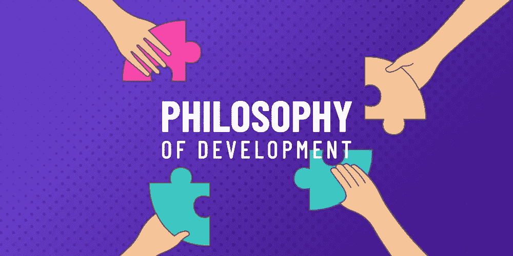
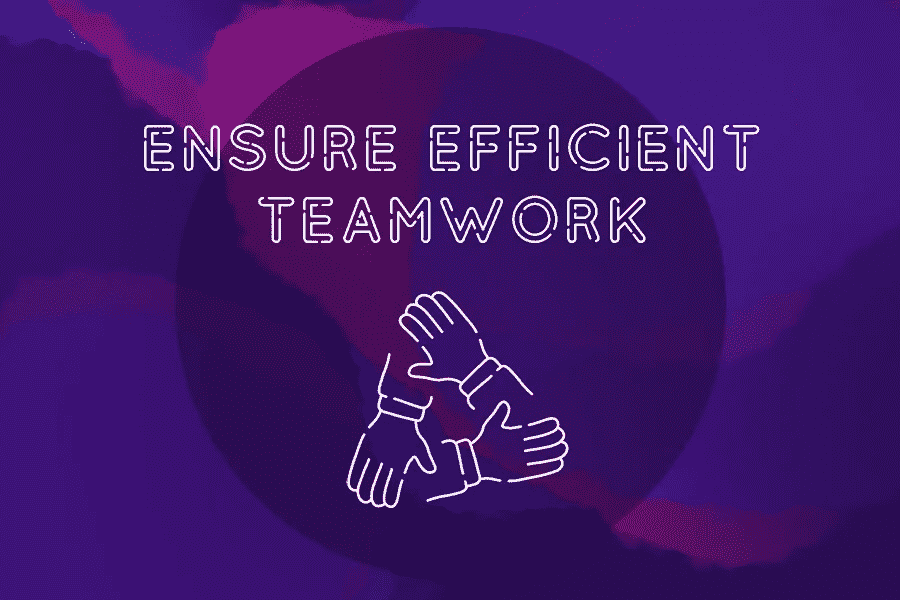
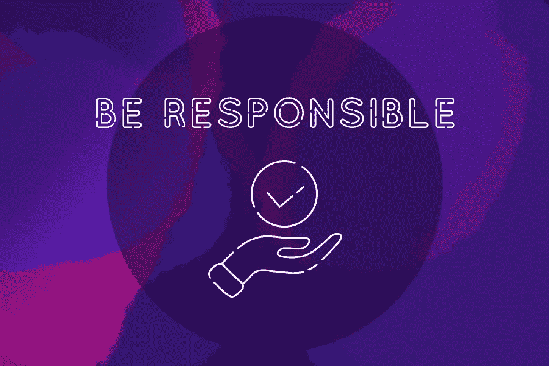

# 管理软件公司——发展哲学

> 原文：<https://medium.com/hackernoon/manage-software-company-philosophy-of-development-3deae2df964f>

总有时间来谈论影响软件开发公司离职率的工作道德和规则。你提供什么样的奖金或激励并不重要——如果公司没有强有力的领导和明确的指导方针，员工很可能不会在那里呆很长时间。

在[dash bounk](https://dashbouquet.com)，我们重视这样一个事实，即我们的员工已经和我们在一起很长时间了，而且不断有新人加入这个团队。我们认为其中一个原因是我们的黑名单规则。因此，我们想与你分享主要的收获——也许它们会启发你想出自己的指南或帮助你改进当前的指南。

# # 1

众所周知，即使是最小的谎言也会导致大问题。健康的工作环境意味着员工可以随时信任你，承认他们的错误或请病假，而不用担心后果。

我们认为软件开发公司应该关注质量而不是数量。也就是说，一段写得很好且清晰的代码比一个充满错误和 bug 的完整任务要好。这就是为什么我们不介意人们在需要的时候休假:条件是他们要在截止日期前完成项目。

因此，任何公司的首要任务都是在员工不怕承认错误或请一天假的情况下，在雇主和员工之间建立信任。

## 不信任的常见例子:

*   你检查过它是否工作吗？—是的，应该是。
*   已经下午 3 点了，你还没上班？—我发烧了，想呆在家里。
*   你今天做了什么？—有一个错误，我不记得具体是什么了，所以在最后三天，我什么也没做。

## 向团队传达的信息

*   如果你不能在截止日期前完成，报告一下，这样工作就不会暂停。
*   如果你觉得不舒服，报告一下。我们不鼓励为了工作而牺牲自己的健康。
*   如果有人问某样东西是否在工作，要先检查后再确认，以免以后重复劳动。
*   如果你不知道什么，不要犹豫承认。

# # 2

我们在家里和工作中都会做很多事情。有些是因为我们不得不做，而有些是因为我们想有所成就。这就是我们所说的动力，这就是普通事物和伟大事物之间的区别。

如果你的开发人员只是因为不得不工作而不喜欢工作，很可能你不会得到好的结果。另一方面，如果你的员工真的对高质量的结果感兴趣，并对工作充满热情，他们会尽最大努力提出创新和高效的解决方案。

## 向团队传达的信息

*   试着为你做的任何事情寻找内在的动力。
*   对自己诚实，为什么你会以某种方式行动。当你开始承认自己的错误时，你就开始成为一名真正的专业人士。
*   主动而不是被动:提出建议，而不是问下一步该做什么。

# # 3

对于组织工作场所如何影响整体工作结果，有不同的观点。我们认为保持一切井然有序是专业人士的可靠标志。

这不仅关系到工作场所组织，也关系到工作流组织。当你不知道故障在哪里以及如何修复时，那就是一种障碍。同样的情况也适用于一切都模糊不清、工作流程没有明确规则的情况。

创建线框和写下发展计划——所有这些过程都有助于构建你的工作。一旦你有了明确的目标和大致的计划，就更容易避免错误并达到预期的结果。

## 良好的组织包括:

*   员工的福利；
*   有组织的工作场所；
*   定期与客户沟通；
*   定期和及时的状态电话；
*   清码；
*   定期测试；

## 向团队传达的信息

*   注意按时填写报告；
*   不要提交注释的代码；
*   始终测试代码；
*   制定一套内部规则并遵循它们。

# # 4

团队合作不仅仅是一群人从事同一项工作。最重要的是，这是关于互助的。

这里值得一提的是招聘/人力资源流程的重要性，它有助于选择最适合您团队的候选人。没有人能强迫员工成为最好的朋友——但是如果他们互相交流，并且毫不犹豫地寻求和提供帮助，那就太好了。

沟通上的差距会导致项目冻结和进一步的后果。确保你的团队成员相处融洽，知道何时介入并互相帮助。

## 一个例子

这个有问题，你能检查一下吗？

## 为什么不好

如果有问题——尽可能精确地描述，不要过多赘言。寻求帮助是很好的，但是不要带着一个模糊的请求。做一些基础工作，告诉这个人问题的实质，让他们更容易解决。

# # 5

责任等于行动。当你把责任推给别人时，会对你的工作产生负面影响。

这一点与建立信任有关。当员工信任你时，他们很可能会对你的行为负责，因为他们知道这不会导致任何糟糕的事情。同时，通过承担责任，他们会增强自己的信心，并赢得你和同事的尊重。

## 推卸责任的例子:

*   我们不能影响局势。
*   闹钟没有响，这就是我迟到的原因。

## 向团队传达的信息

*   记住:你的工作帮助你实现了你现在拥有的一切。你同样要为你的错误和成就负责。
*   更多的责任会让你得到更多的尊重和帮助。
*   学会接受自己的错误，并把它们变成有用的教训。

# # 6

任何行动都会有结果。但是为了使这个行动有用，你应该在头脑中有一个明确的目标。

你想说什么想法？你要做什么任务？这个项目现在进展如何？

所有这些问题都很重要，都应该有一个清晰明确的答案。如果员工不能回答项目处于哪个阶段，或者他/她当前的任务是什么，这表明这个人没有动力，没有目标要实现。

最终，只有结果才是最重要的——如果一个人不知道自己的目标是什么，他们就不可能实现。

## 向团队传达的信息

*   说话前先思考，避免误解。
*   做任何事情时，都要保持一个有条理的计划。
*   将任务分解成更小的任务，但始终将注意力放在最终目标上。

# 一锤定音

当然，每个开发公司都是独特的，都有自己的一套规则和指南可以遵循。

然而，我们个人的例子证明了我们的[黑皮书](https://dashbouquet.com)是有效的。我们看到员工流动率很低，我们的团队是一群喜欢聚在一起、总是互相帮助的朋友。如果我们能帮助你们中的一些人调整流程，那就太好了——让我们知道你的想法！

[*安东·沙列尼科夫*写的](https://www.linkedin.com/in/anton-shaleynikov-45812a1/)