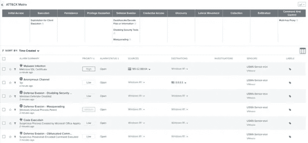
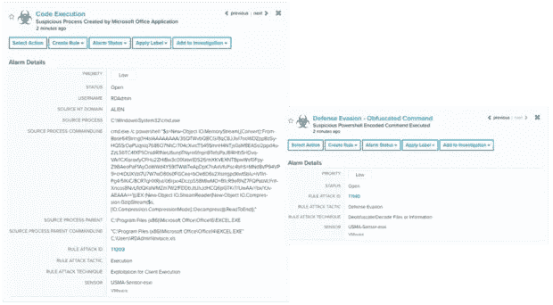
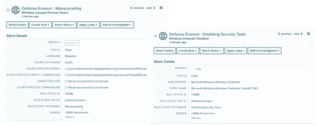
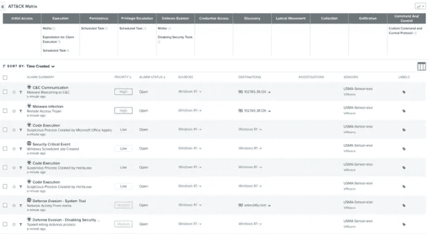
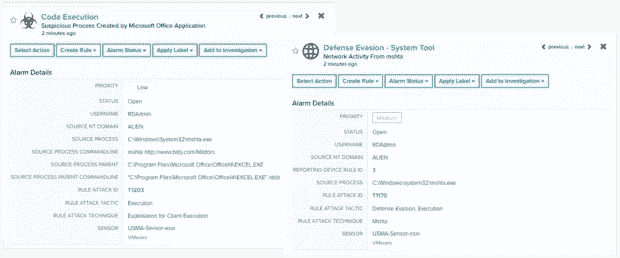
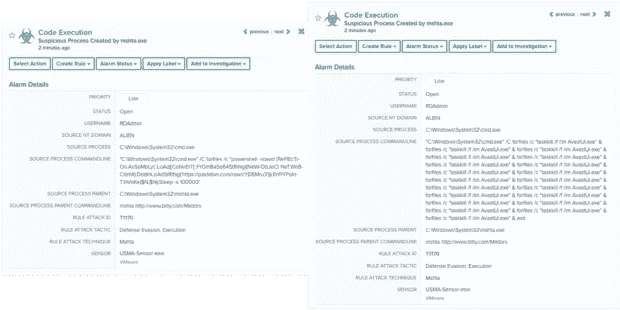
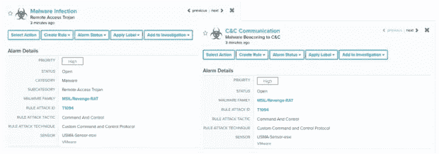

# 地图 TrickBot 和复仇与米特 ATT 和 CK 和 AlienVault USM 无处不在

> 原文：<https://medium.com/hackernoon/mapping-trickbot-and-revengerat-with-mitre-att-ck-and-alienvault-usm-anywhere-12f7de311212>

## 米特 ATT 和 CK(**A**dversarial**T**actics，**T**techniques 和**C**ommon**K**knowledge)是一个理解攻击者行为和行动的框架。

我们很高兴地宣布，AlienVault USM Anywhere 和[开放威胁交换(OTX)](https://otx.alienvault.com/) 现在包括米特 ATT & CK 信息。通过将警报映射到相应的 ATT & CK 技术，我们可以通过了解攻击的背景和范围来帮助[确定](https://hackernoon.com/tagged/prioritizing)分析工作的优先级。

下面我们概述了这项新功能如何帮助您调查两种威胁— [TrickBot](https://hackernoon.com/tagged/trickbot) 和 RevengeRat。

绘制 ATT 和 CK 感染 Trickbot 的地图

Trickbot 是一个恶意软件家族，几年前被发现以银行业为目标，但经过一些[调查](https://blog.trendmicro.com/trendlabs-security-intelligence/trickbot-adds-remote-application-credential-grabbing-capabilities-to-its-repertoire/)后，它仍然活跃并不断发展。该恶意软件通常通过鱼叉式网络钓鱼电子邮件使用附带的 Office 文档进行传播。

这个特定的示例通过从恶意的 Excel 文档通过命令行运行 PowerShell 脚本来工作。该脚本将加载需要在内存中执行的代码，并运行有效负载。为了在不被检测到的情况下运行有效负载，恶意软件将试图禁用和逃避反恶意软件保护。完成后，它会将自身复制到另一个位置，并从那里运行。它还产生了 svchost.exe 进程的实例来执行一些任务，例如下载配置文件和注入浏览器来窃取用户凭证。

AlienVault USM Anywhere 会检测和跟踪以前的恶意软件行为，并将所有不同的行为映射到 ATT 和 CK 定义。这提供了对攻击阶段和策略的清晰理解，并使分析工作更容易。

在我们的环境中运行该示例，我们可以观察到，一旦用户打开恶意的 Office 文档，USM Anywhere 就会自动触发不同的警报:

*   由 Microsoft Office 应用程序创建的可疑进程
*   执行了可疑的 Powershell 编码命令
*   Windows Defender 已禁用
*   Windows 异常进程父进程
*   突岩
*   恶意 SSL 证书

现在可以看到这些警报映射到 ATT 和 CK 矩阵:

正如我们所观察到的，ATT&CK 矩阵提供了 Trickbot 使用的技术和策略的可见性。从执行策略、防御规避机制开始，到指挥和控制活动结束。

kill 链中的第一个警报是由 Microsoft Office 应用程序创建的**可疑进程。打开恶意文档后，进程 EXCEL.EXE 创建一个新进程来运行 PowerShell 命令，并使用 IO 将代码加载到内存中。MemoryStream 类。我们可以看到报警**执行的可疑 Powershell 编码命令**是如何检测到恶意活动以及编码命令试图逃避检测的。**

在注入其他进程之前，恶意软件会尝试禁用反恶意软件保护机制，以规避端点检测。在这种情况下，我们检测它如何试图通过触发警报 **Windows Defender Disabled** 来停止 Windows Defender 服务。

Trickbot 执行的下一步是将自身复制到另一个目录并再次运行。启动了 svchost.exe 进程的一些新实例，但是如您所见，该进程的父进程不是 Windows 通常在进程树中使用的那个。

我们可以看到该行为的另一个警报，表明正在使用伪装技术 [T1036](https://attack.mitre.org/techniques/T1036/) :

在杀伤链的最后一步，Trickbot 恶意软件试图联系命令和控制服务器。网络签名与该家庭使用的 SSL 域相匹配，并作为**恶意 SSL 证书**向其发出警报。

网络活动还检测到一个针对**或**域的 DNS 查询，通常用于匿名和多跳代理连接:

复仇鼠

复仇远程访问特洛伊木马是一种常见的公开远程访问特洛伊木马。复仇鼠允许攻击者捕获个人信息，使用键盘记录器和网络摄像头功能监控用户行为，窃取数据，甚至在受感染的系统中投放新的恶意软件。Malspam 通过恶意的 Office 文档提供“复仇之鼠”,而基础设施使用博客发布服务(如 blogpost.com)来托管将由 Office 文档执行的恶意脚本。

一旦系统被感染，这种恶意软件使用持续机制(如计划任务)来保证持续执行，并向命令和控制服务器发送信标功能。所分析的 Revenge RAT 变体使用带有代码执行的本地计划任务从远程服务下载内容。

当用户打开 Office 文档时，会触发以下 USM Anywhere 警报:

*   由 Microsoft Office 应用程序创建的可疑进程
*   mshta.exe 制造的可疑过程
*   mshta 的网络活动
*   Windows 计划作业已创建
*   Taskkill 杀毒进程
*   恶意软件指向 C&C
*   远程访问特洛伊木马

我们也可以从 ATT&CK 矩阵中看出这一点:

正如我们在上面看到的，之前详述的老鼠行为已经产生了许多警报，这些警报都被映射到 ATT&CK 框架。现在，很容易识别攻击模式，从执行到命令和控制信标。

首先，由 Microsoft Office 应用程序创建的警报**可疑进程检测到 EXCEL.EXE 进程正在将 mshta.exe 作为子进程执行。然后我们可以看到从 mshta** 到 www.bitly.com[的**为了下载恶意内容的网络活动:**](http://www.bitly.com)

作为该活动的结果，由 mshta.exe 创建的**可疑流程的两个警报被触发。其中一个使用 PowerShell *反射检测代码何时被加载到内存中。Assembly* 类和另一个检测有效载荷何时试图杀死反病毒软件，触发 **Taskkill 杀死反病毒进程**警报。**

该活动还为创建的 Windows 计划作业**生成警报。如果我们检查与警报关联的事件，我们可以看到在系统中为执行和持续创建的计划任务的详细视图，以及它如何映射为 ATT & CK 技术 [T1053](https://attack.mitre.org/techniques/T1053/) 。**

最后，在介绍了执行、持久性和防御规避策略之后，还可以回顾恶意软件执行的命令和控制活动。

使用网络检测，我们可以很容易地识别出系统被名为 revenue-RAT 的**远程访问木马**感染，并且还有另一个**恶意软件向同一恶意软件家族的 C & C** 发出警报，表明系统正在与攻击者基础设施进行通信。

