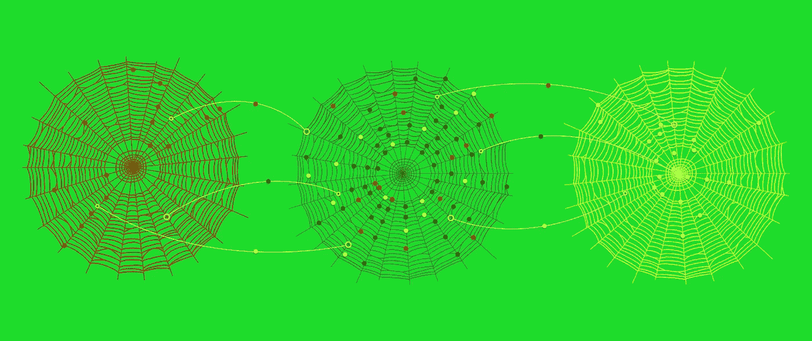

# 市场网络:四年展望

> 原文：<https://medium.com/hackernoon/market-networks-a-four-year-perspective-2193f16d6e5e>

市场网络作为一个术语，今天仍然没有明确的定义，甚至没有一个维基页面，但它很容易理解。

早在 2015 年，市场网络作为一个概念就在风投中引起了相对较大的轰动，TechCrunch 和 NFX(一家风险基金)的出版物就证明了这一点:

*   TechCrunch: [从社交网络到市场网络](https://techcrunch.com/2015/06/27/from-social-to-market-networks/)
*   NFX: [下一个 10 年将是关于“市场网络”](https://www.nfx.com/post/10-years-about-market-networks)

已经四年了，然而，炒作在哪里？

在这篇文章中，我将对什么是市场网络做一些解释，并提供一个视角。(剧透:如果你关注我，你就会知道这是关于区块链的)。

# 什么是市场网络？

简而言之，市场网络是市场和社交网络的融合，通过 SaaS 解决方案来帮助服务提供商——市场网络中的个人，而不是公司——与客户和其他服务提供商合作，开展更持久、更复杂的项目，而不仅仅是像优步或易贝那样的快速交易。尽管如此，正如黑客新闻的一位用户评论的那样，“SaaS 的部分似乎只是被扔在那里，就像法国食物上的番茄酱。”

市场主要是关于交易的，尽管肯定会有评论和总体评分，潜在客户会根据这些来做出购买决定。大多数人在订购优步顺风车时会检查司机的分数，易贝和购买产品时也是如此，等等。然而，这些都是市场，因为买家和卖家在那里进行一次性交易。市场是卖家的聚集地。

社交网络是——嗯，它们是社交网络。人们在 LinkedIn、脸书等网站上交流和建立关系。商业不是社交网络的核心目标。

所以，现在你有了两个独立的地方来展示你的在线形象和进行商务活动:一个销售商品的市场和一个建立关系的社交网络。

然而，如果你提供的服务比简单的买卖交易更复杂，那该怎么办呢？除此之外，如果您需要与您所在行业的其他专业人士合作，组建一个团队来提供端到端的服务，该怎么办？

这就是市场网络发挥作用的地方。在市场网络中，你是一个服务提供商，但也是一个有个人资料的人，有历史，评论，评分等。您可以与其他人合作，为客户提供复杂的服务，并通过 SaaS 解决方案引导工作流程。

四年前，HoneyBook 被誉为这种新型市场网络创业公司的典范，风投竞相投资。

HoneyBook 是活动策划行业的市场网络。典型的 HoneyBook 场景是:

1.  你注册成为一名活动策划人——一个愿意提供服务的人。
2.  你用 HoneyBook 建立你的个人资料，它就是你在网上的家。
3.  您可以使用内置的 SaaS 解决方案与您的客户合作，发送建议书，以数字方式签署合同等等。
4.  你还可以与 HoneyBook 网络中的其他专业人士合作，这些专业人士拥有个人资料和声誉，可以为活动提供端到端的服务。举个例子，你为一个客户的婚礼做所有的策划，和一个摄影的人一起工作，并为这个活动签约一个花店。当事件结束时，每个人都得到报酬。

有道理，对吧？这个世界最终将朝着人们如何相互协作的最高粒度级别(个人级别)发展，包括服务的提供。市场网络似乎与此合拍，早在 2015 年就有人宣称，未来十年将是市场网络的十年，就像之前的十年是社交媒体的十年一样。

然而，四年过去了，炒作已经不存在了。Honeybook 似乎已经转向了项目管理 SaaS 解决方案。发生了什么事？

我没有任何内部知识，但我有一个观点，我想分享一下。

# 在网络进化的道路上快速漫步

你可能已经听厌了 Web 1.0、Web 2.0 和 Web 3.0 这个词，但我还是要使用这些术语，因为它们最容易设置正确的上下文。

## Web 1.0

Web 1.0 非常宽松的时期是 90 年代到 21 世纪初。这是突然之间，任何人都可以将他们的联网电脑变成网络服务器，成为互联网的活跃分子。在网上向任何人提供信息的便利是一个巨大的商业和创业机会，它大约在世纪之交达到顶峰。

## Web 2.0

从 2000 年代中期到现在。虽然 Web 1.0 更像是一个在线公告板，你可以发布任何内容，但只能单向发布，没有真正的反馈，但 Web 2.0 更多的是协作和合作。

标志 Web 2.0 的术语是*平台*。互联网现在完全是一个平台，在这个平台上，你可以和其他人在线交流，交换信息，一起创造东西。平台化成为新的王者。也很棒。你现在能够成为一个平台上活跃的一部分，而不是拥有一系列非常不同和古怪的网站来检查信息——就像你检查广告牌一样。不仅如此，你还能赚钱——例如，在 Airbnb 上出租你的房间，并通过审核系统建立客户关系。

Web 2.0 的特点是，从 Reddit 到优步，它都是关于*平台*。平台是网络经济的容器化版本。它们是孤立的网络，无法相互通信。最重要的是，他们真的不想，因为他们总是属于某个人。而某个人永远不是给平台带来价值的社区。

## Web 3.0

关于 Web 3.0 是什么或者应该是什么，有很多观点，关键点是它的定义特征是真正的协作。

然而，真正的合作是一个相当模糊的短语。

为了使 Web 3.0 更加具体，并与万维网发展的前两个阶段相联系，我想提出以下两个明确的特征:

*   平台目前所代表和体现的孤立的经济网络不可能是孤立的。
*   这些平台必须属于为它们带来价值的成员，因此它们必须是一个网络。

历史重演说明了平台不可能是孤立的——80 年代没有万维网，都是孤立的网络。就像你当时不能浏览互联网，在网上浏览文件时不能随意地从一个网络服务器跳到另一个服务器一样，举例来说，你今天不能使用你的 Reddit karma 在亚马逊上经营一家商店。

这就引出了第二点:平台不可能是平台。目前，互联网上的粒度级别是每个平台，而不是每个人。可以在 Kickstarter 上有账号，但是不能在 GitHub 上使用。这是两个完全隔离的网络。粒度的级别必须降低一个级别——到人。人们——或者更像我们的数字代表——a)必须能够独立于平台运行，b)他们运行并带来价值的网络必须属于他们。

# 这将市场网络置于何处？

你看，我认为市场网络虽然在某种程度上符合世界向个人细分化发展的趋势，但仍然停留在 Web 2.0 的思维模式中，而我们正在向 Web 3.0 过渡。

说到底，市场网络平台是平台，被看做平台。它们被隔离和集装箱化。它们进一步分裂了网络。要想在这个用户数量不断增长的巨大数字空间中成功经营一家企业，你必须在许多网络中保持自己的形象——社交网络或市场网络——而且你不可能毫不费力地将你的声誉从一个网络扩大到另一个网络。

如果你在网络上的数字自我一直属于你，而不是属于某项服务，并且你的数字自我的声誉是由网络维护的，那会怎样？也属于你的网络？这将是分散的声誉，你可以插入任何其他集中的网络，包括市场网络。

对于一个集中的营销网络来说，区分不同的服务提供平台并不容易，建立一个只能在一个孤立的网络中使用的平台配置文件需要付出很大的努力。当你的声誉分散时，整个数字空间就变成了你的市场网络。

区块链是最终的基础设施工具，让个人真正拥有自己的数字自我和声誉。这是向 Web 3.0 过渡的最大区别。

分散的、可插拔的或可移植的——随你怎么称呼它——是关键组件，而不是孤立网络中的 SaaS 解决方案。

哦，这就是我们正在和 [U Community](https://u.community/faq) 做的事情。