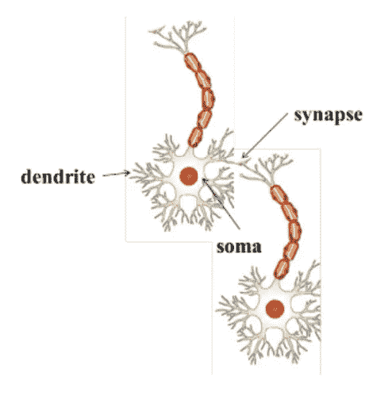
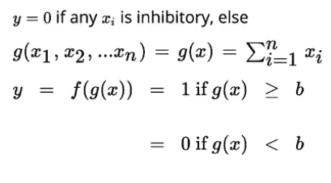
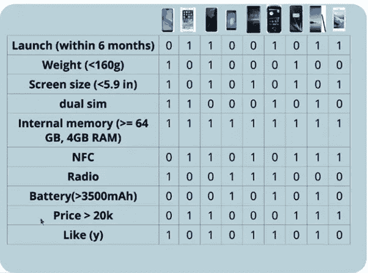
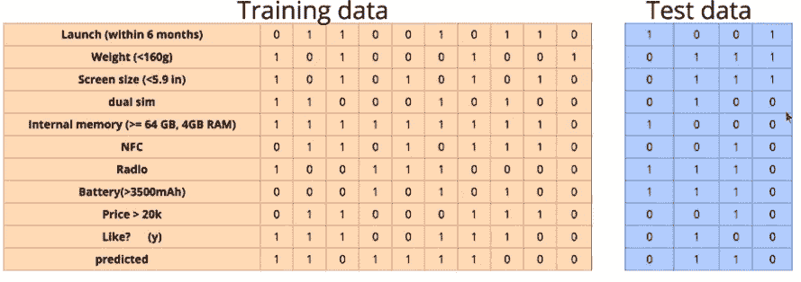

# 麦卡洛克·皮茨神经元——深度学习构建模块

> 原文：<https://medium.com/hackernoon/mcculloch-pitts-neuron-deep-learning-building-blocks-7928f4e0504d>

深度学习的基本块是人工神经元，即它采用输入的加权集合，应用函数并给出输出。受神经生物学的启发，沃伦麦卡洛克和沃尔特皮茨于 1943 年迈出了人造神经元的第一步，创建了一个被称为麦卡洛克-皮茨神经元的模型。

*免责声明:本文内容和结构基于四分之一实验室深度学习讲座——*[*【帕德海】*](https://padhai.onefourthlabs.in) *。*

## 动机——生物神经元

创造人工神经元的灵感来自生物神经元。

Fig — 1 Biological Neuron — [Padhai Deep Learning](https://padhai.onefourthlabs.in)

简单来说，神经元接收信号并产生反应。神经元的一般结构如图 1 所示。*树突*是从另一个神经元或另一个器官带来输入的传输通道。*突触* —控制神经元之间相互作用的强度，就像我们在神经网络中使用的权重一样。*胞体*——神经元的处理单位。

在更高的水平上，神经元通过树突接收信号输入，在细胞体中进行处理，并通过轴突(图 1 中棕色的电缆状结构)传递输出。

# **麦卡洛克-皮茨神经元模型**

1943 年沃伦·麦卡洛克和沃尔特·皮茨提出的 MP 神经元模型。MP 神经元模型也称为线性阈值门模型。

## **数学模型**

Fig — 2 Simple representation of MP Neuron Model

函数(soma)实际上被分成两部分: **g —** 将输入聚合成一个数值，函数 **f** 通过将 **g** 的输出作为输入来产生该神经元的输出，即..单个值作为它的参数。如果函数 **g** 执行的聚合大于某个阈值，函数 **f** 将输出值 1，否则将返回 0。

输入 x1，x2，…..MP 神经元的 xn 只能取布尔值，输入可以是抑制性的或兴奋性的。抑制性输入可以对模型的决策过程产生最大的影响。在某些情况下，抑制性输入会影响模型的最终结果。

Fig — 3 Mathematical representation

例如，我可以使用 MP 神经元模型来预测自己明天是否愿意在附近的 IMAX 影院观看电影。模型的所有输入都是布尔型的，即[0，1]，从图 2 中我们可以看到，模型的输出也是布尔型的。(0 —不去看电影，1 —去看电影)

上述问题的输入可以是

*   x1 — IsRainingTomorrow(明天是否会下雨)
*   x2 — IsScifiMovie(我喜欢科幻电影)
*   x3 — IsSickTomorrow(我明天是否会生病取决于任何症状，例如:发烧)
*   x4 — IsDirectedByNolan(是否由克里斯托弗·诺兰执导的电影。)等。

在这种情况下，如果 x3 — IsSickTomorrow 等于 1，则输出将始终为 0。如果我在看电影的那天感觉不舒服，那么不管谁是这部电影的演员或导演，我都不会去看电影。

# 损失函数

让我们举一个基于二进制格式的特征的一些特征买手机的例子。{ y — 0:不买手机，y — 1:买手机}

Fig — 4: Buying a phone

对于具有特定阈值 **b** 的每个特定音素(观察值),使用 MP 神经元模型，我们可以使用输入总和大于 b 的条件来预测结果，那么预测值将是 1，否则将是 0。特定观测值的损失是实际值和预测值之差的平方。

Fig — 5: MP Neuron Model for Buying a phone

类似地，对于所有观察值，计算 Yactual 和 Ypredicted 之间的平方差之和，以获得特定阈值 **b** 的模型总损耗。

Fig — 6: Loss of the Model

# 学习算法

学习算法的目的是找出参数 **b** 的最佳值，使得模型的损失最小。在理想情况下， **b** 的最佳值的模型损失为零。

对于数据中的 n 个特征，我们在图 5 中计算的总和只能取 0 到 n 之间的值，因为我们所有的输入都是二进制的(0 或 1)。0 —表示图 4 中描述的所有功能都关闭，1 —表示所有功能都打开。因此，阈值 **b** 可以采用的不同值也将从 0 到 n 变化。由于我们只有一个范围为 0 到 n 的参数，我们可以使用蛮力方法来找到 b 的最佳值。

*   用一个随机整数[0，n]初始化 b
*   对于每次观察
*   使用图 5 中的公式，找出预测的结果

计算输入的总和，并检查其是否大于或等于 b。如果大于或等于 b，则预测结果将为 1，否则为 0。

*   找到预测结果后，计算每次观察的损失。
*   最后，通过合计所有单个损失来计算模型的总损失。
*   类似地，我们可以迭代 b 的所有可能值，并找到模型的总损失。那么我们可以选择 b 的值，使损失最小。

# 模型评估

在从学习算法中找到最佳阈值 **b** 后，我们可以通过比较预测结果和实际结果，在测试数据上评估模型。

Fig — 7: Predictions on the test data for b = 5

为了评估，我们将计算模型的准确度分数。

Fig — 8: Accuracy metric

对于上面显示的测试数据，MP 神经元模型的准确率= 75%。

# MP 神经元模型的 Python 实现

在本节中，我们将看到如何使用 python 实现 MP 神经元模型。我们将使用的数据集是来自 [sklearn](https://scikit-learn.org/stable/modules/generated/sklearn.datasets.load_breast_cancer.html) 的乳腺癌数据集。在开始建立 MP 神经元模型之前。我们将从加载数据和分离响应和目标变量开始。

一旦我们加载了数据，我们就可以使用 sklearn 的 train_test_split 函数将数据分成两部分——按照 80:20 的比例进行训练和测试。

MP Neuron PreProcessing Steps

记住我们之前的讨论，MP 神经元只接受二进制值作为输入。所以我们需要把连续的特征转换成二进制格式。为了实现这一点，我们将使用 pandas.cut 函数在一个单独的镜头中将所有的特征分割成 0 或 1。一旦我们准备好了输入，我们就需要建立模型，根据训练数据训练它，并根据测试数据评估模型性能。

为了创建 MP 神经元模型，我们将创建一个类，在这个类中，我们将有三个不同的函数:

*   模型函数-计算二值化输入的总和。
*   预测函数-预测数据中每个观察的结果。
*   拟合函数——拟合函数迭代阈值 **b** 的所有可能值，并找到 **b** 的最佳值，使得损失最小。

MP Neuron Model and Evaluation

建立模型后，在测试数据上测试模型性能，检查训练数据和测试数据的准确性。

# MP 神经元模型的问题

*   布尔输入。
*   布尔输出。
*   阈值 **b** 只能取几个可能的值。
*   模型的所有输入都具有相同的权重。

# 继续学习

如果你有兴趣了解更多关于人工神经网络的知识，请查看来自 [Starttechacademy](https://courses.starttechacademy.com/full-site-access/?coupon=NKSTACAD) 的 Abhishek 和 Pukhraj 的[人工神经网络](https://courses.starttechacademy.com/full-site-access/?coupon=NKSTACAD)。还有，课程是用最新版本的 Tensorflow 2.0 (Keras 后端)讲授的。他们也有非常好的 Python 和 R 语言的[机器学习(基础+高级)](https://courses.starttechacademy.com/full-site-access/?coupon=NKSTACAD)包。

# 摘要

在这篇文章中，我们着眼于 MP 神经元模型的工作及其对生物神经元的类比。最后，我们还看到了使用 python 和真实的乳腺癌数据集实现 MP 神经元模型。

> 与我联系
> 
> GitHub:[https://github.com/Niranjankumar-c](https://github.com/Niranjankumar-c)LinkedIn:[https://www.linkedin.com/in/niranjankumar-c/](https://www.linkedin.com/in/niranjankumar-c/)

**免责声明** —这篇文章中可能有一些相关资源的附属链接。你可以以尽可能低的价格购买捆绑包。如果你购买这门课程，我会收到一小笔佣金。