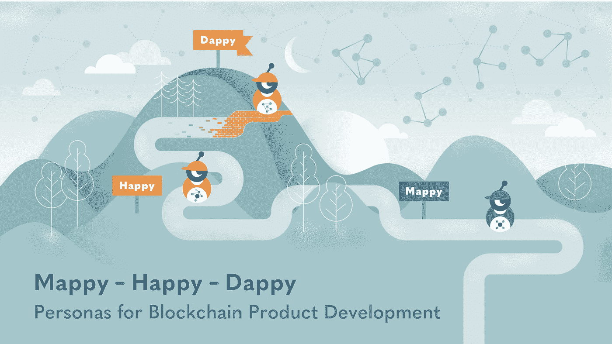

# 认识 Mappy、Happy 和 Dappy:区块链产品管理的角色

> 原文：<https://medium.com/hackernoon/meet-mappy-happy-and-dappy-personas-for-blockchain-product-management-895bfebad94b>

假期已经过去，新的一年已经开始。对于个人和公司来说，这是一个传统的时间——包括我们这些探索区块链科技新世界的人——来评估我们已经取得的成就，并为来年设定目标。

现在是 2019 年，区块链世界是时候面对现实了。

到目前为止，人们太容易陷入这种新技术的秘密炒作、lambos、市场波动和非理性繁荣之中。但是区块链历史的这一篇章正在迅速结束。一个接一个，技术上令人眼花缭乱的项目在没有明确关注真实用户、分布模型和真实世界用例的情况下开始，将会输掉比赛。在许多这样的情况下，在产品找到服务的用户群之前，启动资金就会耗尽。

只有当加密项目清楚地知道他们的产品和服务面向谁，以及这些用户需要什么时，它们才能在 2019 年及以后生存下来并繁荣发展。

**是时候了解区块链客户角色了。**

# **区块链开发人物**

产品经理长期以来一直利用**人物角色**来帮助引导产品开发，以满足现实世界用户的需求。

> 客户**角色**是虚构的角色，由**产品经理**创建，代表特定**产品**的不同用户。他们的存在是为了帮助**产品经理**交流关于他们理想用户群的研究——并给这些用户群面子。…人物角色很重要，因为他们代表了产品的核心客户群体。**产品经理**必须对谁是他们的客户、他们需要什么以及他们的产品如何成为解决方案做出明智的决定。人物角色帮助产品经理做出这些决定。——[阿哈集团](https://www.aha.io/roadmapping/guide/product-strategy/how-should-product-managers-define-customer-personas)

越来越受欢迎的 [**待完成工作**](https://jtbd.info/) 框架进一步将产品管理和创新的重点放在解构某些角色试图完成的工作上，这样产品就可以帮助完成工作，而不是为了寻找用例而构建功能或技术。

在这篇文章中，我提出了三个角色来帮助聚焦区块链产品管理:Mappy、Happy 和 Dappy。

我鼓励区块链社区提供关于这些角色的反馈，并帮助开发和改进它们——作为实现主流采用区块链产品的集体社区资源。

# **遇见活泼、快乐、潇洒的人**

迄今为止，大多数区块链项目都专注于构建被称为“DApps”(或“ **Dappys** ”)的去中心化应用程序，结果却发现区块链的技术、可伸缩性和可用性还没有为主流 DApp 采用做好准备。众所周知，不耐烦的密码投机者会谴责:“用途在哪里？”说到 DApps。在行业内，人们普遍希望 DApps 将在 2020 年前开始获得一些牵引力，每个人都在等待第一个必备的杀手 DApp 的出现。

一小部分区块链项目已经优先考虑为现有的拥有大量用户的集中式企业开发区块链解决方案。这群人的反驳论点是:DApps 是令人兴奋的未来的一部分，但这种未来可能需要数年才能实现并获得消费者的采纳；与此同时，拥有数百万用户的主流企业(我们称之为“MApps”或“ **Mappys** ”)设想通过将部分业务转移到公共区块链来提供更多以客户为中心的体验并发展竞争优势。这样，集中化的业务可以推动对区块链可用性和可伸缩性的需求，以支持大众市场的采用。

这两个群体都相信一个日益分散的未来。健康的争论在于哪一个先出现:去中心化的应用还是去中心化的应用用户。

这是一个古老的**产品管理问题:功能和分销哪个更重要？**

LinkedIn 的创始人雷德·霍夫曼是世界上有史以来最伟大的产品经理之一，他完全站在分销的一边:

> 我们希望创造出人们喜爱的伟大产品，给他们带来神奇的时刻，这也是我们做这些事情的原因之一。但是，如果你没有在你正在做的事情中建立产品分销战略，那么你就完全依赖于一种形式:跑进一个有着巨大金属杆的领域，希望遭到雷击，这通常不是一个成功的战略。
> 
> (Greylock，2016 年 11 月 10 日，4 [m:54s](https://youtu.be/BEMh3-cZWVg?t=4m54s) ) — LinkedIn 创始人雷德·霍夫曼。

**无论你站在辩论的哪一边，为你的目标客户和他们的用户打造合适的产品对于获得认可和销售都至关重要。**

**为此，** [**弗朗西斯科·佩塞拉**](https://twitter.com/olocsis) **和** [**我**](https://twitter.com/betashop) **开发了我们的产品团队在**[**OST**](https://ost.com)**每天依赖的三个角色:Mappy、Happy 和 Dappy。**

*   Mappy 是一个主流应用程序，其核心代码运行在集中式服务器上。Mappy 公司很想涉足区块链，将一些交易放在“链上”,以增加客户价值，建立用户信任，并获得竞争优势。如果成功的话，Mappy 将寻求分散更多的交易。Mappy 通常拥有庞大的现有用户群，他们对区块链感兴趣，因为它提高了他们的用户参与度，并有助于他们的关键 KPI，但他们肯定会拒绝在用户体验上后退一步，因为他们的应用程序中集成了区块链。
*   Happy 设想了一个混合应用程序，结合了 Mappy 的优点和以太坊等区块链的“可编程货币”功能。Happy 对让智能合约管理业务逻辑以增强客户信任和授权的想法很感兴趣。
*   Dappy 处于最前沿，开发了一个完全去中心化的应用程序，其后端代码运行在一个去中心化的对等网络上。Dappy 准备在区块链、智能合约、用户匿名甚至治理方面全力以赴。

Mappy、Happy 和 Dappy 可能听起来像史高治·麦克老鸭的迷失侄子，但这些人物代表了三种类型的企业，主要根据他们准备在短期内接受的分权程度来区分。知道你在为 Mappy、Happy 或 Dappy 中的哪一个做产品，并理解它们之间的主要区别，对于打造成功的区块链产品，吸引最终用户是至关重要的。

这些简介不仅仅是提醒。产品经理依靠详细的客户角色来帮助他们了解目标客户，以便他们能够根据他们的需求定制解决方案。

# **为 Mappy 建造**

*   Mappy 是一个主流应用程序，拥有现有的用户群。
*   Mappy 可能对华而不实的技术更感兴趣，而不是坚如磐石的可靠性。作为一名服务于 Mappy 的区块链开发者，你最好为 Mappy 提供一个可行的可伸缩性解决方案，将数百万用户和数十亿交易装载到你的区块链上。
*   Mappy 对区块链技术感兴趣，认为它是提高用户获取、参与和保留等 KPI 的一种手段。在与 Mappy 交谈时，我们建议将区块链作为业务成果的推动者，而不是未来的宏伟愿景。
*   Mappy 在第一天就不太关心共识机制的完全去中心化，并且愿意走一条去中心化的长期道路。随着时间的推移，权威证明可能是一个可接受的起点，带有一个开放验证器集的路线图。
*   Mappy 对如何部署区块链很感兴趣，它可以让用户对他们通过对公司生态系统的贡献而产生的价值拥有更大的所有权，更灵活地使用和分享它，以及更透明地分配它。
*   Mappys 通常对使用区块链来推动更加开放和透明的忠诚度和奖励计划感兴趣。他们设想使用区块链代币来奖励用户的忠诚度，奖励用户的行为和内容贡献。
*   Mappy 还对区块链代币的互操作性潜力感兴趣，这使得 Mappy 用户可以通过 Mappy 赚钱，并在其他地方无缝消费，反之亦然。
*   一些 Mappys 正转向代币经济，以简化和降低跨境支付的交易成本。这对于用户所在国家的公司尤其重要，这些国家限制跨境资金流动，或者由于国内金融体系薄弱而难以支持国际转账。
*   Mappy 的开发者可能对区块链知之甚少。不要指望他们自己编写可靠的代码。他们希望区块链以微小的片段形式提供给他们，他们可以轻松地将这些片段与 API、SDK、食谱和 UX 指南集成到他们的应用程序中。
*   他们不会马上熟悉“天然气”、多信号、共识算法或智能合约等概念。你需要在帮助教育的同时降低它的难度。
*   Mappy 的开发人员将需要一个连接到测试网的沙盒，以及在大量用户加入之前，以最小的风险在 mainnet 上向用户群样本推出测试版和试点版的能力。
*   Mappy 的区块链团队的“要做的工作”是向他们的老板证明，区块链可以成为领先竞争对手和发展业务的核心优势。
*   Mappy 用于基于网络的仪表板和移动应用程序，以进行分析和报告。不要指望只是用 Mappy 指着块浏览器，告诉他们自己去做。
*   Mappy 的用户可能对区块链知之甚少。不要指望他们会马上记下私钥，首先理解什么是公钥/私钥，签署交易，或者支付汽油费用。
*   从“要做的工作”的角度来看，Mappy 用户最不关心的是如何在区块链上使用 Mappy，而是他们只想继续从 Mappy 应用程序中获得乐趣和价值，而不关心(目前)交易是否在区块链上进行。
*   Mappy 不太倾向于让他们的用户暴露在加密市场的波动中。你需要考虑使用稳定的信贷和经济稳定机制。
*   Mappy 不想承担任何法律、监管或许可风险(例如，资金转移或托管服务)。你需要帮助他们驾驭法律环境，在大多数情况下，代表他们承担所有法律、监管和许可方面的责任。合规性在很大程度上是全国性和地方性的，因此您需要研究和部署全球性的本地法律战略。

# **幸福的建筑**

*   Happy 与 Mappy 有许多相似之处，但 Happy 的区块链雄心更进一步，包括为价值的创造和分配创建复杂的规则，以及更大的“链上”分散化以增加用户信任。
*   Happy 信奉“可编程货币”和分散市场的概念，这可以从根本上重塑和推动他们的业务。
*   Happy 寻求将部分业务逻辑转变为链上智能合约，当满足某些预编程条件时，这些合约会自动执行。
*   一些 Happys 希望在他们的平台上引入令牌化数字资产的使用，包括用户可以拥有和交易的不可替代的令牌。
*   与 Mappy 相比，Happy 可能希望看到更快的网络去中心化路径和去中心化共识引擎。权威的证明对 Happy 来说可能是不可能的。
*   Happy 可能比 Mappy 更有区块链野心，但不要指望大多数 happy 会直接写协议。在孤注一掷之前，Happy 想要尝试一下区块链连锁逻辑。Happy 将需要简单的基于网络的工具，用于智能合同撰写和部署链上逻辑等功能。
*   一些高兴的人看到了一个机会，在开源协议的基础上，用改进的 UX 创建集中式应用程序。

# **为时髦而建**

*   Dappy 是一个运行在分散网络上的分散应用程序。
*   一个开放的分散共识协议验证 Dappy 事务。
*   Dappy 不会收集或保留任何个人用户数据。
*   Dappy 可能没有用户群。
*   Dappy 的开发人员了解最新的区块链技术和开发人员。他们乐于直接根据协议进行开发。
*   预计 Dappy 的所有源代码都应该在开源许可下提供，并且应该可供人们查看，并按照他们认为合适的方式编辑。
*   预计 Dappy 的用户会比 Mappy 和 Happy 更了解区块链。
*   有人期望 Dappy 加班的治理应该去中心化，让 Dappy 的用户掌握关键决策的权力。
*   人们通常预期 Dappy 作为一个组织可能最终会消失，它所运行的应用程序和网络可能会继续独立运行(比如今天的[比特币](https://hackernoon.com/tagged/bitcoin)和以太坊)。

# 实现区块链产品市场契合

在他 2007 年在斯坦福大学[发表的开创性文章](https://web.stanford.edu/class/ee204/ProductMarketFit.html)中，马克·安德森提出，对初创公司来说，唯一重要的事情是让产品适应市场。

> ***唯一重要的是找到产品/市场契合点。***
> 
> 产品/市场匹配意味着在一个好的市场中拥有一个能满足该市场需求的产品。
> 
> *当产品/市场不匹配时，你总能感觉到*。客户没有从产品中获得足够的价值，口碑没有传播开来，使用率没有快速增长，媒体评论有点“废话”，销售周期太长，很多交易都没有成交。
> 
> *当它发生时，你总能感觉到产品/市场的契合度*。客户购买产品的速度与您生产产品的速度一样快，或者使用量的增长速度与您添加更多服务器的速度一样快。客户的钱在你公司的支票账户上堆积如山。你正在尽可能快地招聘销售和客户支持人员。记者打电话来是因为他们听说了你的热门新东西，他们想和你谈谈。你开始获得哈佛商学院颁发的年度企业家奖。投资银行家正在监视你的房子。你可以在巴克餐厅免费吃一年。
> 
> **许多创业公司在产品/市场契合之前就失败了**。
> 
> 事实上，我的观点是，他们失败是因为他们从未达到产品/市场契合度。
> 
> 更进一步，我认为任何创业公司的生命都可以分为两部分:产品/市场契合之前的*(称之为“BPMF”)和产品/市场契合之后的*【APMF】。**

**马克·安德森，2007 年 6 月 25 日**

**获得正确的产品人物角色对于实现产品市场契合至关重要——无论你是在构建工具来帮助 Mappy 部署区块链令牌来激励和奖励他们的用户，还是下一个伟大的 Dappy 来重新定义预测市场，如果你不知道你在为谁构建，几乎不可能实现产品市场契合。**

**Mappy、Happy 和 Dappy 有着非常不同的需求以及非常不同的内部和外部用户期望。理解这些需求并为其开发是构建获得 Mappy、Happy 或 Dappy 内部团队认可的应用程序的关键，并最终获得最终用户的采纳。**

# ****关于作者****

**[杰森·戈德堡](https://twitter.com/betashop)是 [OST](https://ost.com) 的创始人兼首席执行官，Open Simple Token。OST 为区块链经济提供前瞻性的业务，主要集中在拥有数千万用户的 Mappys 和 Happys。OST 的 API、SDK、仪表盘、钱包和协议为拥有数百万用户的企业提供了所需的一切，以便在几分钟内将品牌令牌集成到他们的应用程序中。OST 还领导了 OpenST 协议的开发，这是一个用于标记业务的框架，以及用于运行元区块链的 OpenST Mosaic 协议，以将以太坊应用扩展到数十亿用户。OpenST 协议通过开源提供给任何开发者或 Dappy 使用。OST 在柏林、纽约、香港和浦那设有办事处。更多信息，请访问[https://ost.com](https://ost.com)。**