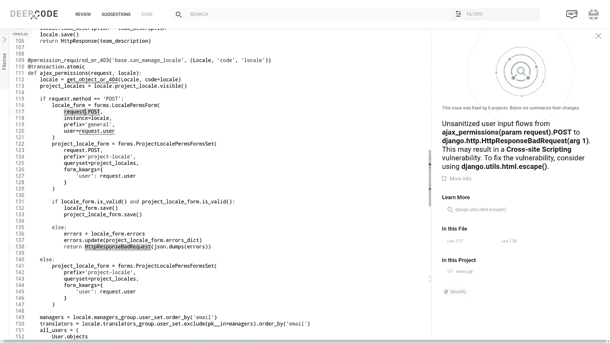

# 了解自动推断 Python 代码中安全漏洞的工具

> 原文：<https://medium.com/hackernoon/meet-the-tool-that-automatically-infers-security-vulnerabilities-in-python-code-3f9729230b24>

# TL；速度三角形定位法(dead reckoning)

2019 年 1 月，我们发布了一款工具，大大提高了检测 Python 代码中安全漏洞的标准。我们构建了一个全自动系统，将数据流分析算法与一个新颖的 ML 组件相结合，并检测比传统方法更多的新安全问题。在几个开源存储库上运行之后，我们从 [OWASP 十大](https://www.owasp.org/index.php/Category:OWASP_Top_Ten_Project)列表中发现并报告了 35 个关键安全漏洞。下面是一张激励人心的截图，展示了其中一个例子:

One of the XSS vulnerabilities that we found and reported

在过去的几年里，人们对信息安全，尤其是 Web 应用程序安全的兴趣在稳步增长。不幸的是，等待攻击者利用的安全漏洞所造成的威胁级别也是如此。这一事实显然给开发人员增加了额外的负担，代码评审工具**必须**减轻这一负担。这就是为什么我们决定大力提高对安全问题的检测。这篇博文讲述了我们是如何做到的。

当涉及到检测所有这些可怕的漏洞时，如跨站脚本(XSS)、SQL 注入(SQLi)、路径遍历(PT)、远程代码执行(RCE)等。可能最常用的代码分析技术叫做[污点分析](https://en.wikipedia.org/wiki/Taint_checking)。我猜它的流行来自于核心思想的简单性，简单地说就是“检查所有的用户输入在到达一段关键的(从安全的角度来看)代码之前是否被正确地转义”。

所以，如果我让你利用这个超级复杂的代码片段

您认为“嗯，来自 HTTP 请求的用户输入进入变量`name`，然后进入`django.http.HttpResponse`调用，所以如果我将它设置为``，那么`evil_code`将在受害者的浏览器中执行”，那么您已经知道它是如何工作的了。如果没有，这里有一个不到 100 字的非正式描述。

污点分析强调三类对象(变量、函数调用等。):

1.  **来源** —包含用户输入(例如`request.GET.get(“name”)`)
2.  **杀毒器** —将不安全的用户输入转换为安全的(例如`django.utils.html.escape()`)
3.  **接收器** —如果攻击者的输入到达安全漏洞，则触发安全漏洞(例如`django.http.HttpResponse()`

该分析验证了从源到接收器的所有数据流都通过杀毒器。如果不是，则每个未组织的流都被报告为潜在的漏洞。

O 污染分析的一个主要限制是它依赖于源、汇和消毒剂的规格。这种规范必须由“安全专家”手动编译，他必须非常熟悉项目代码库和所有使用的第三方框架。理想情况下，专家会记下代码中出现的所有源、接收器和杀毒器，让污点工具完成它的工作。不难看出，这种方法有一些明显的缺点。

首先，想象一下手工组装这个安全规范需要多少工作量。人们将不得不浏览大量的文档和/或项目和框架的代码。现在想想拉里·沃尔的这句名言，“懒惰和急躁是伟大的程序员的两种真正的美德”，并为被指派这项任务的可怜家伙感到一些同情。

其次，列表中每个遗漏的实体都是一个潜在的被忽略的漏洞。人类因犯错而臭名昭著，尤其是像这样的日常工作。你能相信得到的列表的完整性吗？

第三，这不是一朝一夕的努力。每当一个框架得到更新，或者项目开始使用一个不同的框架，或者它自己的代码发生重大变化时，这个过程都必须增量地重做。这大大增加了维护项目的成本。

第四，这种方法没有伸缩性。每个项目和每个框架都是独一无二的，这意味着安全规范不可能 100%成功重用。

这四个基本上意味着传统的方法对于像我们的[代码评审](https://www.deepcode.ai/)这样的工具来说不能有效地工作，它每天在数千个不同的项目上运行。我们根本没有一支安全顾问队伍来为每个项目制定规范。

我们用 DeepCode 的方式解决了这个问题——我们从开源代码中找到了答案。我们构建了一个系统，该系统分析公开可用的代码，收集所有遇到的 API 的统计数据，将它们巧妙地组合在一个模型中，并以完全自动化的方式推断新的源、接收器和杀毒器。它还预测水槽的漏洞类型，并就使用哪种杀毒软件来修复该问题提供建议。

显然，我们的新方法有助于克服上面列出的限制 1、3 和 4。但是第二个(也是主要的)呢？为了检查我们推断出的规范的质量，我们对它进行了终极挑战——寻找 bug。我们在 GitHub 托管的多个开源存储库上运行了我们的分析器的[公开可用版本。我们特别针对那些打算(或者已经)由多个(诚实的和恶意的)用户使用的 web 应用程序。](https://www.deepcode.ai/)

该实验产生了以下被发现和修复的漏洞列表。这也证明了我们的工具能够发现有趣的、重要的、有时是意想不到的 bug。更详细的描述和很酷的例子值得拥有自己的博客，希望很快就能发表。所以，现在让我们以展示我们提交的 GitHub pull 请求/问题来结束。

*(XSS =跨站脚本，SQLi = SQL 注入，PT =路径遍历，RCE =远程代码执行)*

1.  [Mozilla 中的多个 XSS/浮桥](https://github.com/mozilla/pontoon/pull/1175)
2.  [earth gecko/skyline 中的多个 SQLi](https://github.com/earthgecko/skyline/issues/86)
3.  [地球壁虎/天际线中的 XSS](https://github.com/earthgecko/skyline/issues/85)
4.  [XSS 在 DataViva/dataviva-site](https://github.com/DataViva/dataviva-site/issues/1662)
5.  [data viva/data viva-site 中的 SQLi](https://github.com/DataViva/dataviva-site/issues/1661)
6.  [lmf db/lmf db 中的 SQLi](https://github.com/LMFDB/lmfdb/pull/2696)
7.  [lmf db/lmf db 中的多个 XSS](https://github.com/LMFDB/lmfdb/pull/2695)
8.  [gestorpsi/gestorpsi 中的多个 XSS](https://github.com/gestorpsi/gestorpsi/pull/75)
9.  [shared bhat/video hub 中的多个 SQLi](https://github.com/sharadbhat/VideoHub/issues/3)
10.  [UDST 的 RCE/城市](https://github.com/UDST/urbansim/issues/213)
11.  [高架桥上的多辆 XSS](https://github.com/viaict/viaduct/pull/5)
12.  [XSS 在 MLTSHP/mltshp](https://github.com/MLTSHP/mltshp/pull/509)
13.  [Kyle WM/木管乐器中的多重 XSS](https://github.com/kylewm/woodwind/issues/77)
14.  [XSS 在 kylewm/silo.pub](https://github.com/kylewm/silo.pub/issues/57)
15.  [anyaudio/anyaudio-server 中的多个 XSS](https://github.com/anyaudio/anyaudio-server/pull/163)
16.  [SQLi in Minn post/election-night-API](https://github.com/MinnPost/election-night-api/issues/1)
17.  [PT in mitre/multiscanner](https://github.com/mitre/multiscanner/issues/159)
18.  [在 PadamSethia/shorty 中的 SQLi](https://github.com/PadamSethia/shorty/pull/4)

**P.S.** 好奇看看我们能在你的项目中找到多少漏洞？在开源中寻找 CVEs？或者只是还不相信它有用？好吧，那么在 https://www.deepcode.ai/见。