# ML。微软的机器学习框架。NET 开发人员

> 原文：<https://medium.com/hackernoon/ml-net-machine-learning-framework-by-microsoft-for-net-developers-3c6f46bcb59f>

每当您想到数据科学和机器学习时，您脑海中唯一出现的两种编程语言是 Python 和 r。但是，问题出现了，如果开发人员掌握了除这些语言之外的其他语言的知识，该怎么办？

我们有一个解决方案，就是微软最近推出的 build 2018，这是它自己版本的机器学习框架，专门针对。NET 和 C#开发人员。该框架是开源的、跨平台的，也可以在 Windows、Linux 和 macOS 上运行。

开发人员总是希望有一个 NuGet 包，他们可以插入一个. Net 应用程序来创建机器学习应用程序。在第一个版本发布后，

ML。NET 仍然是一个婴儿，但它已经显示出成为科技巨头的能力。

在这个版本中，我们可以在高级 [ML 算法](https://neelbhatt.com/2017/11/25/how-to-choose-ml-algorithm-machine-learning-questions-answers-part-iii/)的帮助下执行几个机器学习任务，如分类、回归等等。我们还可以训练模型，并使用模型以及其他基本的机器学习任务和算法进行预测。

ML。NET 可以进一步扩展到 ML 库，比如 TensorFLow、Accord.NET、CNTK 等等。

## ML.NET 的内部是什么？

正如我们已经看到的，该框架可以扩展到与任何第三方库一起工作，以实现平稳运行。它也包含一些很棒的库。对于像回归和分类这样的任务，训练和消耗都存在于 ML.NET。

除此之外，它还支持核心数据类型、可扩展管道、数据结构、工具支持、高级性能数学等。

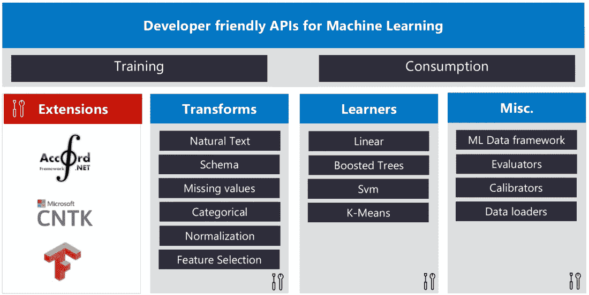

让我们学习如何在 yours.Net 应用程序中添加这个 NuGet 包。首先，你需要安装。NET Core 2.0 或更高版本，因为 ML.NET 目前运行在 64 位进程中。

*   完成这些后，打开你的 Visual Studio 2017 →新建项目→选择核心 Web 应用，如图所示。

*   现在点击空选项:

*   首先创建您的应用程序，一旦完成，添加所需的 Microsoft。ML NuGet 包。使用“Microsoft”继续搜索。然后点击安装:

*   完成所有步骤后，您的包就安全地安装好了，可以使用了。
*   您也可以通过从 CLI 安装 ML.NET nu get 来开始使用它:

**微软 dotnet 添加包。ML**

*   此外，从软件包管理器中:

**安装包微软。ML**

此外，您可以直接从 [GitHub](https://github.com/dotnet/machinelearning) 创建您的框架。

**ML.NET 的核心组件是什么？**

ML.NET 框架作为。NET 基金会和今天的回购组成。许多流行的 ML 任务，如回归和分类，都需要使用. NET C # APIs 进行消费和模型训练以及变量转换和学习。

ML。NET 的目标是为注入 ML 提供 E2E 工作流。NET 应用程序跨不同的专业，如预处理，特征工程，建模，评估和操作化。

您还可以创建自己的示例应用程序，通过使用可以直接在您的应用程序中使用的[ML.NET 模板](https://marketplace.visualstudio.com/items?itemName=MLNET.07)，演示如何在您的应用程序中使用 ML 模型。

【ML.NET】出发前要知道的事情

*   **初始化你的模型**

当使用机器学习时，首先，你需要选择最适合的 ML 算法，因为机器学习有像聚类、回归、分类和异常检测模块这样的方法。

*   **训练模型**

您需要训练机器学习模型，因为训练是通过模型分析输入数据的过程，以通过将其保存为训练模型来学习模式。例如，如果您在应用程序和 CSV 文件中创建一个 CSV 文件，给出库存详细信息，如 ItemID、Location、InQTY、OutQTY、TotalStock quantity 等等。你需要给这个 CSV 文件作为模型的输入，模型可以得到训练和分析这些数据来预测结果。一旦模型被训练，它理解输入的模式，并且结果模型需要被保存用于预测结果。

*   **预测**

预测也称为 score，它需要与定型模型具有相同的列。分数有助于根据训练好的模型生成结果。

*   **评估**

模型训练完成后，将进行评估。它通过将模型与测试数据进行比较来执行，并预测最终结果。

**用简单的步骤创建 C#控制台应用**

**第一步:创建一个应用**

安装完所有必备后，在开始→新建项目中的程序中选择 Visual Studio 2017 点击 Visual C# → Windows 桌面→点网框架中的控制台 APP。输入您的项目名称，然后选择确定。

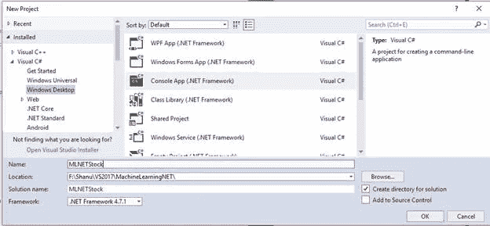

**第二步:下推微软 ML 包**

右键单击您的项目，选择管理 NuGet 包…

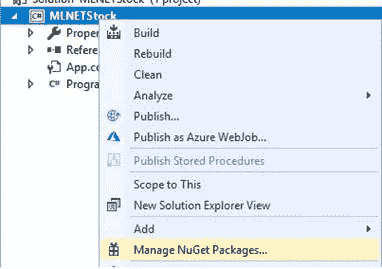

然后，搜索微软。浏览器标签中的 ML。

选择 Install，接受策略并等待安装继续进行。

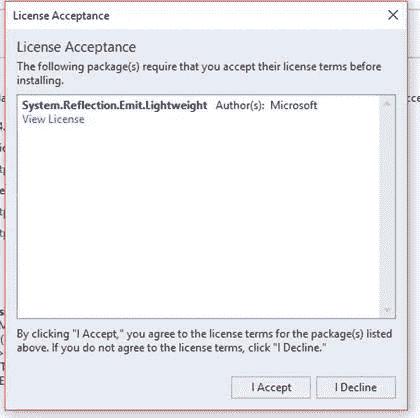

你会看到微软。ML 包被安装，所有的微软。ML 引用已插入到您的项目引用中。

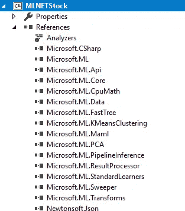

**步骤#3:创建培训和评估数据**

现在，您需要通过在项目中创建一个名为 data 的新文件夹来添加两个 CSV 文件，从而为数据集创建一个模型定型和评估。

*   **添加数据文件夹**

右键单击项目，添加名为“Data”的新文件夹。

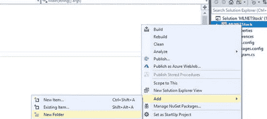

*   **创建列车 CSV 文件**

右键单击数据文件夹，选择添加→新项目→文本文件；名称为“StockTrain.csv”。

单击属性，将复制到输出目录更改为“总是复制”。

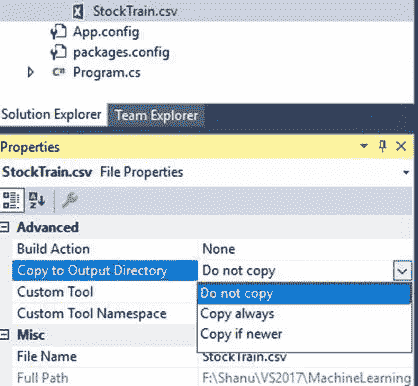

如图所示添加 CSV 文件详细信息。

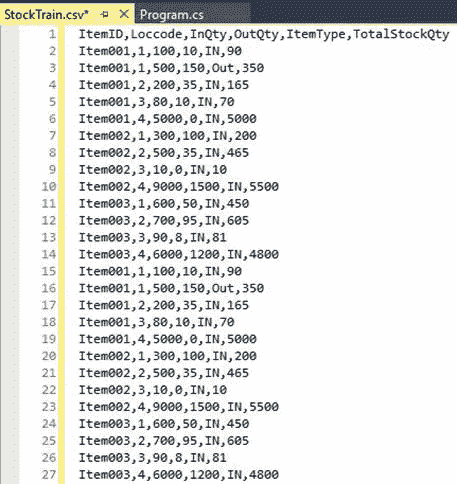

这里给用户一个提示，您必须修复标签和特性。标签字段是一个

我们需要在样本中预测。

**ItemID** —产品项目 ID(特征)

**LocCode** —仓库位置(特征)

**输入数量** —到达库位的项目总数(特征)

**OutQty** —交付到该位置的总项目(特征)

**item type**—item type“In”表示本地制造,“out”表示外包。(特写)

**TotalStockQty** —项目库存总数。(标签)

请记住，您始终需要添加至少 100 条数据记录来训练您的模型。同样，您必须通过创建一个名为“StockTest.csv”的新文件来添加另一个用于评估的 CSV 文件。

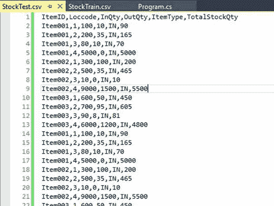

**步骤#4:为输入数据和预测创建一个类**

现在，您需要为输入数据和预测创建一个新类，方法是右键单击您的项目并添加一个新类“ItemStock.cs”。你首先需要导入 Microsfot。类中的 ML.Runtime.API，如下所示:

此外，我们需要按照类中相同的顺序添加所有列，并尝试将列设置为 0 到 5。

接下来，您需要创建一个预测类来添加您的预测列。请注意，预测列需要重命名为“Score ”,数据类型为 float。得分列包含回归模型中的预测结果。

**第五步:Program.cs**

您需要打开“program.cs”文件来使用 ML.NET，并导入所有需要的引用。

**数据集路径**

您需要给出训练数据的“StockTrain.csv”路径，因为最终训练的模型需要保存以用于评估和结果生成。将模型路径设置为“Model.zip”文件，经过训练的模型将在程序运行期间自动保存在 bin 文件夹中的 zip 文件中。

> 静态只读 string _Traindatapath = Path。结合(环境。CurrentDirectory，" Data "，" stock train . CSV ")；
> 
> 静态只读 string _Evaluatedatapath = Path。结合(环境。CurrentDirectory，" Data "，" stock test . CSV ")；
> 
> 静态只读 string _modelpath = Path。结合(环境。CurrentDirectory，" Data "，" model . zip ")；

您还可以将 Main 方法更改为 async Task Main 方法，如下所示:

在此之前，您需要执行两个关键任务来成功运行您的程序。首先，将平台目标设置为 x64，因为 ML.NET 在 x64 上运行；其次，使用异步任务主方法运行程序，将语言版本更改为 c#7.1。

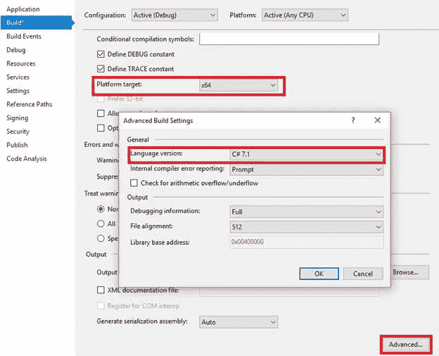

**使用培训模型**

首先，您需要对模型进行定型，然后将其保存到 zip 文件中，这是调用预测模型并传递 ItemStock itemStockQtyPrediction 类以将模型返回到 main 方法的主要方法:

在上面显示的方法中，您需要添加函数来训练模型，并将其保存到 zip 文件中。在训练中，首先，您将使用 LearningPipeline()，因为它会加载所有训练数据来训练模型。

其次，TextLoader 从 train CSV 文件中获取所有数据进行训练，并设置 use 头以避免从 CSV 文件中读取第一行。基本部分是要在训练模型中定义的预测值。它需要数字特征来转换分类数据，并且您必须添加所有要训练和评估的特征列。

**添加学习算法**

在这个代码片段中，您将使用 FastTreeREgressor 学习器，它必须添加到您的管道中。最后，您需要通过下面给出的方法来训练和保存模型:

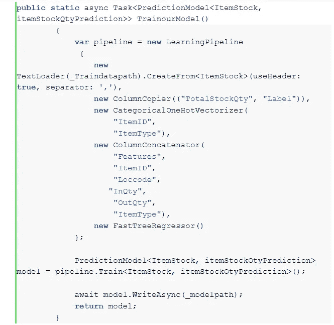

除此之外，您还需要通过用测试数据检查模型来评估模型，并预测最终结果。为此，您需要从 main 方法调用 Evaluate 方法，并将训练好的模型传递给这个模型。

我们用样本 CSV 测试数据在评估方法中传递训练好的模型。使用文本加载器，加载测试数据 CSV 文件中的所有数据以进行模型评估。

使用 RegressionEvaluator 方法，我们可以使用测试数据评估模型，并通过显示均方根(RMS)和平方度量值来生成评估度量。

**最终预测结果**

现在是产生最终结果的时候了。首先创建一个名为“ItemStock.cs”的新类，并向其中添加在模型定型列中创建和定义的值。

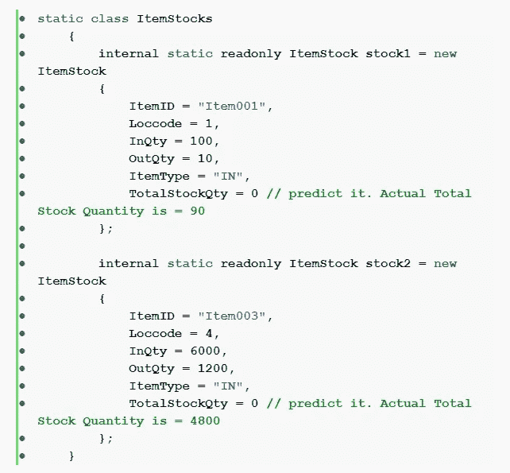

您也可以运行该程序，并在命令窗口中查看结果，如下所示:

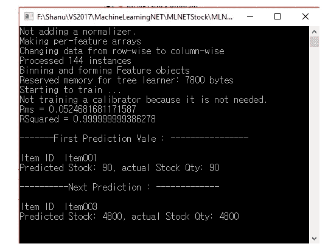

创建并运行程序后，我们可以在应用程序根 bin 文件夹内的“Data”文件夹中看到 Model.zip 文件，以查看我们的 StockTrain 和 StockTest CSV 文件。该模型在这个 CSV 文件的帮助下进行训练，结果将存储在 Model.zip 文件中。

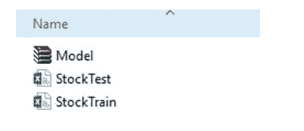

**总结**

我们可以得出结论，ML.NET 是一个了不起的框架。期待与机器学习一起工作的. NET 开发人员。在目前的时代，只有预览版的 ML.NET 是可用的，但我们真的不能等待公开版本得到释放。如果你是一名. NET 开发者，并且对机器学习框架了解不多，那么 ML.NET 绝对适合你。我希望你喜欢阅读这篇文章。继续学习！

**作者简介:**

惠普摩根在 Tatvasoft.com.au 担任技术分析师。客户[澳洲软件开发公司](https://www.tatvasoft.com.au/)。闲暇时，他喜欢写博客，也在主要出版物上发表署名文章。