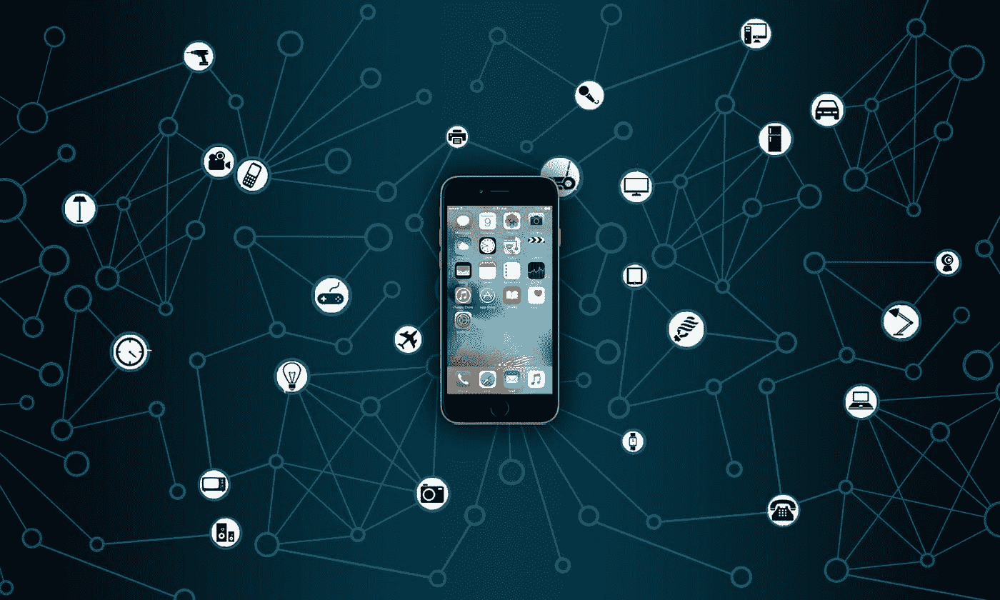
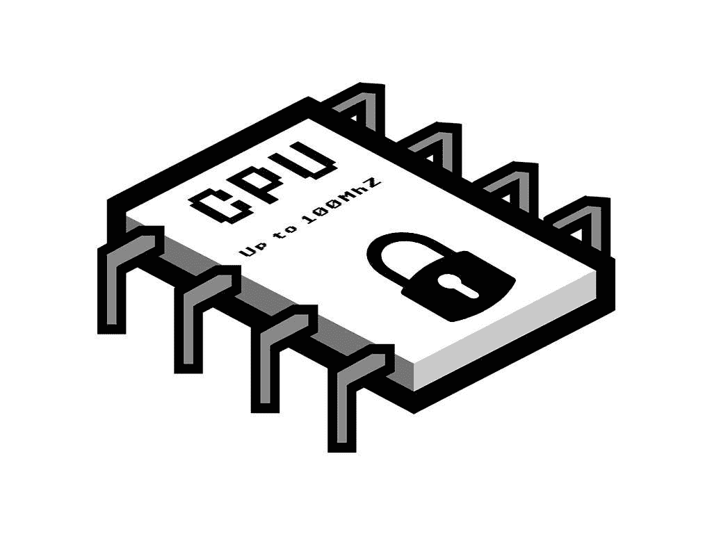
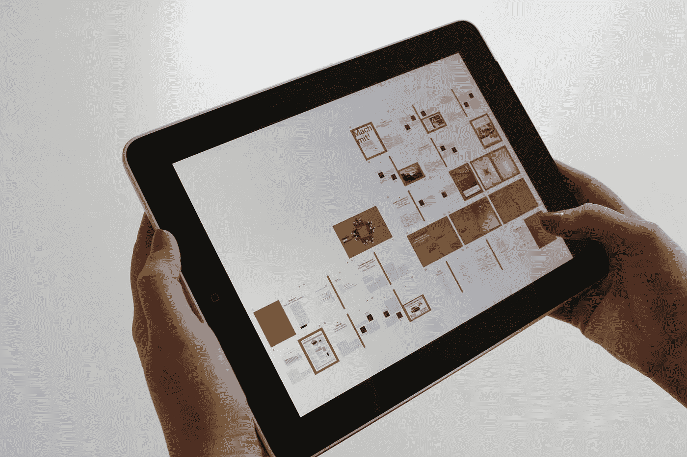
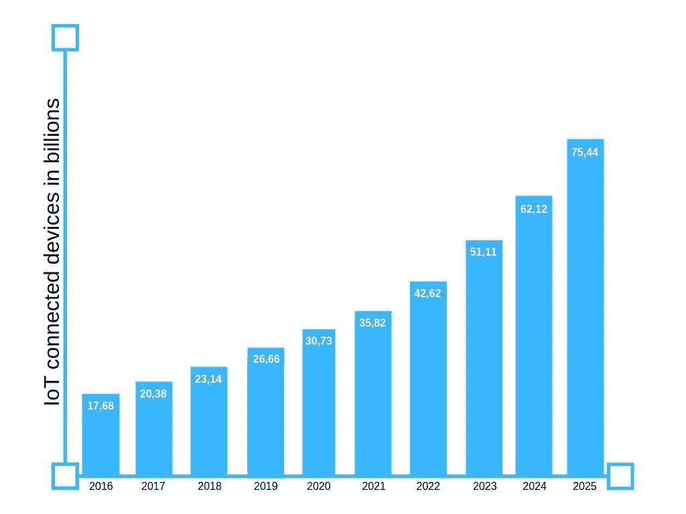

# 作为物联网核心的移动应用:探索连接

> 原文：<https://medium.com/hackernoon/mobile-apps-as-iot-core-exploring-the-connection-9fcdc2eefcbe>

我想以一种直截了当的方式开始这篇文章，这不是一件容易的事情。根据 Hootsuite research 的数据，全球独立移动用户总数超过 51.53 亿。智能手机是物联网领域的设备。

根据 Statista 的数据，物联网设备的总数已超过 266.6 亿。然而，智能手机是我们在大多数情况下使用的设备，我们从早到晚都带着它们。Freepps.top 确信应用开发者应该思考如何让软件比现在更有用。

移动应用程序做了许多十年前我们无法想象的事情。今天，你可以使用应用程序来跟踪你的活动，做作业，发送文本到打印机，打开电水壶，设置你的恒温器。

这是一个令人难以置信的事态，但如此庞大数量的多功能应用程序的实际可用性即将达到下降的地步。设计用于连接我们使用的物联网设备的应用越多，我们在过去不太复杂的事情上浪费的时间就越多。

在接下来的段落中，我将讨论如何让应用程序以正确的方式进行交互，从而实现真正的进步。我坚信，在物联网的背景下，所有应用程序都必须连接起来，以实现其主要目的，让用户的生活更美好。物联网技术发展缓慢，但目前极具前景。

# 受限的计算能力

我们今天使用的任何设备都是受限设备。这意味着我们的智能手机和水壶都是一样的。它们有内存和有限的计算能力。这就是为什么他们可以做很多但不是所有的事情。你可以购买大量的小工具，每一个都可以通过特定的应用程序进行管理。它看起来和感觉都很现代，但不符合逻辑。为什么不呢？

你买了一个智能加湿器，用智能手机应用程序来设置它。所以，计算能力从你的核心设备(智能手机)开始。如果你必须日复一日地重复，这只是一个毫无用处的遥控行为。要成为物联网的一个核心，你使用的应用要学习。

你什么时候下班回来？你什么时候睡觉？什么时候的天气条件适合额外的空气加湿？你的恒温器温度是多少？

所有这些问题的答案都很重要，因为它们决定了你与设备的一般交互逻辑。你的加湿器 app 可以和恒温器 app 交互吗？也许不能。与此同时，它能够分析你的位置和时间表，但它仍然无法调用天气应用程序来将你从调整“智能”加湿器中解放出来。

你能看出这个过程中资金流动的逻辑吗？您需要支付额外费用来使用智能手机设置此设备。仅此而已。用 Wi-Fi 代替红外发射器，但还是要手动做事。那么，拥有 8GB CPU 的智能手机的目的是什么呢？要玩沥青 8？能够同时打开十几个应用程序？

# 谷歌的方式

Freeps.top 每天都会测试应用程序，看看它们是否真的有用。最通用的应用程序包由 Google 提供。这家大公司的下属开发了许多互联的应用程序，每个程序都可以访问谷歌云。

在今天的水平，这个选项是用来节省您的时间，让您从需要手动复制数据。例如，您的日历可以访问您的联系人列表，以便将这些数据自动填充到安排中。可以说，它知道天气状况来设置加湿强度。

与此同时，谷歌助手可以利用你的地理位置来建议附近最好的餐厅。你昂贵的加湿器也可以做到这一点，但它不是由谷歌制造的。

谷歌的互联应用机制向我们展示了所有智能设备必须如何表现才能真正有用。如果这些应用程序可以做到这一点，任何小工具都可以。

# 人们需要什么

任何一个商人都知道，虽然他的产品可能没什么用，但有可能让顾客相信它是有用的。聪明的物联网厂商就是这么做的。他们使用廉价的 1-5 美元的带 Wi-Fi 和蓝牙的微控制器，让用户无法通过智能手机实现远程访问。

是的，这种管理家用设备的方法看起来很新鲜，但这个想法比任何千禧一代都古老。智能物联网设备的绝大多数应用程序仍处于 90 年代以来电视遥控器的进步水平。

如今，技术进步已经足够先进，可以让事情以不同的方式运作。让我们回到那个漂亮的加湿器。这是一种使用智能手机作为物联网核心的物联网设备，因为它可以完成所有计算工作。

如今加湿器的应用为用户提供了设置其工作时间和蒸发强度的能力。所以是一个技术上和物联网相关但逻辑上不相关的遥控器。

我认为，人们需要这种能够相互交换数据的应用程序，从而让用户跳过几个设置阶段。互联设备应使用协同工作的软件。

# 履行

如今，物联网行业的发展速度相当缓慢。现在想象一下不是这样的，你一定要进步，告诉你的公司发明一个全新的加湿器。工程师们夜以继日地工作，让它变得更小更强，确保它降低能耗，等等。

你花了大量的钱来改变加湿器的物理特性。终于，新产品做好了。用户可以用语音来切换它，改变 LED 的颜色，并设置睡眠时间。那是个好结果，但一点都不进步。

让我们想象一个更好的方法。第一，不要告诉你的工程师改变物理性质。这个设备已经被赋予了一个微控制器，这足以控制它。您的下一步是吸引您的应用程序开发人员。告诉他们要有耐心，并赋予你的应用程序 GPS 访问跟踪用户的位置。

现在，与负责天气预报和恒温器设置的应用程序开发人员见面，提出一个简单的计划。事情是这样的:您将他们的应用程序集成到您的应用程序中，这样他们就可以共享关于某些情况的信息。他们的好处是什么？是升职。如果开发者向你提供天气预报和恒温器温度，他们就多了一个销售产品的媒介。扩展越多越好。

# 可到达的目的地

我想传达的观点是，没有必要成为谷歌才能在物联网领域取得成功。上面的“加湿器项目”表明，您只需建立连接。您不必购买新的服务器或大幅升级您的设备。

移动应用是这一过程的核心，因为你可以让它们在一部智能手机(受限设备)的边界内交换数据。任何现代移动平台的计算能力都足以让应用程序在后台模式下进行通信，让用户不必完成多项任务。

当然，我理解这种根本性的变革需要资源。我相信销售额的增长将证明在这一领域的单笔投资是值得的。核心应用开发的经济方面需要进一步研究，但这个想法似乎是合理的。

# 结论

我提出的想法需要在工作方式上有很大的改变。好的一面是，任何公司都可以有所突破。最具挑战性的任务是让应用程序和设备以一种安全的方式协同工作。通过这样做，我们将能够销售和购买真正智能的物联网设备，这些设备需要很少的人类预测来执行任务。希望这种方式是可行的，因为它承诺为普通用户节省大量时间。