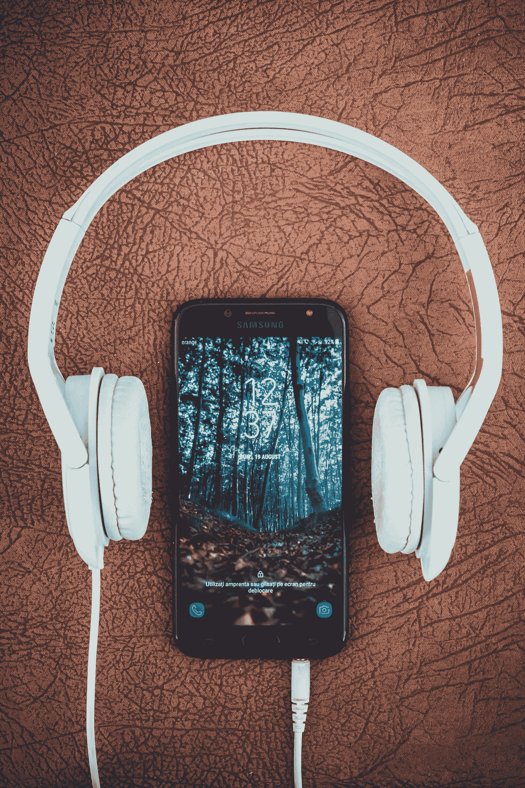

# 简化的移动规格

> 原文：<https://medium.com/hackernoon/mobile-specifications-simplified-5fdb0c2dd2cd>

## 买新手机？以下是如何理解列出的规格，如显示器、内存、摄像头、处理器和电池。

对于“你和谁在一起的时间最长”这个问题，二十年前，父母或朋友会是典型的答案，但现在生活已经改变了。现在一个新的熟人走进了我们的生活。当我们有空闲时间时，即使只有 5 分钟，我们也尽量和他们一起度过。现在你应该已经猜到了——这个不可分割的实体就是我们的手机。

不幸的是，手机寿命不长。在两到三年内，要么手机损坏，要么我们觉得有必要升级手机。不管怎样，寻找新手机的工作每三年开始一次。随之而来的是我们的阅读马拉松。

在寻找过程中，我们会遇到一些评论称赞“这款手机是最物有所值的”，我们盲目地相信这些话并购买了这款手机。仅仅根据评论者的评论购买手机而没有对手机规格的正确理解是错误的。另一方面，单纯根据规格买手机也是不对的。因此，要找到一款好手机，浏览评论的行为必须辅之以对智能手机规格的“正确”了解。

有一种主要的误解，认为我们支付的越高，产品就越好。不一定每次都是这样。通过适当的探索，我们可以找到 400 美元的更好的手机，这比 500 美元的手机更好。为此，你需要很好地了解手机的规格、你需要的功能和不需要的功能。因此，现在是我们学习与手机及其组件相关的基本术语和技术术语的时候了。

**注意**:这篇文章强调解释一个组件如何影响用户体验，而不是它的技术方面。

# 显示:

## 1.类型:

LCD 或 AMOLED 屏幕用于现代移动电话。最基本的区别是，AMOLED 屏幕中的每个像素都是单独点亮的，而 LCD 屏幕是整体点亮的。这有助于 AMOLED 具有沥青黑色和高对比度。

假设您正在展示一张黑白照片。在 LCD 屏幕上，无论你显示什么颜色，所有的像素都会被点亮。但是在 AMOLED 屏幕中，没有像素被点亮来显示黑色(因为屏幕默认为黑色)。只有在显示纯黑色以外的阴影时，像素才会被照亮。因此，与 LCD 相比，AMOLED 可以获得最好的墨黑色，而且省电效果更好，因为没有像素被点亮来显示黑色。

AMOLED 屏幕的缺点是，与 LCD 相比价格昂贵，并且一些低质量的 AMOLED 屏幕在从侧面观看时会发生颜色偏移。

## 2.亮度:

亮度是显示器的一个重要方面。它以“尼特”为单位。要检查智能手机的亮度，请在“ [phonearena](https://www.phonearena.com/) ”或“ [gsmarena](https://www.gsmarena.com/) ”等网站上查看相应的评论。手机的平均亮度范围从 450 到 500 尼特，600 到 800 尼特之间的任何地方都绰绰有余，即使是在阳光直射下处理手机。

## 3.分辨率:

分辨率是指屏幕的像素数量。点亮的像素数量越多，电池消耗就越高(-_-)，需要的处理能力也越高(-_-)，但反过来，你会得到更清晰的 screen(•‿•).据说超过 326 PPI(每英寸像素)的像素密度只会带来细微的改善。

常见的显示分辨率包括高清、全高清、四高清。通常，全高清在电池消耗和所需的清晰度(像素密度)之间找到了最佳平衡点。

你可能听说过苹果公司的 retina 显示屏，它们有什么特别之处，所有的 iPhone 似乎都有 retina 显示屏。没什么…是的，没什么。这只是一种营销策略，用来让它看起来像高科技，但它只是指显示器的 PPI 超过 326。

## 4.HDR:

HDR 代表高动态范围。符合 HDR 标准的屏幕有助于通过更鲜明的色彩和高对比度观看 HDR 内容。但是你需要 HDR 内容来利用这个特性。如今，所有高端中档手机都配备了符合 HDR 标准的屏幕。这个功能变得越来越普遍，但在互联网上并没有太多的 HDR 内容。只有网飞、亚马逊、YouTube 等流媒体服务提供 HDR 内容。如果你必须访问大量的 HDR 内容，那么这是一个很好的功能。

## 5.纵横比:

随着时间的推移，移动显示器的屏幕宽高比从 4:3 发展到 16:9，这为新的现代 18:9 宽高比铺平了道路。那么这个长宽比是多少呢？它是屏幕高度与屏幕宽度的比值。这并不是买手机前需要考虑的一个非常关键的特性。只要知道存在一个术语叫做纵横比，以及它的含义就足够了。

*总结*:尽量获得明亮的全高清屏幕。不在乎长宽比。HDR 是一种奢侈品。如果预算允许，可以选择 AMOLED 屏幕。

# 电池:

它用 mAh 表示。电池寿命不仅取决于电池容量有多大，还取决于软件调整和处理器效率。所以 3500 mAh 的手机可以比 4000 mAh 的手机有更好的续航。我们没有太多的选择，只能依靠客户评论来了解手机的电池寿命。

*总结*:查看电池寿命评论，无其他

# 处理器:

作为客户，我们应该努力了解 SOC 提供了多少处理能力。

由于每个公司都有自己的命名方案，所以不能根据它们的名称来比较处理器。想知道哪个厉害，高通骁龙 710 vs 华为麒麟 710(两家不同公司同型号)，骁龙 835 vs 骁龙 660(同一公司但 8xx 旗舰系列有 35，6xx 中端系列有 60🤔)可能只会让我们陷入很多困惑。

使用基准应用程序，如" [Antutu](https://www.google.co.in/url?sa=t&rct=j&q=&esrc=s&source=web&cd=14&cad=rja&uact=8&ved=2ahUKEwiv6NyK15_iAhUC4XMBHX7bATkQFjANegQIBBAB&url=https%3A%2F%2Fplay.google.com%2Fstore%2Fapps%2Fdetails%3Fid%3Dcom.antutu.ABenchMark%26hl%3Den&usg=AOvVaw0AOmsrV4IrMkcBZeiKyRcW) "，查看 SOC 提供的处理能力。对比基准应用给出的分数，看看哪个处理器比较强大。

较高的基准测试分数可能并不总是转化为现实生活中的性能，它只是给出了可用处理能力的概述。日常性能不仅取决于原始处理能力，还取决于软件、显示屏触摸延迟和许多其他因素。在很大程度上，比较基准测试分数就足以知道哪个处理器是强大的。
(骁龙 710 和骁龙 835 是以上对比的胜出者)

*总结*:使用基准测试 app 了解 CPU & GPU。

# 摄像机:

相机部门是每个公司都试图脱颖而出的部门。图像质量取决于传感器尺寸、孔径尺寸、SOC 处理来自图像传感器的数据的能力、聚焦机制和软件。你可能会找到最好的规格，然后想，“有了这个规格，不可能拍出不好的照片”。不，你错了。许多你看不见的因素都会影响图像质量。因此，令人高兴的消息是，你不必费心去阅读这些规格。只需检查互联网上的未压缩照片。最好还是去看看 [gsmarena](https://www.google.co.in/url?sa=t&rct=j&q=&esrc=s&source=web&cd=1&cad=rja&uact=8&ved=2ahUKEwi5-73Z2J_iAhWEV30KHTY7CmgQFjAAegQIBRAC&url=https%3A%2F%2Fwww.gsmarena.com%2Fpiccmp.php3%3FidType%3D1&usg=AOvVaw3G7QHQ9mspedstvNhEnCSc) 或 [phonearena](https://www.google.co.in/url?sa=t&rct=j&q=&esrc=s&source=web&cd=1&cad=rja&uact=8&ved=2ahUKEwj097_j2J_iAhUTVysKHf0ACIQQFjAAegQIARAB&url=https%3A%2F%2Fwww.phonearena.com%2Fphones%2Fcamera&usg=AOvVaw06ZMVK_7RRNc0GdhSmo_eB) 网站。他们有照片对比工具。将您感兴趣的手机图像与旗舰手机或您当前手机的图像进行比较。做你自己的法官。

> 更高的百万像素并不意味着更高的清晰度。

手机制造商的公关团队让我们相信。百万像素仅指相机传感器中的像素总数。仅仅考虑百万像素数量，人们不应该认为 48Mp 优于 12Mp 相机。

如今，拥有双摄像头或三摄像头是一种趋势。广角镜头，长焦(变焦)镜头增加了相机的价值。但是深度传感器只是为了增加计数。没别的了。是的，他们说深度传感器有助于创建散景(像模糊一样的人工 DSLR)，但它也可以使用软件创建，没有实质性的区别。如果手机被宣传为双后置摄像头，第二个是深度传感器，那么就把它当作单摄像头而不是双摄像头。

*总结*:检查图像样本，了解质量。不需要深入了解相机规格。不要爱上深度传感器的噱头。

# 内存:

> 那么我们到底需要多少内存呢？它提高了手机的速度吗？？？它能提升游戏性能吗？？？

手机被塞满了大量的内存(主要是为了营销目的)，4gb 的内存现在已经成为事实上的标准。除非许多应用程序在后台运行，否则你不会看到 4gb ram 型号和 6gb ram 型号之间的性能差异(在游戏和日常使用方面)。有时应用程序可能会在 4 GB 内存的手机上重新加载，但这不会成为一个交易破坏者。具有 6gb 内存的手机在未来 3 年是经得起考验的，任何高于 6gb 内存的都是大材小用。普通用户不需要 8GB 内存。

*总结* : 4 到 6 Gb RAM 就够了。

# 结论:

纸上尽可能好的规格不足以让手机成为最好的。硬件和软件应该很好地调整，牢记客户。由于我们对手机的基本规格有了更好的了解，我们现在可以选择一个非常适合下次最好的朋友(手机)。