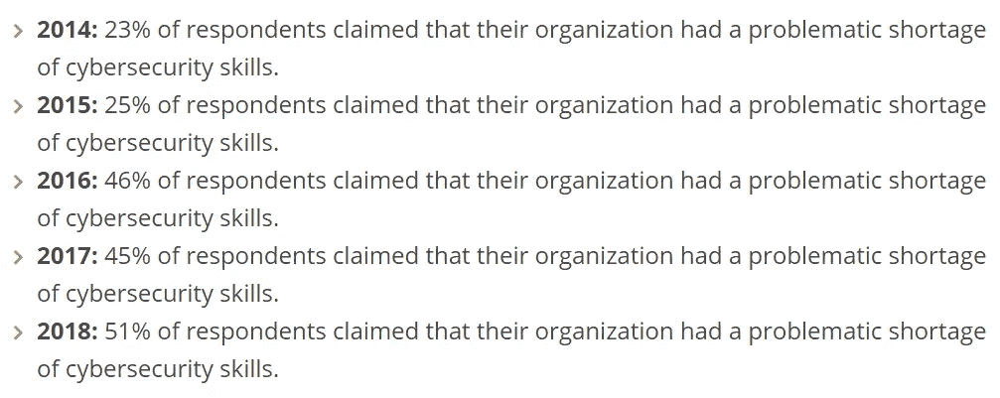

# 针对个人用户的最常见的网络攻击类型，第一部分

> 原文：<https://medium.com/hackernoon/most-popular-types-of-cyber-attacks-against-individual-users-part-i-dee7eed353b6>

有一条法律是以一个著名的银行抢劫犯命名的，叫做萨顿法则。威利·萨顿被抓后，有记者问他一个简单的问题，你为什么抢银行？“因为钱在那里，”他回答。萨顿定律指出，当面对一个问题时，应该首先应用最明显的解决方案。它用于医学、哲学、计算机程序调试，但让我们把它应用到网络安全领域。

[https://armacad.info/2019-02-07--workshop-cfp-wacco-2019-first-workshop-on-attackers-and-cyber-crime-operation-20-june-2019-sweden](https://armacad.info/2019-02-07--workshop-cfp-wacco-2019-first-workshop-on-attackers-and-cyber-crime-operation-20-june-2019-sweden)

我们的钱在哪里？存钱罐时代已经过去，我们大多数人都在网上交易。当我们想知道我们有多少钱时，我们很少去数现金，我们登录我们的网上银行账户，看看有多少。那么萨顿定律能教会我们什么呢？威利·萨顿现在不会去抢银行了，他会成为一名黑客，让自己迷失在虚拟空间里，“因为那里有钱。”

了解在线面临的危险是保护资产的第一步。在这篇文章中，我将详细阐述最流行的黑客攻击方法，这些方法可能会对受害者造成直接损害。然而，我不会提供解决方案，但是一定要跟进，因为这将是我下一篇文章的主题。

## 先来点统计数据

截至 2019 年 3 月 31 日，连接到互联网的人数为 4，383，810，342 人，超过世界人口的一半。可以肯定的是，相当一部分人确实在 Gmail、脸书和一些游戏平台上拥有账户，并且可以访问他们的银行账户。不幸的是，网络安全意识非常薄弱，超过一半的参与 [ESG 的组织对 IT 专业人员进行了广泛的全球调查](https://www.esg-global.com/blog/esg-research-suggests-cybersecurity-skills-shortage-is-getting-worse)称他们在网络安全领域严重缺乏知识。

[https://www.esg-global.com/blog/esg-research-suggests-cybersecurity-skills-shortage-is-getting-worse](https://www.esg-global.com/blog/esg-research-suggests-cybersecurity-skills-shortage-is-getting-worse)

可悲的是，CySec 专业人员的缺乏与网络犯罪造成的损害和经济损失有关。2017 年，勒索软件损害赔偿(我将很快详细阐述这一网络攻击)超过 50 亿美元，并继续增长。据估计，到 2020 年，人类和机器将使用 3000 亿个密码。此外，此时此刻，在黑暗网络中，你可以发现 22 亿个密码的巨大泄露。

许多国家已经宣布网络犯罪正在成为最常见的犯罪行为。令人震惊的是，法律官员推测如今黑客比毒贩挣得多。有一点可以肯定的是，这是一个真实的问题，需要有意义的解决方案，当谈到网络安全时，谚语“安全胜于遗憾”是直截了当的。

# 最流行的网络攻击

## 勒索软件

从 2012 年开始，勒索软件攻击像滚雪球一样越滚越大，并以每年 350%的惊人速度持续增长。勒索软件是一种恶意软件，它会加密您的硬盘(或部分硬盘)并阻止访问您的文件。要“解锁”你的设备，你需要支付一定数量的钱，通常是加密货币。

传播感染最常见的方式是通过电子邮件和网络钓鱼诈骗(请参阅下面的网络钓鱼解释)。这些都是大规模的攻击，不是针对单个个人，而是向不知情的用户发送带有下载附件或超链接的令人信服的信件。

另一种传播勒索软件的方式是通过受感染的网站。例如，黑客在网站中发现了一个特定的漏洞，并插入了一个恶意代码，当一个特定的动作发生时(比如点击一个广告)，这个恶意代码就会自动执行。勒索软件通过消息应用传播的情况非常罕见。

WannaCry 是 2017 年 5 月发起的最著名的勒索软件攻击。它迅速传播，感染了 150 个国家的 20 多万台设备。它的目标是运行微软 Windows 操作系统的计算机，并使用了两个漏洞利用软件:第一个是 EternalBlue，用于访问设备，第二个是 DoublePulsar，用于安装和执行自身。黑客要求从 300 美元到 600 美元不等，财务损失估计从几十万美元到 40 亿美元不等。

## 网络钓鱼

网络钓鱼是试图通过欺骗受害者来获取敏感的私人信息。通常，这是通过电子邮件或网页进行的，但也可以通过电话或短信进行。两种常见场景:

1.  受害者会收到一封虚假但令人信服的电子邮件，要求提供私人信息。它可以是一封来自银行的信，声明他们注意到一些可疑的活动，为了保护您的帐户，他们希望收到某些凭证。一旦收到请求的信息，他们就查封账户，并试图从中提取尽可能多的钱。
2.  黑客创建一个假网站。通常，它是一些知名服务的网站，如网上商店甚至银行页面。如果操作正确，该网站几乎与真实网站相同，受害者会无意中输入个人数据，这些数据再次被用于获取账户。这些假冒网站往往会保持在线长达 5 个小时，一旦关闭就很难追踪。

[https://www.onlineowls.com/phishing-emails-10-tips-identify-attack/](https://www.onlineowls.com/phishing-emails-10-tips-identify-attack/) img: phishing-email-total.png

电子邮件钓鱼取决于它听起来有多可信和合法。个人数据越多，一个人被欺骗的机会就越大。我的预测是，网络钓鱼攻击将变得更加复杂，因为大量的数据泄露将私人信息暴露给了黑客。去年脸书数据泄露很可能被用来构建一个令人信服的钓鱼电子邮件，包括个人的高中，电话号码，去过的地方等等。

## 凭据填充

凭证填充非常容易执行，自 2012 年以来一直是个问题。然而，在过去的几年中，由于大量的数据泄露，凭据填充攻击出现了大幅增长。攻击本身不需要深入了解计算机黑客，但需要几个软件应用程序。

首先，黑客试图获取泄露的密码、用户名、电子邮件和其他个人信息的数据库。可悲的是，这样的信息很容易在黑暗的网络论坛上找到，正如我之前提到的，有 22 亿个凭据的巨大泄露。

显然，黑客不会用手在不同的网页中输入数百万个用户名和密码，所以他或她会获得一个自动化软件来填写必填字段。那么这个软件必须瞄准很多很多的网站，希望受害者在泄露后没有改变用户名/密码组合。然而，这无法从同一个 IP 地址完成，因此需要另一个软件，该软件通过不同的代理服务器发送命令，同时尝试数百个页面。

[https://www.bleepingcomputer.com/news/security/28-billion-credential-stuffing-attempts-during-second-half-of-2018/](https://www.bleepingcomputer.com/news/security/28-billion-credential-stuffing-attempts-during-second-half-of-2018/) img: Credential%20Abuse%20Per%20Day.png

剩下的就不言而喻了，如果成功的话，一个账户被查封，任何有用的数据都被提取出来用于进一步的犯罪。在 2018 年下半年，主要针对零售商网站进行了约 280 亿次凭据填充尝试。容易执行、自动化和缺乏网络安全意识使这成为最流行的网络犯罪之一。

还有另一种流行的黑客方法叫做中间人(MITM)攻击，但它可以通过几种不同的方式来实现，由于其中一些方法的复杂技术性质，它值得写一整篇文章。但是，我将简要地提到，这种攻击用于拦截用户(客户端)和网站(服务器)之间的通信，以收集信息、修改信息或接管整个会话。

## 摘要

2019 年 1 月 2 日密码管理器服务，Blur 的日子不好过。他们的新年始于一项宣布，240 万个用户名、电子邮件地址、密码提示、IP 地址和加密密码被暴露。你可以在这里阅读 2019 年[数据泄露的完整列表](https://www.identityforce.com/blog/2019-data-breaches)，我希望这足以成为一个论点，开始采取第一步来提高你的在线安全。

我上面提到的三种网络攻击都受益于这种泄露，培训所需数量的网络安全专家需要一些时间。另一件要注意的事情是，黑客希望利用人为错误因素，因此关于在线危险的教育可以防止草率和未经考虑的反应。

在很短的时间内，我将再次跟进一篇关于如何保护自己免受上述所有攻击的文章，敬请关注。