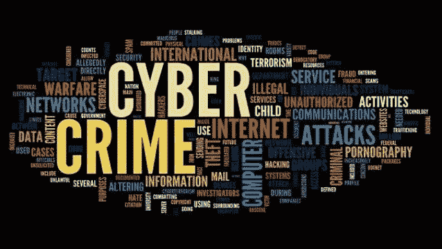
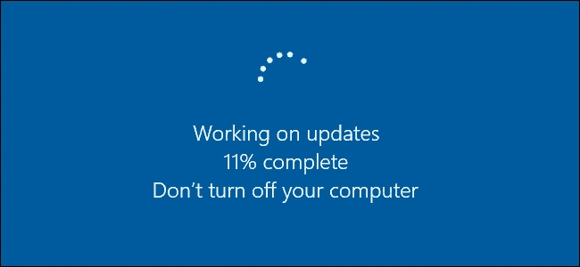
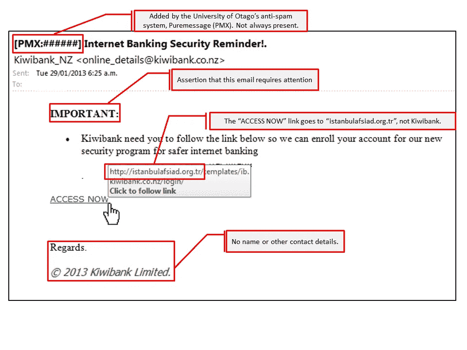
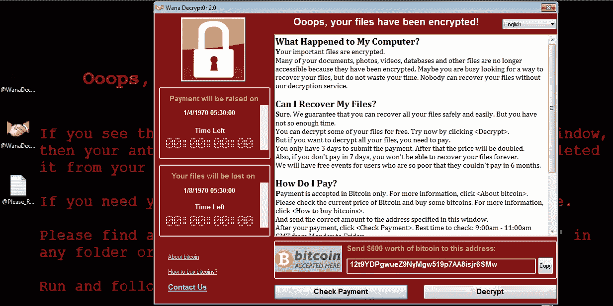
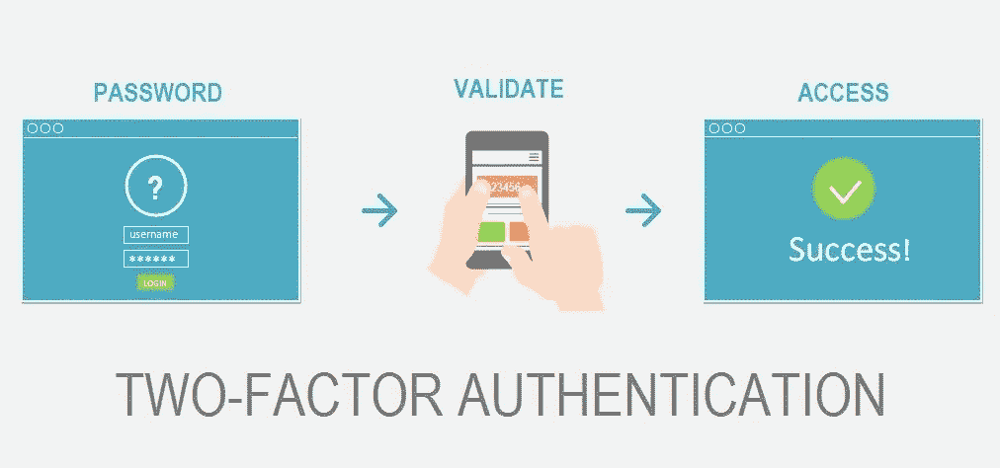

# 如何保护自己免受针对个人用户的最流行的网络攻击

> 原文：<https://medium.com/hackernoon/most-popular-types-of-cyber-attacks-against-individual-users-part-ii-e75067161aaf>

## 第二部分

在我的[上一篇文章](/@gershwin.aaron/most-popular-types-of-cyber-attacks-against-individual-users-part-i-dee7eed353b6)中，我介绍了针对个人用户的三种最流行的网络攻击:勒索软件、网络钓鱼和凭据填充。虽然理解不同黑客方法的内部运作是实现网络安全的第一步，但实践必须永远补充理论。

[https://www.slideshare.net/shubhamarsenal/cyber-crime-70262741](https://www.slideshare.net/shubhamarsenal/cyber-crime-70262741) img: cyber-crime-1–638.jpg?cb=1482143571

对于高级用户来说，这里的信息可能看起来过于简单，但年度网络安全研究显示，一个普通的互联网用户经常用舒适来换取安全。以利润为导向的黑客对复杂的黑客技术不感兴趣，他们想要一个简单的、无风险的操作来套现。

这就是为什么实施即使是最简单的防御机制也可以显著提高您的安全性，它将您与其他未受保护的人群隔离开来，并且将您作为目标变得不值得努力。请记住，网络安全不是一次性的练习，而是一种健康的习惯，并不是很难培养，所以让我们开始吧。

# 基本在线安全提示

## **1。使用在线/离线保护软件。**

杀毒软件是必备的，因为大多数攻击都试图用恶意软件、病毒或蠕虫感染您的设备。此外，好的反病毒软件具有在线保护功能，如果网页或电子邮件附件试图感染您的系统，它会向您发出警报。如果你经常使用公共 wi-fi，考虑使用 VPN，它会加密你的流量，使你更难监视你的在线活动。密码管理也是一个问题，因此可靠的密码生成器和可信的密码管理器是有益的。

## 2.**让你的软件保持最新。**

出于各种原因发布了更新，其中一些更新可能包含对已知漏洞的关键修复。您的防病毒软件、网络浏览器、操作系统等都可能存在漏洞，黑客可以利用这些漏洞来获取机密信息。如果您更新系统的时间太晚，遭受成功黑客攻击的风险就会增加，因为漏洞已经成为一个已知问题，网络罪犯会寻找没有应用补丁的系统。

[https://www.howtogeek.com/235474/how-to-roll-back-builds-and-uninstall-updates-on-windows-10/](https://www.howtogeek.com/235474/how-to-roll-back-builds-and-uninstall-updates-on-windows-10/)

## 3.保持你的知识是最新的。

如果你是一个活跃的网民，那么你在不同的网页上有几十个(如果不是更多的话)账户。如果他们中的任何人泄露了你的凭据，那么尽快采取行动是至关重要的。阅读最新的在线安全威胁可以让你知道危险可能来自哪里，并帮助你做好准备。不要依赖公司通知可能的违规，他们中的一些人会故意隐瞒这些信息，害怕损害他们的品牌。力争领先一步。

# 防范网络钓鱼攻击

## 1.不惜一切代价避免草率决定。

网络钓鱼可以通过电子邮件、电话或短信进行，但最终目的都是一样的——获取您的私人信息。电子邮件可能试图引诱您采取草率的行动，例如，“银行”通知他们遇到了安全漏洞，需要您尽快更新您的密码。或者您接到“互联网服务提供商”的电话，告诉您他们正在进行网络升级(称为“技术支持电话诈骗”)，并要求您提供个人信息才能继续。

当你注意到一种紧迫感时，一定要花时间检查问题的有效性。银行不需要他们客户的密码，也永远不会要求它，互联网服务提供商不需要任何凭证就可以进行网络升级。如果您接到电话，说明您将回电告知相关信息，并通过相关机构的官方电话号码联系他们，询问相关问题。对于电子邮件，请阅读以下段落。

## 2.如何辨别欺诈邮件和真邮件？

首先，它通常以“亲爱的客户”或类似的开头，网络钓鱼电子邮件会群发，很少包含您的真实姓名。发件人的电子邮件可能是欺骗性的，乍看起来似乎是合法的，但是，它可能包含拼写错误的公司名称，例如，“support@anazon.com”。此外，使用额外的软件，可以创建一个带有“@amazon.com”的假电子邮件，因此令人信服的电子邮件地址并不一定意味着它不是网络钓鱼。

[https://blogs.otago.ac.nz/infosec/examples-of-phishing-emails/](https://blogs.otago.ac.nz/infosec/examples-of-phishing-emails/) img: Slide1.png

网络钓鱼电子邮件通常包含一个指向欺诈网站的超链接。而不是点击链接打开一个新的浏览器标签和手动输入网页地址。黑客可以使用链接缩写(如 bit.ly)来使链接看起来更有说服力，但这是一家真正的公司很少在电子邮件中采用的做法。超链接可能被格式化为看起来像文本，在这种情况下，将鼠标悬停在超链接上并检查弹出的地址。

## 3.**打开附件之前，请仔细检查。**

黑客可能想要感染您的设备以获取机密信息。您可能会收到一封信，其中附有需要支付的发票或彩票中奖信息，并附有一份 PDF 文档，其中包含如何领奖的“说明”。再次，仔细检查电子邮件的拼写错误，可疑的电子邮件地址，恶意超链接，最后，如果你的反病毒软件支持这一功能，扫描发出和收到的电子邮件的恶意元素。

# 防范勒索软件

## 1.**如果你的电脑被勒索软件锁定，立即断开网络连接。**

勒索软件是一种恶意软件，它倾向于传播和加密尽可能多的设备，因此这应该是您防止进一步感染的第一步。然而，这种恶意软件在执行自身之前可以在设备中潜伏相当长的时间，并且可能已经传播到其他设备，这意味着它们也必须被检查是否感染。

[http://www.secpod.com/blog/wannacry-ransomware-digital-example-of-a-perfect-storm/](http://www.secpod.com/blog/wannacry-ransomware-digital-example-of-a-perfect-storm/) img: Screenshot-from-2017–05–14–23–42–20.png

## 2.**有备份。**

勒索软件会加密你的全部或部分硬盘，或者拒绝访问你的文件，直到你支付赎金。有一个备份可以保证你能够恢复你的数据，而不会屈服于黑客的要求。然而，设置备份后，建议测试它是否正常工作。

## 3.**不付赎金。**

无法保证在支付赎金后，黑客们会信守承诺。最好的情况是他们会信守承诺，但更常见的情况是继续勒索受害者更多的钱。此外，您很可能会被添加到易受攻击的受害者名单中，并可能在未来受到更多的攻击。

## 4.**请勿重启设备并联系当局。**

恶意软件可以从 RAM 中执行自身，通过重新启动您的设备，RAM 会清除任何可能对取证有用的痕迹。当局可能能够识别出使用的是哪种勒索软件，这可能会导致更大的成功恢复机会。

# 防止凭据填充

## 1.**开启双因素或多因素认证。**

到目前为止，这是防止凭据填充的第一道防线。像 Gmail 这样的服务会通过检查试图访问账户的设备的用户、位置和语言来防止未经授权的登录。但是这些凭证都是可以伪造的，强制 2FA 或者 MFA 会让黑客更加卖力。

[https://www.falcon.io/help/manage/2-factor-authentication/](https://www.falcon.io/help/manage/2-factor-authentication/) img: 2fa-two-factor-authentication.jpg

## 2.监控你的电子邮件的安全。

由于大量泄露，凭证填充越来越受欢迎，因此您应该了解影响您电子邮件地址的任何泄露。到目前为止，最好的方法是检查 www.haveibeenpwned.com。如果您的电子邮件受到影响，您应该立即更改有问题的电子邮件的密码以及使用相同密码的所有服务的密码。

## 3.**使用密码管理器。**

正如文章开头提到的，密码管理仍然是一个大问题。一个好的密码管理器将允许你为每个网站设置一个不同的强密码，并将它们保存在一个安全且加密的保险箱中。执行凭据填充攻击的黑客希望同一个密码被多次使用，而密码管理器解决了这个问题。

这些只是基本的步骤，将提高(但不保证)你的网上安全，抵御黑客攻击的问题。阅读最新的漏洞、黑客方法和安全问题可能会调整你的感知方式，并改善你的浏览习惯。此外，不幸的是，遵循这些简单步骤的网民数量仍然很低，所以通过实施命名的安全措施，你将从雷达上消失。还是俗话说的好，谨言慎行，心中有数。