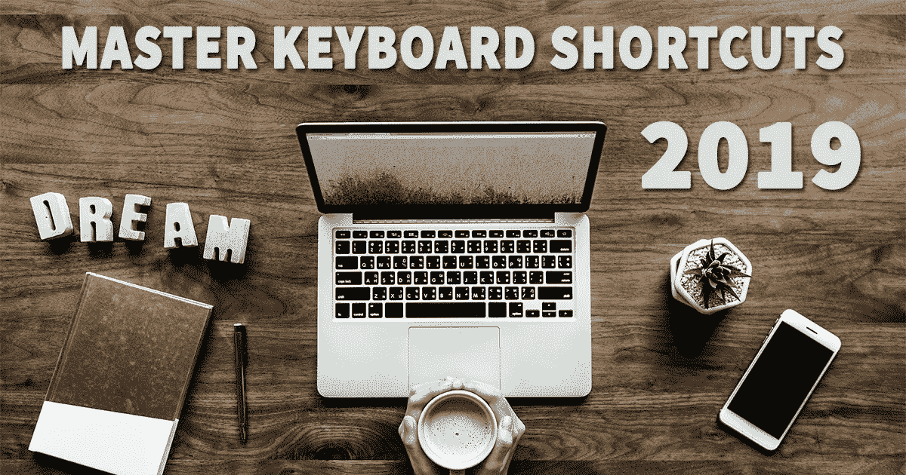

# 2019 年要掌握的最高效的键盘快捷键

> 原文：<https://medium.com/hackernoon/most-productive-keyboard-shortcuts-to-master-in-2019-5d2c51df7e9b>

我们经常发现自己的手在鼠标或触控板和键盘之间切换。如果你是一个像我一样的程序员，或者如果你大部分时间都在机器上，这就变得很麻烦了。

如果我与你分享一些**秘密魔法咒文**(一个被认为具有特殊精神力量的单词或声音)，可以把你变成**键盘快捷键巫师**会怎么样？是的，你肯定需要一些练习，但最终，你会变得很棒。

快捷方式是为了节省我们的时间，比使用鼠标或触控板更快地完成任务。现在看着键盘，你不会对你键盘上的随机字母感到好奇吗？

# 为什么字母会随机放在键盘上？

让我告诉你，这些字母不是随意放置的，也不是为了好玩，它背后有一个非常明确和有目的的原因。

在 19 世纪 70 年代之前，打字机习惯于遵循键盘上的字典顺序。当人们打字太快时，问题就出现了，这导致打字机的钢条纠缠在一起，卡住了。

为了解决这个问题，克里斯托弗·肖尔斯在 1873 年开发了 QWERTY 键盘布局。它以这样一种方式放置按键，当打字时，这些条不太可能相互碰撞。随着第一台使用这种键盘的雷明顿打字机的流行，这种键盘布局成为了一种标准，所有其他制造商也纷纷效仿。

## 为什么我们还在用它？

你可能会想**为什么 140 年后我们还在使用同样的老式 QWERTY 布局键盘，它是为了解决一个不再存在的问题而设计的？**

经过数百次的试验和错误，Christopher Sholes 开发了 QWERTY 键盘布局，受到了社区的好评。QWERTY 布局也解决了许多其他问题。在观察了数千个单词后，克里斯托弗·肖尔斯总结道，为了加快打字速度，两只手必须有规律地交替使用。所以他把这些字放在这样的位置上，这样大部分的字都可以使用双手。

现在 **QWERTY 是一种广泛使用的布局**，切换回旧的字典式布局几乎是不可能的，因为这需要我们更换所有的 QWERTY 键盘，并且我们必须再次学习在新的布局上打字。众所周知，人们抵制改变，这也是 QWERTY 布局一直沿用至今的唯一原因。

# 最高效的键盘快捷键

这里提到的所有快捷方式都是针对 Windows 操作系统的，所以很抱歉 Mac 和 Linux 用户把你留在这里。尽管 Mac **Cmd** 键(⌘)通常与 Windows **Ctrl** 键和 Windows **Alt** 键相同，但它们可能是 Mac **Cmd** 或 Mac **Opt** 键。

我们不会讨论一些我们已经习惯的基本快捷方式，比如剪切、复制、粘贴、撤销和重做。我试图只涵盖那些鲜为人知或最新的捷径，它们将帮助你提高工作效率。

我们已经介绍了以下程序的快捷方式:

*   Windows 操作系统
*   Word / Google 文档
*   Chrome / Firefox / Opera /微软 Edge

你准备好成为**键盘快捷键向导**了吗？如果你坚持到这篇文章结束，那么我有一些**奖励工具**来提高你的生产力。

## 剪贴板历史

**注意:**此快捷键仅适用于 Windows 十月更新之后的版本。

剪贴板历史保存多个复制的文本和图像，可以按任何顺序粘贴，而无需反复复制文本和图像。

这项功能在 Windows 十月更新中一发布就引起了我的注意，从那以后，我再也不用寻找任何第三方软件来完成这项任务，因为这项新功能可以完美地工作。

## 右键单击

我们的下一个快捷方式是鼠标右键点击键盘，目标是 **shift + F10。**

该快捷方式只需右击聚焦区域，因此如果您想右击特定文件，首先需要将焦点设置在该文件上，然后按下 **shift + F10** ，它将显示所选文件的选项。

## 锁定您的桌面

我们经常不得不让我们的工作空间空闲一段时间，所有的进程都在后台运行。当你不在的时候不锁定你的电脑是一个愚蠢的想法，所以这里有一个方便的快捷方式让你使用 **Win + L.** 锁定你的桌面

## 打开任务管理器

一个程序没有响应！别担心， **Ctrl + Alt + Del** 会在打开任务管理器并杀死任务之后来拯救你。但是有一个更好的方法，那就是 **Ctrl + Shift + Esc** 直接打开任务管理器，然后我们可以使用 **Del** 键结束选中的任务。

## 系统基本信息

了解系统的一些基本信息总是明智的，所以不要去查看“这台电脑”(以前称为“我的电脑”)的属性。您可以使用 **Win + Pause 查看系统信息。**

## 快速截图

您可以使用 **Win + prt sc** 在 Windows 上对当前屏幕进行快速截图，您的截图将在`Pictures/Screenshots`中显示。

使用 **Win + Shift + S** 捕捉所需区域的屏幕截图，只需在您想要复制的区域周围单击并拖动鼠标左键即可。现在你可以用经典的 **Ctrl + V.** 把它粘贴到任何你想粘贴的地方

## 任务栏选择

我们把项目钉在任务栏上，这样我们可以在需要的时候快速打开它们，但是你还在用鼠标打开它们吗？

嗯，你可以使用 **Win + number** 打开你锁定的项目，其中数字(1–0)是一个项目在任务栏上从左边开始的位置。假设 chrome 是任务栏的第三项，那么你将使用 **Win + 3** 打开 chrome。

这适用于从 1 到 10 的项目，其中 **Win + 1** 是任务栏上的第一个项目，而 **Win + 0** 是第十个项目。任务栏中的更多项目怎么办？

您可以使用 **Win + T** 自由浏览任务栏上的项目，然后使用箭头键选择所需的项目。

如果您想切换系统托盘，则使用 **Win + B** 并选择所需项目。您可以使用 **Win + A** 打开 Windows 操作中心，并在其中切换通知和设置。

## 桌面选择

你可以使用 **Win + D** 将焦点移至桌面，这将最小化当前焦点中的所有应用程序。然后，您可以使用箭头键在应用程序中导航，并可以使用 **Ctrl +箭头**键在项目周围移动并按下**空格键**来选择多个项目。

选择所需文件后，您也可以使用 **Alt + Enter** 直接打开任何文件的属性。

## 最近的活动

您可以使用 **Win + Tab** 查看最近 3 天或最多 30 天的活动，如果您让 Microsoft 存储您的活动历史记录，但我不建议您这样做。

您可以使用最近的活动在应用程序之间切换，甚至可以打开您在过去 3 天内关闭的应用程序。

## 在单个屏幕上捕捉多个应用程序

Windows 允许您通过将屏幕分成两半，在单个屏幕上捕捉多个应用程序。

在 Windows 10 中，你会得到一个**快照辅助功能**，当你在屏幕上快照一个应用程序时，它会自动建议你快照其他应用程序。这可以简单地通过使用 **Win + Arrow** 键将应用程序捕捉到屏幕的任意一侧来完成。

## 浏览器快捷方式

如果您使用这些快捷方式来完成这些任务，网上冲浪将变得更容易、更快。所以给你:

*   **标签:**你可以用 **Ctrl + T** 打开一个新标签，用**Ctrl+w**关闭它，如果你想重新打开关闭的标签，你可以用 **Ctrl + Shift + T** 重新打开它。
*   **切换标签:**您可以使用 **Ctrl + number** 切换到特定的标签，其中数字(1–8)是标签从左边开始的位置，因此 **Ctrl + 1** 是第一个标签， **Ctrl + 9** 是最后一个标签。如果超过 8 个标签，您将无法在第 8 个位置之后直接切换到所需的标签。您可以使用 **Ctrl + Tab** 切换到下一个选项卡，使用 **Ctrl + Shift + Tab** 切换到上一个选项卡，在选项卡之间自由导航。
*   **复制标签:**在网络浏览器上复制标签没有快捷方式，只能右击标签并选择“复制标签”选项。但是使用键盘复制标签有一个技巧，那就是首先使用 **Alt + D** 或 **Ctrl + L** 高亮显示 URL，然后使用 **Alt + Enter** 复制标签。
*   您可以使用 **Alt +左箭头键**返回，使用 **Alt +右箭头键前进。**
*   您可以使用 **Ctrl + N** 打开一个新窗口，使用 **Ctrl + Shift + N** 打开一个新的私人窗口。
*   您可以使用 **Ctrl + Enter** 来完成 URL，这将在输入的 URL 的末尾添加一个`com`，因此它对于除了`.com`顶级域之外的域无效。
*   您可以使用 **Ctrl + J** 查看您的下载，使用 **Ctrl + H** 查看历史，使用 **Ctrl + Shift + O** 查看书签。
*   您可以使用 **Ctrl + D** 为任何网页添加书签。
*   你可以使用 **Alt + Home** 打开你的主页。
*   您可以使用 **Tab 键**选择下一个元素，使用 **Shift + Tab 键**选择上一个元素。
*   您可以使用 **Ctrl + Shift + I** 查看 inspect 元素，使用 **Ctrl + U** 查看页面源代码。

## 文档快捷方式

当我在写文档时，我讨厌仅仅为了增加字体大小或使文本加粗而切换到鼠标。我相信你也在寻找更好的方法来完成这些任务，所以你可以这样做:

*   您可以使用 **Ctrl + B** 使文本加粗，使用 **Ctrl + I** 使文本倾斜，使用 **Ctrl + U.** 使文本加下划线
*   您可以使用 **Ctrl + Shift + >** 增加文本大小，使用 **Ctrl + Shift + <** 减小文本大小。
*   您可以添加表情符号(😃)添加到您的文档中。或**Win+；**
*   您可以使用 **Shift +右箭头键**键选择多个字符。
*   您可以使用 **Shift + End** 或 **Shift + Home** 选择一整行文本，如果光标在末尾。
*   您可以使用 **Win +空格键**在您机器上安装的语言之间切换。

# 奖金

正如我在文章开头所承诺的，这里有一些**奖励工具**可以帮助你提高工作效率:

*   [Ueli](http://bit.ly/ueliapp) :一个击键启动器，可以更快地访问 Windows 中的应用程序、文件和文件夹。
*   ShareX:它可以让你捕捉或录制屏幕上的任何区域，只需按一个键就可以分享。它还允许上传图像，文本或其他类型的文件到 80 多个支持的目的地，你可以从中选择。

# 准备好使用你的快捷键超能力了吗？

现在你知道了使用键盘快捷键来完成所有这些任务的最快方法，这肯定会节省你的时间，让你的生活更简单。所以下一次当你浏览网页或编辑文档时，你将有快捷方式来做任何事情，你所需要的就是练习去习惯它。

## 非常感谢你花时间阅读这篇文章！如果你喜欢它，请给它一些掌声，因为它会帮助更多的人看到这个故事。❤