# 书呆子的穆勒报告！Spark 与 TensorFlow 和 BERT 相遇 NLP(第 1 部分)

> 原文：<https://medium.com/hackernoon/mueller-report-for-nerds-spark-meets-nlp-with-tensorflow-and-bert-part-1-32490a8f8f12>

# Apache Spark 实现 NLP 的正确方法


Photo by [Michael](https://unsplash.com/photos/9wXvgLMDetA?utm_source=unsplash&utm_medium=referral&utm_content=creditCopyText) on [Unsplash](https://unsplash.com/search/photos/department-of-justice?utm_source=unsplash&utm_medium=referral&utm_content=creditCopyText)

你有没有想过，如果你不读这本书，你能说出书里的内容？如果你能画一张所有重要人物、地点、事件以及它们之间关系的地图会怎么样？这就是**自然语言处理** (NLP)和**文本挖掘**技术可以帮助我们以一种新的和不同的方式理解自然语言数据的地方。

好吧！也许“阅读一本书”不是一个好的例子，因为每个人**每个月至少应该阅读两到四本书！**

> *这是一系列文章，通过使用基于 Apache Spark 构建的*[*Spark NLP*](https://github.com/JohnSnowLabs/spark-nlp)*库和由 TensorFlow 和 BERT 支持的预训练模型来探索“穆勒报告”。*
> 
> 这些文章对于那些有兴趣学习如何使用 Apache Spark 进行 NLP 的人来说是纯教育性的。

F **第一部分:**通过使用 Spark NLP 提供的预训练管道和模型，执行 NLP 任务并注释“ **Mueller 报告”**。

S第二部分 *:* 使用 BERT 训练的模型，在 Spark NLP 中训练一个 POS 标记器模型，数据清洗，通过 POS 和 NER 分块提取关键词/短语。

TT**第三部分: [GraphFrames](https://github.com/graphframes/graphframes) 的**图形算法，Spark ML 的聚类和主题建模，以及 [Gephi](https://gephi.org/) 的网络可视化。

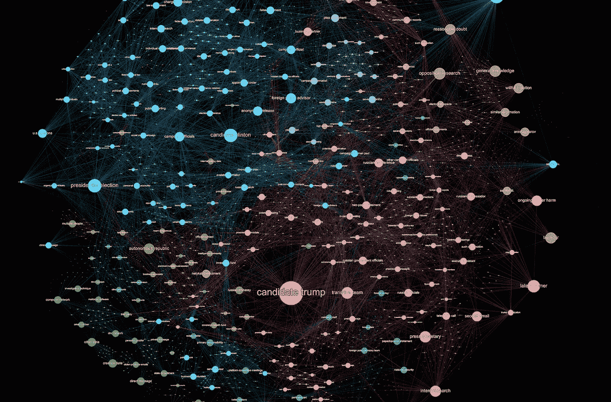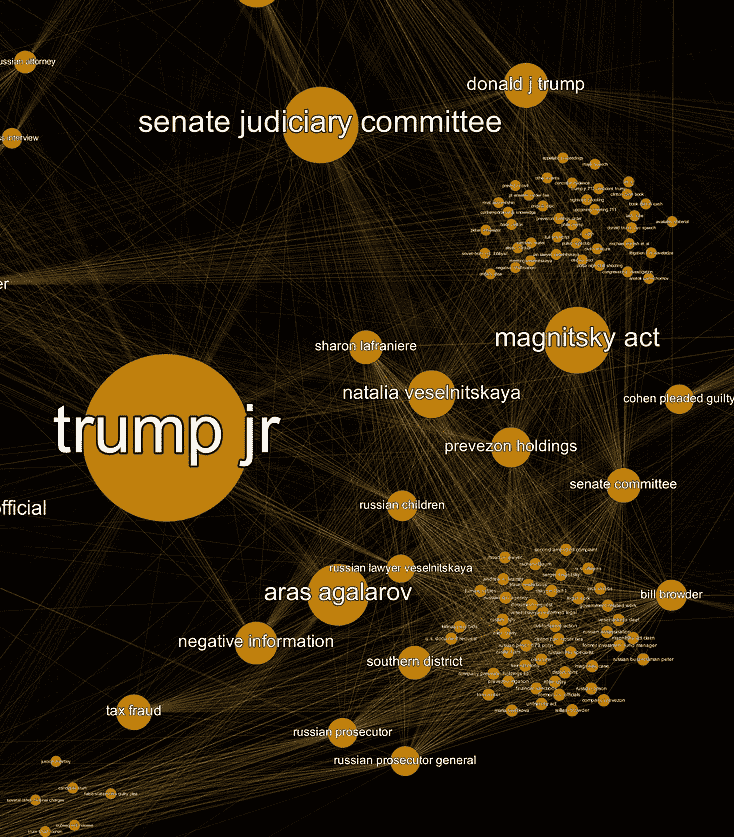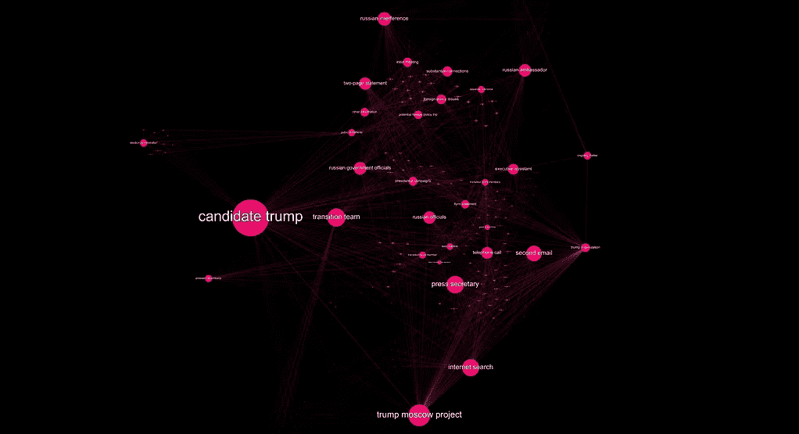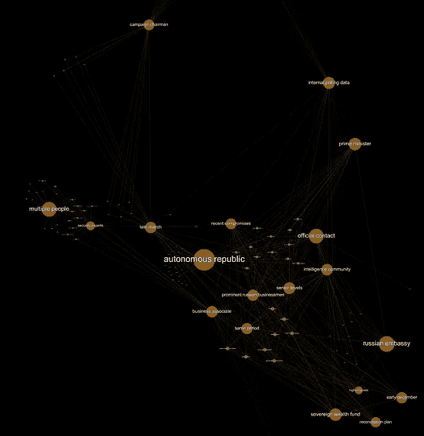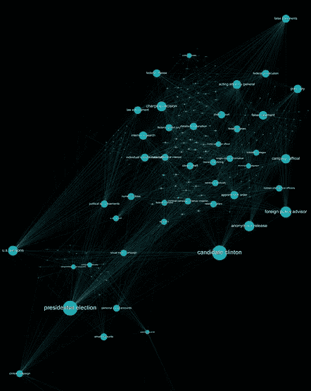

Extracting keywords from the Mueller Report by using Spark NLP

# 关于俄罗斯干涉 2016 年总统选举的调查报告

**米勒报告俗称**


Robert Mueller, 2012

最初的报告是由美国发布的。司法部([原始文件](https://www.justice.gov/storage/report.pdf))对于我们这些不熟悉他的调查的人来说:

> 经过多年的调查，司法部周四公布了特别顾问罗伯特·穆勒报告的编辑副本。这份报告将近 **400** 页，涵盖了从**俄罗斯**干涉 2016 **美国总统选举**到**唐纳德·川普**总统是否妨碍司法公正等问题。[分词器](https://medium.com/u/374a801b3eb2#tokenizer)
> 
> *   [规格化器](https://nlp.johnsnowlabs.com/docs/en/annotators#normalizer)*   [斯特梅尔](https://nlp.johnsnowlabs.com/docs/en/annotators#stemmer)*   [Lemmatizer](https://nlp.johnsnowlabs.com/docs/en/annotators#lemmatizer)*   [正则表达式匹配器](https://nlp.johnsnowlabs.com/docs/en/annotators#regexmatcher)*   [文本匹配器](https://nlp.johnsnowlabs.com/docs/en/annotators#textmatcher)*   [切饼机](https://nlp.johnsnowlabs.com/docs/en/annotators#chunker)*   [约会对象](https://nlp.johnsnowlabs.com/docs/en/annotators#datematcher)*   [sentenced 检测器](https://nlp.johnsnowlabs.com/docs/en/annotators#sentencedetector)*   [深度检测器](https://nlp.johnsnowlabs.com/docs/en/annotators#deepsentencedetector)*   [后置标记](https://nlp.johnsnowlabs.com/docs/en/annotators#postagger)*   [viveksentimentdetector](https://nlp.johnsnowlabs.com/docs/en/annotators#viveknsentimentdetector)*   [情感探测器:情感分析](https://nlp.johnsnowlabs.com/docs/en/annotators#sentimentdetector)*   [词语嵌入](https://nlp.johnsnowlabs.com/docs/en/annotators#word-embeddings)*   [NER CRF](https://nlp.johnsnowlabs.com/docs/en/annotators#ner-crf)*   [NER DL](https://nlp.johnsnowlabs.com/docs/en/annotators#ner-dl)*   [诺维格拼写检查器](https://nlp.johnsnowlabs.com/docs/en/annotators#norvig-spellchecker)*   [对称拼写检查器](https://nlp.johnsnowlabs.com/docs/en/annotators#symmetric-spellchecker)*   [依赖解析器](https://nlp.johnsnowlabs.com/docs/en/annotators#dependency-parser)*   [类型依赖解析器](https://nlp.johnsnowlabs.com/docs/en/annotators#typed-dependency-parser)
> 
> 关于注释器、模型和管道的完整列表，您可以阅读[他们的在线文档](https://nlp.johnsnowlabs.com/docs/en/annotators)。
> 
> > 完全披露:我是[投稿人](https://github.com/JohnSnowLabs/spark-nlp/graphs/contributors)之一！
> 
> # 安装 Spark NLP
> 
> 我的环境:
> 
> *   [火花 NLP](https://github.com/JohnSnowLabs/spark-nlp) 2.0.3 发布
> *   阿帕奇火花 2.4.1
> *   阿帕奇齐柏林飞艇版本 0.8.2
> *   使用 MacBook Pro/macOS 进行本地设置
> *   使用 40 台服务器的 Cloudera/CDH 6.2 集群设置
> *   编程语言:Scala(但是不用担心，Spark 和 Spark NLP 中的 Python APIs 与 Scala 语言非常相似)
> 
> 我将解释如何为我的环境设置 Spark NLP。尽管如此，如果您希望尝试一些不同的东西，您可以通过访问主要的公共存储库或查看包含大量示例的 showcase 存储库来了解有关如何使用 Spark NLP 的更多信息:
> 
> **主**公共知识库:
> 
> [](https://github.com/johnsnowlabs/spark-nlp) [## 约翰·斯诺实验室/spark-nlp
> 
> ### Apache Spark 自然语言理解库。约翰·斯诺实验室/spark-nlp
> 
> github.com](https://github.com/johnsnowlabs/spark-nlp) 
> 
> **展柜**储存库:
> 
> [](https://github.com/JohnSnowLabs/spark-nlp-workshop) [## 约翰·斯诺实验室/spark-NLP-车间
> 
> ### 为 Apache Spark 使用 John Snow Labs 的 NLP 的公共运行示例。— JohnSnowLabs/spark-nlp 工作室
> 
> github.com](https://github.com/JohnSnowLabs/spark-nlp-workshop) 
> 
> 我们开始吧！要在 Apache Zeppelin 中使用 Spark NLP，您有两种选择。要么使用 **Spark 包**，要么你可以自己构建一个胖罐子，并在 Spark 会话中将其作为**外部罐子**加载。要不我给你们俩看看？
> 
> ## 首先，带 Spark 包:
> 
> 要么把这个添加到你的 **conf/zeppelin-env.sh**
> 
> ```
> *# set options to pass spark-submit command*
> export SPARK_SUBMIT_OPTIONS**=**"--packages com.johnsnowlabs.nlp:spark-nlp_2.11:2.0.3"
> ```
> 
> 2.或者，将其添加到**通用内联配置解释器**(在开始 Spark 会话之前，在笔记本的开头):
> 
> ```
> %spark.conf# spark.jars.packages can be used for adding packages into spark interpreter
> spark.jars.packages com.johnsnowlabs.nlp:spark-nlp_2.11:2.0.3
> ```
> 
> ## 其次，加载外部 JAR:
> 
> 要建造一个大罐子，你需要做的就是:
> 
> ```
> $ git clone [https://github.com/JohnSnowLabs/spark-nlp](https://github.com/JohnSnowLabs/spark-nlp#apache-zeppelin)
> $ cd spark-nlp
> $ sbt assembly
> ```
> 
> 然后，您可以按照我提到的两种方法之一来添加这个外部 JAR。您只需要在第一个选项中将“— packages”改为“— jars”。或者对于第二个解决方案，只需要“spark.jars”。
> 
> ## 用 Spark NLP 启动 Spark
> 
> 现在，我们可以通过导入 Spark NLP 注释器开始将 **Spark NLP 2.0.3** 与 **Zeppelin 0.8.2** 和 **Spark 2.4.1** 一起使用:
> 
> ```
> import com.johnsnowlabs.nlp.base._
> import com.johnsnowlabs.nlp.annotator._
> import org.apache.spark.ml.Pipeline
> ```
> 
> Apache Zeppelin 将启动一个新的 Spark 会话，它与 Spark NLP 一起提供，不管您使用的是 Spark 包还是外部 JAR。
> 
> ## 阅读穆勒报告 PDF 文件
> 
> 还记得关于 PDF 文件不是真正的 PDF 的问题吗？我们有三个选择:
> 
> 1.  您可以使用任何您喜欢的 OCR 工具/库来生成 PDF 或文本文件。
> 2.  或者您可以使用社区创建的已经可搜索和可选择的 PDF 文件。
> 3.  或者你可以直接用 Spark NLP！
> 
> Spark NLP 带有一个 **OCR** 包，可以读取 PDF 文件和扫描图像。但是，我把选项 2 和选项 3 混在了一起。(我需要在整个集群上为基于图像的 OCR 安装 Tesseract 4.x+,所以我有点懒)
> 
> 您可以从 Scribd 下载这两个 PDF 文件:
> 
> *   [穆勒报告编辑第一卷](https://www.scribd.com/document/406904220/Word-searchable-Mueller-Report-Redacted-Vol-I)
> *   [穆勒报告修订第二卷](https://www.scribd.com/document/406904826/Word-searchable-Mueller-Report-Redacted-Vol-II)
> 
> 当然你也可以直接下载文字版，用 Spark 看。但是，我想向您展示如何使用 Spark NLP 附带的 OCR。
> 
> **Spark NLP OCR:**
> 
> 让我们为与 OCR 相关的一切创建一个助手函数:
> 
> ```
> import com.johnsnowlabs.nlp.util.io.OcrHelper
> val ocrHelper = new OcrHelper()
> ```
> 
> 现在，我们需要阅读 PDF 并根据其内容创建一个数据集。Spark NLP 中的 OCR 每页创建一行:
> 
> ```
> //If you do this locally you can use **file:///** or **hdfs:///** if the files are hosted in Hadoop**val muellerFirstVol = ocrHelper.createDataset**(spark, "/tmp/Mueller/Mueller-Report-Redacted-Vol-I-Released-04.18.2019-Word-Searchable.-Reduced-Size.pdf")
> ```
> 
> 
> 
> DataFrame created by reading the PDF file
> 
> 如您所见，我正在将该报告的“第一卷”以 PDF 格式加载到一个数据集中。我在本地这样做只是为了说明使用 Apache Spark 和 Spark NLP 并不总是需要集群！
> 
> **提示 1** :如果 PDF 实际上是扫描图像，我们可以使用这些设置(但在我们的用例中，我们发现了一个可选的 PDF):
> 
> ```
> ocrHelper.setPreferredMethod("image")
> ocrHelper.setFallbackMethod(false)
> ocrHelper.setMinSizeBeforeFallback(0)
> ```
> 
> **提示 2** :如果需要，您可以通过以下方式将 Spark 数据集转换为 DataFrame:
> 
> ```
> **muellerFirstVol.toDF()**
> ```
> 
> # Spark NLP 管道和模型
> 
> ## 机器学习和深度学习的自然语言处理
> 
> 现在是时候做一些 NLP 任务了。正如我在开始时提到的，我们希望使用已经预先培训好的由 Spark NLP 在第一部分中提供的**管道**和**型号**。这些是一些可用的[管道](https://nlp.johnsnowlabs.com/docs/en/pipelines)和[型号](https://nlp.johnsnowlabs.com/docs/en/models):
> 
> 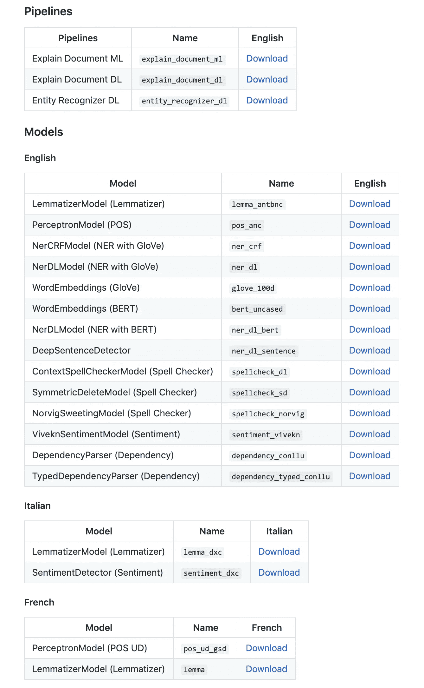
> 
> Spark NLP pre-trained Pipelines and Models (full list of [pipelines](https://nlp.johnsnowlabs.com/docs/en/pipelines) and [models](https://nlp.johnsnowlabs.com/docs/en/models))
> 
> 不过，我想先用一个名为**“explain _ document _ dl”**的管道。让我们看看如何下载这个管道，用它来注释一些输入，以及它到底提供了什么:
> 
> ```
> import com.johnsnowlabs.nlp.pretrained.PretrainedPipelineval pipeline = PretrainedPipeline("**explain_document_dl**", "**en**")// This DataFrame has one sentence for testing
> val testData = Seq(
>     "Donald Trump is the 45th President of the United States"
>     ).toDS.toDF("text")// Let's use our pre-trained pipeline to predict the test dataset
> pipeline.transform(testData).show
> ```
> 
> 以下是的结果。显示():
> 
> 
> 
> Spark NLP pre-trained “**explain_document_dl**” pipeline
> 
> 我知道！这条管道里有很多东西。让我们从我们在**“explain _ document _ dl”**管道中的 NLP 注释器开始:
> 
> *   文件汇编员
> *   判刑检测员
> *   标记器
> *   引理模型
> *   斯特梅尔
> *   感知器模型
> *   ContextSpellCheckerModel
> *   WordEmbeddings(手套 6B 100)
> *   NerDLModel
> *   NerConverter(分块)
> 
> 据我所知，这个管道中有一些标注器正在使用由 **TensorFlow** 驱动的**深度学习**进行监督学习。例如，当您加载此管道时，您会注意到这几行:
> 
> ```
> pipeline: com.johnsnowlabs.nlp.pretrained.PretrainedPipeline = PretrainedPipeline(**explain_document_dl**,en,public/models)adding (ner-dl/mac/_sparse_feature_cross_op.so,ner-dl/mac/_lstm_ops.so)loading to **tensorflow**
> ```
> 
> 为简单起见，我将分别选择一组列，这样我们就可以实际看到一些结果:
> 
> 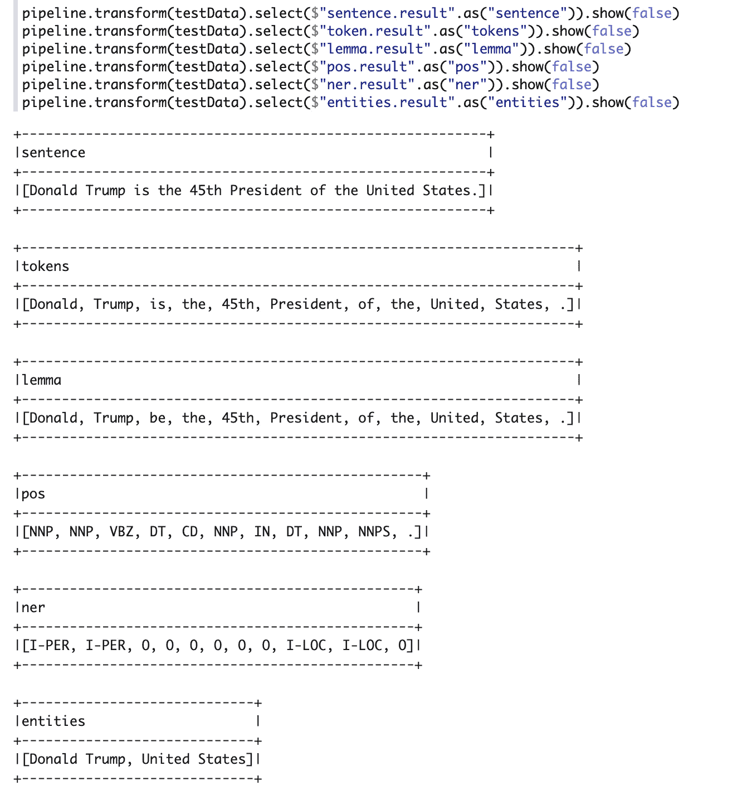
> 
> Spark NLP pre-trained “**explain_document_dl**” pipeline
> 
> 这是一个非常完整的 NLP 管道。像其他 NLP 库一样，它有许多 NLP 任务，甚至更像**拼写检查。**但是，如果你只是在寻找一个或两个自然语言处理任务，如 POS 或 NER，这可能有点重。
> 
> 让我们尝试另一个预先训练好的管道，名为**“entity _ recognizer _ dl”:**
> 
> ```
> import com.johnsnowlabs.nlp.pretrained.PretrainedPipelineval pipeline = PretrainedPipeline("**entity_recognizer_dl**", "**en**")val testData = Seq(
>     "Donald Trump is the 45th President of the United States"    ).toDS.toDF("text")// Let's use our pre-trained pipeline to predict the test dataset
> pipeline.transform(testData).show
> ```
> 
> 如您所见，使用预先训练的管道非常容易。你只需要改变它的名字，它就会下载并缓存在本地。这条管道里有什么？
> 
> *   文件
> *   句子
> *   代币
> *   **嵌入**
> *   **NER**
> *   **NER 大块**
> 
> 让我们来看看 NER 模式在这两条管道中发生了什么。**命名实体识别(NER)** 使用**单词嵌入** ( **手套**或**伯特**)进行训练。我可以引用该项目的主要维护者之一的话来说明它是什么:
> 
> > NerDLModel 是一个训练过程的结果，由 NerDLApproach SparkML estimator 发起。这个估算器是一个张量流 DLmodel。它遵循具有卷积神经网络的双 LSTM 方案，利用单词嵌入进行令牌和子令牌分析。
> 
> 你可以阅读这篇关于使用**张量流**图以及 Spark NLP 如何使用它来训练其 NER 模型的完整文章:
> 
> [](/@saif1988/spark-nlp-walkthrough-powered-by-tensorflow-9965538663fd) [## Spark NLP 演练，由 TensorFlow 提供支持
> 
> ### 本文是一个演练解决一个现实的用例自然语言理解在医疗保健使用…
> 
> medium.com](/@saif1988/spark-nlp-walkthrough-powered-by-tensorflow-9965538663fd) 
> 
> 回到我们的管道，NER 块将提取命名实体块。例如，如果你有**唐纳德** - >伊佩尔和**川普** - >伊佩尔，就会产生**姜懿翔川普**。看一下这个例子:
> 
> 
> 
> Spark NLP pre-trained “**entity_recognizer_dl**” pipeline
> 
> ## 自定义管道
> 
> 就个人而言，当我处理预先训练好的模型时，我更喜欢构建自己的 NLP 管道。通过这种方式，我可以完全控制我想要使用什么类型的注释器，我想要 ML 还是 DL 模型，在混合中使用我自己训练的模型，定制每个注释器的输入/输出，集成 Spark ML 函数，等等！
> 
> > 是否有可能创建自己的 NLP 管道，但仍然利用预先训练的模型？
> 
> 答案是**是的**！让我们看一个例子:
> 
> ```
> val document = new DocumentAssembler()
>   .setInputCol("text")
>   .setOutputCol("document")val sentence = new SentenceDetector()
>   .setInputCols(Array("document"))
>   .setOutputCol("sentence")
>   .setExplodeSentences(true)val token = new Tokenizer()
>   .setInputCols(Array("document"))
>   .setOutputCol("token")val normalized = new Normalizer()
>   .setInputCols(Array("token"))
>   .setOutputCol("normalized")val pos = PerceptronModel.pretrained()
>     .setInputCols("sentence", "normalized")
>     .setOutputCol("pos")val chunker = new Chunker()
>   .setInputCols(Array("document", "pos"))
>   .setOutputCol("pos_chunked")
>   .setRegexParsers(Array(
>       "<DT>?<JJ>*<NN>"
>     ))val embeddings = WordEmbeddingsModel.pretrained()
>     .setOutputCol("embeddings")val ner = NerDLModel.pretrained()
>     .setInputCols("document", "normalized", "embeddings")
>     .setOutputCol("ner")val nerConverter = new NerConverter()
>     .setInputCols("document", "token", "ner")
>     .setOutputCol("ner_chunked")val pipeline = new Pipeline().setStages(Array(
>       document, 
>       sentence,
>       token, 
>       normalized,
>       pos,
>       chunker,
>       embeddings,
>       ner,
>       nerConverter   
> ))
> ```
> 
> 就是这样！相当简单和活泼。重要的是，您可以为每个注释器设置想要的输入。例如，对于词性标注，我可以使用标记、词干标记、词汇化标记或规范化标记。这可能会改变注释器的结果。NerDLModel 也一样。我为 POS 和 Ner 模型都选择了规范化的令牌，因为我猜我的数据集有点乱，需要清理一下。
> 
> 让我们使用我们定制的管道。如果你了解 Spark ML 管道，它有两个阶段。一个是拟合，即在管道内训练模型。第二是通过将数据转换成新的数据框架来预测新数据。
> 
> ```
> val nlpPipelineModel = pipeline.**fit**(**muellerFirstVol**)val nlpPipelinePrediction = nlpPipelineModel.**transform**(**muellerFirstVol**)
> ```
> 
> 的。fit()在这里是用来装饰的，因为所有的东西都是预先训练好的。我们不需要训练任何东西。transform()是我们使用管道中的模型来创建一个包含所有预测的新数据框架的地方。但是如果我们有自己的模型或者 Spark ML 函数需要训练，那么。fit()需要一些时间来训练模型。
> 
> 在本地机器上，这需要大约 3 秒钟来运行。我的笔记本电脑有酷睿 i9、32G 内存和 Vega 20(如果这很重要的话)，所以它是一台相当不错的机器。
> 
> 
> 
> Apache Spark on Local machine
> 
> 这个例子与大数据场景完全不同，在大数据场景中，您需要处理数百万条记录、句子或单词。其实连小数据都算不上。然而，我们使用 Apache Spark 是有原因的！让我们在一个可以分配任务的集群中运行它。
> 
> 例如，不久前我有一个更大更复杂的 Spark NLP 管道来处理整个法国大辩论，它被称为“[**Le Grand débat Nationale**](https://granddebat.fr/)”。
> 
> 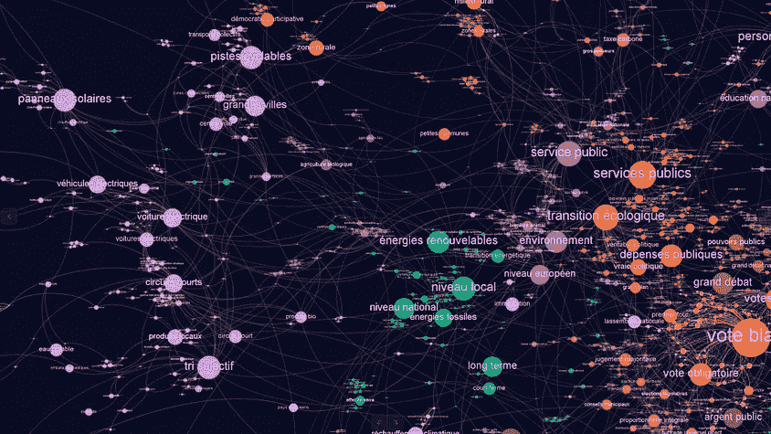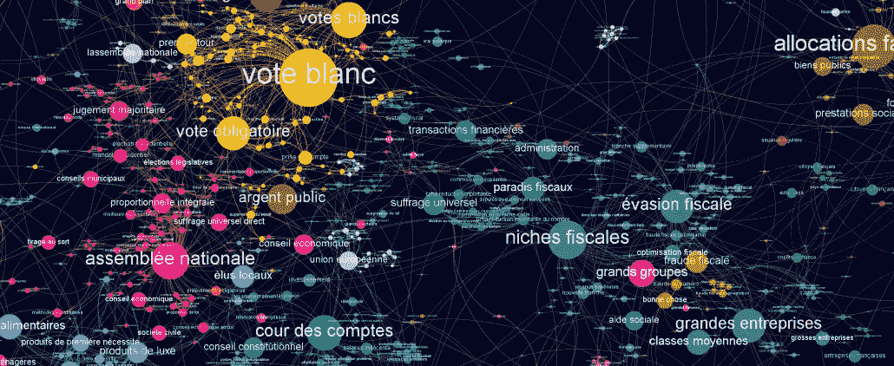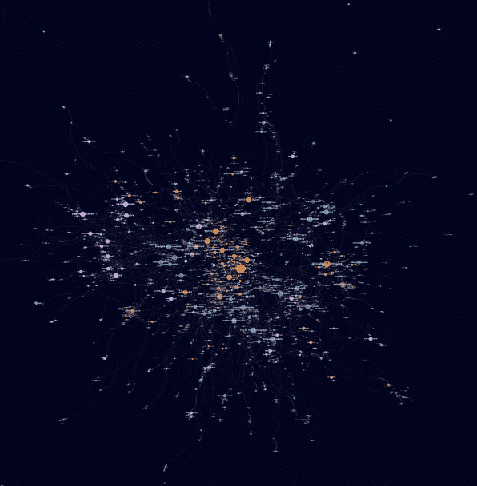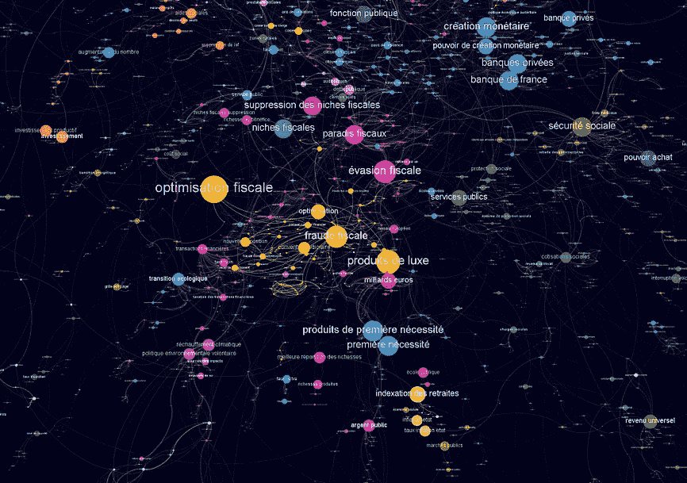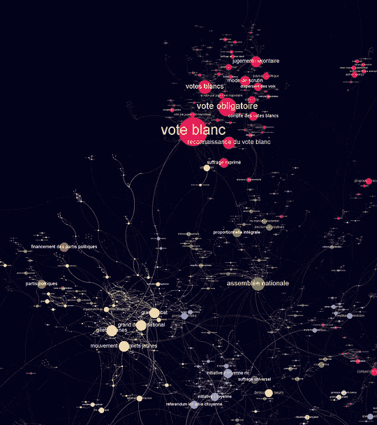
> 
> Politoscope project: [https://politoscope.org/2019/03/gdn-preliminaires/](https://politoscope.org/2019/03/gdn-preliminaires/)
> 
> 最终，我能够将我的 Spark NLP 管道放在一个集群中，该集群拥有超过 25 万用户生成的数百万个句子。当你被困在一台机器上时，这些类型的 NLP 项目是非常困难的，甚至几乎是不可能的。
> 
> **回到我们自己的演示**！在集群中，我们需要做的就是将数据帧从 1 个分区(因为它是 1 个文件)重新分区到大约 60 个分区(取决于有多少个执行器，每个执行器有多少个内核，等等。).这样，Spark 可以将任务分配给更多的执行者，并并行运行它们:
> 
> ```
> **muellerFirstVol**.rdd.getNumPartitions
> val newMuellerFirstVolDF = **muellerFirstVol**.repartition(60)//Now this runs in parallelval nlpPipelineModel = pipeline.**fit**(**newMuellerFirstVolDF**)
> val nlpPipelinePrediction = nlpPipelineModel.**transform**(**newMuellerFirstVolDF**)
> ```
> 
> **注意**:我创建新数据帧的原因是，rdd 本质上是不可变的。所以你不能只改变他们的分区数量。但是，您可以创建具有不同数量分区的新 rdd(数据帧)。
> 
> 这一次，在集群上运行管道用了 **0.4 秒，而不是 3 秒**。也许在一个作业中快几秒钟并不值得注意，但是您可以将它应用于数万个 pdf 或数百万条记录，这样我们就可以利用 Apache Spark 分布式引擎。
> 
> 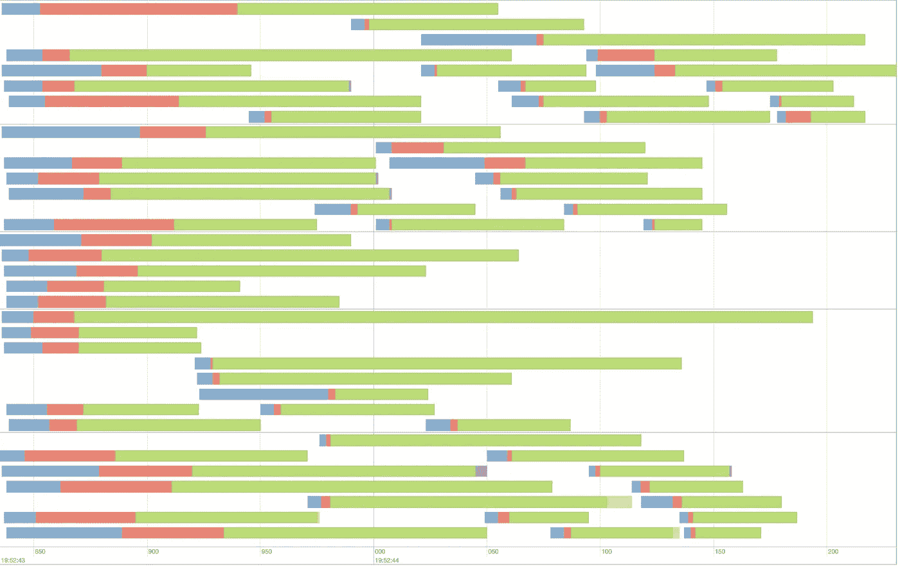
> 
> Apache Spark on a cluster
> 
> 现在让我们来看看我们定制的管道的结果。我想做的是对 NER 模型中的组块进行简单的分组:
> 
> 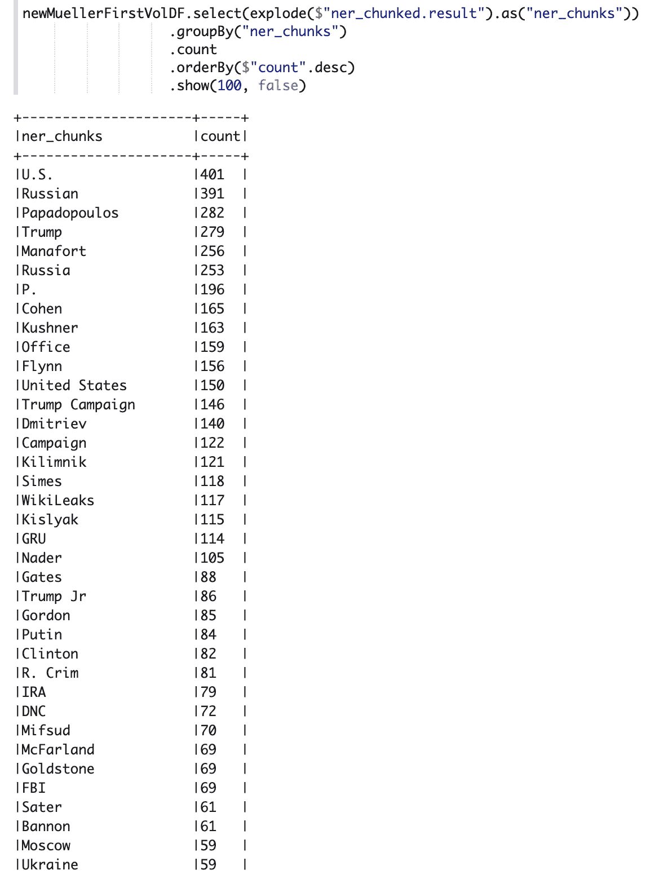
> 
> Spark NLP: NER chunking on Mueller Report
> 
> 正如你所看到的，它需要一些数据清理，以排除错误的实体，如“p”。我们将在第二部分。如果我们在 Mueller 报告的第一卷中创建这些命名实体的共现矩阵，我们可以在 Gephi 中可视化它们，我将在第三部分解释如何实现:
> 
> 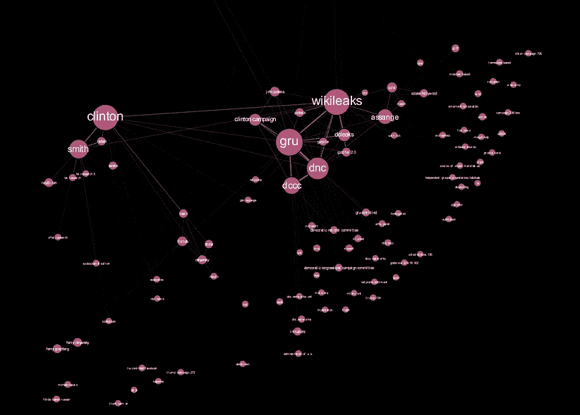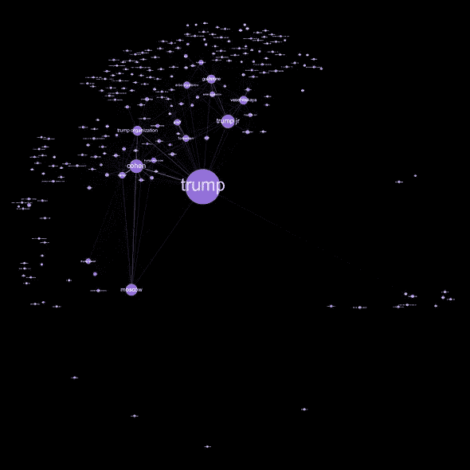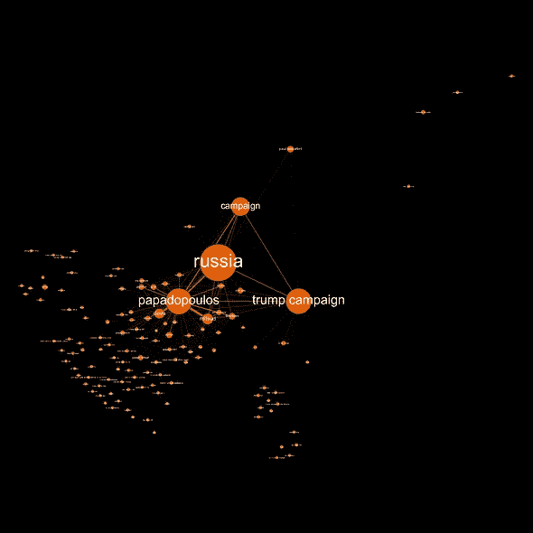
> 
> Spark NLP: Mueller Report Named Entities co-occurrence graph
> 
> # 接下来是什么:
> 
> 恭喜你！现在，您已经知道如何使用 Spark NLP 预训练管道和模型在 Apache Spark 中执行 NLP 任务。这为您提供了 Apache Spark 中分布式引擎的优势，可以在数千个 CPU 内核上运行大规模 NLP 作业。
> 
> 请记住，这是开始使用 Spark NLP 的一种非常快速简单的方法。在下一部分中，我想试验一个由 BERT 单词嵌入而不是 GloVe 训练的 NER 模型，在 Spark NLP 中从通用依存关系训练我自己的 POS 标记器模型，运行一些数据清洗，最后通过 POS 和 NER 分块提取一些关键字/短语。
> 
> # 资源:
> 
> *   [*GitHub 上的 Spark NLP*](https://github.com/JohnSnowLabs/spark-nlp)
> *   [*Spark NLP 网站*](https://nlp.johnsnowlabs.com/)
> *   [*Spark NLP 示例*](https://github.com/JohnSnowLabs/spark-nlp-workshop)
> *   [火花 NLP 管道](https://nlp.johnsnowlabs.com/docs/en/pipelines)
> *   [Spark NLP 车型](https://nlp.johnsnowlabs.com/docs/en/models)
> *   [*火花 NLP 松弛*](https://join.slack.com/t/spark-nlp/shared_invite/enQtNjA4MTE2MDI1MDkxLWVjNWUzOGNlODg1Y2FkNGEzNDQ1NDJjMjc3Y2FkOGFmN2Q3ODIyZGVhMzU0NGM3NzRjNDkyZjZlZTQ0YzY1N2I)
> *   [*Spark NLP vs 其他 NLP 库*](https://blog.dominodatalab.com/comparing-the-functionality-of-open-source-natural-language-processing-libraries/)
> *   [*火花 NLP vs 空间*](https://www.oreilly.com/ideas/comparing-production-grade-nlp-libraries-training-spark-nlp-and-spacy-pipelines)
> *   [*tensor flow 供电的 Spark NLP*](/@saif1988/spark-nlp-walkthrough-powered-by-tensorflow-9965538663fd)
> 
> # 问题？
> 
> 如果您有任何问题，请在这里留言或在 [Twitter](https://twitter.com/MaziyarPanahi) 上发推文给我。
> 
> 觉得这篇文章有趣？请在媒体上关注我( [Maziyar Panahi](https://medium.com/u/fe4b780b61e1?source=post_page-----32490a8f8f12--------------------------------) )以获取未来的文章和掌声👏如果你喜欢的话，来几次吧！😊