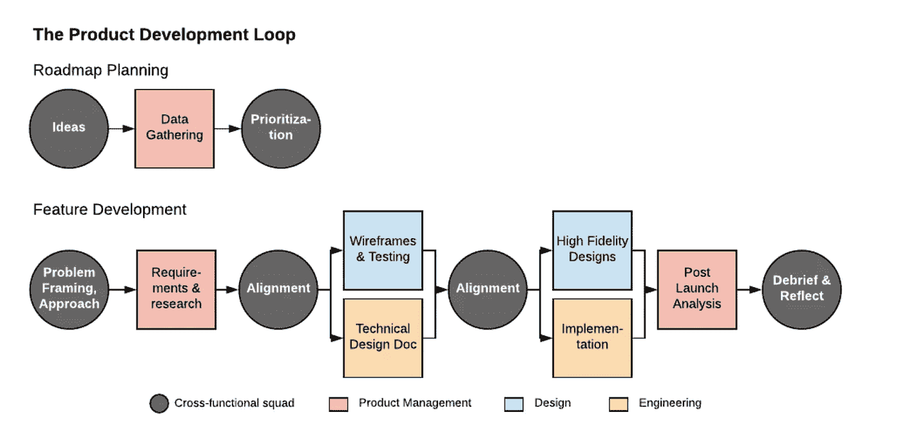

# 我从训练营参加者到高级软件工程师的 4 年历程

> 原文：<https://medium.com/hackernoon/my-4-year-journey-from-bootcamp-attendee-to-senior-software-engineer-b369896d37b9>

[Image from here](https://www.pexels.com/photo/woman-programming-on-a-notebook-1181359/)

## 对经验教训的回顾

我最近在 [Apollo.io](https://www.apollo.io/) 被提升为高级软件工程师。然而，头衔只是头衔。我到底成长了多少？

我在 2015 年初离开了我的医学预科道路，并在此后不久开始了我在科技领域的第一份工作。像许多其他人一样，我经常质疑自己在这个行业中的地位。

我学得够快吗？我在职业生涯中成长了吗？我会被刚从大学毕业的人取代吗？

这些想法每隔一段时间就会冒出来，几周前，我对自己说，在过去的一年左右的时间里，我没有长高多少。我感到不安，直到我和一位同事谈到我在这个行业迄今为止的经历。

*“告诉我你工作过的每个地方。你为什么加入？你为什么离开？”*

我们的谈话围绕着这个话题。

与她交谈后，我意识到在过去的一年里，在我进入科技行业的四年里，我确实在我的职业生涯中成长了很多。我从初级工程师到高级工程师的旅程不仅仅是空洞的头衔膨胀。只有好的经历才能提供真知灼见和知识。

我的第一份工作是在 Lumosity。我加入了营销团队，做前端开发。那时候我没有标准。不知道我想要什么，不想要什么。我加入是因为这是我在训练营的第一份工作，我只想开始赚钱。我工作的前三个月几乎完全是营销团队需要的静态 html 页面。

幸运的是，公司经历了一次重组。市场营销与增长相结合，结果我加入了工程团队。

在那里，我有了更多的资源，接触到了营销邮件和网页范围之外的项目。

或多或少，我觉得自己受到了公司里极其聪明的人的保护。通过大量的指导和配对会议，我很快学会了编码最佳实践，比如模块化、关注点分离和编写好的测试。

在获得了一些真实世界的软件开发经验后，我觉得已经准备好继续前进了。虽然我在 Lumosity 度过了美好的时光，与了不起的人一起工作，但我不再想被牵着手。我知道，如果我留下来的话，我还需要一段时间才能着手大型项目。我需要加入一个小团队，在那里我可以犯自己的错误并从中吸取教训。

> **有时候，学习游泳最快的方法就是自己出去。我觉得自己已经做好了成败的准备。**

我的下一份工作是在一家名为 Pillow 的 30 人创业公司。很快，我接手了一个使用 Airbnb api 的大项目。在 Pillow 的一年多时间里，作为一名个人贡献者，我成长了很多。我参与了多项计划，从头开始设计和构建功能。例子包括为 Pillow 的 React 应用程序设置集成测试框架，构建和设置第一个 A/B 测试，以及为期一个月的与入职相关的项目。

过了一年左右，五官本身不再让我害怕。我觉得我能承担任何抛给我的项目。随着我的思想越来越少被冒名顶替综合症分散，我开始更多地关注产品开发过程本身。这成了我个人和职业成长的转折点。

我注意到团队构建的特性的预期寿命很低。我见过大项目在很短的时间内就被其他大项目取代。我见过一些功能从未被采用，或者更糟，从未投入生产。

那时我才意识到，在那之前，我只是专注于完成我正在建造的*什么—* 什么。我不知道问题导向的重要性，也不知道问*“为什么”的重要性*

*为什么这个特性是必要的？*

我们到底要解决什么？

*这个功能实际上解决问题了吗？有没有更好的解决办法？*

枕头有一个流水线产品开发过程。当工程师们听说新项目时，一切都已经确定和设计好了。工程校准从来不是流程的一部分，我也没有足够的经验来质疑产品需求。

Assembly line product development process. From [here](https://hackernoon.com/killing-the-product-development-assembly-line-2176bde2a4d9)

这个问题我提了好几次，但最后，我觉得是时候继续前进了。对于我的下一家公司，我想找到一种好奇的文化和一个以问题为导向的 EPD(工程、产品和设计)团队。

> 我认为从初级工程师到高级工程师的职业发展过程中的一个自然步骤是从任务执行者(关注“什么”)转变为问题解决者(理解“为什么”)。

我想找到一种文化，在这种文化中，工程师受到鼓励并被赋予解决问题的能力。

我加入 Apollo 的前提是，它有一种重视产品、工程和设计之间快速迭代和协作的文化。

我以为公司有我要找的流程。

然而，我很快了解到，没有一个初创企业有伟大的过程。大多数初创企业都在想办法解决问题。当我加入的时候，阿波罗经历了一个相当糟糕的过程。事实上，在我早期的阿波罗计划中，我的经历或多或少类似于在 Pillow 的经历。我是任务执行者，Tim(我们的 CEO)是任务创造者。

然而，随着时间的推移，事情变得非常好，因为我们的领导者乐于接受反馈和改进。拥有一个好的流程并不像与那些倾听和接受积极变化的人一起工作那么重要。

现在，阿波罗有一个产品开发循环。

[https://hackernoon.com/killing-the-product-development-assembly-line-2176bde2a4d9](https://hackernoon.com/killing-the-product-development-assembly-line-2176bde2a4d9)

在这个生态系统中，工程、产品和设计共同塑造新功能和工作流的最终状态。

我不会说阿波罗的过程是完美的。这是一项持续进行的工作。但是，没关系，因为过程是达到目的的手段，而不是目的本身。重要的是与关心合作的人一起工作，以取得积极的成果。

> 与那些乐于接受反馈和改进的人一起工作会有很大的不同。

那么我职业生涯的下一步是什么？

在过去的几年里，作为一名 IC，我通过接手和设计复杂的系统成长了很多。但是对于我参与的大多数项目，我都是独自完成的。因此，我现在的职业经历中缺少的是成为一名技术领导者。我期待着接受重大挑战的机会，并带领一支工程师团队共同应对这些挑战。

学习和成长发生在宏观尺度上。很难在日常生活中衡量它们。同样的道理也适用于塑造身材或获得一项新技能。你不会在一天，一周，甚至一个月内看到很大的不同。你必须坚持做很长一段时间。

我期待着作为一名高级软件工程师在 Apollo.io 获得的经验和做出的贡献。