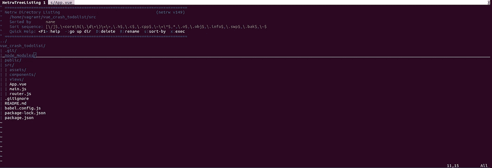

# 我的最小值。vimrc 配置

> 原文：<https://medium.com/hackernoon/my-minimal-vimrc-config-c1a4d26553ca>

在过去的几周里，我一直在为我们现在的几个不同的项目构建和配置无数的虚拟机和编码环境。

这是一个很好的机会，可以让我获得一些系统管理员的经验，还可以了解在基本的 Linux 环境下工作需要什么工具和配置。

我喜欢 Vim，我每天都用它工作，但在这种情况下，我在这些机器上安装 vanilla Vim，并使用它们来配置机器并在其上进行一些实际的编码。这给了我写这篇文章的灵感。

# 使用 Vim 时我真正需要的配置是什么？

每天，我都用我精心制作的`[.vimrc](https://github.com/DailyMatters/dotfiles/blob/master/vimrc)`[文件](https://github.com/DailyMatters/dotfiles/blob/master/vimrc)。这份文件包含了我认为能够胜任工作所需的一切，并且处于不断的变化之中。总是进化出更好的版本。

当在一台新机器上安装 Vim 时，我只需要执行一些非常简单的工作，获取我所有的配置是没有意义的。那样做太过分了。但是有几个配置不仅有意义，而且让我的生活更轻松，体验更好。

所以我不再多说，我向你介绍

# 我的最小值。vimrc 配置


Configuring Vim like a football team!

```
syntax enable
set tabstop=2
set number
set hlsearch
set incsearch
let g:netrw_liststyle = 3
```

先说第一件事，没有`set nocompatible`。我在我更大的配置文件中使用了这一行，我在书中提到过，但是如果 Vim 发现 vimrc 或 gvmrc 文件`compatible`自动关闭，那么现实`compatible`就是多余的。

接下来两行

```
syntax enable
set tabstop=2
```

我主要用于代码。`syntax enable`打开语法高亮显示。不同编程语言中的关键字会以不同的颜色出现，使得代码可读性更强。而`set tabstop=2`会让制表符宽 2 个空格。这个数字可能会变化，我可能会根据我使用的编程语言实时将其更改为 4。在 Vim 中配置制表符和空格可能有点困难，因此我应该使用更大、更复杂的版本。

是一个不需要动脑筋的、非常有用的工具。它只是在左边显示行号。这样我可以很容易地知道我在哪一行，如果我需要使用`:25`或`7G`跳转到某一行，我总是知道要跳转到的行号。

`set hlsearch`和`set incsearch`不是我所说的必需品，但拥有它们很好。配置文件有时很大，同时具有增量搜索和搜索高亮，使得搜索特定的文本位变得容易得多。

最后一行`let g:netrw_liststyle = 3`也很不错。因为拥有一个文件浏览器在很多时候可以是一个救命稻草，所以我有时会使用`netrw`。`netrw`是 Vim 附带的一个文件浏览器插件。所以不需要安装。这一行的作用是从默认的文件夹视图切换到树视图。拥有一个树形视图可以给出项目更详细的视图，这也是我喜欢使用它的原因。



Netrw in tree view mode

有些人喜欢拿出 netrw 横幅(带`let g:netrw_banner = 0`选项)，但我有点喜欢它，并不止一次地使用它的提示。

如你所见，我也喜欢在 Vim 上使用选项卡。我认为 tabs 和 netrw 以及上面的其他配置对于完成我需要完成的大多数任务来说已经足够了。姑且称之为我的荒岛设置吧！

这个设置最大的优点是它足够小，如果我需要一次性使用一台机器，我甚至不需要创建一个. vimrc 文件，我只需要为那个特定的会话设置它们。它们很容易记住！

当我实际上想要不止一次地使用一台机器时，我通常只是在设置它们时设置这些规则。这就是我在《流浪》中的做法:

```
if [ ! -f ~vagrant/.vimrc ]; then
    touch ~vagrant/.vimrc
    chown vagrant.vagrant ~vagrant/.vimrc
  fi value=$(grep -c "set tabstop=2" ~vagrant/.vimrc)
  if [ $value -eq 0 ]; then
    echo 'set tabstop=2' >> ~vagrant/.vimrc
    echo 'set number' >> ~vagrant/.vimrc
    echo 'set hlsearch' >> ~vagrant/.vimrc
    echo 'set incsearch' >> ~vagrant/.vimrc
    echo 'let g:netrw_liststyle = 3' >> ~vagrant/.vimrc
    echo 'syntax enable' >> ~vagrant/.vimrc
  fi
```

# 结论

作为程序员，在工作中使用正确的工具至关重要。但有时我们可能需要随机应变，这就是拥有一些旧工具的知识和适应能力的地方。

我仍然会每天使用我的主配置文件，但是如果需要的话，我会毫不犹豫地切换到最小模式，这完全是一个适应性问题，作为程序员，我们都需要一点它。


想了解更多关于 Vim 的知识？想学习如何将其用作 IDE？看看我的新书[一个叫做 Vim](https://leanpub.com/anidecalledvim) 的 IDE。从基本的 Vim 使用到文件查找、自动完成、文件管理器等等，它都有。