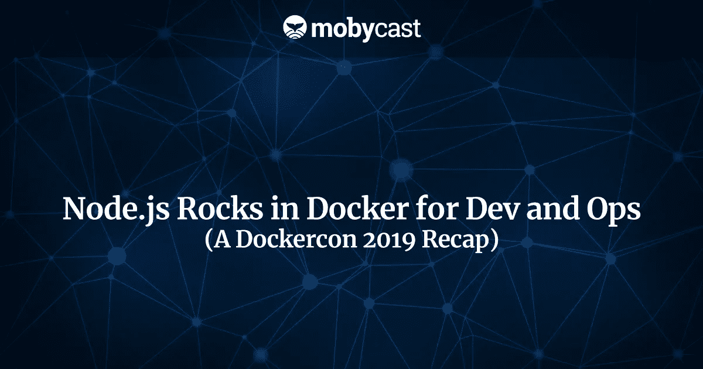

# Node.js 在 Docker for Dev and Ops 中大放异彩(Dockercon 2019 年回顾)

> 原文：<https://medium.com/hackernoon/node-js-rocks-in-docker-for-dev-and-ops-a-dockercon-2019-recap-8a53bd179a6d>

凯尔萨斯的乔恩·克里斯滕森和克里斯·希克曼以及 Secret Stache 的里奇·斯塔茨讨论布雷特·费舍尔的 DockerCon 2019 年会议，题为，*node . js Rocks in Docker for Dev and Ops*。

**展览的一些亮点包括:**

*   今年的新消息:开源峰会
*   DockerCon 2019 在天平上的位置:“我永远不会回去”到“有史以来最好的会议”
*   缺乏创新使得每年都去变得不太可能或不必要
*   Docker 是不是年龄越来越大了？或者，非常成熟健壮的技术？
*   贴纸主题:做事拿贴纸；去玩一个机器人，填一份调查，等等。
*   主题演讲缺乏活力，外观和感觉与往年一样
*   棕色是新的绿色:遗产和绿地工作的混合物
*   同样的球员，一些增长，仍然强劲；但不是在码头区
*   Docker Captain 的演讲提供了在开发、测试和操作容器时管理节点和 Javascript 项目的最佳实践
*   坚持偶数版本的节点，以长期支持基础映像(LTS)
*   缓存问题:如果你有一个最新的标记为“最新”的图片，它被缓存在你的本地主机上，还没有被获取；不要使用“最新”，请指定版本
*   软件越少，进入代码的门道就越少
*   将节点模块添加到 Docker“忽略”文件
*   以 Root 用户身份运行:拥有世界上所有的特权，但只使用您需要的权限来避免问题

**链接和资源**

[DockerCon 2019](https://www.docker.com/dockercon/)

[Bret Fisher's Node.js 在 Docker for Dev and Ops 中表现出色](https://www.docker.com/dockercon/2019-videos?watch=node-js-rocks-in-docker-for-dev-and-ops)

[回复:发明](https://reinvent.awsevents.com/)

[码头工人](https://www.docker.com/)

[Node.js](https://nodejs.org/)

[黛比·杰西](https://www.debian.org/releases/jessie/)

[Debian Stretch](https://www.debian.org/releases/stretch/)

德边喘息着

[节点门](https://nodemon.io/)

[苗条](https://github.com/docker-library/openjdk/tree/master/8/jdk/slim)

[高山](https://github.com/docker-library/openjdk/tree/master/8/jdk/alpine)

[微软 Azure](https://azure.microsoft.com/en-us/)

[AppGet](https://appget.net/)

[百胜](https://access.redhat.com/solutions/9934)

[凯尔苏斯](https://kelsus.com/)

[秘密 Stache 媒体](https://www.secretstache.com/)

**成绩单**

Rich:在 Mobycast 的第 59 集，Jon 和 Chris 分解了 Bret Fisher 的 DockerCon 2019 会议，题为 node . js Rocks In Docker for Dev and Ops。欢迎来到 Mobycast，这是一个关于云原生开发、AWS 和构建分布式系统的每周对话。让我们直接开始吧。

乔恩:欢迎，克里斯和里奇。又是一集 Mobycast。

里奇:嘿。

克里斯:嘿，伙计们。回来真好。

乔恩:嘿，克里斯。自从你去了码头监狱，我就没和你说过话，我很想知道事情的进展。[……]今天刚回来吧？

克里斯:是的。我昨晚很晚才从美丽的旧金山回来。这对我来说是连续第四年了。有趣的是，我们看到了它多年来的发展和变化，但同样的[…]形式，两整天的内容和会议，然后最后一天，第三天是一些更受欢迎的分组会议的重复。今年的新活动是开源峰会。这绝对是一件有趣的事情，我不能参加其中任何一个，也不能仅仅因为时间关系而出席，但这绝对是对会议的一个很好的补充。

乔恩:酷。让我们开门见山吧。在“我再也不会回去”到“有史以来最好的会议”的范围内，这个会议属于哪一类？

克里斯:这很难回答，因为从个人的角度来看，这可能是我最后一部 DockerCon，因为四部之后，我认为它已经达到了饱和点。Docker 本身没有足够多的创新和新事物。对更有经验的人来说，学习的回报越来越少。回报一年比一年少。

我认为对 DockerCon 来说，这是事实。每年，他们总会问，“嘿，如果这是你的第一个 DockerCon，请举手”，而这是超过一半的观众[…]他们的手。我确实认为，特别是 Docker 和 DockerCon，与 re:Invent 这样的会议相比，每年参加的需求越来越少，我们在那里谈论的创新是不懈的，那里有太多的东西在进行，有太多的东西需要学习。就好像你每次都必须去，只是为了跟上正在发生的事情。我说我想这可能是我最后一次停靠码头了，但我很高兴我去了。

乔恩:码头工人年纪越来越大了？

克里斯:一个非常成熟和强大的技术怎么样？

乔恩:我们走吧。我认为这可能值得你分享一些你从主题演讲中学到的东西，然后也许只是几节课，然后也许我们可以开始讨论。这一集我们想做的是，我们想进入一个更好的会话。我认为这对我们的观众和任何不是其他公司开发者的人都是有用的。也许一分钟概述几个会议，然后我们将开始进入我们喜欢的一个。

克里斯:好吧。总的来说，真正突出的是今年感觉小多了。前几年，去年和前年在奥斯汀，参加人数约为 5000 人。我看到了大约 3000 个数字和一些码头工人发来的电子邮件。从 5000 到 3000 差别很大。它确实感觉更小了。

这也有它的好处和优势。我的意思是:发明，有这么多的 FOMO 正在进行，就像，“我会得到任何会议吗？”[……]和 DockerCon 的竞争是很酷的。Docker 和 chill 就像你不会有任何问题进入会话。他们上了预注册，什么都没有。就是这么简单。你只是走进来，没什么大不了的。

这是最大的不同。我们在去年的会议上谈到了这一点，从那时到[…]再到现在史蒂夫·辛格掌管 Docker。我认为 Docker 的人[……]更多地关注他们的业务模式，真正成为一项业务，而不仅仅是一项技术，看到越来越多的关注点，对企业越来越有这种感觉，这是关于业务，关于赚钱。

乔恩:感觉好恶心。它从为期两天的创新庆典变成了为期两天的电视广告。

克里斯:这绝对是一种不同的氛围，当然，绝对是。事情就是这样。这正是他们现在所需要的，也是他们所关注的。它是什么？

我觉得这很有趣，不管是什么原因，今年的主题都是关于贴纸的。贴纸没问题。我的笔记本上有很多，但这就像所有的东西一样。大会期间最重要的事情就是做一些事情来获得贴纸，比如去玩一个机器人，你会得到一张贴纸，你填写会议调查，你会得到一张贴纸，你在会议派对上做一些特别的事情，你会得到一张贴纸，他们会给你一本贴纸书。

很奇怪。我是说，前几年我在西雅图做主题演讲时，他们在每把椅子上都放了一把印有 Docker 标志的雨伞。今年，你得到了这本空白的贴纸书。它实际上只是一个小笔记本。它甚至不是那本贴纸书。很奇怪。与笔记本相比，我当然更喜欢雨伞，但事实就是如此。

今年的主题演讲又一次遵循了同样的外观和感觉。再一次，能量，氛围不在那里。有一大块[…]与码头工人客户圆桌会议。他们有来自五家公司的五位不同代表在台上，花了大约 20 分钟进行圆桌讨论问答。我宁愿做点别的事情，这是最好的说法。

乔恩:你让那么多 C 级的人在一个小组里一起站在一个舞台上，这只是一个什么都不说但看起来很重要的游戏。

克里斯:他们应该做的是分发啤酒，我们应该玩宾果游戏和喝酒。那会很有趣。这是我第一次听到“棕色地带”这个词。我们都听说过格林菲尔德。布朗菲尔德，你听说过这个吗？

乔恩:不，不是在污水咒语之外。

克里斯:我从来没有听说过这个。我听说过其他人，那里的演讲者他们提到他们以前也没有听说过。显然这是一个新的术语，基本上是当你有一个遗产和绿地工作的混合体时你所做的事情。那是布朗菲尔德。分解你的整体，你有你的传统应用，然后你开始围绕它建立一些新的微服务形式的功能，这就是棕色地带。所以，有些要在那里学。也许最后一点要说的是，我对世博会的地板如此之小感到惊讶。真的很小。

乔恩:有意思。这意味着公司不想花钱去那里，这是否意味着没有那么多公司或有成千上万的公司，他们只是觉得花钱不值得，因为他们的潜在客户不在那里？

克里斯:对，可能不止这些。我很惊讶。我记得去年在那里的许多公司今年都不在了。

乔恩:听说公司少了。你会想，为什么公司会在那里制造那些真正与容器有关的东西。新公司或公司数量和集装箱行业，可能在去年或甚至两年前达到顶峰，然后开始整合，很多公司也消亡了。

克里斯:一部分原因是市场仍然是相同的参与者，甚至可能有所增长。几年过去了，已经有很多供应商，存储驱动程序领域显然是监控、跟踪、诊断领域、混合领域、操作系统供应商等等。所有这些人都还活着，而且很强壮。只是今年他们不在了。令人惊讶。

乔恩:好吧。实际上，我认为我们不应该花太多时间谈论我们不打算谈论的话题。这么说吧，这不是我第一次和你说话，自从我们去了码头区，你参加了很多讲座，你再也回不到那段时间了。但是有几个很好的，我们喜欢在 Mobycast 上打破谈话，真正进入他们，谈论他们，比你坐在那里的时候更深入一点。让我们用过去节目中你最喜欢的一个演讲来做吧。

克里斯:是的。我参加了 Bret Fisher 的一次会议，他是一名长期的 Docker 船长，在 Docker 中非常重要……………………………………………………………一个长期的 Docker 社区，现在有很多关于博客的培训和在线课程，就像我说过的，Docker 船长在社区中非常活跃。

他做了一个关于 Node.js 和在 Docker 中使用它的演讲。它在 Docker 中被称为 Node.js Rocks，用于开发和运营。这只是在开发、测试和操作容器时管理节点和 Javascript 项目的最佳实践。本课程涵盖了节点的本地开发、特定于 Javascript 的项目，还优化了 Docker 桌面和 Docker 组合配置，以利用 Javascript 和 Docker 实现两全其美。

这里是 Kelsus，我们在那里有一个 Node.js 商店，现在它是一个大的 Docker 商店，这看起来是一个很好的会议。

Jon:在对这个演讲一无所知的情况下，只知道它的名字，Node.js 在 Docker for Dev and Ops 中很受欢迎，它看起来确实有点像一场完美的婚姻。Node 使这些小服务器在发生任何错误时都会死亡，因此，拥有一种基础设施方式来重新启动它们，并把它们当作牲口来对待，对于它所提供的确切类型的解决方案来说，似乎是完美的。

克里斯:当然。这是一个非常好的、相关的、实用的演讲，它实际上只是一些提示和技巧的列表。其中一些有些为人所知，还有一些更详细的微妙的宝石。所以很好的会议。

也许这只是关于如何在 Docker 环境中使用 Node 的各种主题。所涉及的一些高级主题包括:为 Node 编写 Docker 文件的一些最佳实践是什么，我们如何使用 Node 管理进程容器，谈论健康关机，例如如何实际设置关机节点的属性。

这个演讲实际上是一个很大的陷阱。然后，我们将讨论多阶段 Docker 文件，以及如何在各种不同的环境中使用这些文件。还要了解一些我们都应该了解的事情，比如安全扫描和加固。然后还总结了一些用 npm 处理经典 node_modules 问题的实用技巧。构建完成后，将为哪个平台构建，并确保不会出现问题，尤其是在您有卷装载共享的情况下。你可以更容易地做一些事情，比如为了调试而硬重启等等，这样可以确保你的 node_modules 不会被它咬到。

乔恩:[……]那个特殊的问题。到了[…]就到了。各位听着，这绝对会是两部曲。

克里斯:当然。然后简单介绍一下健康检查，以及这些检查在整个场景中的作用。大概就是这样。

Jon:所以，从 docker 文件和 Node 的最佳实践开始。

克里斯:是的，我们来深入探讨一下。首先，Bret 谈到的第一件事是关于基本图像。您使用什么样的基本映像，并坚持使用偶数编号的 Node 主版本。这些人将会得到支持并拥有 LTS。Node 最近刚刚发布了 12。

乔恩:你说 LTS。那代表什么？

克里斯:长期支持。奇数不会有长期支持，但偶数会。我相信 LTS 是有保证的。大约 18 个月或 2 年的支持。因此，请坚持使用偶数编号的 Node 主版本。我想我们过去肯定讨论过这个问题。不要使用最新的技术。非常明确地说明你想要什么版本，以及实际的图像。这是你正在使用的实际 Docker 图像上的标签，所以不要使用最新的。取而代之的是，选择你想用的数字，然后使用它，因为用最新的，你不一定知道你会得到什么。你的内心将会改变。

我们还讨论了缓存的问题。如果出于任何原因，您和您的 Docker 主机，如果您有最新的图像标记为最新，它缓存在您的本地主机，它还没有被收获，这可能意味着您将使用一个旧版本，而不是真正想要的。所以，不要用最新的。指定您想要的版本。

乔恩:酷。有道理。

克里斯:这实际上是一件可能有[…]的事情。如果你在使用 Node，如果你在 Node 上使用 Docker，你可能会遇到这种情况，也就是说，如果你使用的是基于 Jessie 发行版的版本之一，你可能会遇到这个问题，你不能再建立你的 Docker 映像。你想从 Jessie 的 Debian 回购中抽身，它已经不在了。这是因为 Debian 不再支持 Jessie。他们存档了。所以基本上，不要用杰西。相反，切换到 Stretch 是您应该在官方节点发行版中寻找的味道。使用拉伸，而不是杰西。这将是受支持的版本。

Jon:谈到 Node，由谁提供支持？只是 Node 或者一个公司的各种维护者？

克里斯:这是 Debian。这是 Debian Linux 发行版。杰西是一个典型的 Debian。因此，它们不再受支持。

乔恩:哦，好吧。

克里斯:喘息和杰西都已经存档了。这意味着你不会在 Node 上得到任何安全补丁。有 LTS 支持的 Node 也是一样。如果它不是 LTS 版本，如果你使用的是其中一个奇怪的版本，那么六个月后，它将不再更新安全简历。只是不再受支持。

乔恩:知道了。

克里斯:用拉伸。我们还讨论了应该使用 Alpine 还是 Slim。我想我们在过去已经讨论过这个问题，也讨论过使用阿尔卑斯山作为你的图像。Alpine 有很多优点，你会听到很多人谈论 Alpine，并稍微谈一谈它的优势。这是非常简单的基本图像。从软件的角度来看，它只是被简化成你绝对需要的东西。它的好处有两个:第一，它只对文件大小有好处。如果你担心文件大小，Alpine 将会非常小。如果把所有东西都拉进来，完整的节点图像几乎是千兆字节，而 Alpine 是 77 兆字节。这是一个巨大的差异。

但不仅如此。不考虑空间，另一个很大的优势是安全和你必须覆盖的表面区域的宽度。你有越多的软件，你就有越多的表面空间，就有越多的可能性，“嘿，这里的安全会有问题。我要保护的不仅仅是这些。”软件越少，进入代码的门道就越少。这两件事值得关注。

阿尔卑斯山的缺点是它更难合作。不仅仅是方便。阿尔卑斯山的一切都不一样。默认情况下，BASH 不在那里。

乔恩:你想要的一切你都要加进去。

克里斯:对。它有自己的包管理器，与 apt-get 或 yum 完全不同。更难合作。此外，CVE 扫描不太适合阿尔卑斯山。也是因为它是如此的微小。特别是，它有自己的兼容性问题。

最近 nodemon 出现了一个文件监视问题，nodemon 是一个很受欢迎的包，带有[…]来监视文件系统的变化，所以你可以热重装你的应用程序。这在 Alpine 上不起作用，但在其他发行版上很好。同样，最小的软件，更难配置。你将更有可能遇到这些问题。

他之所以这么投入只是为了使用 Slim。Slim 实际上非常小。它实际上比阿尔卑斯山大不了多少。在他的例子中，一个非常官方的 Node.js 图片，Slim 大约是 150 兆字节，而 Alpine 是 77 兆字节。150 兆还是比 1g 好太多了，1g 是 800 兆什么的。所以，150 兆是完全合理的。只比阿尔卑斯多了 75 兆字节。你会得到很多你已经习惯的软件。所以从苗条开始，就这样做，让生活变得简单一点，除非你有一个真正令人信服的理由为什么你需要去阿尔卑斯山。从 Slim 开始。

乔恩:有意思。我们还有几分钟。我想我们可以再讨论一点，然后以 Dockerfile 最佳实践部分结束。

克里斯:当然。我们谈了一点关于节点模块和处理它的内容。当您的容器和主机之间有卷装载时，这确实会成为一个更大的问题。当你在你的机器上进行本地开发时，比如热重装或者只是加速，有时你会希望与主机共享，与主机和你的源代码共享节点模块。

问题是，如果你的节点应用程序用于在特定平台下运行，它可能会在 Linux 下运行，如果你运行 AWS 或 Azure，一些云或什么的，可能会在 Linux 机器上运行，而且有些节点模块肯定有本机代码。当您安装 npm 时，它将运行 node-gyp，将本机代码、C 代码、C++代码等编译成目标代码。它将在将要运行的平台上完成。

如果你在 Mac 上工作，在 OS X 上，你共享你的节点模块，你在容器外运行你的 npm 安装，node-gyp 将在 MacOS 上编译。如果这已经融入到您的映像中，而现在您在 AWS 上部署您的映像，事情就不会顺利了。

乔恩:对。这是一个有趣的问题。

克里斯:他刚刚指出了这一点。小心点。毫无疑问，您应该做的一件事是，您应该将节点模块添加到 Docker ignore 文件中。如果你这么做了，你肯定不用担心。

Jon:我不记得你的 Docker ignore 文件基本上是说，“当你把这个图像放在图像库中时，不要带任何东西”？

克里斯:当你建立一个形象的时候。当你构建图像时，它说，“无论你何时添加文件或复制文件，我都不在乎你在指令中说了什么。执行此操作时，不要包含这些类型的文件。

乔恩:当你说任何指示的时候，你是在说 Dockerfile 文件中的指示。

克里斯:在实际的 Docker 文件中，如果它是你的 Docker 文件中的一个添加或复制指令。无论您在那里指定什么，Docker 忽略文件都会覆盖它。所以，通常你的码头工人忽略，你要确保像这样的事情。git 被忽略，因为您不希望您的 git repo 成为实际 Docker 映像的一部分。所以，这是类似的东西。在构建映像时，也不应该有任何模块来防止这种情况。当然，如果你应该做你的 CI 系统的话，你不应该在你的本地机器上建立你的映像，但是同样，有时候你可能会也可能不会这样做，所以把它添加到你的 Docker ignore 中。

总结 Dockerfile 最佳实践，最后讨论的只是安全性和最小特权原则，明确地切换并使用节点用户来运行您的应用程序。默认情况下，如果你不改变你的用户，你将作为根用户运行。很明显，以 root 身份运行，拥有世界上所有的特权。你真的不应该这么做。你应该真正按照最小特权原则来操作。你应该只使用你需要的特权。Root 太强大了，有太多的东西可能会出错。你将自己暴露在安全问题和漏洞之下。

所有的 node 官方映像实际上都内置了对一个用户的支持，这个用户已经在操作系统中为您创建了，名为 Node。但是启用它取决于您。你可以很容易地在 docker 文件中做到这一点。只需使用 user 命令切换到节点用户，就可以了。这可能会有一些权限访问问题。在这个过程中，您会遇到一些问题，因此需要做更多的工作来调整它，并确保您使用正确的目录，拥有正确的权限和所有权等等。在你的 Docker 文件里可能还有一些你需要做的说明。

Jon:在开发过程中这样做比你得到一个可用的应用程序要好得多，你已经完成了，现在你为一家更大的公司工作，所以他们会对它进行安全审计，就像“哦，你必须改变这一点。”这不是[……]你想改变这一点。

克里斯:没错。所以切换这些或者不要以 root 运行。在权限较低的帐户下运行，如内置节点帐户。

乔恩:这很酷，他们已经建立了这一点，让它准备好切换，并准备好了。

克里斯:当然。

乔恩:好吧。好吧，谢谢你。下周，我们会更多地讨论这个演讲，因为它已经是非常有用的东西了。自从我们谈论 Docker 已经有一段时间了，所以在这个播客中回到我们的容器根源感觉很好。所以，谢谢你。

克里斯:莫比 101。

乔恩:没错。

里奇:好吧。再见伙计们。

乔恩:是的。谢谢里奇。谢谢克里斯。拜拜。

克里斯:再见。

亲爱的听众，你坚持到了最后。感谢您抽出时间，并邀请您继续与我们在线交流。这一集，以及显示笔记和其他宝贵的资源可在 mobycast.fm/59.如果你有任何问题或额外的见解，我们鼓励你给我们留下评论。谢谢你，我们下周再见。