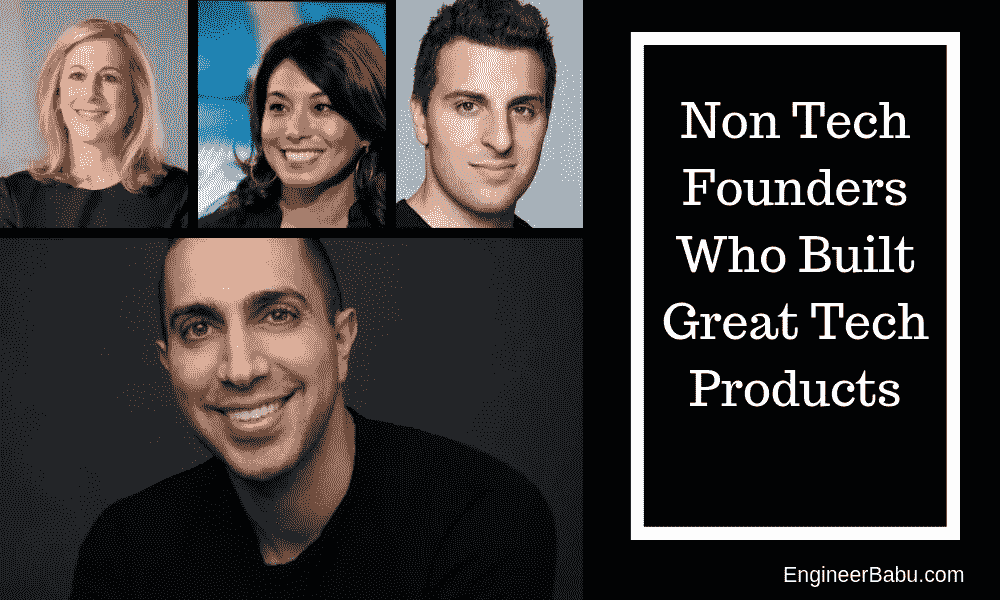

# 11 位非技术型初创公司创始人，他们创造了伟大的技术产品

> 原文：<https://medium.com/hackernoon/non-tech-startup-founders-who-built-great-tech-products-9f3be67e237>

那么，怎样才能创建一家继之后的[创业公司呢？是知道构建成功应用的艺术吗？或者这完全是技术问题？对于许多创业公司来说，非技术出身的创始人创造了屡获殊荣的技术产品，这是完全错误的。](https://www.engineerbabu.com/blog/anyone-can-spend-honey-can-make-money/)

对于那些把在没有技术知识的情况下创建应用程序比作在没有正确食谱的情况下烹饪的人来说，这是一条新闻。拥有非技术技能的创始人和首席执行官正在塑造世界各地的科技创业公司。让我们从革新了家外之家概念的初创公司说起:Airbnb。

# 布莱恩·切斯基

布莱恩·切斯基是 Airbnb 的联合创始人。他也是一名设计师。创建点对点住宿服务并成为互联网亿万富翁，只不过是在伟大的头脑失败的地方取得成功的问题。布莱恩还被《时代》杂志评为 100 位最具影响力的人物之一。

早在 2004 年，Brian 就获得了工业设计艺术学士学位，在职业生涯的初期，他在洛杉矶的一家公司担任工业设计师。这位罗德岛设计学院的校友现在正与脸书的技术创始人马克·扎克伯格等人擦肩而过。

Airbnb 最近已经成为在线酒店行业的市场领导者，表明伟大的想法总是有空间的。2017 年 1 月，Airbnb 与加里·维纳查克和迈克·蒙特罗一起投资了餐厅预订应用 Resy。

该公司于 2016 年首次实现盈利。它在 2017 年的收购范围包括加拿大的 Luxury Retreat、社交支付初创公司 Tilt 和旅行无障碍初创公司 Accomable。2018 年，Airbnb plus 与 Beyond Airbnb 的豪华租赁一起提供。2019 年 3 月，Airbnb 通过收购酒店预订网站 HotelTonight 完成了超过 4 亿美元的收购。

# 梅洛迪·麦克劳斯基

StyleSeat 是一个面向造型师的在线预约管理系统，也是美容服务行业最大的市场。梅洛迪·麦克洛斯基和联合创始人丹·莱文合作得非常好，他们都热衷于为美容行业提供有吸引力的解决方案。通过 StyleSeat 预订的预约价值超过 3 亿美元。Melody 的公司在 15000 个城市提供了令人印象深刻的 20 万名造型师名单。在加州大学戴维斯分校(UC Davis)获得法语和国际关系学位后，Melody 最不想做的事情就是创办一家科技公司。

当她收到不止一个，而是三个标价 300 美元的造型灾难时，这种情况即将改变。她从事产品方面的公关工作，并在辞职创办 StyleSeat 时创造了历史。事实证明，让女性轻点鼠标或轻点智能手机，就有机会找到理想的造型师是一个革命性的想法。

为科技领域的女性创新，Melody 的创业清楚地证明了科技技能只能带你走这么远，尤其是在建立一家科技初创公司的时候。归根结底，速度和决策能力同样重要。不要担心写代码，把优秀的产品管理技能带到董事会，你也会做得很好。从筹款到概念的货币化，Melody 将有目的的美提升到了一个全新的水平。

# 蒂姆·韦斯特格伦

提到科技巨擘和巨头，人们会想到比尔·盖茨和马克·扎克伯格这样的科技巨头。但是科技创业公司和产品并不总是需要一个有技术背景的领导者才能成功。潘多拉电台首席执行官兼创始人蒂姆·韦斯特格伦就是一个很好的例子。他是一名音响工程师和音乐家，对音乐作品和科技行业的驱动力有着深刻的理解。

蒂姆身兼数职，在创办潘多拉电台之前，他做过音乐作曲家、录音师，甚至还当过保姆来维持生计。蒂姆被《时代》杂志评为 2010 年最具影响力的 100 人之一，他领导这家科技初创公司成为音乐行业的关键人物。

从拖欠 200 万美元的工资到完成一笔 900 万美元的资金交易，Tim 见证了潘多拉电台的一切。2017 年卸任首席执行官，Tim 继续激励和领导潘多拉的团队。

# 亚历克斯·特恩布尔

稳扎稳打才能赢得比赛，作为一个创办了一流科技公司的非技术人员，Groove HQ 的亚历克斯·特恩布尔(Alex Turnbull)比任何人都清楚这一点。他从素描开始，想出了线框。这导致了创新，他创建了 Groove，一家服务台软件公司。

在他的博客中，亚历克斯解释了他如何使用图形编辑软件 Photoshop 来创建应用程序的实体模型，并弥合联合创始人和他自己之间在理解方面的差距。一个狂热的冲浪者和热情的软件爱好者，没有任何技术技能，它需要勇气和毅力来设置软件。但 Alex 在 2011 年是一个有远见的人，在没有人想到的时候引入了实时聊天。

因为他对科技行业惊人的把握，节省了大量的迭代和金钱。作为一名连续创业者，亚历克斯的公司每个月都有数百万的经常性收入。Groove 是大量辛勤工作和坚持不懈的结果。从 Groove 吸引投资者和顾问的统计数据来看，大卫·豪泽(David Hauser)是著名的企业家、演说家和天使投资人。

# 佩里·戈尔曼·蔡斯

非技术联合创始人佩里·戈尔曼·蔡斯(Perri Gorman Chase)想到了一种电子邮件退订服务，在她的技术朋友的帮助下，Unroll.me 诞生了。以下是她用自己的话了解到的情况。虽然原型在前端看起来不错，但视觉设计让其他人更容易看到 Perri 想要完成的东西。

她成功地与工程师和开发人员沟通，他们将她的愿景转化为现实。重点是理解工程团队是否会说一个人的语言，反之亦然。Perri 谈到一个人如何需要了解环境、数据库、编程和 API 集成，或者(换句话说)事物如何组合在一起。

把基础做好和控制业务成果是联系在一起的。始终保持一个数据库和对工程过程的理解，像 Perri 一样，你会得到它的权利！

# 沃克·威廉姆斯

Teespring 的创始人兼首席执行官沃克·威廉姆斯(Walker Williams)在创办科技公司之前是一名漫画家和作家，对编码或编程一无所知。从一开始，沃克就追求不同的兴趣。16 岁时，他下定决心要成为一名企业家。然后在布朗大学获得了艺术和历史学士学位。大学毕业后，他与联合创始人埃文斯·斯蒂茨·克莱顿合作，创建了一个定制商品平台。独特的定制设计、设定销售目标甚至商品价格是 Teespring 区别于业内其他公司的地方。

2016 年，仅 Teespring 一家就估值 3000 万美元。沃克因其革命性的社交商务公司而被列为领先企业家。但这一切都始于两个还在上大学的朋友埃文斯和沃克设计并出售了一件 t 恤，以纪念当地一家娱乐场所的关闭。现在，Teespring 每月吸引 10 万份订单，并且还在增长！它甚至出现在 Y Combinator 的博客上。

# AJ 福塞斯

iCracked 的创始人兼首席执行官 AJ Forsyth 实际上拥有科学和生物学/心理学学位！在通过 iCracked 满足于按需智能手机维修服务之前，他已经尝试了从酿酒厂到养蜂的所有事情。虽然 Forsythe 于 2011 年从加州州立理工大学毕业，但他在此之前就创办了 iCracked。从 2010 年的一个大学宿舍到世界上最大、最高效的平板电脑和智能手机维修服务，Forsythe 已经走过了一段漫长的路，他的企业也是如此。该公司拥有超过 4K 认证的 iTech 专业人员，在 11 个国家开展业务。AJ 也因为他的成就进入了福布斯 30 岁以下排行榜。随着面向所有人的智能家居的下一步行动，iCracked 是一个与众不同的早期采用者。

# 斯蒂芬妮·蒂勒纽斯

Vida Health Inc .的创始人兼首席执行官 Stephanie Tilenius 是哈佛大学和布兰代斯大学的校友，拥有经济学和国际金融学位。那么，尽管她没有科技背景，是什么促使她创建了一家科技健康公司呢？Stephanie 寻求提供专业、按需、个性化的健康指导，以及来自经验丰富的医疗保健提供商和领先医疗中心的项目。

美国有近 1.33 亿人独自生活，面临慢性健康问题。她的父亲患有 4 种慢性疾病，当她努力建立一个医疗基础设施来支持他时，Stephanie 意识到需要一个可扩展的持续移动护理平台，于是 Vida Health 成立了。

用 Stephanie 的话说，Vida Health 是第一家“横向数字治疗”服务提供商。她还通过铆钉投资基金支持女企业家。

# 肖恩·拉德

Tinder 的创始人兼董事长肖恩·拉德(Sean Rad)是一名大学辍学生，直到他创建了这款约会应用并成为首席执行官！拉德在 2012 年与另外两位联合创始人创立了 Tinder。Tinder 在上线仅两个月内就成功匹配了 100 万次。

此外，Tinder 的付费用户超过 370 万，比 2017 年同季度增长 81%。目前，Tinder 的价值为 30 亿美元。它是应用商店中收入最高的应用之一。

# 杰米·王

Jamie Wong 是 Vayable 的创始人兼首席执行官，是一位杰出的电影制作人，也是利用技术促进旅行的科技公司 Vayable 的创始人。Jamie 拥有沟通、宣传和破坏性媒体方面的背景。她追求艺术、历史和政治，在卫斯理大学获得历史学士学位，最后进入哥伦比亚大学新闻研究生院。她在 2010 年创建了 Vayable，这是由分享集体和独特旅行体验的需求所驱动的，迄今为止这是一段相当长的旅程。Jamie 的技术公司在 240 个城市都有业务，还被 NYT、华尔街日报和美国有线电视新闻网报道。

# 埃文·夏普

Pinterest 的联合创始人兼首席创意官埃文·夏普(Evan Sharp)在提出这个想法时，肯定不是一个技术人员。埃文在哥伦比亚大学学习建筑。在此之前，他在芝加哥大学攻读历史学士学位。

在注册建筑课程时，他遇到了 Pinterest 的联合创始人兼首席执行官本·希伯尔曼。该图片分享网站于 2010 年推出。这是最有创意的社交媒体渠道之一。2018 年 10 月，Pinterest 跨越了 2.5 亿月活跃个人和 1750 亿 Pinterest Pins 的用户群。

# 结论

Pinterest、Vayable 或任何其他由非科技创始人创造的科技产品都表现得非常好。这证明，如果你想在科技创业世界里茁壮成长，你需要的是创新，而不是技术知识。所以不要因为没有正式的学位而犹豫。记住，知识随着经验而增长，专业知识不仅仅是编码！