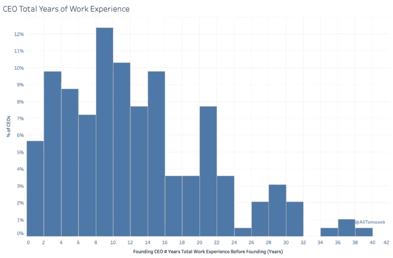
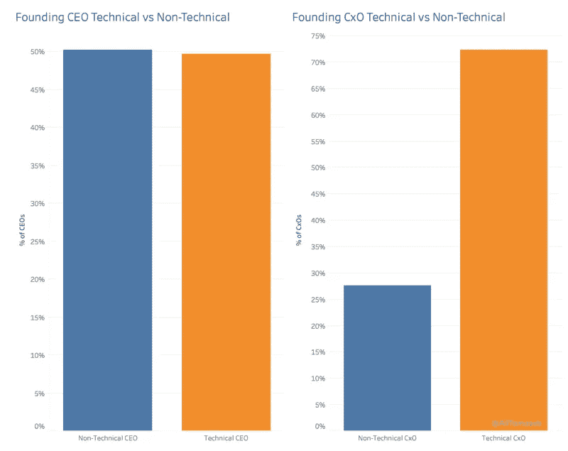
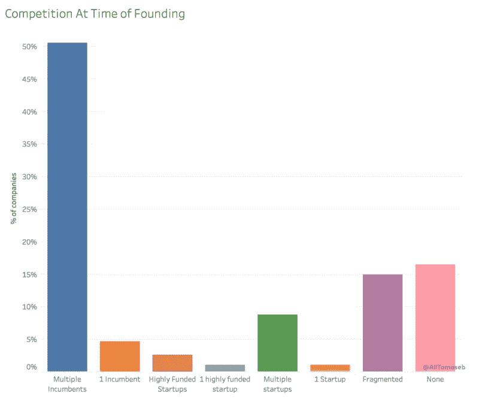
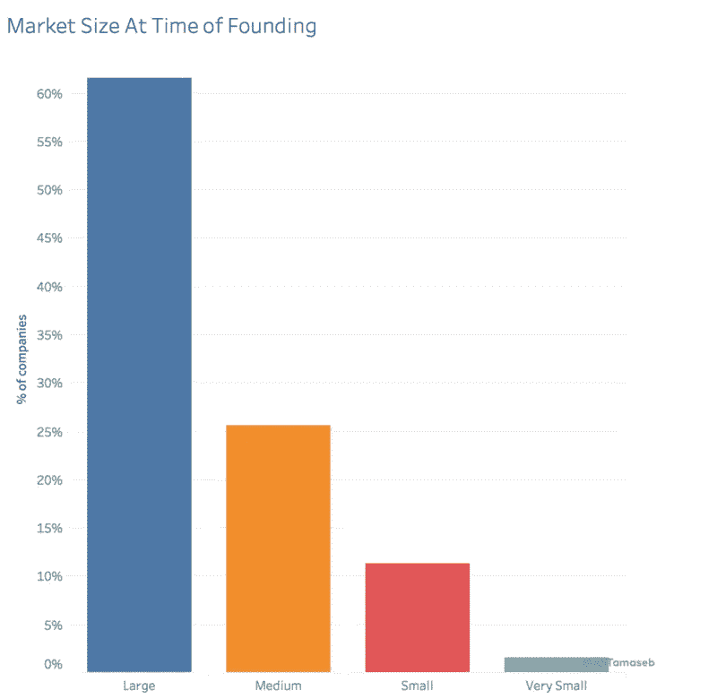
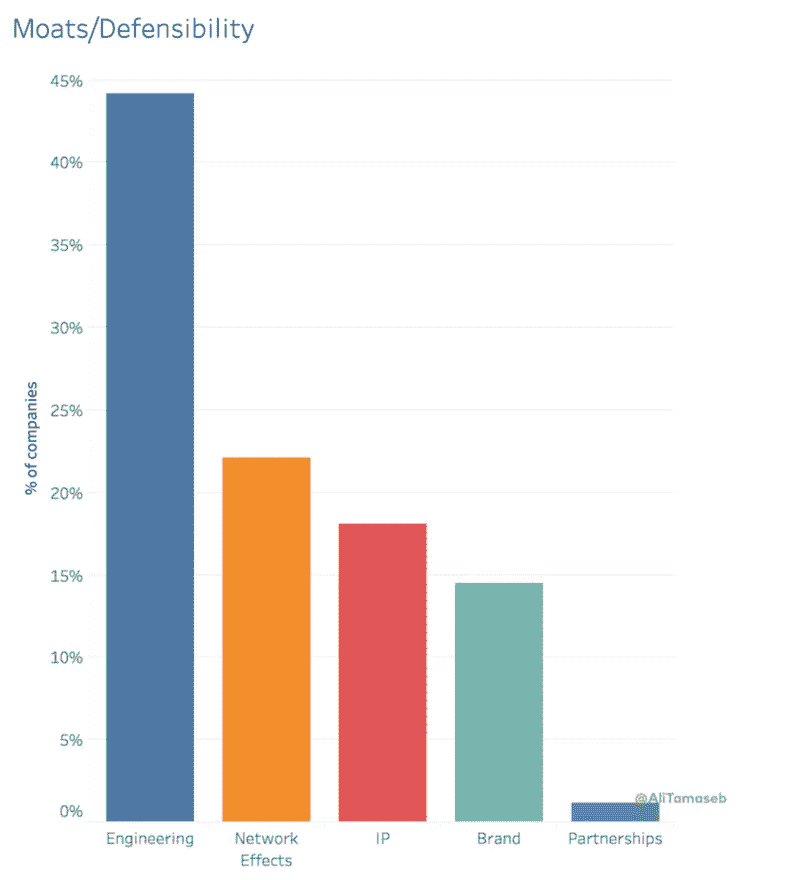
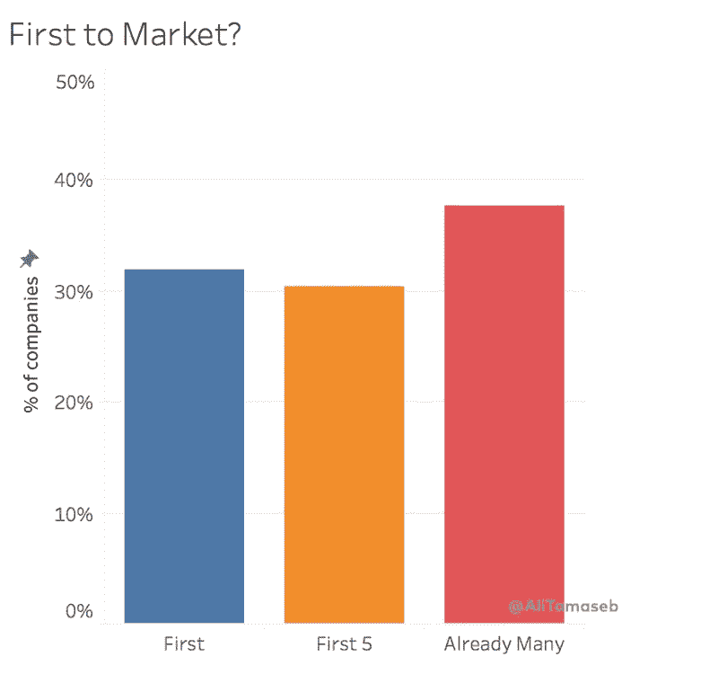
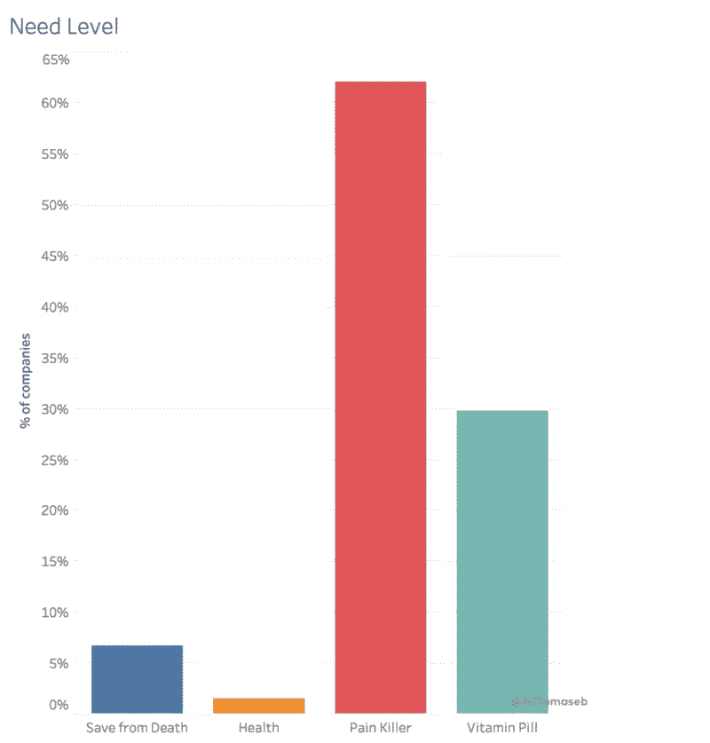

# 超级创始人超级笔记

> 原文：<https://medium.com/hackernoon/notes-on-super-founders-11254f693267>

这篇文章包含了对阿里·塔玛塞布最近文章的一些注释:

 [## “超级创始人”的土地——一种数据驱动的方法来揭示十亿美元的秘密…

### 我花了 300 个小时收集 10 亿美元创业公司的数据，这里有 100 张图表，你不应该错过

medium.com](/@alitamaseb/land-of-the-super-founders-a-data-driven-approach-to-uncover-the-secrets-of-billion-dollar-a69ebe3f0f45) 

阿里的文章包含了很多有趣的数据，值得一读。我将把重点放在我认为最有趣的作品上。

最初的文章旨在回答“十亿美元的初创公司在起步时是什么样的？”。它“量化了 2005 年后直到今天在美国成立的所有 195 家初创公司的 65 个因素，这些公司的估值一度超过了 10 亿美元。”

正如阿里在免责声明中指出的，“数据可能不是 100%准确”，但他尽力了。需要记住的重要一点是，相关性并不意味着因果关系。

这篇文章专门介绍了价值数十亿美元的公司。创办一家 5000 万美元的公司也是一个巨大的成就。此外，仅仅因为过去 15 年的独角兽是这样建立的，并不意味着未来 15 年的独角兽也将是这样建立的。

让我们开始吧。

# 1)联合创始人的数量

有一种普遍的误解，认为独自创业不好。然而，几乎 20%的独角兽是由单飞创始人创立的。扔掉规则手册。

杰夫·贝索斯是一个单独的创始人。易贝、福特、Tumblr、Craigslist、Magic Leap、Spanx 和许多其他公司也都是由个人创始人创办的。

我想大多数公司都是从 1-4 个创始人开始的，所以大多数 10 亿美元的初创公司都在这个范围内也不奇怪。这里的数据很可能具有误导性。如果 40%的公司是由两个创始人创办的，但只有 35%成为了独角兽，这很可能是一个迹象，表明两个创始人实际上是一个糟糕的创始人数量！

话虽如此，我认为最重要的一点是，你的联合创始人的数量不应该太重要。无论哪种方式，你都可能成功，这很可能取决于你所处的具体环境，以及什么对你最有意义。

# 2)年龄

创始人的年龄可以在 20 岁到 70 岁之间。最常见的年龄组是 28-32 岁。50%的公司是由 24-36 岁的人创办的。你的 30 岁生日是开公司的最佳年龄；).

换个角度看数据，50%的独角兽都是 35 岁以上的人创业的。

如果你还不到 24 岁，创办一家独角兽企业似乎要困难得多。

# 5)工作经验

你可以用任何数量的工作经验来创建一个独角兽，但科技公司的模式是 10 年工作经验，健康创业公司是 28 年经验。

# 6)不需要行业经验

这是一个令人惊讶的问题。你不需要在你所颠覆的行业中有直接相关的经验。

# 7–10)重复创业者

几乎 60%的公司是由重复创业者创办的。

许多人以前是 2-3 年的创始人，有些人创立了多个创业公司并领导了 20 多年。对他们中的许多人来说，他们的第一次甚至第二次创业都失败了。

几乎 70%的重复创业者之前已经成功地创立了一家公司，或者有超过 5000 万美元的退出，或者有超过 1000 万美元的年收入。其中，25%的人实际上有超过 1 次的成功退出。令人印象深刻。

如果你可以投资一家有前超级创始人的公司，成为一名超级创始人的联合创始人，或者作为一名早期员工加入一家由超级创始人创办的新公司，这些看起来都是非常聪明的举动，很有可能获得丰厚的回报。

# 13)技术型与非技术型首席执行官

技术型和非技术型 CEO 的人数几乎相等。

马克·扎克伯格、比尔·盖茨、谢尔盖·布林、拉里·佩奇是一些著名的技术创始人。史蒂夫·乔布斯、理查德·布兰森、菲尔·奈特是一些著名的非技术型创始人。

对于首席执行官应该是什么样子，有很多误解。通常你可能会认为这是一个响亮的推销员。也许是理查德·布兰森或艾伦·休格式的人物。实际上，成功的初创公司首席执行官通常都是害羞或书呆子型的。例如，耐克创始人菲尔·奈特就非常害羞。虽然作为一个品牌，耐克并没有给人这样的印象。谷歌、脸书和微软是其他非“首席执行官”类型创造世界上最有价值公司的例子。如果你在 20 岁时遇到比尔·盖茨或马克·扎克伯格，你可能不会认为他们是当 CEO 的料。

# 16)曾在其他创业公司工作的经历

70%的独角兽公司 CEO 没有为其他创业公司工作的经历。然而，许多人确实有过在自己的初创公司工作的经历，而且往往很成功。

# 26) B2B 与 B2C

做 B2B 和 B2C 的独角兽数量几乎相等(B2C 略多)。仅有 1%的独角兽做到了这两点。

> 第 29 至 36 节包含了一些对创始人来说最有价值的信息。

# 29，32，33)竞争和市场规模

在现有的大型市场中竞争是一件好事。

> 似乎与多家大型企业竞争是一件好事。这是市场机会很大的迹象，大型在位者已经教育了市场。然而，初创公司可以利用现有公司的低效率和没有遗留系统的优势来赢得市场。支离破碎和空荡荡的市场也是引发混乱的主要原因。**最糟糕的情况似乎是复制另一家初创公司正在做的事情，特别是他们最近筹集了大量资金的地方。**

关于这个话题，我推荐阅读马克·安德森(Marc Andreesen)关于市场规模的以下文章:

 [## Pmarchive -唯一重要的事情

### 你看着一家初创公司，问自己，这个团队能够最大限度地利用他们的机会吗？我专注于…

pmarchive.com](https://pmarchive.com/guide_to_startups_part4.html) 

你会发现在这个话题上有一些不同的观点。彼得·泰尔在他的书《零比一》中指出了亚马逊、易贝和脸书等最初专注于利基市场并不断扩张的例子。亚马逊专注于在线书籍。这在当时并不是一个巨大的市场，但他们征服了它，并最终扩大到销售一切。

你可以说亚马逊追求的是一个巨大的市场，但战略是从小规模开始，然后扩张，这实际上是贝佐斯对该公司的最初愿景。

脸书追逐的是社交媒体市场，虽然当时这个市场并不大，但 MySpace 之类的东西确实存在。在成长战略上，他们从只有哈佛大学的学生开始，然后扩展到其他大学，最终扩展到全球。他们一个接一个地统治着他们进入的每一个小市场。

我推荐一个涵盖彼得·泰尔观点的好视频:

尽管如此，这里的数据似乎表明，追逐大型现有市场通常是一个非常好的主意，竞争不适合失败者。

# 31)产品差异化

尽管许多独角兽在追逐现有的大型市场，这些市场显示了该领域对产品的现有需求，但这些独角兽与现有的解决方案有很大程度的差异。

# 30)护城河

护城河是阻止竞争进入你的领域并取代你的公司的东西。最大的防御因素是工程(想想谷歌的搜索算法)。其他防御因素是网络效应、知识产权和品牌。合伙关系似乎不是一个很好的护城河，虽然他们可能会帮助你的企业作为一个整体。

# 时间安排

关于时机有太多的误解。你可以是第一名，你可以是最后一名，你可以在两者之间。时机很难把握，但是你最后进入市场的事实并不意味着你没有机会。率先行动也不一定是一种优势。先行者会犯一些错误，后来者可以从中学习并改正。例如，脸书在 MySpace 上的改进。

# 35)止痛药与维生素

止痛药解决疼痛。维生素只是让你的生活变得更好。两者都致力于创造独角兽。

# 38)加速器

90%的独角兽没有经过加速器。在那 10%的人中，他们基本上都来自于 YCombinator。

# 43–44)投资者

60%的独角兽拥有一级风投作为早期投资者。前创始人是最好的天使投资人。

# 47–48)资金

这些公司筹集了大量资金，而且速度很快，每轮融资间隔时间相对较短。市场意识到了这些公司的潜力，愿意对它们进行大量投资。要点不应该是你必须每 12 个月筹集资金来运营一家成功的公司，尽管如果事情进展顺利，这很可能是一种影响。

# 49)时间轴

超过 50%的独角兽用了 4 年多的时间达到 10 亿美元的估值。这不应该太令人惊讶。我发现令人惊讶的是，研究中有 22%的公司在成立两年内成功成为独角兽。

我希望你喜欢这篇文章。对以上有什么想法？我很乐意在评论中听到。新年快乐！